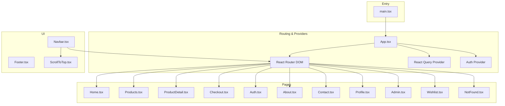
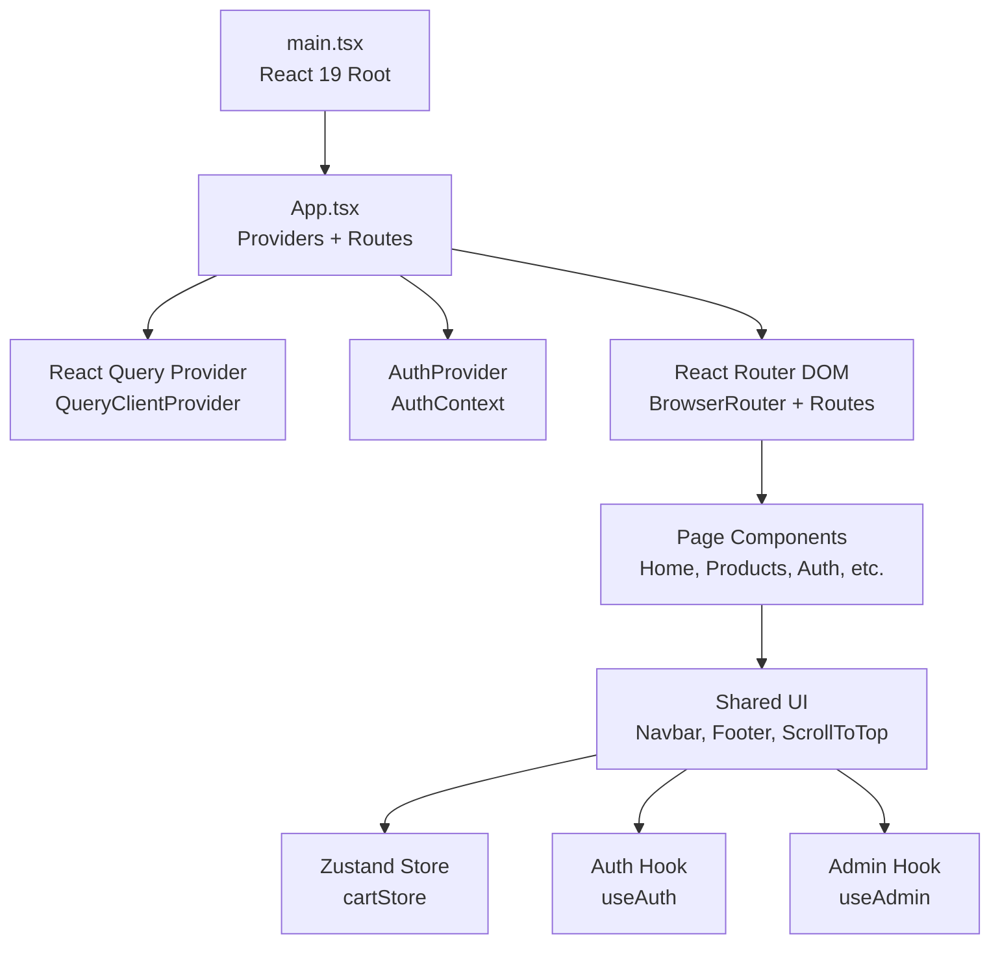
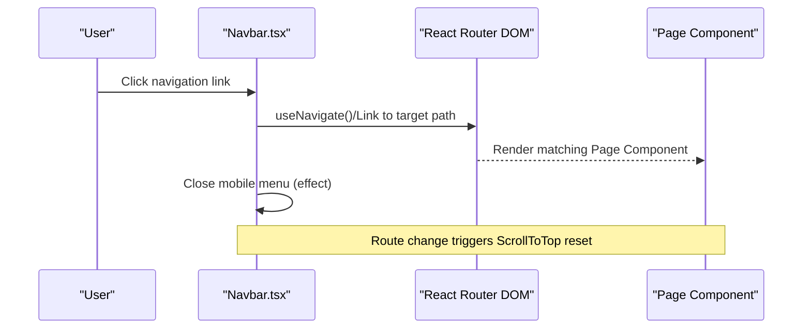
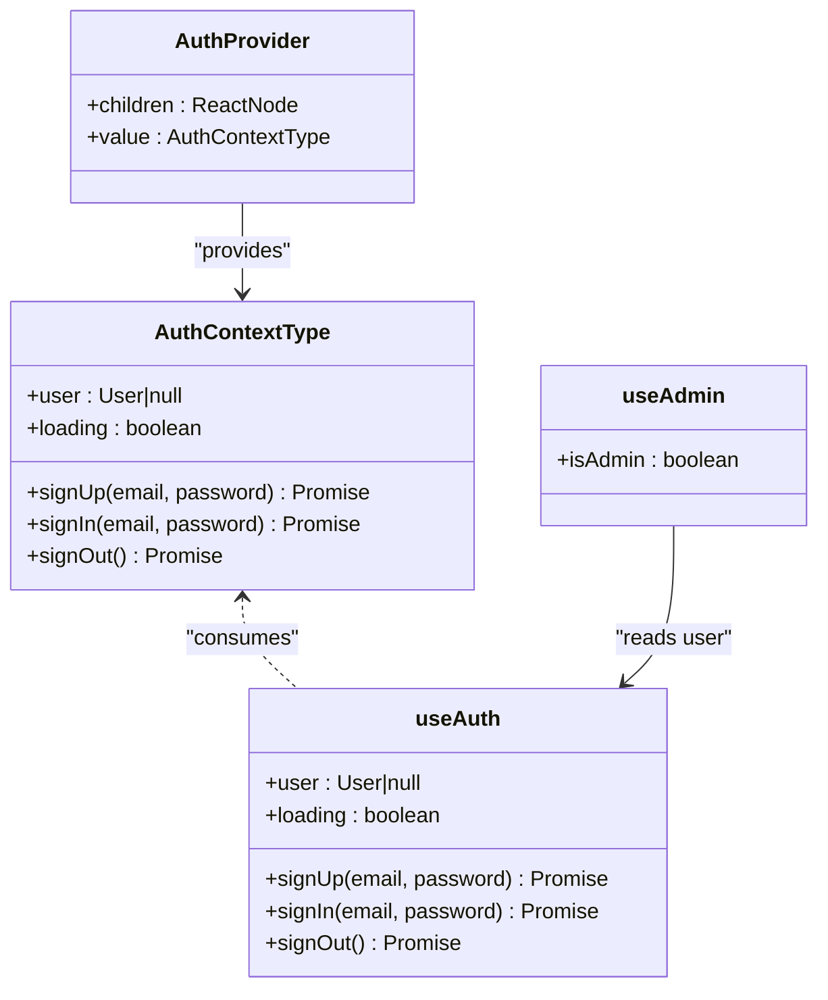
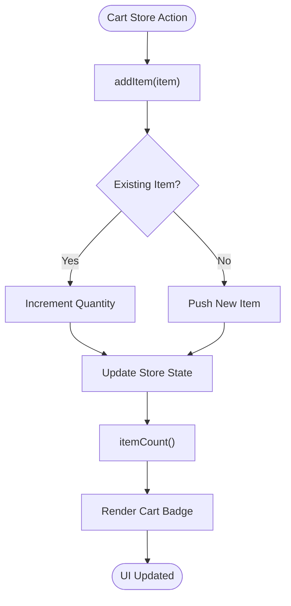
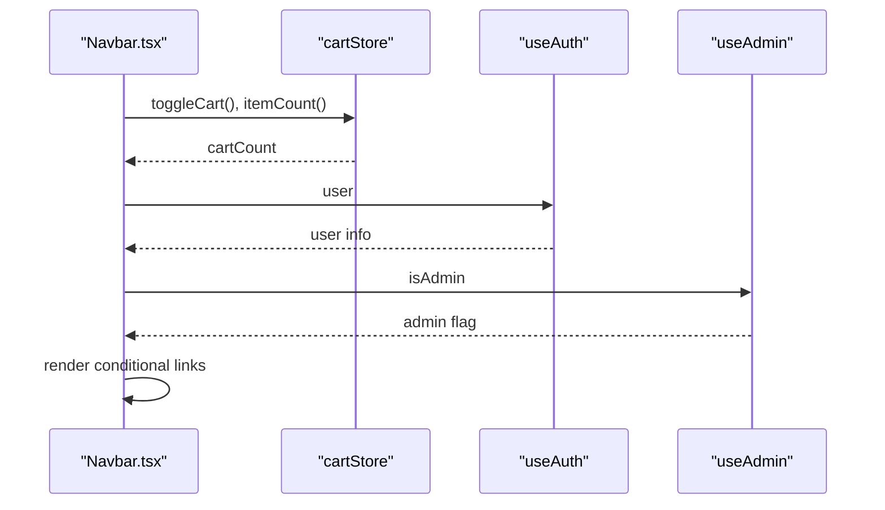
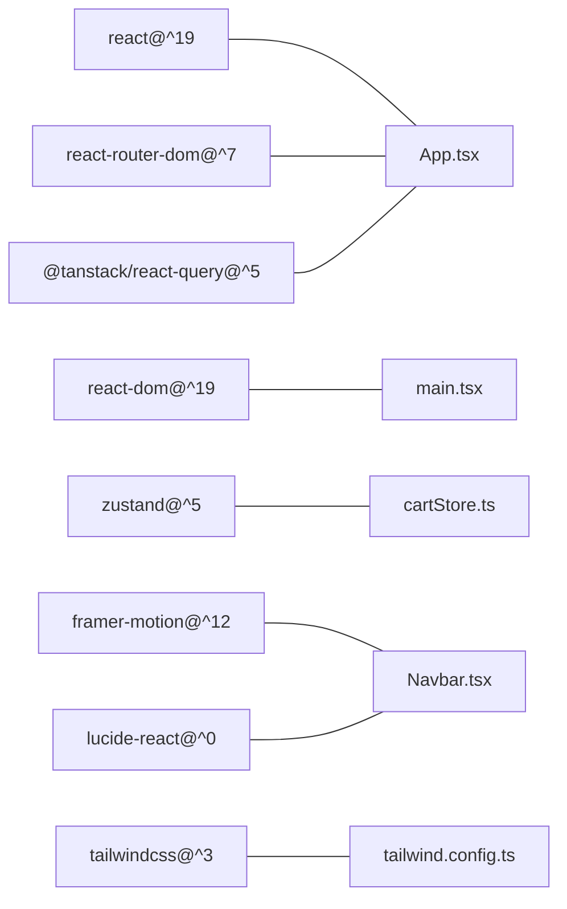

# Architecture Overview

<cite>
**Referenced Files in This Document**
- [App.tsx](file://autocure/src/App.tsx)
- [main.tsx](file://autocure/src/main.tsx)
- [AuthContext.tsx](file://autocure/src/contexts/AuthContext.tsx)
- [useAuth.ts](file://autocure/src/hooks/useAuth.ts)
- [useAdmin.ts](file://autocure/src/hooks/useAdmin.ts)
- [cartStore.ts](file://autocure/src/stores/cartStore.ts)
- [Navbar.tsx](file://autocure/src/components/Navbar.tsx)
- [ScrollToTop.tsx](file://autocure/src/components/ScrollToTop.tsx)
- [Home.tsx](file://autocure/src/pages/Home.tsx)
- [Products.tsx](file://autocure/src/pages/Products.tsx)
- [Auth.tsx](file://autocure/src/pages/Auth.tsx)
- [Profile.tsx](file://autocure/src/pages/Profile.tsx)
- [Admin.tsx](file://autocure/src/pages/Admin.tsx)
- [package.json](file://autocure/package.json)
- [tailwind.config.ts](file://autocure/tailwind.config.ts)
</cite>

## Table of Contents
1. [Introduction](#introduction)
2. [Project Structure](#project-structure)
3. [Core Components](#core-components)
4. [Architecture Overview](#architecture-overview)
5. [Detailed Component Analysis](#detailed-component-analysis)
6. [Dependency Analysis](#dependency-analysis)
7. [Performance Considerations](#performance-considerations)
8. [Troubleshooting Guide](#troubleshooting-guide)
9. [Conclusion](#conclusion)

## Introduction
This document describes the frontend architecture of CarCure2, focusing on the component-based design with React 19, the provider pattern for state management, and a dual-state strategy combining local Zustand stores and TanStack React Query. It explains the routing architecture using React Router DOM, the component hierarchy from the root App down to individual pages, and the data flow among authentication context, state stores, and UI components. Architectural decisions around client-side state management, lazy-loading strategies, and performance optimizations are documented, along with system boundaries and scalability considerations.

## Project Structure
The project follows a feature-based layout under src/, with clear separation of concerns:
- Root entry initializes the React 19 app and mounts the root component.
- Routing is configured at the root App level with React Router DOM.
- Global providers wrap the routing tree: React Query for server-state caching and AuthProvider for client-side authentication state.
- UI composition centers on reusable components (Navbar, Footer, ScrollToTop) and page components.
- Local state is managed via Zustand stores for shopping cart and similar UI-focused state.
- Styling leverages Tailwind CSS with a custom theme and animations.

**Diagram sources**
- [main.tsx](file://autocure/src/main.tsx#L1-L11)
- [App.tsx](file://autocure/src/App.tsx#L1-L47)
- [Navbar.tsx](file://autocure/src/components/Navbar.tsx#L1-L216)
- [ScrollToTop.tsx](file://autocure/src/components/ScrollToTop.tsx#L1-L13)

**Section sources**
- [main.tsx](file://autocure/src/main.tsx#L1-L11)
- [App.tsx](file://autocure/src/App.tsx#L1-L47)

## Core Components
- App container orchestrates providers and routes. It instantiates a React Query client and wraps the entire app in QueryClientProvider and AuthProvider. It defines all routes and renders shared UI like ScrollToTop.
- Authentication context provides user state and auth actions via a dedicated hook. The provider exposes a typed context for consumption across components.
- Zustand store encapsulates cart state and related actions (add item, toggle cart visibility, compute item count).
- Navbar composes cart and auth state to render dynamic UI (cart badge, profile/admin links).
- ScrollToTop resets scroll position on route changes.

Key architectural patterns:
- Provider pattern for global state (authentication) and caching (React Query).
- Local state management with Zustand for UI-focused state (cart).
- Component composition with shared UI elements (Navbar, Footer) and page-specific views.

**Section sources**
- [App.tsx](file://autocure/src/App.tsx#L1-L47)
- [AuthContext.tsx](file://autocure/src/contexts/AuthContext.tsx#L1-L37)
- [useAuth.ts](file://autocure/src/hooks/useAuth.ts#L1-L43)
- [cartStore.ts](file://autocure/src/stores/cartStore.ts#L1-L36)
- [Navbar.tsx](file://autocure/src/components/Navbar.tsx#L1-L216)
- [ScrollToTop.tsx](file://autocure/src/components/ScrollToTop.tsx#L1-L13)

## Architecture Overview
The frontend architecture centers on a layered approach:
- Entry layer: React 19 root rendering App.
- Provider layer: React Query for server-state caching and AuthProvider for client-side auth state.
- Routing layer: React Router DOM mapping URLs to page components.
- UI layer: Shared components (Navbar, Footer, ScrollToTop) composed within pages.
- State layer: Local Zustand stores for UI-centric state (cart); React Query for remote data.

**Diagram sources**
- [main.tsx](file://autocure/src/main.tsx#L1-L11)
- [App.tsx](file://autocure/src/App.tsx#L1-L47)
- [Navbar.tsx](file://autocure/src/components/Navbar.tsx#L1-L216)
- [cartStore.ts](file://autocure/src/stores/cartStore.ts#L1-L36)
- [useAuth.ts](file://autocure/src/hooks/useAuth.ts#L1-L43)
- [useAdmin.ts](file://autocure/src/hooks/useAdmin.ts#L1-L25)

## Detailed Component Analysis

### Routing and Navigation Flow
The routing architecture uses React Router DOM with a central Routes definition in App. Each route maps to a page component. Navbar integrates with routing to navigate between sections and conditionally renders links based on authentication and admin status. ScrollToTop ensures a clean viewport on navigation.

**Diagram sources**
- [App.tsx](file://autocure/src/App.tsx#L25-L39)
- [Navbar.tsx](file://autocure/src/components/Navbar.tsx#L15-L38)
- [ScrollToTop.tsx](file://autocure/src/components/ScrollToTop.tsx#L4-L9)

**Section sources**
- [App.tsx](file://autocure/src/App.tsx#L1-L47)
- [Navbar.tsx](file://autocure/src/components/Navbar.tsx#L1-L216)
- [ScrollToTop.tsx](file://autocure/src/components/ScrollToTop.tsx#L1-L13)

### Authentication Context and Hooks
Authentication state is centralized via a context provider and consumed through a custom hook. The provider delegates to a hook that manages user, loading, and auth action stubs. A separate admin hook derives admin privileges from the current user.

**Diagram sources**
- [AuthContext.tsx](file://autocure/src/contexts/AuthContext.tsx#L1-L37)
- [useAuth.ts](file://autocure/src/hooks/useAuth.ts#L1-L43)
- [useAdmin.ts](file://autocure/src/hooks/useAdmin.ts#L1-L25)

**Section sources**
- [AuthContext.tsx](file://autocure/src/contexts/AuthContext.tsx#L1-L37)
- [useAuth.ts](file://autocure/src/hooks/useAuth.ts#L1-L43)
- [useAdmin.ts](file://autocure/src/hooks/useAdmin.ts#L1-L25)

### Zustand Cart Store
The cart store encapsulates cart items, visibility, and actions. It computes total item count and updates quantities in place. Components subscribe to the store to render UI state (e.g., cart badge).

**Diagram sources**
- [cartStore.ts](file://autocure/src/stores/cartStore.ts#L19-L35)

**Section sources**
- [cartStore.ts](file://autocure/src/stores/cartStore.ts#L1-L36)
- [Navbar.tsx](file://autocure/src/components/Navbar.tsx#L20-L24)

### Data Flow: Authentication, Stores, and UI
The Navbar demonstrates the integration of auth and store state into UI:
- Reads cart state via the cart store to show a badge.
- Reads user state via the auth hook to conditionally render profile/admin links.
- Uses the admin hook to determine admin visibility.

**Diagram sources**
- [Navbar.tsx](file://autocure/src/components/Navbar.tsx#L15-L23)
- [cartStore.ts](file://autocure/src/stores/cartStore.ts#L19-L24)
- [useAuth.ts](file://autocure/src/hooks/useAuth.ts#L17-L41)
- [useAdmin.ts](file://autocure/src/hooks/useAdmin.ts#L4-L21)

**Section sources**
- [Navbar.tsx](file://autocure/src/components/Navbar.tsx#L1-L216)
- [cartStore.ts](file://autocure/src/stores/cartStore.ts#L1-L36)
- [useAuth.ts](file://autocure/src/hooks/useAuth.ts#L1-L43)
- [useAdmin.ts](file://autocure/src/hooks/useAdmin.ts#L1-L25)

## Dependency Analysis
External libraries and their roles:
- React 19: Core framework for UI and concurrent features.
- React Router DOM: Declarative routing and navigation.
- TanStack React Query: Server-state caching and data synchronization.
- Zustand: Lightweight local state management.
- Framer Motion: Animations for UI transitions.
- Lucide React: Icons for UI elements.
- Tailwind CSS: Utility-first styling and animations.

**Diagram sources**
- [package.json](file://autocure/package.json#L18-L28)
- [App.tsx](file://autocure/src/App.tsx#L1-L47)
- [cartStore.ts](file://autocure/src/stores/cartStore.ts#L1-L36)
- [Navbar.tsx](file://autocure/src/components/Navbar.tsx#L1-L216)
- [tailwind.config.ts](file://autocure/tailwind.config.ts#L1-L91)

**Section sources**
- [package.json](file://autocure/package.json#L1-L30)
- [tailwind.config.ts](file://autocure/tailwind.config.ts#L1-L91)

## Performance Considerations
- Concurrent Rendering: React 19’s concurrent features enable features like automatic batching and suspense-friendly data fetching. While the current implementation does not yet leverage Suspense boundaries, adopting React Query’s cache-first strategy reduces re-renders and improves perceived performance.
- Minimal Re-renders: Zustand’s selector-friendly store shape allows components to subscribe to specific slices of state, minimizing unnecessary re-renders.
- Lazy Loading Strategies:
  - Route-level code splitting can be introduced by dynamically importing page components in App routes to reduce initial bundle size.
  - Components like modals or heavy widgets can be lazy-loaded when needed.
- Animations: Framer Motion is used selectively for smooth transitions; keep animation complexity minimal to avoid layout thrashing.
- Styling: Tailwind’s JIT compilation and purging help reduce CSS footprint; ensure unused classes are removed during builds.
- Scroll Restoration: ScrollToTop ensures a consistent UX and prevents jank caused by stale scroll positions.

[No sources needed since this section provides general guidance]

## Troubleshooting Guide
Common areas to inspect:
- Authentication Hook Stubs: The auth hook currently returns stubbed results. Verify that real backend integration replaces these implementations and that errors are surfaced appropriately.
- Admin Privileges: The admin hook is stubbed; ensure it integrates with backend checks to derive admin status reliably.
- Zustand Store Updates: Confirm that cart updates are idempotent and that item quantities update correctly without unintended mutations.
- Route Guards: Implement route guards to protect protected routes (profile, admin) based on auth state.
- ScrollToTop Behavior: Ensure ScrollToTop runs after navigation and that it does not conflict with browser history or deep linking.

**Section sources**
- [useAuth.ts](file://autocure/src/hooks/useAuth.ts#L21-L33)
- [useAdmin.ts](file://autocure/src/hooks/useAdmin.ts#L14-L18)
- [cartStore.ts](file://autocure/src/stores/cartStore.ts#L24-L34)
- [ScrollToTop.tsx](file://autocure/src/components/ScrollToTop.tsx#L7-L9)

## Conclusion
CarCure2’s frontend architecture embraces a clean, component-based design with React 19, a provider pattern for global state, and a dual-state model combining local Zustand stores and TanStack React Query. The routing layer is declarative and extensible, while shared UI components compose consistently across pages. The current implementation focuses on client-side state and stubbed auth/admin logic, providing a foundation for future backend integration. By adopting route-level code splitting, robust error handling, and Suspense-friendly patterns, the application can scale efficiently and maintain a responsive user experience.