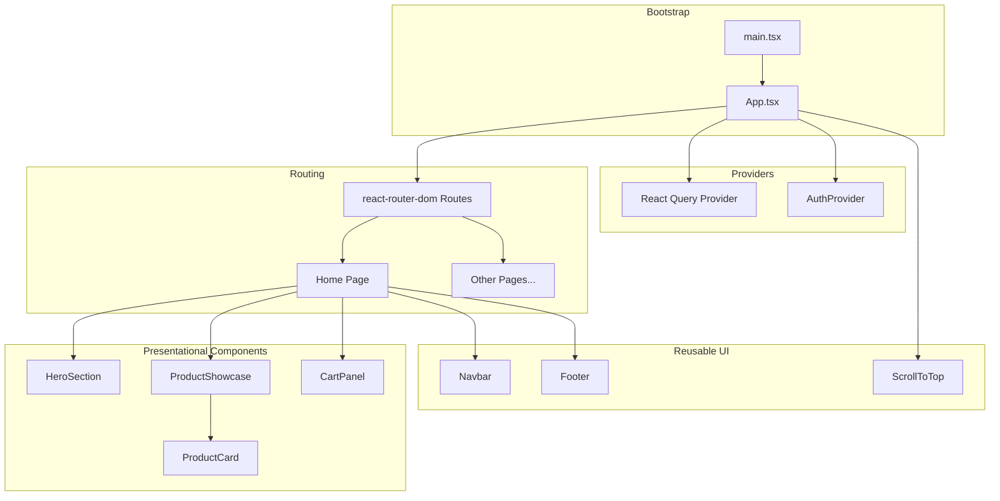
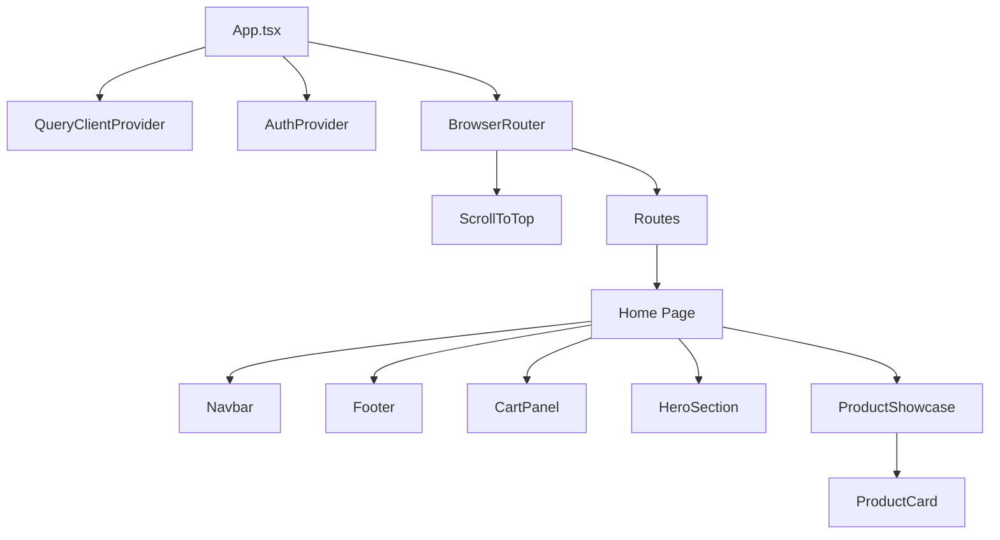
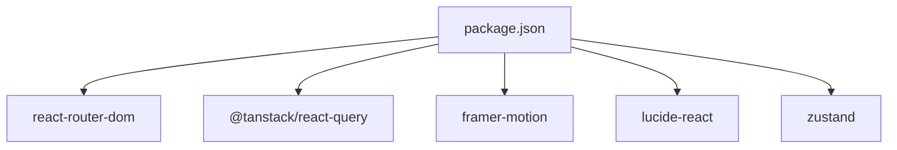

# Component Architecture

<cite>
**Referenced Files in This Document**
- [App.tsx](file://autocure/src/App.tsx)
- [main.tsx](file://autocure/src/main.tsx)
- [Navbar.tsx](file://autocure/src/components/Navbar.tsx)
- [Footer.tsx](file://autocure/src/components/Footer.tsx)
- [ScrollToTop.tsx](file://autocure/src/components/ScrollToTop.tsx)
- [Home.tsx](file://autocure/src/pages/Home.tsx)
- [AuthContext.tsx](file://autocure/src/contexts/AuthContext.tsx)
- [useAuth.ts](file://autocure/src/hooks/useAuth.ts)
- [cartStore.ts](file://autocure/src/stores/cartStore.ts)
- [CartPanel.tsx](file://autocure/src/components/CartPanel.tsx)
- [HeroSection.tsx](file://autocure/src/components/HeroSection.tsx)
- [ProductShowcase.tsx](file://autocure/src/components/ProductShowcase.tsx)
- [ProductCard.tsx](file://autocure/src/components/ProductCard.tsx)
- [products.ts](file://autocure/src/data/products.ts)
- [package.json](file://autocure/package.json)
</cite>

## Table of Contents
1. [Introduction](#introduction)
2. [Project Structure](#project-structure)
3. [Core Components](#core-components)
4. [Architecture Overview](#architecture-overview)
5. [Detailed Component Analysis](#detailed-component-analysis)
6. [Dependency Analysis](#dependency-analysis)
7. [Performance Considerations](#performance-considerations)
8. [Troubleshooting Guide](#troubleshooting-guide)
9. [Conclusion](#conclusion)

## Introduction
This document explains CarCure2’s component-based architecture, focusing on the component hierarchy starting from the root App component down to individual page components. It details composition patterns, strategies to avoid prop drilling, and the reusable component library (Navbar, Footer, ScrollToTop). It also covers the separation between presentational and container components, lifecycle management, and performance optimizations such as memoization and selective re-rendering. Practical examples and best practices are included to guide maintainable component design.

## Project Structure
CarCure2 follows a feature-based organization under src/. The application bootstraps in main.tsx and renders App, which configures routing, global providers, and page-level components. Presentational components live under components/, page components under pages/, shared state under stores/, cross-cutting concerns under contexts/, and reusable hooks under hooks/.

**Diagram sources**
- [main.tsx](file://autocure/src/main.tsx#L1-L11)
- [App.tsx](file://autocure/src/App.tsx#L1-L47)
- [Home.tsx](file://autocure/src/pages/Home.tsx#L1-L18)
- [Navbar.tsx](file://autocure/src/components/Navbar.tsx#L1-L216)
- [Footer.tsx](file://autocure/src/components/Footer.tsx#L1-L119)
- [ScrollToTop.tsx](file://autocure/src/components/ScrollToTop.tsx#L1-L13)
- [HeroSection.tsx](file://autocure/src/components/HeroSection.tsx#L1-L123)
- [ProductShowcase.tsx](file://autocure/src/components/ProductShowcase.tsx#L1-L70)
- [ProductCard.tsx](file://autocure/src/components/ProductCard.tsx#L1-L95)
- [CartPanel.tsx](file://autocure/src/components/CartPanel.tsx#L1-L143)

**Section sources**
- [main.tsx](file://autocure/src/main.tsx#L1-L11)
- [App.tsx](file://autocure/src/App.tsx#L1-L47)

## Core Components
This section introduces the foundational building blocks and their roles:
- App: Central orchestrator that wires providers, routing, and ScrollToTop.
- Providers: React Query provider for caching and optimistic updates; AuthProvider for authentication state.
- Routing: Route definitions for all pages.
- Reusable UI: Navbar, Footer, ScrollToTop provide consistent navigation and UX across pages.
- Presentational components: HeroSection, ProductShowcase, ProductCard, CartPanel deliver page-specific UI and interactions.

Key patterns:
- Composition over inheritance: Pages compose reusable components.
- Hooks for cross-cutting concerns: useAuth and Zustand cartStore encapsulate state logic.
- Minimal prop drilling: Context and stores supply data to deeply nested components.

**Section sources**
- [App.tsx](file://autocure/src/App.tsx#L1-L47)
- [AuthContext.tsx](file://autocure/src/contexts/AuthContext.tsx#L1-L37)
- [useAuth.ts](file://autocure/src/hooks/useAuth.ts#L1-L43)
- [cartStore.ts](file://autocure/src/stores/cartStore.ts#L1-L63)

## Architecture Overview
The architecture centers on a single-page application with:
- Global providers at the root (QueryClientProvider, AuthProvider).
- Route-driven rendering of page components.
- Reusable presentational components layered on top of page components.
- Localized state via Zustand for shopping cart and global UI state.
- Authentication state managed via a custom hook and context.

**Diagram sources**
- [App.tsx](file://autocure/src/App.tsx#L1-L47)
- [Home.tsx](file://autocure/src/pages/Home.tsx#L1-L18)
- [Navbar.tsx](file://autocure/src/components/Navbar.tsx#L1-L216)
- [Footer.tsx](file://autocure/src/components/Footer.tsx#L1-L119)
- [ScrollToTop.tsx](file://autocure/src/components/ScrollToTop.tsx#L1-L13)
- [CartPanel.tsx](file://autocure/src/components/CartPanel.tsx#L1-L143)
- [HeroSection.tsx](file://autocure/src/components/HeroSection.tsx#L1-L123)
- [ProductShowcase.tsx](file://autocure/src/components/ProductShowcase.tsx#L1-L70)
- [ProductCard.tsx](file://autocure/src/components/ProductCard.tsx#L1-L95)

## Detailed Component Analysis

### App and Root Providers
- Wraps the app with QueryClientProvider for caching and optimistic updates.
- Wraps with AuthProvider to expose authentication state via context.
- Configures BrowserRouter and ScrollToTop to reset scroll position on route changes.
- Declares routes for Home, Products, Product detail, Checkout, Auth, About, Contact, Profile, Admin, Wishlist, and NotFound.

Prop drilling avoidance:
- Authentication state is available globally via context, eliminating the need to pass props down multiple layers.
- QueryClientProvider enables data fetching anywhere in the tree without manual prop passing.

**Section sources**
- [App.tsx](file://autocure/src/App.tsx#L1-L47)
- [AuthContext.tsx](file://autocure/src/contexts/AuthContext.tsx#L1-L37)

### Reusable Components Library

#### Navbar
Responsibilities:
- Renders desktop and mobile navigation.
- Displays cart item count with animated badge.
- Shows conditional links based on authentication and admin status.
- Adjusts appearance on scroll and closes mobile menu on route changes.

Props and integration:
- No props required; consumes useCartStore, useAuth, useAdmin internally.
- Integrates with routing via Link and reacts to location changes.

Lifecycle management:
- Uses scroll event listener with cleanup.
- Resets mobile menu on route change.

Performance considerations:
- Uses local state for scroll and mobile menu; minimal re-renders.
- Avoids unnecessary re-computation by deriving cart count from store.

**Section sources**
- [Navbar.tsx](file://autocure/src/components/Navbar.tsx#L1-L216)

#### Footer
Responsibilities:
- Provides site branding, shop links, company links, and contact information.
- Uses Link for internal navigation.

Props and integration:
- Stateless functional component; no external props.
- Integrated into page layouts for consistent footer placement.

**Section sources**
- [Footer.tsx](file://autocure/src/components/Footer.tsx#L1-L119)

#### ScrollToTop
Responsibilities:
- Scrolls to the top of the page on route changes.
- Prevents scroll restoration issues during navigation.

Props and integration:
- No props; subscribes to location changes via react-router-dom.

**Section sources**
- [ScrollToTop.tsx](file://autocure/src/components/ScrollToTop.tsx#L1-L13)

### Page Components and Composition Patterns

#### Home
Composition pattern:
- Composes Navbar, CartPanel, HeroSection, ProductShowcase, and Footer.
- Demonstrates presentational vs container separation: Home is a container that composes presentational components.

Props and integration:
- No props passed; presentational components consume hooks and stores internally.

**Section sources**
- [Home.tsx](file://autocure/src/pages/Home.tsx#L1-L18)

### Presentational Components and State Management

#### HeroSection
Responsibilities:
- Renders hero content with animations and statistics.
- Uses motion primitives for staggered entrance effects.

Props and integration:
- Stateless; integrates with routing via Link.

**Section sources**
- [HeroSection.tsx](file://autocure/src/components/HeroSection.tsx#L1-L123)

#### ProductShowcase
Responsibilities:
- Manages category filtering and product grid rendering.
- Uses useMemo to compute filtered products efficiently.

Props and integration:
- Receives no props; reads categories and products from data module.

**Section sources**
- [ProductShowcase.tsx](file://autocure/src/components/ProductShowcase.tsx#L1-L70)
- [products.ts](file://autocure/src/data/products.ts#L1-L111)

#### ProductCard
Responsibilities:
- Displays product details and quick actions.
- Adds items to the cart via useCartStore.

Props and integration:
- Accepts product and optional index for staggered animations.
- Uses event handlers to prevent propagation and integrate with cart store.

**Section sources**
- [ProductCard.tsx](file://autocure/src/components/ProductCard.tsx#L1-L95)
- [cartStore.ts](file://autocure/src/stores/cartStore.ts#L1-L63)

#### CartPanel
Responsibilities:
- Implements a slide-out cart panel with animated backdrop and items list.
- Supports quantity updates, removal, and checkout navigation.

Props and integration:
- Consumes cart store for items, totals, and UI state.
- Uses AnimatePresence/motion for smooth transitions.

**Section sources**
- [CartPanel.tsx](file://autocure/src/components/CartPanel.tsx#L1-L143)
- [cartStore.ts](file://autocure/src/stores/cartStore.ts#L1-L63)

### Authentication and State Management

#### AuthContext and useAuth
- AuthProvider exposes authentication state and actions via context.
- useAuth encapsulates sign-up, sign-in, and sign-out logic with stub implementations.

Integration patterns:
- Components access user state via useAuthContext or direct useAuth hook.
- Avoids prop drilling by centralizing auth state.

**Section sources**
- [AuthContext.tsx](file://autocure/src/contexts/AuthContext.tsx#L1-L37)
- [useAuth.ts](file://autocure/src/hooks/useAuth.ts#L1-L43)

#### Zustand cartStore
- Encapsulates cart state, UI open state, and derived computations (total, item count).
- Exposes actions to modify cart and toggle visibility.

Integration patterns:
- Components subscribe to slices of state via useCartStore.
- Reduces re-renders by selecting only needed state.

**Section sources**
- [cartStore.ts](file://autocure/src/stores/cartStore.ts#L1-L63)

### Component Lifecycle Management
- ScrollToTop resets scroll on pathname changes.
- Navbar adds a scroll event listener on mount and removes it on unmount.
- CartPanel uses AnimatePresence for enter/exit animations and controlled backdrop behavior.
- ProductShowcase uses viewport-based animations with whileInView and viewport once optimization.

**Section sources**
- [ScrollToTop.tsx](file://autocure/src/components/ScrollToTop.tsx#L1-L13)
- [Navbar.tsx](file://autocure/src/components/Navbar.tsx#L1-L216)
- [CartPanel.tsx](file://autocure/src/components/CartPanel.tsx#L1-L143)
- [ProductShowcase.tsx](file://autocure/src/components/ProductShowcase.tsx#L1-L70)

### Prop Drilling Avoidance Strategies
- Context (AuthProvider) eliminates the need to pass user props through intermediate components.
- Zustand stores (cartStore) allow components to subscribe to specific slices without lifting state.
- Route-level composition keeps presentational components self-contained and decoupled from routing concerns.

**Section sources**
- [AuthContext.tsx](file://autocure/src/contexts/AuthContext.tsx#L1-L37)
- [cartStore.ts](file://autocure/src/stores/cartStore.ts#L1-L63)

### Performance Optimization Through Memoization and Selective Re-rendering
- ProductShowcase uses useMemo to avoid recomputing filtered products on every render.
- ProductCard leverages motion and viewport-based rendering to optimize perceived performance.
- CartPanel selectively renders empty vs populated states and uses layout animations efficiently.
- Navbar uses local state for UI toggles and scroll detection with passive listeners.

**Section sources**
- [ProductShowcase.tsx](file://autocure/src/components/ProductShowcase.tsx#L1-L70)
- [ProductCard.tsx](file://autocure/src/components/ProductCard.tsx#L1-L95)
- [CartPanel.tsx](file://autocure/src/components/CartPanel.tsx#L1-L143)
- [Navbar.tsx](file://autocure/src/components/Navbar.tsx#L1-L216)

## Dependency Analysis
External libraries and their roles:
- react-router-dom: Routing and navigation.
- @tanstack/react-query: Data fetching and caching.
- framer-motion: Animations and transitions.
- lucide-react: Icons.
- zustand: Lightweight state management.

**Diagram sources**
- [package.json](file://autocure/package.json#L1-L30)

**Section sources**
- [package.json](file://autocure/package.json#L1-L30)

## Performance Considerations
- Prefer local component state for UI toggles (e.g., mobile menu, cart open state).
- Use memoization for expensive computations (e.g., filtered product lists).
- Keep presentational components pure and delegate state to hooks or stores.
- Use viewport-based animations to improve perceived performance.
- Avoid unnecessary re-renders by selecting minimal state from stores.

## Troubleshooting Guide
Common issues and resolutions:
- Authentication state not available: Ensure components are rendered within AuthProvider and use the appropriate hook/context.
- Cart not updating: Verify useCartStore subscriptions and that actions are invoked correctly.
- Scroll not resetting: Confirm ScrollToTop is rendered inside BrowserRouter and that pathname changes trigger the effect.
- Animations not working: Ensure framer-motion is installed and used correctly in components.

**Section sources**
- [AuthContext.tsx](file://autocure/src/contexts/AuthContext.tsx#L1-L37)
- [cartStore.ts](file://autocure/src/stores/cartStore.ts#L1-L63)
- [ScrollToTop.tsx](file://autocure/src/components/ScrollToTop.tsx#L1-L13)
- [package.json](file://autocure/package.json#L1-L30)

## Conclusion
CarCure2 employs a clean, component-based architecture with clear separation between presentational and container components. By leveraging context, hooks, and Zustand, the app minimizes prop drilling and centralizes cross-cutting concerns. Reusable components like Navbar, Footer, and ScrollToTop provide consistent UX, while routing and state management enable scalable growth. Following the outlined patterns and best practices ensures maintainability and performance across the application.