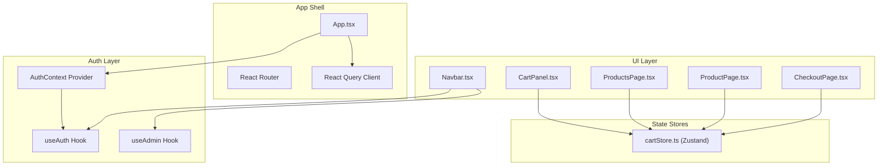
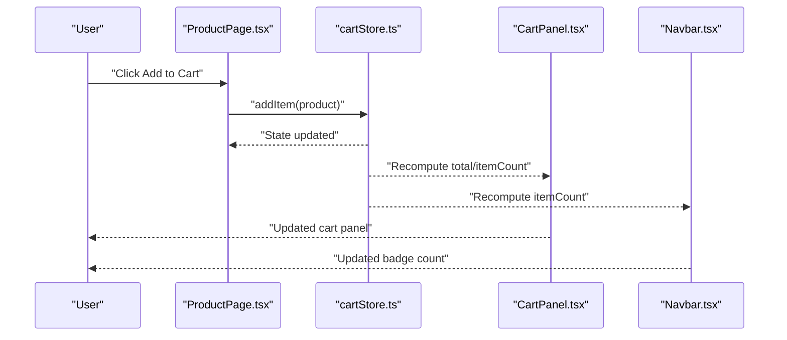
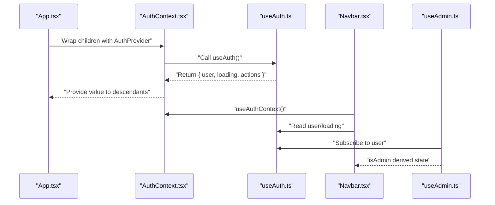
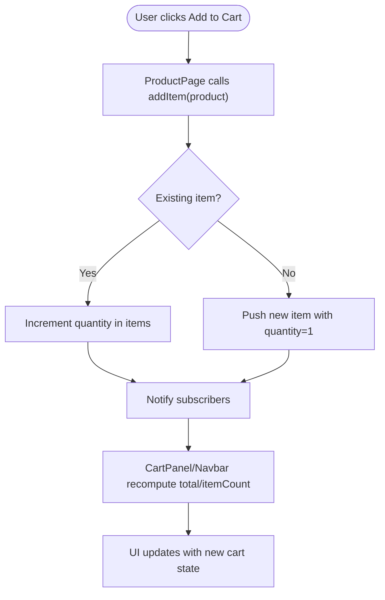
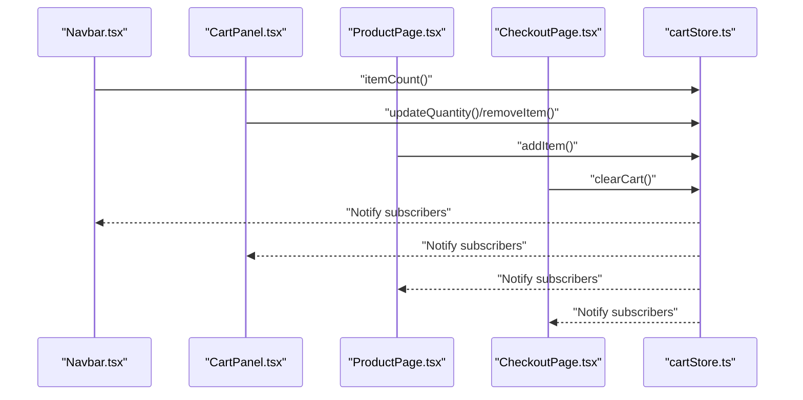
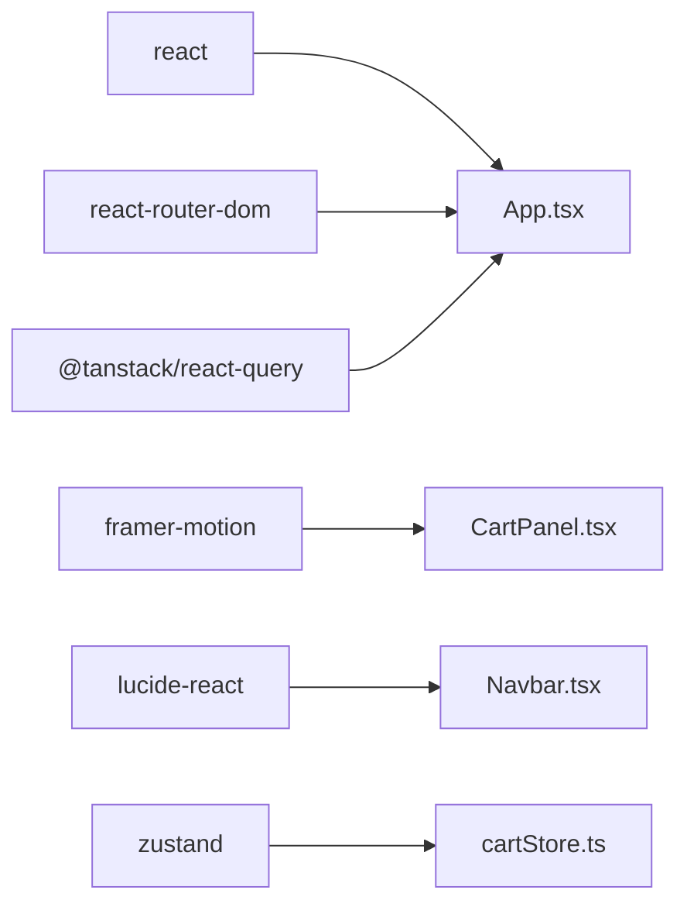

# Data Flow Patterns

<cite>
**Referenced Files in This Document**
- [App.tsx](file://autocure/src/App.tsx)
- [AuthContext.tsx](file://autocure/src/contexts/AuthContext.tsx)
- [useAuth.ts](file://autocure/src/hooks/useAuth.ts)
- [useAdmin.ts](file://autocure/src/hooks/useAdmin.ts)
- [cartStore.ts](file://autocure/src/stores/cartStore.ts)
- [Navbar.tsx](file://autocure/src/components/Navbar.tsx)
- [CartPanel.tsx](file://autocure/src/components/CartPanel.tsx)
- [ProductsPage.tsx](file://autocure/src/pages/ProductsPage.tsx)
- [ProductPage.tsx](file://autocure/src/pages/ProductPage.tsx)
- [CheckoutPage.tsx](file://autocure/src/pages/CheckoutPage.tsx)
- [package.json](file://autocure/package.json)
</cite>

## Table of Contents
1. [Introduction](#introduction)
2. [Project Structure](#project-structure)
3. [Core Components](#core-components)
4. [Architecture Overview](#architecture-overview)
5. [Detailed Component Analysis](#detailed-component-analysis)
6. [Dependency Analysis](#dependency-analysis)
7. [Performance Considerations](#performance-considerations)
8. [Troubleshooting Guide](#troubleshooting-guide)
9. [Conclusion](#conclusion)

## Introduction
This document explains CarCure2’s data flow architecture with a focus on unidirectional data flow from user interactions through context providers and state stores to UI updates. It documents:
- Authentication data flow through AuthContext and custom hooks
- State synchronization patterns across components
- Event-driven updates in the shopping cart system
- Integration between custom hooks (useAuth, useAdmin) and underlying state management
- Examples of data flow diagrams, state update sequences, and debugging approaches
- Performance considerations and optimization strategies for large-scale data updates

## Project Structure
CarCure2 organizes its frontend around React with a small set of state management primitives:
- Context provider for authentication
- Zustand-based cart store
- Custom hooks for authentication and admin checks
- UI components that subscribe to state and trigger actions

**Diagram sources**
- [App.tsx](file://autocure/src/App.tsx#L1-L47)
- [AuthContext.tsx](file://autocure/src/contexts/AuthContext.tsx#L20-L28)
- [useAuth.ts](file://autocure/src/hooks/useAuth.ts#L17-L42)
- [useAdmin.ts](file://autocure/src/hooks/useAdmin.ts#L4-L24)
- [Navbar.tsx](file://autocure/src/components/Navbar.tsx#L15-L24)
- [CartPanel.tsx](file://autocure/src/components/CartPanel.tsx#L6-L7)
- [ProductsPage.tsx](file://autocure/src/pages/ProductsPage.tsx#L20-L77)
- [ProductPage.tsx](file://autocure/src/pages/ProductPage.tsx#L38-L53)
- [CheckoutPage.tsx](file://autocure/src/pages/CheckoutPage.tsx#L26-L42)
- [cartStore.ts](file://autocure/src/stores/cartStore.ts#L22-L62)

**Section sources**
- [App.tsx](file://autocure/src/App.tsx#L1-L47)
- [package.json](file://autocure/package.json#L1-L30)

## Core Components
- AuthContext and useAuth: Provide authentication state and actions to the app. The provider exposes user, loading, and auth action functions. The hook encapsulates local state and returns the current user and actions.
- useAdmin: Derives admin privileges from the current user via a derived effect; stubbed in the current implementation.
- cartStore (Zustand): Centralized cart state with actions to add/remove/update items, compute totals, and manage visibility.

Key integration points:
- Navbar subscribes to cart item count and toggles the cart panel; it also reads user/admin state to render appropriate navigation.
- Product pages subscribe to cart actions to add items and to the cart total for checkout summaries.
- Checkout page validates form state, checks authentication, and clears the cart upon successful submission.

**Section sources**
- [AuthContext.tsx](file://autocure/src/contexts/AuthContext.tsx#L10-L36)
- [useAuth.ts](file://autocure/src/hooks/useAuth.ts#L9-L42)
- [useAdmin.ts](file://autocure/src/hooks/useAdmin.ts#L4-L24)
- [cartStore.ts](file://autocure/src/stores/cartStore.ts#L9-L62)
- [Navbar.tsx](file://autocure/src/components/Navbar.tsx#L15-L24)
- [CartPanel.tsx](file://autocure/src/components/CartPanel.tsx#L6-L7)
- [ProductsPage.tsx](file://autocure/src/pages/ProductsPage.tsx#L20-L77)
- [ProductPage.tsx](file://autocure/src/pages/ProductPage.tsx#L38-L53)
- [CheckoutPage.tsx](file://autocure/src/pages/CheckoutPage.tsx#L26-L42)

## Architecture Overview
Unidirectional data flow:
1. User interactions occur in UI components (e.g., clicking “Add to Cart”).
2. Components call state store actions (e.g., addItem) or context actions (e.g., signOut).
3. State stores update internal state immutably and notify subscribers.
4. Subscribers re-render based on selected slices of state.
5. Derived state (e.g., admin flag) recomputes when upstream dependencies change.

**Diagram sources**
- [ProductPage.tsx](file://autocure/src/pages/ProductPage.tsx#L100-L105)
- [cartStore.ts](file://autocure/src/stores/cartStore.ts#L22-L36)
- [CartPanel.tsx](file://autocure/src/components/CartPanel.tsx#L6-L7)
- [Navbar.tsx](file://autocure/src/components/Navbar.tsx#L20-L24)

## Detailed Component Analysis

### Authentication Data Flow (AuthContext, useAuth, useAdmin)
- Provider pattern: AuthProvider wraps the app and injects auth state/actions via context.
- useAuth manages local user/loading state and exposes stubbed auth methods.
- useAdmin derives admin status from user; currently stubbed.

**Diagram sources**
- [App.tsx](file://autocure/src/App.tsx#L23-L42)
- [AuthContext.tsx](file://autocure/src/contexts/AuthContext.tsx#L20-L28)
- [useAuth.ts](file://autocure/src/hooks/useAuth.ts#L17-L42)
- [useAdmin.ts](file://autocure/src/hooks/useAdmin.ts#L4-L24)
- [Navbar.tsx](file://autocure/src/components/Navbar.tsx#L20-L22)

**Section sources**
- [AuthContext.tsx](file://autocure/src/contexts/AuthContext.tsx#L10-L36)
- [useAuth.ts](file://autocure/src/hooks/useAuth.ts#L9-L42)
- [useAdmin.ts](file://autocure/src/hooks/useAdmin.ts#L4-L24)
- [Navbar.tsx](file://autocure/src/components/Navbar.tsx#L20-L22)

### Shopping Cart Data Flow (Zustand Store)
- Store shape includes items, isOpen, and actions (addItem, removeItem, updateQuantity, clearCart, toggleCart, setCartOpen, total, itemCount).
- Components subscribe to store slices (e.g., items, isOpen, total, itemCount) and call actions on user events.

**Diagram sources**
- [ProductPage.tsx](file://autocure/src/pages/ProductPage.tsx#L100-L105)
- [cartStore.ts](file://autocure/src/stores/cartStore.ts#L22-L36)
- [CartPanel.tsx](file://autocure/src/components/CartPanel.tsx#L6-L7)
- [Navbar.tsx](file://autocure/src/components/Navbar.tsx#L20-L24)

**Section sources**
- [cartStore.ts](file://autocure/src/stores/cartStore.ts#L9-L62)
- [ProductPage.tsx](file://autocure/src/pages/ProductPage.tsx#L100-L105)
- [CartPanel.tsx](file://autocure/src/components/CartPanel.tsx#L6-L7)
- [Navbar.tsx](file://autocure/src/components/Navbar.tsx#L20-L24)

### State Synchronization Patterns Across Components
- Navbar reacts to cart changes via itemCount and toggles cart visibility via toggleCart/setCartOpen.
- CartPanel renders items and exposes per-item update/remove actions.
- ProductPage computes related products and handles quantity selection; it triggers addItem.
- CheckoutPage validates form, checks authentication, and clears the cart after order placement.

**Diagram sources**
- [Navbar.tsx](file://autocure/src/components/Navbar.tsx#L20-L24)
- [CartPanel.tsx](file://autocure/src/components/CartPanel.tsx#L6-L7)
- [ProductPage.tsx](file://autocure/src/pages/ProductPage.tsx#L100-L105)
- [CheckoutPage.tsx](file://autocure/src/pages/CheckoutPage.tsx#L29-L111)
- [cartStore.ts](file://autocure/src/stores/cartStore.ts#L22-L62)

**Section sources**
- [Navbar.tsx](file://autocure/src/components/Navbar.tsx#L20-L24)
- [CartPanel.tsx](file://autocure/src/components/CartPanel.tsx#L6-L7)
- [ProductPage.tsx](file://autocure/src/pages/ProductPage.tsx#L100-L105)
- [CheckoutPage.tsx](file://autocure/src/pages/CheckoutPage.tsx#L29-L111)
- [cartStore.ts](file://autocure/src/stores/cartStore.ts#L22-L62)

### Debugging Approaches for Tracking Data Changes
- Enable React DevTools to inspect component props and hooks state.
- Use React Query Devtools to observe cache behavior and invalidations.
- Add console logs in store action creators and hook effects to trace updates.
- Temporarily wrap components with a wrapper that logs re-renders to identify unnecessary re-renders.
- For cart debugging, log store slices before and after actions to confirm immutability and subscription correctness.

[No sources needed since this section provides general guidance]

## Dependency Analysis
External libraries and their roles:
- React Router: Routing and navigation
- Framer Motion: Animations for cart panel and page transitions
- Lucide React: Icons used across UI
- @tanstack/react-query: Query client provider at the app root
- zustand: Global state store for cart

**Diagram sources**
- [package.json](file://autocure/package.json#L18-L28)
- [App.tsx](file://autocure/src/App.tsx#L1-L47)
- [CartPanel.tsx](file://autocure/src/components/CartPanel.tsx#L1-L143)
- [Navbar.tsx](file://autocure/src/components/Navbar.tsx#L1-L216)
- [cartStore.ts](file://autocure/src/stores/cartStore.ts#L1-L63)

**Section sources**
- [package.json](file://autocure/package.json#L18-L28)
- [App.tsx](file://autocure/src/App.tsx#L19-L24)

## Performance Considerations
- Prefer granular subscriptions: Components should only subscribe to the slices they need (e.g., itemCount vs. entire items array).
- Memoize derived computations: Use useMemo for expensive derived data (already present in ProductsPage and ProductPage).
- Batch updates: When adding multiple units, consider batching addItem calls or using a single action if extended.
- Avoid unnecessary re-renders: Keep UI components pure and avoid passing new object/function refs on each render.
- Large cart lists: Virtualize long lists if cart grows significantly; the current implementation uses layout animations which are acceptable for moderate sizes.
- Debounce heavy UI updates: For search/filter operations, debounce input handlers to reduce re-computation frequency.

[No sources needed since this section provides general guidance]

## Troubleshooting Guide
Common issues and remedies:
- Cart not updating after add: Verify that the component calls the store action and that the store slice is subscribed. Confirm that the action returns a new state and that subscribers re-render.
- Admin UI not appearing: useAdmin is currently stubbed; ensure the hook resolves to true for admin users in a real backend integration.
- Authentication state not reflected: Ensure components consume the context via useAuthContext or the useAuth hook and that the provider is wrapping the app.
- Form validation errors: Checkout form validation sets local errors; ensure the form state is reset or cleared appropriately after corrections.

**Section sources**
- [useAdmin.ts](file://autocure/src/hooks/useAdmin.ts#L4-L24)
- [ProductsPage.tsx](file://autocure/src/pages/ProductsPage.tsx#L38-L77)
- [ProductPage.tsx](file://autocure/src/pages/ProductPage.tsx#L57-L69)
- [CheckoutPage.tsx](file://autocure/src/pages/CheckoutPage.tsx#L43-L65)

## Conclusion
CarCure2 follows a clean, unidirectional data flow:
- Authentication state is centralized via a context provider and custom hook.
- UI components subscribe to state slices and trigger actions in response to user interactions.
- The cart store, built with Zustand, enables event-driven updates with minimal boilerplate.
- Performance and maintainability are supported by memoization, granular subscriptions, and clear separation of concerns.

[No sources needed since this section summarizes without analyzing specific files]