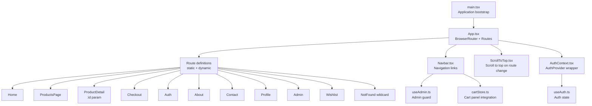
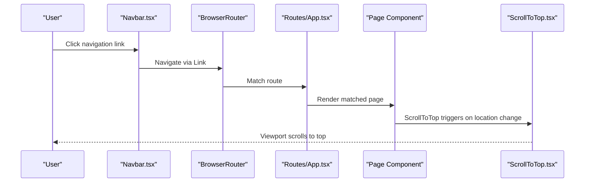
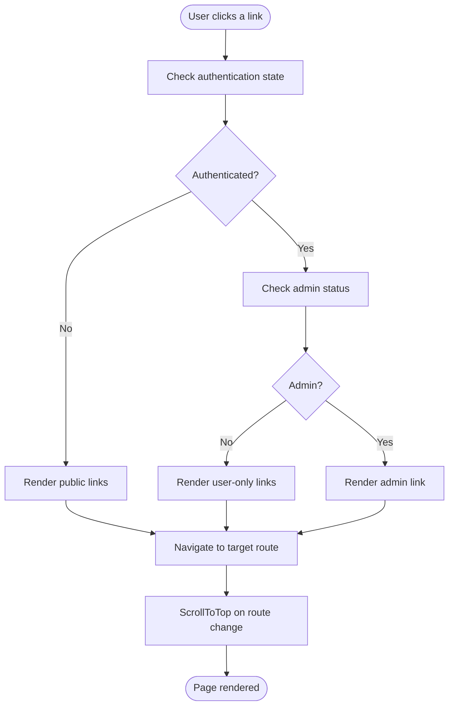
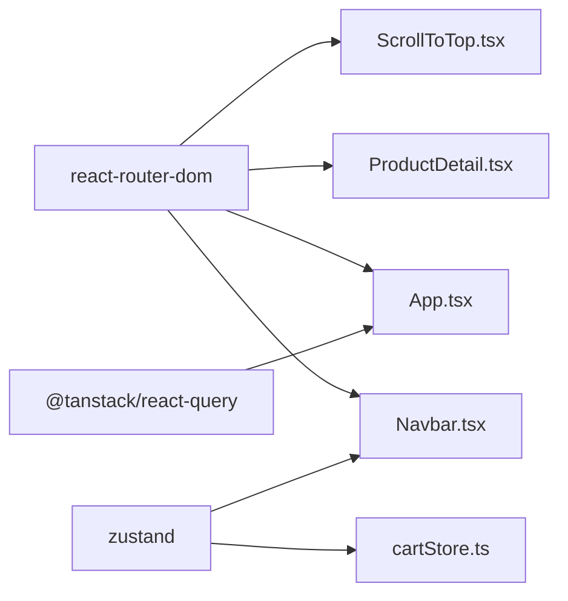

# Routing System

<cite>
**Referenced Files in This Document**
- [App.tsx](file://autocure/src/App.tsx)
- [main.tsx](file://autocure/src/main.tsx)
- [Navbar.tsx](file://autocure/src/components/Navbar.tsx)
- [ScrollToTop.tsx](file://autocure/src/components/ScrollToTop.tsx)
- [AuthContext.tsx](file://autocure/src/contexts/AuthContext.tsx)
- [useAuth.ts](file://autocure/src/hooks/useAuth.ts)
- [useAdmin.ts](file://autocure/src/hooks/useAdmin.ts)
- [ProductsPage.tsx](file://autocure/src/pages/ProductsPage.tsx)
- [ProductDetail.tsx](file://autocure/src/pages/ProductDetail.tsx)
- [Admin.tsx](file://autocure/src/pages/Admin.tsx)
- [Profile.tsx](file://autocure/src/pages/Profile.tsx)
- [package.json](file://autocure/package.json)
- [products.ts](file://autocure/src/data/products.ts)
- [cartStore.ts](file://autocure/src/stores/cartStore.ts)
</cite>

## Table of Contents
1. [Introduction](#introduction)
2. [Project Structure](#project-structure)
3. [Core Components](#core-components)
4. [Architecture Overview](#architecture-overview)
5. [Detailed Component Analysis](#detailed-component-analysis)
6. [Dependency Analysis](#dependency-analysis)
7. [Performance Considerations](#performance-considerations)
8. [Troubleshooting Guide](#troubleshooting-guide)
9. [Conclusion](#conclusion)

## Introduction
This document explains CarCure2’s routing architecture built with React Router DOM. It covers route configuration in App.tsx, navigation flows, route parameter handling for dynamic content, and the integration of authentication and admin guards. It also outlines performance considerations, SEO-friendly URL patterns, and best practices for maintainable routing.

## Project Structure
The routing system centers around a single-page application bootstrapped in main.tsx and configured in App.tsx. React Router DOM defines static and dynamic routes, while shared components like Navbar and ScrollToTop coordinate navigation and UX. Authentication and admin checks are handled via custom hooks and context providers.

**Diagram sources**
- [main.tsx](file://autocure/src/main.tsx#L1-L11)
- [App.tsx](file://autocure/src/App.tsx#L1-L47)
- [Navbar.tsx](file://autocure/src/components/Navbar.tsx#L1-L216)
- [ScrollToTop.tsx](file://autocure/src/components/ScrollToTop.tsx#L1-L13)
- [AuthContext.tsx](file://autocure/src/contexts/AuthContext.tsx#L1-L37)
- [useAuth.ts](file://autocure/src/hooks/useAuth.ts#L1-L43)
- [useAdmin.ts](file://autocure/src/hooks/useAdmin.ts#L1-L25)
- [cartStore.ts](file://autocure/src/stores/cartStore.ts#L1-L36)

**Section sources**
- [main.tsx](file://autocure/src/main.tsx#L1-L11)
- [App.tsx](file://autocure/src/App.tsx#L1-L47)

## Core Components
- App.tsx: Declares BrowserRouter and all Routes, including a wildcard catch-all for 404. It wraps the app with QueryClientProvider and AuthProvider to integrate state and routing.
- Navbar.tsx: Provides navigation links and conditionally renders admin and profile links based on authentication and admin status. Integrates cart and mobile menu.
- ScrollToTop.tsx: Scrolls to the top of the page on route changes.
- AuthContext.tsx and useAuth.ts: Provide authentication state and actions (signUp, signIn, signOut). They expose user data and loading state to the rest of the app.
- useAdmin.ts: Computes admin status from the current user and stubs backend role verification.
- ProductsPage.tsx: Demonstrates route parameter handling indirectly via product listing and filtering; ProductDetail.tsx shows useParams usage for dynamic content.
- Admin.tsx and Profile.tsx: Example protected pages.

**Section sources**
- [App.tsx](file://autocure/src/App.tsx#L1-L47)
- [Navbar.tsx](file://autocure/src/components/Navbar.tsx#L1-L216)
- [ScrollToTop.tsx](file://autocure/src/components/ScrollToTop.tsx#L1-L13)
- [AuthContext.tsx](file://autocure/src/contexts/AuthContext.tsx#L1-L37)
- [useAuth.ts](file://autocure/src/hooks/useAuth.ts#L1-L43)
- [useAdmin.ts](file://autocure/src/hooks/useAdmin.ts#L1-L25)
- [ProductsPage.tsx](file://autocure/src/pages/ProductsPage.tsx#L1-L225)
- [ProductDetail.tsx](file://autocure/src/pages/ProductDetail.tsx#L1-L25)
- [Admin.tsx](file://autocure/src/pages/Admin.tsx#L1-L17)
- [Profile.tsx](file://autocure/src/pages/Profile.tsx#L1-L17)

## Architecture Overview
The routing architecture follows a layered pattern:
- Bootstrap: main.tsx renders the root App component.
- Routing provider: App.tsx wraps the app with BrowserRouter and defines all routes.
- Navigation: Navbar.tsx uses Link to navigate between pages and adapts visibility based on auth/admin state.
- State integration: AuthProvider supplies user context consumed by Navbar, useAdmin, and other components.
- UX enhancement: ScrollToTop ensures a clean viewport on navigation.

**Diagram sources**
- [Navbar.tsx](file://autocure/src/components/Navbar.tsx#L1-L216)
- [App.tsx](file://autocure/src/App.tsx#L1-L47)
- [ScrollToTop.tsx](file://autocure/src/components/ScrollToTop.tsx#L1-L13)

## Detailed Component Analysis

### Route Configuration in App.tsx
- Static routes define the primary application pages with clean, SEO-friendly URLs.
- Dynamic route: product detail uses a parameterized path to display content based on id.
- Wildcard route handles unknown paths gracefully.
- Providers: QueryClientProvider and AuthProvider wrap the routing tree to enable global state and auth.

URL structure patterns:
- Home: "/"
- Products catalog: "/products"
- Product detail: "/product/:id"
- Checkout: "/checkout"
- Authentication: "/auth"
- Information: "/about", "/contact"
- User areas: "/profile", "/wishlist"
- Administration: "/admin"
- Fallback: "*"

Protected routes:
- Profile and Wishlist currently depend on user presence in Navbar rendering logic. To enforce server-side protection, wrap sensitive pages with a route guard that redirects unauthenticated users.

Admin-only routes:
- Admin page is conditionally shown in Navbar when admin status is true. For stricter enforcement, apply an admin guard at the route level.

Lazy loading:
- Current imports are eager. To optimize performance, replace static imports with React.lazy and Suspense for larger pages like ProductsPage and Admin.

Route parameter handling:
- ProductDetail uses useParams to extract id from the URL and render dynamic content.

**Section sources**
- [App.tsx](file://autocure/src/App.tsx#L1-L47)
- [ProductDetail.tsx](file://autocure/src/pages/ProductDetail.tsx#L1-L25)

### Navigation Flow and Guards
- Navbar.tsx orchestrates navigation with Link components and adapts menu items based on authentication and admin status.
- useAdmin.ts computes admin visibility by checking the current user; in a production system, integrate backend role verification.
- ScrollToTop.tsx listens to pathname changes and scrolls to the top, ensuring a consistent user experience.

**Diagram sources**
- [Navbar.tsx](file://autocure/src/components/Navbar.tsx#L1-L216)
- [useAdmin.ts](file://autocure/src/hooks/useAdmin.ts#L1-L25)
- [ScrollToTop.tsx](file://autocure/src/components/ScrollToTop.tsx#L1-L13)

**Section sources**
- [Navbar.tsx](file://autocure/src/components/Navbar.tsx#L1-L216)
- [useAdmin.ts](file://autocure/src/hooks/useAdmin.ts#L1-L25)
- [ScrollToTop.tsx](file://autocure/src/components/ScrollToTop.tsx#L1-L13)

### Route Parameter Handling for Dynamic Content
- ProductDetail demonstrates useParams to read the id parameter and display dynamic content.
- ProductsPage showcases filtering and sorting logic but does not rely on URL parameters for these features.

Best practices:
- Keep parameters minimal and descriptive.
- Validate parameters on the server or in the component to prevent invalid states.
- Consider URL encoding for special characters in identifiers.

**Section sources**
- [ProductDetail.tsx](file://autocure/src/pages/ProductDetail.tsx#L1-L25)
- [ProductsPage.tsx](file://autocure/src/pages/ProductsPage.tsx#L1-L225)

### Integration with Application State
- AuthProvider exposes user state and actions to the entire routing tree.
- useAuth manages local authentication state; in production, integrate with a backend service.
- useAdmin derives admin privileges from the user object; stubs can be replaced with backend RPC calls.
- cartStore coordinates cart visibility and item counts, influencing Navbar icons.

**Section sources**
- [AuthContext.tsx](file://autocure/src/contexts/AuthContext.tsx#L1-L37)
- [useAuth.ts](file://autocure/src/hooks/useAuth.ts#L1-L43)
- [useAdmin.ts](file://autocure/src/hooks/useAdmin.ts#L1-L25)
- [cartStore.ts](file://autocure/src/stores/cartStore.ts#L1-L36)

### SEO Considerations
- Clean, semantic URLs improve SEO and usability.
- Use descriptive paths like "/product/:id" and avoid query-string heavy navigation for core content.
- Implement canonical URLs and meta tags per page if integrating SSR or static generation later.
- Ensure the wildcard route serves appropriate 404 content and robots.txt policies.

[No sources needed since this section provides general guidance]

## Dependency Analysis
React Router DOM is the core dependency for routing. The application also uses @tanstack/react-query for caching and state management, which integrates with routing via QueryClientProvider.

**Diagram sources**
- [package.json](file://autocure/package.json#L1-L30)
- [App.tsx](file://autocure/src/App.tsx#L1-L47)
- [Navbar.tsx](file://autocure/src/components/Navbar.tsx#L1-L216)
- [ProductDetail.tsx](file://autocure/src/pages/ProductDetail.tsx#L1-L25)
- [ScrollToTop.tsx](file://autocure/src/components/ScrollToTop.tsx#L1-L13)
- [cartStore.ts](file://autocure/src/stores/cartStore.ts#L1-L36)

**Section sources**
- [package.json](file://autocure/package.json#L1-L30)

## Performance Considerations
- Lazy loading: Replace static imports with React.lazy for large pages (e.g., Admin, ProductsPage) and wrap with Suspense to avoid blocking the main thread.
- Code splitting: Group related routes under separate lazy-loaded chunks to reduce initial bundle size.
- Route-level suspense: Ensure Suspense boundaries are placed at route boundaries for optimal loading behavior.
- Image optimization: Use modern formats and sizes for product images to complement fast navigation.

[No sources needed since this section provides general guidance]

## Troubleshooting Guide
Common issues and resolutions:
- Blank screen after navigation: Verify that all route components render a fallback UI or proper error boundaries.
- Incorrect scroll position: Confirm ScrollToTop is mounted inside the routing tree and reacts to pathname changes.
- Auth guard bypass: Implement route guards that redirect unauthenticated users to the login page and admin-only routes to a forbidden page.
- Parameter errors: Validate route parameters in components and provide graceful fallbacks for invalid ids.
- State not updating: Ensure AuthProvider is wrapping the routing tree and that useAuth/useAdmin are used within the provider context.

**Section sources**
- [ScrollToTop.tsx](file://autocure/src/components/ScrollToTop.tsx#L1-L13)
- [AuthContext.tsx](file://autocure/src/contexts/AuthContext.tsx#L1-L37)
- [useAuth.ts](file://autocure/src/hooks/useAuth.ts#L1-L43)
- [useAdmin.ts](file://autocure/src/hooks/useAdmin.ts#L1-L25)

## Conclusion
CarCure2’s routing system is centered on React Router DOM with a clean URL structure and integrated authentication and admin guards. By implementing route guards, lazy loading, and robust parameter handling, the system can achieve secure, performant, and user-friendly navigation. The current architecture provides a solid foundation for scaling with additional pages, advanced guards, and SEO enhancements.