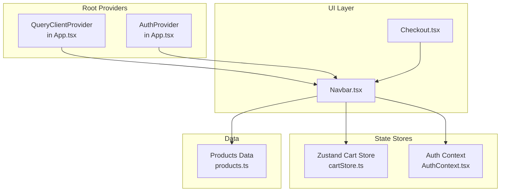
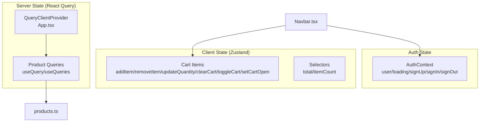
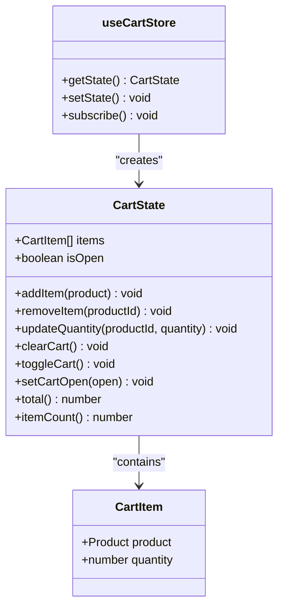
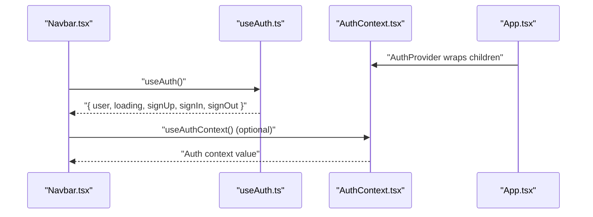
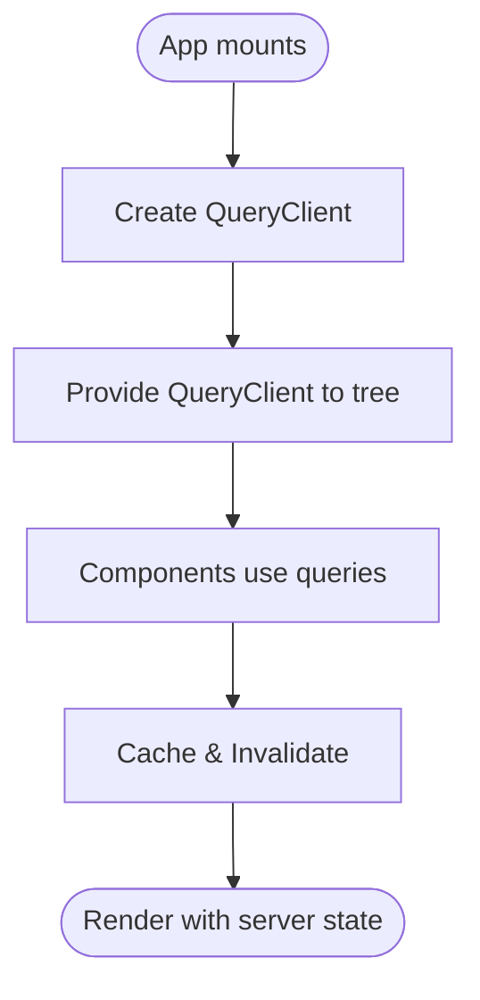
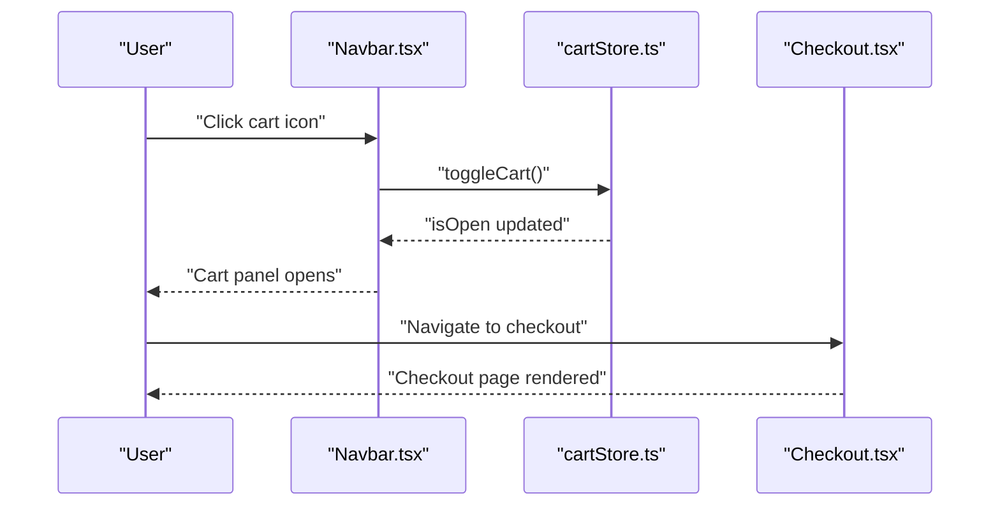
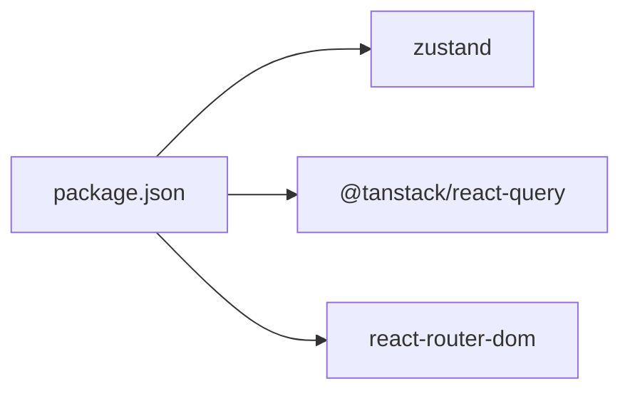

# State Management Architecture

<cite>
**Referenced Files in This Document**
- [cartStore.ts](file://autocure/src/stores/cartStore.ts)
- [AuthContext.tsx](file://autocure/src/contexts/AuthContext.tsx)
- [useAuth.ts](file://autocure/src/hooks/useAuth.ts)
- [useAdmin.ts](file://autocure/src/hooks/useAdmin.ts)
- [App.tsx](file://autocure/src/App.tsx)
- [main.tsx](file://autocure/src/main.tsx)
- [Navbar.tsx](file://autocure/src/components/Navbar.tsx)
- [Checkout.tsx](file://autocure/src/pages/Checkout.tsx)
- [products.ts](file://autocure/src/data/products.ts)
- [CartPanel.tsx](file://autocure/src/components/CartPanel.tsx)
- [package.json](file://autocure/package.json)
</cite>

## Table of Contents
1. [Introduction](#introduction)
2. [Project Structure](#project-structure)
3. [Core Components](#core-components)
4. [Architecture Overview](#architecture-overview)
5. [Detailed Component Analysis](#detailed-component-analysis)
6. [Dependency Analysis](#dependency-analysis)
7. [Performance Considerations](#performance-considerations)
8. [Troubleshooting Guide](#troubleshooting-guide)
9. [Conclusion](#conclusion)

## Introduction
This document explains CarCure2’s dual-state management architecture that combines client-side state (shopping cart) powered by Zustand and server state (product data) coordinated via React Query. It details how the application separates concerns between local UI/cart state and remote data state, documents the cart store implementation, authentication context, and integration patterns with UI components. It also outlines performance strategies, persistence considerations, and debugging approaches for complex state interactions.

## Project Structure
The application initializes global providers for React Query and authentication at the root level, then renders routed pages. The Zustand cart store is consumed by UI components such as the navigation bar to display cart state and trigger actions.

**Diagram sources**
- [App.tsx](file://autocure/src/App.tsx#L1-L47)
- [main.tsx](file://autocure/src/main.tsx#L1-L11)
- [Navbar.tsx](file://autocure/src/components/Navbar.tsx#L1-L216)
- [cartStore.ts](file://autocure/src/stores/cartStore.ts#L1-L63)
- [AuthContext.tsx](file://autocure/src/contexts/AuthContext.tsx#L1-L37)
- [products.ts](file://autocure/src/data/products.ts#L1-L111)

**Section sources**
- [App.tsx](file://autocure/src/App.tsx#L1-L47)
- [main.tsx](file://autocure/src/main.tsx#L1-L11)

## Core Components
- Zustand Cart Store: Manages client-side shopping cart state, exposes actions to modify items, and computed selectors for totals and counts.
- Authentication Context: Provides user session state and authentication methods via a hook-based pattern.
- React Query Provider: Wraps the app to enable server state caching and synchronization patterns.

Key responsibilities:
- Cart store: item lifecycle, quantity updates, totals, and UI visibility state.
- Auth context: user identity, loading state, and sign-in/sign-out flows.
- React Query: server state orchestration (product data fetching and caching).

**Section sources**
- [cartStore.ts](file://autocure/src/stores/cartStore.ts#L1-L63)
- [AuthContext.tsx](file://autocure/src/contexts/AuthContext.tsx#L1-L37)
- [useAuth.ts](file://autocure/src/hooks/useAuth.ts#L1-L43)
- [App.tsx](file://autocure/src/App.tsx#L1-L47)

## Architecture Overview
The architecture follows a clear separation of concerns:
- Local state (cart): managed entirely in memory with Zustand, ideal for ephemeral UI/cart interactions.
- Server state (products): intended to be managed with React Query for caching, invalidation, and refetching. While product data is present locally, the React Query provider is configured at the root, enabling future server integration.

**Diagram sources**
- [cartStore.ts](file://autocure/src/stores/cartStore.ts#L1-L63)
- [App.tsx](file://autocure/src/App.tsx#L1-L47)
- [AuthContext.tsx](file://autocure/src/contexts/AuthContext.tsx#L1-L37)
- [products.ts](file://autocure/src/data/products.ts#L1-L111)

## Detailed Component Analysis

### Zustand Cart Store
The cart store encapsulates:
- State shape: items array and cart open flag.
- Actions: add, remove, update quantity, clear, toggle visibility, and setters.
- Selectors: total cost and item count computed from current state.

Implementation highlights:
- Pure reducer-style updates via the Zustand setter.
- Efficient lookups for existing items before mutating arrays.
- Computed selectors avoid recomputing totals unless state changes.

**Diagram sources**
- [cartStore.ts](file://autocure/src/stores/cartStore.ts#L4-L20)

State selectors and actions:
- Selectors: total and itemCount compute derived values from items.
- Actions:
  - addItem: dedupe by product id, increment quantity if present, otherwise append new item.
  - removeItem: filter out item by product id.
  - updateQuantity: delete item if quantity falls to zero, else update quantity.
  - clearCart: reset items to empty.
  - toggleCart/setCartOpen: manage UI visibility.

Subscription patterns:
- Components subscribe to specific slices via selector functions (e.g., itemCount).
- Zustand subscriptions re-render only when selected state changes.

Integration with UI:
- Navbar consumes toggleCart and itemCount to render cart icon badge and open/close behavior.

**Section sources**
- [cartStore.ts](file://autocure/src/stores/cartStore.ts#L1-L63)
- [Navbar.tsx](file://autocure/src/components/Navbar.tsx#L20-L24)

### Authentication Context and Hooks
The authentication layer provides:
- Context provider wrapping the app.
- Hook exposing user, loading, and auth action methods.
- Admin hook deriving admin status from user.

**Diagram sources**
- [App.tsx](file://autocure/src/App.tsx#L20-L28)
- [AuthContext.tsx](file://autocure/src/contexts/AuthContext.tsx#L20-L36)
- [useAuth.ts](file://autocure/src/hooks/useAuth.ts#L17-L42)
- [Navbar.tsx](file://autocure/src/components/Navbar.tsx#L21-L22)

Notes:
- Current auth methods are stubbed; production would integrate with a backend or Supabase.
- Admin hook currently returns false; can be wired to server-side role checks.

**Section sources**
- [AuthContext.tsx](file://autocure/src/contexts/AuthContext.tsx#L1-L37)
- [useAuth.ts](file://autocure/src/hooks/useAuth.ts#L1-L43)
- [useAdmin.ts](file://autocure/src/hooks/useAdmin.ts#L1-L25)

### React Query Integration Point
React Query is initialized at the root with a QueryClientProvider. While product data is currently local, the provider enables:
- Centralized cache management.
- Query invalidation and refetching strategies.
- Hydration and error boundaries for server state.

**Diagram sources**
- [App.tsx](file://autocure/src/App.tsx#L19-L23)

**Section sources**
- [App.tsx](file://autocure/src/App.tsx#L1-L47)
- [package.json](file://autocure/package.json#L18-L28)

### UI Integration Examples
- Navbar subscribes to cart state via selectors and toggles visibility.
- Checkout page composes Navbar/Footer for layout.
- Product data is typed and structured for potential server integration.

**Diagram sources**
- [Navbar.tsx](file://autocure/src/components/Navbar.tsx#L75-L90)
- [cartStore.ts](file://autocure/src/stores/cartStore.ts#L55-L57)
- [Checkout.tsx](file://autocure/src/pages/Checkout.tsx#L1-L17)

**Section sources**
- [Navbar.tsx](file://autocure/src/components/Navbar.tsx#L1-L216)
- [Checkout.tsx](file://autocure/src/pages/Checkout.tsx#L1-L17)
- [products.ts](file://autocure/src/data/products.ts#L1-L111)

## Dependency Analysis
External libraries:
- Zustand: lightweight state management for client-side cart.
- @tanstack/react-query: server state orchestration and caching.
- react-router-dom: routing for page composition.

**Diagram sources**
- [package.json](file://autocure/package.json#L18-L28)

Internal dependencies:
- App.tsx composes QueryClientProvider and AuthProvider.
- Navbar.tsx depends on cartStore.ts and useAuth.ts.
- products.ts defines the data model for product entities.

**Section sources**
- [App.tsx](file://autocure/src/App.tsx#L1-L47)
- [Navbar.tsx](file://autocure/src/components/Navbar.tsx#L1-L216)
- [products.ts](file://autocure/src/data/products.ts#L1-L111)

## Performance Considerations
- Zustand selectors: Prefer narrow selectors to minimize re-renders. For example, pass a selector that returns only the needed slice (e.g., itemCount) rather than the entire state object.
- Batch updates: Group cart mutations to reduce intermediate renders.
- React Query caching: Configure cache times and invalidation policies for product queries to balance freshness and performance.
- Memoization: Wrap heavy UI components with memoization to prevent unnecessary re-renders when cart state changes.
- Lazy loading: Defer rendering of heavy components until after hydration if integrating server state.

## Troubleshooting Guide
Common issues and remedies:
- Cart not updating: Verify that the component subscribes to the correct selector and that actions are invoked with the proper arguments.
- Stale cart totals: Ensure selectors are pure and rely on current state; avoid external mutable state.
- Auth context errors: Confirm that components using the auth context are wrapped within AuthProvider.
- React Query hydration: If integrating server state, ensure QueryClientProvider is present at the root and consider hydration boundaries for SSR scenarios.
- Debugging state interactions:
  - Use Zustand devtools to inspect store updates and subscriptions.
  - Add logging around cart actions and auth transitions to trace state changes.
  - For React Query, leverage query devtools to observe cache state and refetch triggers.

## Conclusion
CarCure2’s architecture cleanly separates client-side cart state (Zustand) from server state (React Query), enabling scalable and maintainable state management. The cart store offers efficient, predictable updates with computed selectors, while the auth context provides a flexible foundation for user sessions. As the application evolves, integrating server-backed product data with React Query will further strengthen the dual-state strategy, supported by robust caching, invalidation, and hydration patterns.