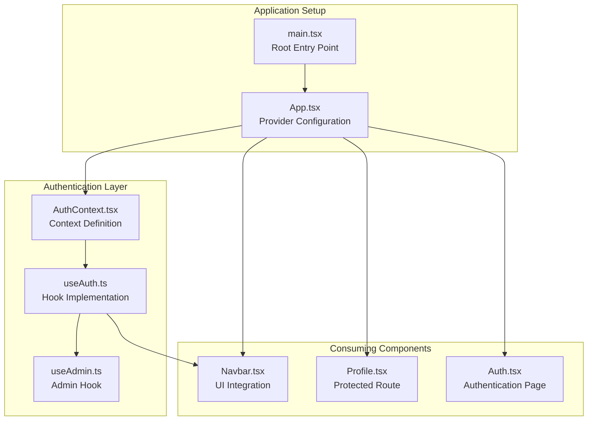
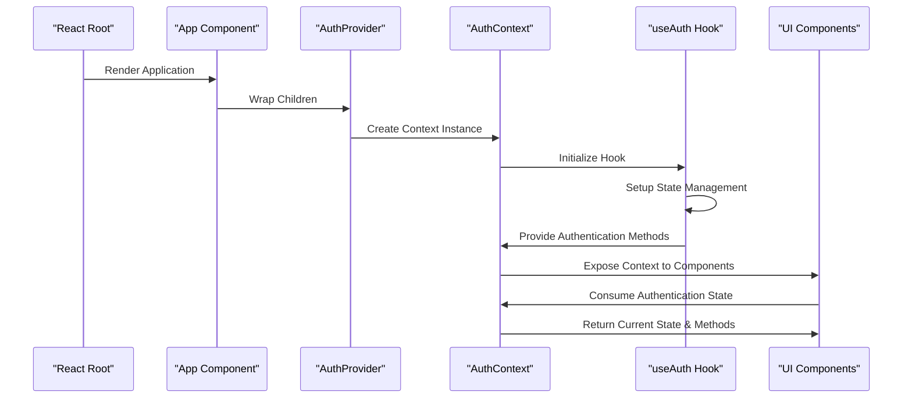
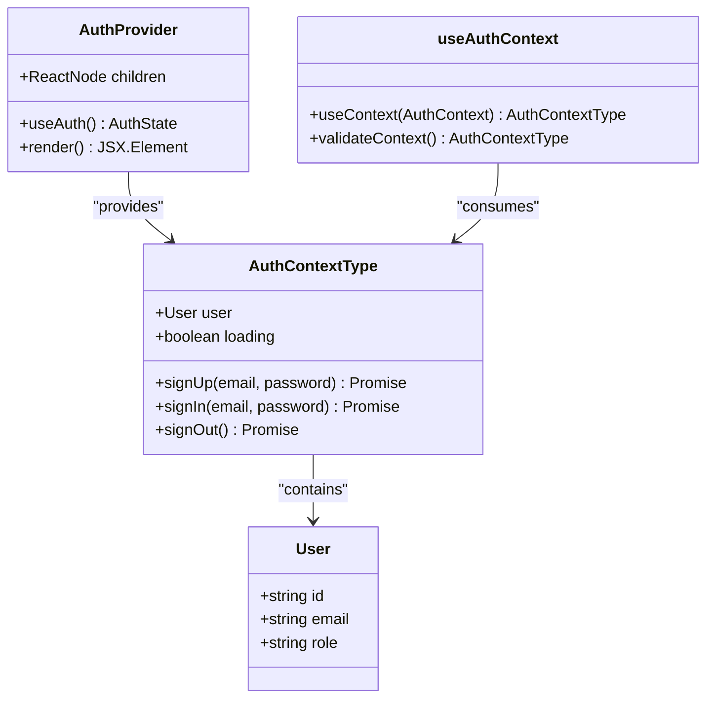
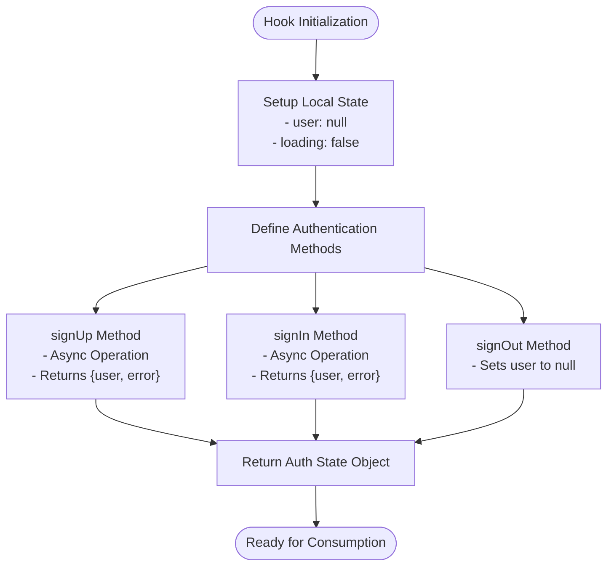
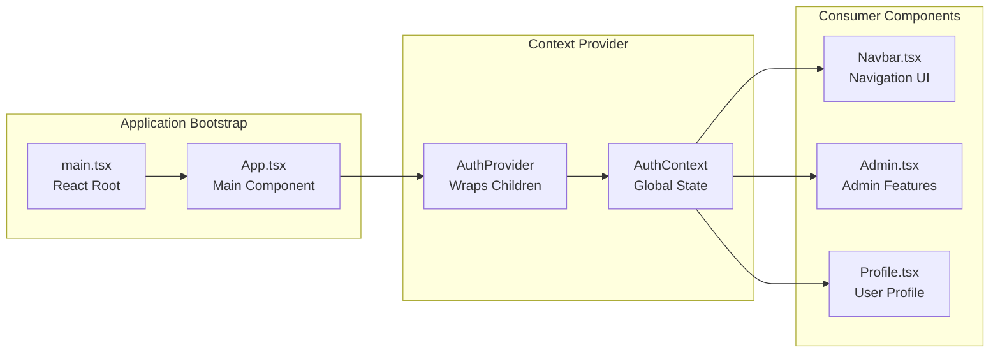
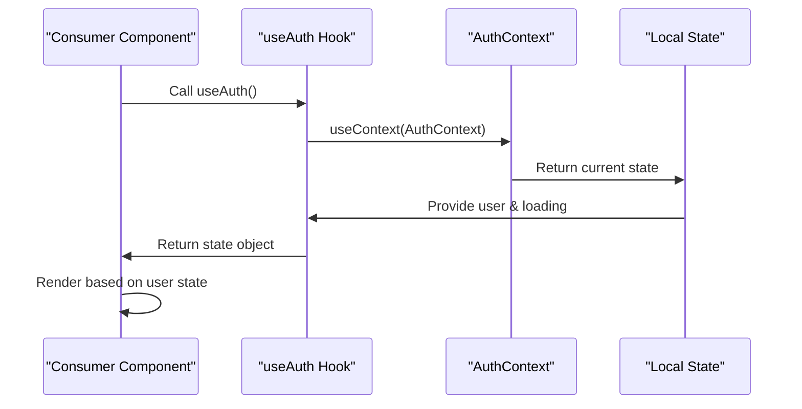
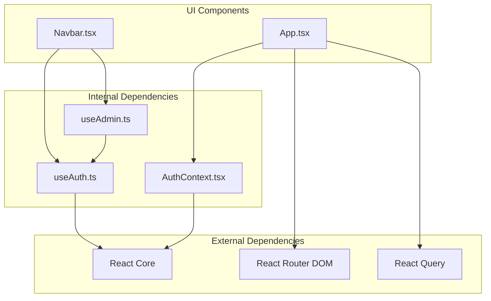

# Authentication Context

<cite>
**Referenced Files in This Document**
- [AuthContext.tsx](file://autocure/src/contexts/AuthContext.tsx)
- [useAuth.ts](file://autocure/src/hooks/useAuth.ts)
- [App.tsx](file://autocure/src/App.tsx)
- [main.tsx](file://autocure/src/main.tsx)
- [Navbar.tsx](file://autocure/src/components/Navbar.tsx)
- [useAdmin.ts](file://autocure/src/hooks/useAdmin.ts)
</cite>

## Table of Contents
1. [Introduction](#introduction)
2. [Project Structure](#project-structure)
3. [Core Components](#core-components)
4. [Architecture Overview](#architecture-overview)
5. [Detailed Component Analysis](#detailed-component-analysis)
6. [Dependency Analysis](#dependency-analysis)
7. [Performance Considerations](#performance-considerations)
8. [Troubleshooting Guide](#troubleshooting-guide)
9. [Conclusion](#conclusion)

## Introduction
This document provides comprehensive documentation for the AuthContext implementation in CarCure2, focusing on the React Context pattern used for global authentication state management. The implementation establishes a centralized authentication state that tracks user identity, authentication status, and provides methods for sign-up, sign-in, and sign-out operations. The context integrates with React hooks and maintains state across the component hierarchy while preparing the foundation for future authentication backend integration.

## Project Structure
The authentication context implementation follows a clean separation of concerns with dedicated files for context definition, hook implementation, and provider setup:

**Diagram sources**
- [AuthContext.tsx](file://autocure/src/contexts/AuthContext.tsx#L1-L37)
- [useAuth.ts](file://autocure/src/hooks/useAuth.ts#L1-L43)
- [App.tsx](file://autocure/src/App.tsx#L1-L47)
- [main.tsx](file://autocure/src/main.tsx#L1-L11)

**Section sources**
- [AuthContext.tsx](file://autocure/src/contexts/AuthContext.tsx#L1-L37)
- [useAuth.ts](file://autocure/src/hooks/useAuth.ts#L1-L43)
- [App.tsx](file://autocure/src/App.tsx#L1-L47)
- [main.tsx](file://autocure/src/main.tsx#L1-L11)

## Core Components
The authentication system consists of three primary components that work together to manage global authentication state:

### User Data Structure
The authentication system defines a structured user object with the following properties:
- **id**: Unique identifier for the user account
- **email**: User's email address for authentication
- **role**: Optional role property for administrative privileges

### Authentication State Interface
The context exposes a comprehensive interface for authentication operations:
- **user**: Current authenticated user or null when unauthenticated
- **loading**: Boolean flag indicating ongoing authentication operations
- **signUp**: Async function for user registration
- **signIn**: Async function for user authentication
- **signOut**: Async function for user logout

### Provider Configuration
The AuthProvider component wraps the application tree and makes authentication state available to all descendant components through React's Context API.

**Section sources**
- [AuthContext.tsx](file://autocure/src/contexts/AuthContext.tsx#L4-L16)
- [useAuth.ts](file://autocure/src/hooks/useAuth.ts#L3-L15)

## Architecture Overview
The authentication architecture follows React's Context pattern with a clear separation between state management and UI presentation:

**Diagram sources**
- [App.tsx](file://autocure/src/App.tsx#L20-L42)
- [AuthContext.tsx](file://autocure/src/contexts/AuthContext.tsx#L20-L28)
- [useAuth.ts](file://autocure/src/hooks/useAuth.ts#L17-L42)

The architecture ensures that authentication state is available throughout the component hierarchy while maintaining encapsulation and preventing unnecessary re-renders.

**Section sources**
- [App.tsx](file://autocure/src/App.tsx#L20-L42)
- [AuthContext.tsx](file://autocure/src/contexts/AuthContext.tsx#L20-L36)

## Detailed Component Analysis

### AuthContext Implementation
The AuthContext module serves as the central hub for authentication state management:

**Diagram sources**
- [AuthContext.tsx](file://autocure/src/contexts/AuthContext.tsx#L4-L16)
- [AuthContext.tsx](file://autocure/src/contexts/AuthContext.tsx#L20-L36)

The context implementation provides:
- Strongly typed user interface with optional role property
- Comprehensive authentication method signatures
- Safe context consumption with error handling
- Provider wrapper for component tree integration

### useAuth Hook Implementation
The useAuth hook encapsulates all authentication logic and state management:

**Diagram sources**
- [useAuth.ts](file://autocure/src/hooks/useAuth.ts#L17-L42)

The hook provides:
- Local state management for user and loading states
- Async authentication methods with standardized return format
- Clean separation of authentication logic from UI components

**Section sources**
- [useAuth.ts](file://autocure/src/hooks/useAuth.ts#L1-L43)

### Provider Setup and Application Integration
The AuthProvider integrates seamlessly with the React application structure:

**Diagram sources**
- [main.tsx](file://autocure/src/main.tsx#L6-L10)
- [App.tsx](file://autocure/src/App.tsx#L20-L42)
- [AuthContext.tsx](file://autocure/src/contexts/AuthContext.tsx#L20-L28)

**Section sources**
- [main.tsx](file://autocure/src/main.tsx#L1-L11)
- [App.tsx](file://autocure/src/App.tsx#L1-L47)

### Context Consumption Patterns
Components consume authentication context through several patterns demonstrated in the codebase:

#### Basic Authentication State Access
Components can access user authentication state through the useAuth hook:

**Diagram sources**
- [Navbar.tsx](file://autocure/src/components/Navbar.tsx#L21-L22)

#### Conditional UI Rendering Based on Authentication
The Navbar component demonstrates conditional rendering based on authentication state:

| Authentication State | UI Elements Displayed |
|---------------------|----------------------|
| User authenticated | Profile link, Wishlist, Admin dashboard |
| User unauthenticated | Sign in link, Cart, Navigation |

**Section sources**
- [Navbar.tsx](file://autocure/src/components/Navbar.tsx#L92-L131)

### State Mutation Methods
The authentication context provides three primary methods for state manipulation:

#### signOut Method
The simplest state mutation operation sets the user state to null, effectively logging out the user.

#### signUp and signIn Methods
Both methods follow a standardized async pattern returning an object with user and error properties, enabling consistent error handling across the application.

**Section sources**
- [useAuth.ts](file://autocure/src/hooks/useAuth.ts#L31-L33)
- [useAuth.ts](file://autocure/src/hooks/useAuth.ts#L21-L29)

## Dependency Analysis
The authentication context has minimal external dependencies, promoting maintainability and testability:

**Diagram sources**
- [AuthContext.tsx](file://autocure/src/contexts/AuthContext.tsx#L1-L2)
- [useAuth.ts](file://autocure/src/hooks/useAuth.ts#L1)
- [useAdmin.ts](file://autocure/src/hooks/useAdmin.ts#L1-L2)
- [App.tsx](file://autocure/src/App.tsx#L1-L3)

**Section sources**
- [AuthContext.tsx](file://autocure/src/contexts/AuthContext.tsx#L1-L2)
- [useAuth.ts](file://autocure/src/hooks/useAuth.ts#L1)
- [useAdmin.ts](file://autocure/src/hooks/useAdmin.ts#L1-L2)
- [App.tsx](file://autocure/src/App.tsx#L1-L3)

## Performance Considerations
The current implementation prioritizes simplicity and maintainability over complex optimizations. Key performance characteristics include:

- **Minimal Re-renders**: Context updates only occur when authentication state changes
- **Lazy Loading**: Authentication methods are only executed when explicitly called
- **Memory Efficiency**: No persistent state storage reduces memory footprint
- **Bundle Size**: Minimal external dependencies keep bundle size small

Future optimizations could include:
- Selective context updates using React.useMemo
- Authentication state caching
- Debounced authentication operations

## Troubleshooting Guide

### Common Issues and Solutions

#### Context Not Found Error
**Problem**: Attempting to use authentication context outside of AuthProvider
**Solution**: Ensure all components consuming authentication state are wrapped within AuthProvider

#### Authentication State Not Updating
**Problem**: UI not reflecting authentication state changes
**Solution**: Verify that authentication methods are properly updating state and that components are consuming the context correctly

#### Type Errors
**Problem**: TypeScript compilation errors with user object properties
**Solution**: Ensure the User interface matches the expected data structure and handle optional properties appropriately

### Error Handling Strategies
The current implementation provides a foundation for error handling through the standardized return format of authentication methods. Future enhancements should include:

- Centralized error state management
- User-friendly error messaging
- Automatic retry mechanisms for failed operations
- Graceful degradation for offline scenarios

**Section sources**
- [AuthContext.tsx](file://autocure/src/contexts/AuthContext.tsx#L32-L34)

## Conclusion
The AuthContext implementation in CarCure2 provides a solid foundation for global authentication state management using React's Context pattern. The implementation successfully separates concerns between state management, UI presentation, and provider configuration while maintaining type safety and extensibility.

Key strengths of the implementation include:
- Clean separation of authentication logic from UI components
- Strong typing with TypeScript interfaces
- Minimal dependencies and maintainable code structure
- Ready foundation for future authentication backend integration

The current stub implementations of authentication methods provide a clear migration path for integrating with actual authentication providers while maintaining the established context pattern. The architecture supports future enhancements for error handling, loading state management, and local storage persistence without disrupting existing functionality.