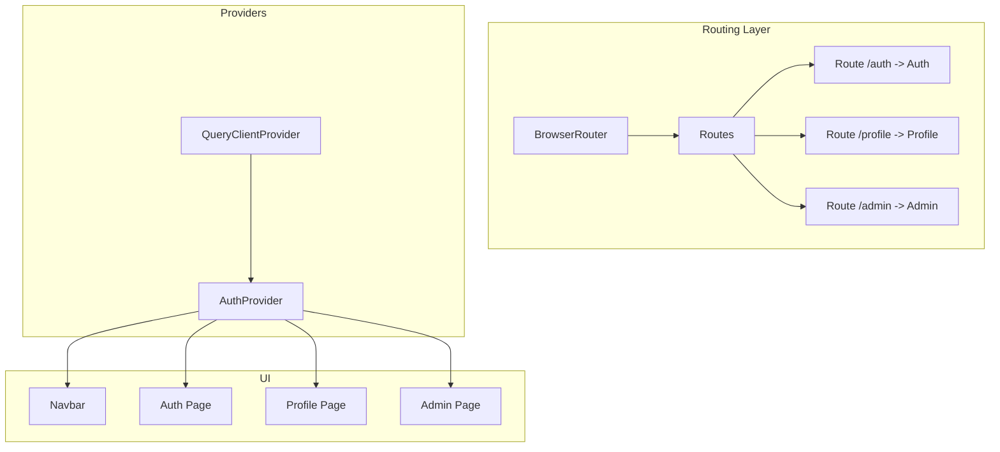
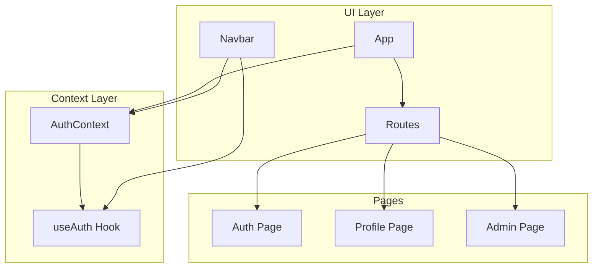
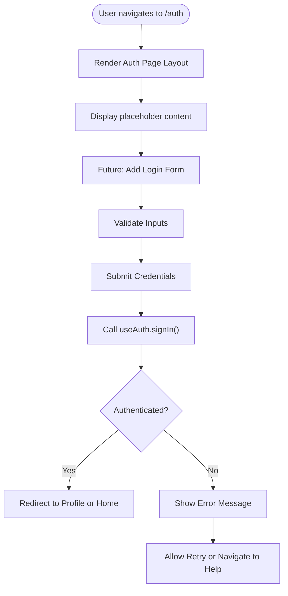
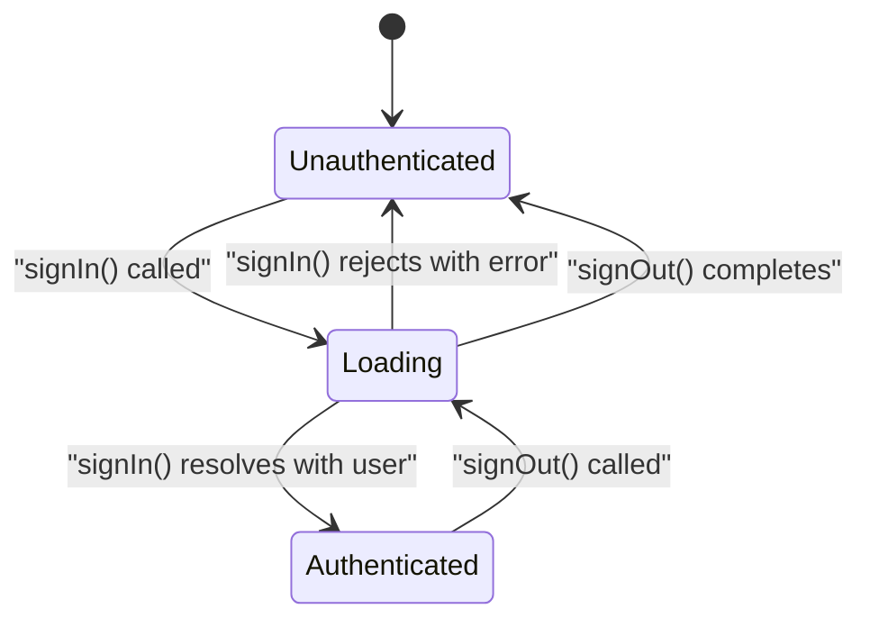
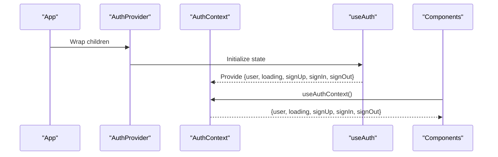
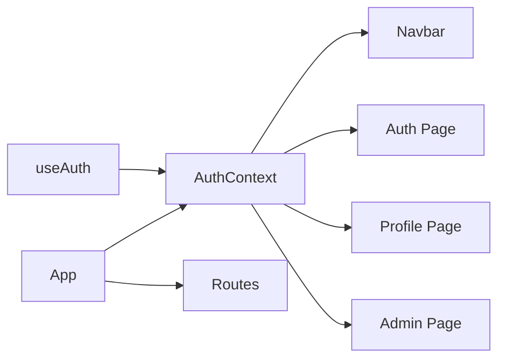

# Authentication Flow and Pages

<cite>
**Referenced Files in This Document**
- [Auth.tsx](file://autocure/src/pages/Auth.tsx)
- [App.tsx](file://autocure/src/App.tsx)
- [AuthContext.tsx](file://autocure/src/contexts/AuthContext.tsx)
- [useAuth.ts](file://autocure/src/hooks/useAuth.ts)
- [Navbar.tsx](file://autocure/src/components/Navbar.tsx)
- [Profile.tsx](file://autocure/src/pages/Profile.tsx)
- [Admin.tsx](file://autocure/src/pages/Admin.tsx)
- [useAdmin.ts](file://autocure/src/hooks/useAdmin.ts)
</cite>

## Table of Contents
1. [Introduction](#introduction)
2. [Project Structure](#project-structure)
3. [Core Components](#core-components)
4. [Architecture Overview](#architecture-overview)
5. [Detailed Component Analysis](#detailed-component-analysis)
6. [Dependency Analysis](#dependency-analysis)
7. [Performance Considerations](#performance-considerations)
8. [Troubleshooting Guide](#troubleshooting-guide)
9. [Conclusion](#conclusion)

## Introduction
This document explains the authentication flow and user interface components in the CarCure2 application. It focuses on the Auth page implementation, authentication state transitions, error handling, validation patterns, and integration with the authentication context. It also covers user feedback mechanisms, state persistence, session timeout handling, and integration points with the Navbar and Profile/Admin pages.

## Project Structure
The authentication system is organized around a React context provider and custom hooks. The routing exposes an Auth page, while the Navbar conditionally renders authentication-related UI based on the current authentication state. The Profile and Admin pages demonstrate authenticated routes.

**Diagram sources**
- [App.tsx](file://autocure/src/App.tsx#L21-L44)
- [Auth.tsx](file://autocure/src/pages/Auth.tsx#L4-L16)
- [Profile.tsx](file://autocure/src/pages/Profile.tsx#L4-L16)
- [Admin.tsx](file://autocure/src/pages/Admin.tsx#L4-L16)

**Section sources**
- [App.tsx](file://autocure/src/App.tsx#L1-L47)

## Core Components
- AuthContext and Provider: Expose authentication state and actions (signUp, signIn, signOut) to the app via a React context.
- useAuth Hook: Manages local authentication state and provides stubbed async methods for sign-up/sign-in and sign-out.
- Navbar: Reads authentication state from useAuth and conditionally renders links for Profile, Admin, Wishlist, and Auth.
- Auth Page: Currently displays a placeholder page at /auth; future iterations will implement the login form.
- Profile and Admin Pages: Render authenticated-only destinations; Admin integrates with a separate admin hook.

Key responsibilities:
- AuthContext: Centralizes authentication state and exposes typed methods.
- useAuth: Encapsulates state and async operations; designed to integrate with a backend later.
- Navbar: Reflects authentication state in the UI and routes users appropriately.
- Auth Page: Will host the login form and validation logic.
- Profile/Admin: Demonstrate authenticated navigation.

**Section sources**
- [AuthContext.tsx](file://autocure/src/contexts/AuthContext.tsx#L1-L37)
- [useAuth.ts](file://autocure/src/hooks/useAuth.ts#L1-L43)
- [Navbar.tsx](file://autocure/src/components/Navbar.tsx#L1-L216)
- [Auth.tsx](file://autocure/src/pages/Auth.tsx#L1-L17)
- [Profile.tsx](file://autocure/src/pages/Profile.tsx#L1-L17)
- [Admin.tsx](file://autocure/src/pages/Admin.tsx#L1-L17)

## Architecture Overview
The authentication architecture follows a layered pattern:
- Context Provider: Wraps the app with authentication capabilities.
- Custom Hooks: Provide typed state and async operations.
- UI Components: Consume context to render appropriate navigation and content.
- Routing: Exposes protected and public routes.

**Diagram sources**
- [AuthContext.tsx](file://autocure/src/contexts/AuthContext.tsx#L20-L28)
- [useAuth.ts](file://autocure/src/hooks/useAuth.ts#L17-L42)
- [Navbar.tsx](file://autocure/src/components/Navbar.tsx#L21-L22)
- [App.tsx](file://autocure/src/App.tsx#L21-L44)
- [Auth.tsx](file://autocure/src/pages/Auth.tsx#L4-L16)
- [Profile.tsx](file://autocure/src/pages/Profile.tsx#L4-L16)
- [Admin.tsx](file://autocure/src/pages/Admin.tsx#L4-L16)

## Detailed Component Analysis

### Auth Page Implementation
The Auth page currently renders a placeholder layout with the Navbar and Footer. It serves as the designated location for implementing the login form, validation, and submission workflow.

**Diagram sources**
- [Auth.tsx](file://autocure/src/pages/Auth.tsx#L4-L16)
- [useAuth.ts](file://autocure/src/hooks/useAuth.ts#L26-L29)

**Section sources**
- [Auth.tsx](file://autocure/src/pages/Auth.tsx#L1-L17)

### Authentication State Transitions
The authentication state transitions are managed by the useAuth hook and exposed via AuthContext. The state includes user identity, loading flag, and async methods for sign-up, sign-in, and sign-out.

**Diagram sources**
- [useAuth.ts](file://autocure/src/hooks/useAuth.ts#L17-L42)
- [AuthContext.tsx](file://autocure/src/contexts/AuthContext.tsx#L10-L16)

**Section sources**
- [useAuth.ts](file://autocure/src/hooks/useAuth.ts#L1-L43)
- [AuthContext.tsx](file://autocure/src/contexts/AuthContext.tsx#L1-L37)

### Login Form Handling and Validation Patterns
Validation patterns should be implemented in the Auth page form and coordinated with useAuth.signIn. Recommended strategies:
- Input sanitization: Normalize and trim inputs; reject empty or whitespace-only fields.
- Pattern validation: Email format checks; minimum length for passwords.
- Real-time feedback: Show inline messages during typing or on blur.
- Submission workflow: Disable submit button during network requests; surface errors clearly.

Integration points:
- useAuth.signIn(email, password): Returns a promise resolving to user or error.
- useAuth.signUp(email, password): Future expansion for registration.

Note: The current useAuth methods are stubbed and return null values; replace with backend integration when ready.

**Section sources**
- [useAuth.ts](file://autocure/src/hooks/useAuth.ts#L21-L33)

### Error Handling for Failed Login Attempts
On failed login attempts, the system should:
- Capture and display user-friendly error messages.
- Prevent automatic retries without user action.
- Optionally provide recovery options (e.g., password reset link).

Current behavior:
- useAuth.signIn returns an error object; integrate this with UI to show messages.
- useAuth.signOut clears the user state; useful for explicit logout flows.

**Section sources**
- [useAuth.ts](file://autocure/src/hooks/useAuth.ts#L26-L33)

### Success Redirection Patterns
After successful authentication:
- Redirect to Profile (/profile) or Home (/) based on application policy.
- Ensure Navbar updates immediately to reflect authenticated state.

Navbar integration:
- Uses user from useAuth to decide whether to show Profile or Auth links.

**Section sources**
- [Navbar.tsx](file://autocure/src/components/Navbar.tsx#L115-L131)
- [App.tsx](file://autocure/src/App.tsx#L32-L32)

### Form Validation Strategies and User Feedback
Recommended validation and feedback mechanisms:
- Real-time validation: Validate on change or blur with concise messages.
- Submission validation: Ensure all fields pass before calling useAuth.signIn.
- User feedback: Toasts, inline messages, or banner notifications; avoid modal pop-ups unless necessary.
- Accessibility: Announce validation messages to screen readers.

These patterns should be implemented in the Auth page form and coordinated with the useAuth hook.

**Section sources**
- [useAuth.ts](file://autocure/src/hooks/useAuth.ts#L21-L33)

### Authentication State Persistence and Session Timeout
State persistence and timeouts should be handled by integrating useAuth with a backend service:
- Persist tokens securely (e.g., HttpOnly cookies or secure storage).
- Implement refresh logic to extend sessions.
- On timeout or token invalidation, call useAuth.signOut to reset state and redirect to Auth.

This section outlines recommended patterns; implementation depends on backend integration.

**Section sources**
- [useAuth.ts](file://autocure/src/hooks/useAuth.ts#L31-L33)

### Integration with Authentication Context
The AuthContext wraps the app and exposes the useAuth hook’s state and methods. Components consume the context via useAuthContext to access user, loading, and auth actions.

**Diagram sources**
- [AuthContext.tsx](file://autocure/src/contexts/AuthContext.tsx#L20-L28)
- [useAuth.ts](file://autocure/src/hooks/useAuth.ts#L17-L42)

**Section sources**
- [AuthContext.tsx](file://autocure/src/contexts/AuthContext.tsx#L1-L37)
- [useAuth.ts](file://autocure/src/hooks/useAuth.ts#L1-L43)

### Password Reset and Account Verification Flows
Common scenarios:
- Password reset: Provide a link on the Auth page leading to a reset form; on success, redirect to Auth.
- Account verification: After sign-up, prompt for email verification; upon verification, redirect to Profile.

These flows should be integrated with useAuth.signUp and useAuth.signIn and coordinated with backend APIs.

**Section sources**
- [useAuth.ts](file://autocure/src/hooks/useAuth.ts#L21-L29)

## Dependency Analysis
The authentication system exhibits low coupling and high cohesion:
- AuthContext depends on useAuth for state and actions.
- Navbar depends on useAuth for rendering decisions.
- Pages depend on routing and context for navigation.

**Diagram sources**
- [useAuth.ts](file://autocure/src/hooks/useAuth.ts#L17-L42)
- [AuthContext.tsx](file://autocure/src/contexts/AuthContext.tsx#L20-L28)
- [Navbar.tsx](file://autocure/src/components/Navbar.tsx#L21-L22)
- [App.tsx](file://autocure/src/App.tsx#L21-L44)

**Section sources**
- [useAuth.ts](file://autocure/src/hooks/useAuth.ts#L1-L43)
- [AuthContext.tsx](file://autocure/src/contexts/AuthContext.tsx#L1-L37)
- [Navbar.tsx](file://autocure/src/components/Navbar.tsx#L1-L216)
- [App.tsx](file://autocure/src/App.tsx#L1-L47)

## Performance Considerations
- Minimize re-renders: Keep authentication state in context to avoid prop drilling.
- Debounced validation: For real-time checks, debounce expensive validations.
- Lazy loading: Load heavy assets after authentication state is confirmed.
- Network efficiency: Batch auth operations and cache minimal state.

## Troubleshooting Guide
Common issues and resolutions:
- useAuthContext outside AuthProvider: Ensure the provider wraps the app; otherwise, an error is thrown.
- Empty user state: Verify that signOut resets user and that sign-in resolves with a proper user object.
- UI not updating: Confirm that components consuming useAuth are rendered within the provider.

**Section sources**
- [AuthContext.tsx](file://autocure/src/contexts/AuthContext.tsx#L30-L36)
- [useAuth.ts](file://autocure/src/hooks/useAuth.ts#L31-L33)

## Conclusion
The CarCure2 authentication system is structured around a clean context and hook pattern. The Auth page is the designated location for implementing the login form and validation. The Navbar reflects authentication state, and Profile/Admin serve as authenticated destinations. Future work should focus on integrating backend APIs into useAuth, implementing robust validation and error handling in the Auth page, and adding password reset and verification flows.