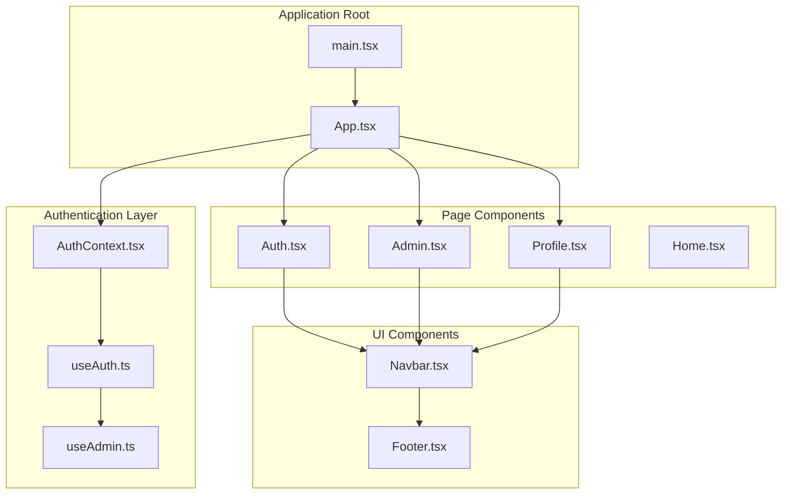
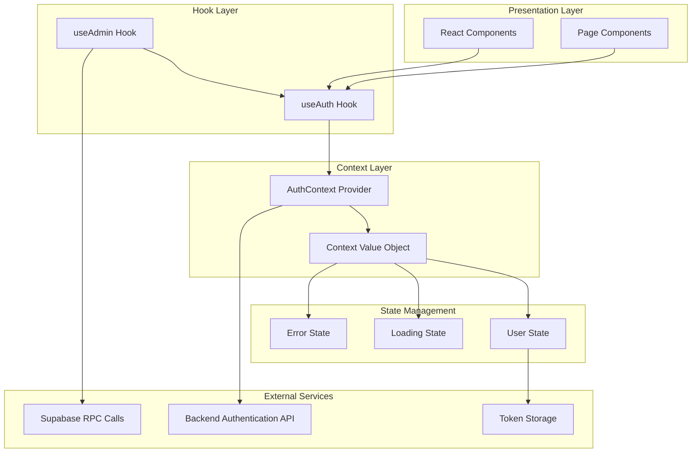
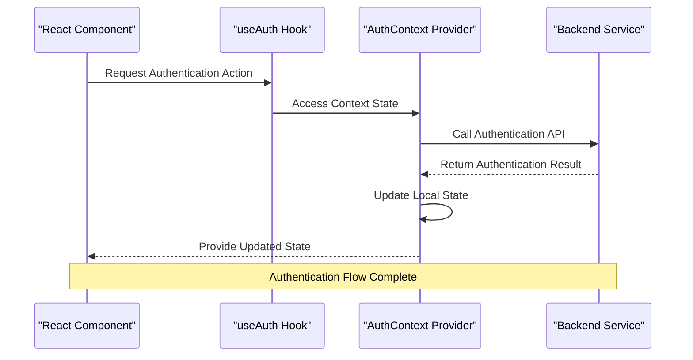
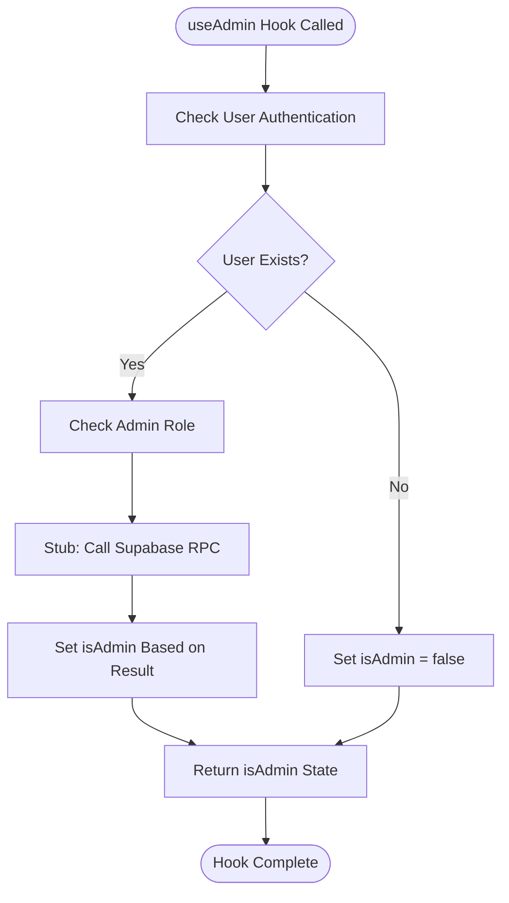
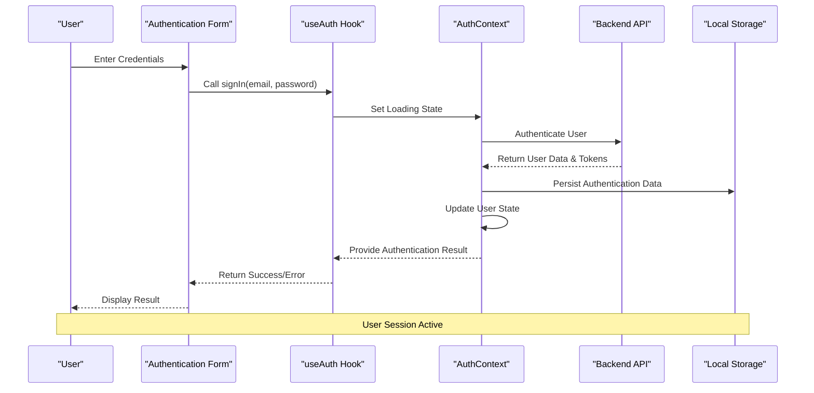
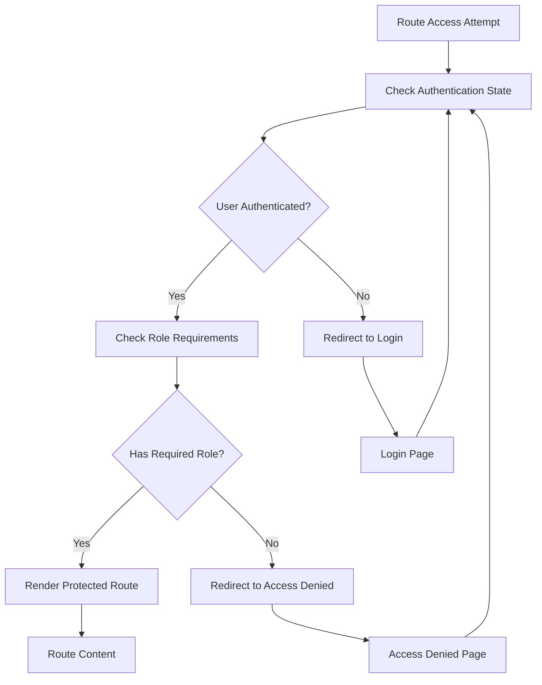

# Authentication System

<cite>
**Referenced Files in This Document**
- [AuthContext.tsx](file://autocure/src/contexts/AuthContext.tsx)
- [useAuth.ts](file://autocure/src/hooks/useAuth.ts)
- [useAdmin.ts](file://autocure/src/hooks/useAdmin.ts)
- [App.tsx](file://autocure/src/App.tsx)
- [Auth.tsx](file://autocure/src/pages/Auth.tsx)
- [Admin.tsx](file://autocure/src/pages/Admin.tsx)
- [Profile.tsx](file://autocure/src/pages/Profile.tsx)
- [main.tsx](file://autocure/src/main.tsx)
</cite>

## Table of Contents
1. [Introduction](#introduction)
2. [Project Structure](#project-structure)
3. [Core Components](#core-components)
4. [Architecture Overview](#architecture-overview)
5. [Detailed Component Analysis](#detailed-component-analysis)
6. [Authentication Flow](#authentication-flow)
7. [Protected Routes Implementation](#protected-routes-implementation)
8. [Security Considerations](#security-considerations)
9. [Integration Guidelines](#integration-guidelines)
10. [Troubleshooting Guide](#troubleshooting-guide)
11. [Conclusion](#conclusion)

## Introduction

CarCure2 implements a modern authentication system built on React's Context API, providing context-based authentication architecture with role-based access control capabilities. The system follows React best practices by encapsulating authentication state management within a dedicated context provider, enabling seamless user session management with persistent login state and granular access control for administrative features.

The authentication system consists of three primary layers: the authentication context provider that manages global authentication state, custom hooks that expose authentication functionality to components, and role-based access control mechanisms for privileged features. This architecture ensures clean separation of concerns while maintaining efficient state synchronization across the application.

## Project Structure

The authentication system is organized within a clear hierarchical structure that promotes maintainability and scalability:



**Diagram sources**
- [main.tsx](file://autocure/src/main.tsx#L1-L11)
- [App.tsx](file://autocure/src/App.tsx#L1-L47)
- [AuthContext.tsx](file://autocure/src/contexts/AuthContext.tsx#L1-L37)
- [useAuth.ts](file://autocure/src/hooks/useAuth.ts#L1-L43)
- [useAdmin.ts](file://autocure/src/hooks/useAdmin.ts#L1-L25)

**Section sources**
- [main.tsx](file://autocure/src/main.tsx#L1-L11)
- [App.tsx](file://autocure/src/App.tsx#L1-L47)

## Core Components

### Authentication Context Provider

The authentication context provider serves as the central state manager for all authentication-related operations. It encapsulates user state, loading indicators, and authentication action handlers within a React Context, making authentication functionality available throughout the component tree.

Key responsibilities include:
- Managing user session state with automatic persistence
- Providing authentication action handlers (signUp, signIn, signOut)
- Exposing loading states for authentication operations
- Maintaining type-safe user interface contracts

### Custom Authentication Hook (useAuth)

The `useAuth` hook provides a comprehensive authentication interface with the following capabilities:
- State management for user sessions and loading states
- Asynchronous authentication operation handlers
- Type-safe user data structures with optional role information
- Integration-ready stub implementations for backend integration

### Role-Based Access Control Hook (useAdmin)

The `useAdmin` hook implements specialized role checking functionality:
- Monitors user authentication state for role verification
- Provides boolean indicators for administrative privileges
- Supports asynchronous role validation against backend services
- Handles edge cases for unauthenticated users

**Section sources**
- [AuthContext.tsx](file://autocure/src/contexts/AuthContext.tsx#L1-L37)
- [useAuth.ts](file://autocure/src/hooks/useAuth.ts#L1-L43)
- [useAdmin.ts](file://autocure/src/hooks/useAdmin.ts#L1-L25)

## Architecture Overview

The authentication system follows a layered architecture pattern that ensures separation of concerns and maintainable code organization:



**Diagram sources**
- [AuthContext.tsx](file://autocure/src/contexts/AuthContext.tsx#L20-L28)
- [useAuth.ts](file://autocure/src/hooks/useAuth.ts#L17-L42)
- [useAdmin.ts](file://autocure/src/hooks/useAdmin.ts#L4-L24)

## Detailed Component Analysis

### AuthContext Implementation

The AuthContext provides a robust foundation for authentication state management through React's Context API. The context implementation includes comprehensive type definitions that ensure type safety across the entire authentication system.

```mermaid
classDiagram
class AuthContextType {
+User user
+boolean loading
+signUp(email, password) Promise~{user, error}~
+signIn(email, password) Promise~{user, error}~
+signOut() Promise~void~
}
class User {
+string id
+string email
+string role
}
class AuthProvider {
+ReactNode children
+value AuthContextType
+render() JSX.Element
}
class useAuthContext {
+return AuthContextType
+throws Error
}
AuthContextType --> User : "contains"
AuthProvider --> AuthContextType : "provides"
useAuthContext --> AuthContextType : "consumes"
```

**Diagram sources**
- [AuthContext.tsx](file://autocure/src/contexts/AuthContext.tsx#L4-L16)
- [AuthContext.tsx](file://autocure/src/contexts/AuthContext.tsx#L20-L28)

### useAuth Hook Architecture

The `useAuth` hook implements a sophisticated state management pattern that handles asynchronous authentication operations while maintaining clean separation of concerns:



**Diagram sources**
- [useAuth.ts](file://autocure/src/hooks/useAuth.ts#L21-L33)
- [AuthContext.tsx](file://autocure/src/contexts/AuthContext.tsx#L20-L28)

### useAdmin Hook Implementation

The `useAdmin` hook demonstrates advanced React patterns for derived state computation and effect management:



**Diagram sources**
- [useAdmin.ts](file://autocure/src/hooks/useAdmin.ts#L4-L24)

**Section sources**
- [AuthContext.tsx](file://autocure/src/contexts/AuthContext.tsx#L1-L37)
- [useAuth.ts](file://autocure/src/hooks/useAuth.ts#L1-L43)
- [useAdmin.ts](file://autocure/src/hooks/useAdmin.ts#L1-L25)

## Authentication Flow

The authentication system implements a comprehensive flow that covers user registration, login, session management, and logout procedures:



**Diagram sources**
- [useAuth.ts](file://autocure/src/hooks/useAuth.ts#L21-L33)
- [AuthContext.tsx](file://autocure/src/contexts/AuthContext.tsx#L20-L28)

### Login Process

The login process follows these steps:
1. User submits credentials through the authentication form
2. The `signIn` method is invoked with email and password parameters
3. Authentication state transitions to loading while backend validation occurs
4. Successful authentication updates user state and persists session data
5. Error handling manages invalid credentials and service failures

### Logout Procedure

The logout mechanism ensures complete session termination:
1. `signOut` method clears user state from local storage
2. Current user session is reset to null state
3. All authentication-dependent components re-render with unauthenticated state
4. Navigation redirects to appropriate routes based on authentication status

**Section sources**
- [useAuth.ts](file://autocure/src/hooks/useAuth.ts#L21-L33)
- [AuthContext.tsx](file://autocure/src/contexts/AuthContext.tsx#L20-L28)

## Protected Routes Implementation

The application implements route protection through a combination of authentication state monitoring and conditional rendering:



**Diagram sources**
- [useAdmin.ts](file://autocure/src/hooks/useAdmin.ts#L4-L24)
- [App.tsx](file://autocure/src/App.tsx#L36-L36)

### Admin-Only Features

Administrative features are protected through the `useAdmin` hook which provides:
- Real-time role validation for administrative privileges
- Automatic role checking on user authentication state changes
- Conditional rendering based on administrative permissions
- Integration-ready patterns for backend role verification

### Profile Access Control

User profile access implements a simplified authentication check:
- Requires valid user session for access
- Restricts unauthorized navigation attempts
- Provides seamless redirect to authentication page when unauthenticated

**Section sources**
- [useAdmin.ts](file://autocure/src/hooks/useAdmin.ts#L4-L24)
- [App.tsx](file://autocure/src/App.tsx#L35-L37)

## Security Considerations

### Client-Side Authentication Limitations

The current implementation uses stub implementations for authentication operations, which introduces several security considerations:

**Critical Security Notes:**
- Passwords are currently handled as plain text in stub implementations
- No token validation or refresh mechanisms are implemented
- Session persistence relies on browser storage without encryption
- Role checking is performed client-side with stub implementations

### Recommended Security Enhancements

For production deployment, implement the following security measures:

**Token Management:**
- Implement JWT token storage with expiration handling
- Add automatic token refresh mechanisms
- Secure token storage using HttpOnly cookies or secure storage
- Implement token validation middleware for all protected routes

**Password Security:**
- Never transmit passwords as plain text
- Implement proper password hashing on backend servers
- Add password strength validation and rate limiting
- Support secure password reset workflows

**Session Security:**
- Implement CSRF protection for all authentication endpoints
- Add session timeout and automatic logout after inactivity
- Secure cross-site scripting (XSS) prevention measures
- Implement proper CORS configuration for API endpoints

**Role-Based Security:**
- Move role validation to server-side with database queries
- Implement RBAC (Role-Based Access Control) at the API level
- Add audit logging for administrative actions
- Regular security audits of authentication flows

## Integration Guidelines

### Backend Authentication API Integration

The authentication system is designed for easy integration with various backend authentication providers:

**Supabase Integration Pattern:**
```typescript
// Example integration pattern for Supabase
const signIn = async (email: string, password: string) => {
  try {
    const { data, error } = await supabase.auth.signInWithPassword({
      email,
      password
    })
    
    if (error) throw error
    
    // Store user data and tokens
    setUser(data.user)
    return { user: data.user, error: null }
  } catch (error) {
    return { user: null, error }
  }
}
```

**Custom Backend Integration:**
- Replace stub implementations with actual API calls
- Implement proper error handling and retry mechanisms
- Add loading state management for network requests
- Integrate with existing authentication middleware

### Token Management Strategies

Implement comprehensive token lifecycle management:

**Token Storage:**
- Use secure HTTP-only cookies for production environments
- Implement localStorage fallback with encryption for development
- Add token refresh mechanisms to prevent expiration
- Store tokens with appropriate expiration dates

**Token Validation:**
- Implement automatic token validation on app load
- Add periodic token refresh checks
- Handle token expiration gracefully with user notification
- Implement token revocation on logout

**Section sources**
- [useAuth.ts](file://autocure/src/hooks/useAuth.ts#L21-L29)
- [useAdmin.ts](file://autocure/src/hooks/useAdmin.ts#L14-L18)

## Troubleshooting Guide

### Common Authentication Issues

**Authentication State Not Persisting:**
- Verify local storage availability and browser compatibility
- Check for proper state initialization on app load
- Ensure context provider wraps the entire application tree

**Role Checking Failures:**
- Confirm user authentication before role validation
- Verify backend role checking endpoint availability
- Check for proper error handling in role validation

**Navigation Issues:**
- Ensure proper route protection implementation
- Verify authentication state updates trigger re-renders
- Check for infinite redirect loops in protected routes

### Debugging Authentication Flows

**Development Tools:**
- Use React DevTools to inspect context provider state
- Monitor network requests for authentication API calls
- Check browser console for authentication-related errors
- Implement logging for authentication state changes

**State Inspection Patterns:**
- Monitor user state changes in authentication hooks
- Track loading state transitions during authentication operations
- Verify error states are properly propagated through the system
- Check context provider value updates across component tree

**Section sources**
- [useAuth.ts](file://autocure/src/hooks/useAuth.ts#L17-L42)
- [AuthContext.tsx](file://autocure/src/contexts/AuthContext.tsx#L30-L36)

## Conclusion

CarCure2's authentication system provides a solid foundation for modern React applications, implementing context-based authentication architecture with comprehensive role-based access control capabilities. The system's modular design ensures maintainability while providing flexible integration points for various backend authentication solutions.

The current implementation serves as a comprehensive template that can be easily extended with production-ready authentication providers, token management systems, and enhanced security measures. The clear separation of concerns between context providers, custom hooks, and page components ensures scalability and maintainability as the application grows.

Key strengths of the implementation include:
- Clean separation of authentication logic through React Context API
- Comprehensive type safety with TypeScript interfaces
- Flexible hook-based architecture for component integration
- Scalable role-based access control patterns
- Ready-to-integrate patterns for various backend authentication providers

Future enhancements should focus on implementing secure token management, production-ready authentication providers, and comprehensive error handling to support enterprise-grade deployment requirements.