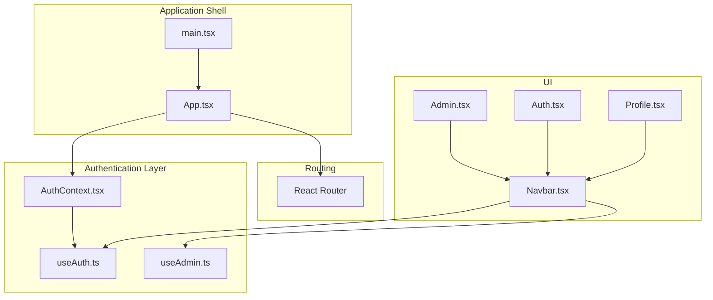
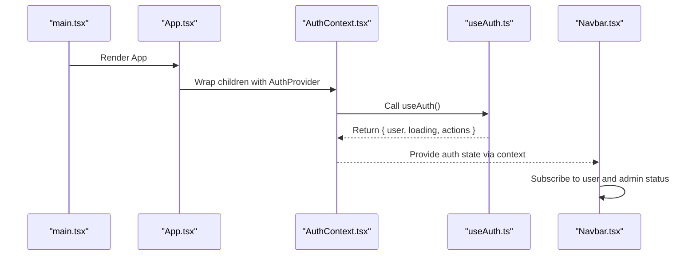
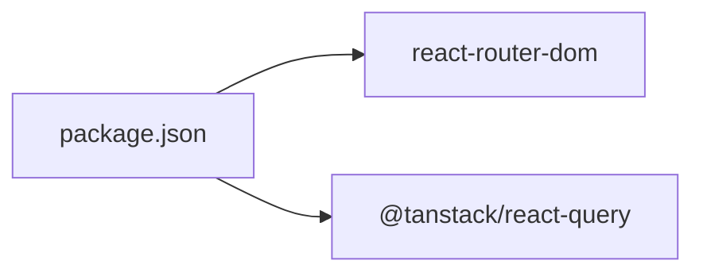

# Custom Authentication Hooks

<cite>
**Referenced Files in This Document**
- [useAuth.ts](file://autocure/src/hooks/useAuth.ts)
- [useAdmin.ts](file://autocure/src/hooks/useAdmin.ts)
- [AuthContext.tsx](file://autocure/src/contexts/AuthContext.tsx)
- [App.tsx](file://autocure/src/App.tsx)
- [Navbar.tsx](file://autocure/src/components/Navbar.tsx)
- [Admin.tsx](file://autocure/src/pages/Admin.tsx)
- [Auth.tsx](file://autocure/src/pages/Auth.tsx)
- [Profile.tsx](file://autocure/src/pages/Profile.tsx)
- [main.tsx](file://autocure/src/main.tsx)
- [package.json](file://autocure/package.json)
</cite>

## Table of Contents
1. [Introduction](#introduction)
2. [Project Structure](#project-structure)
3. [Core Components](#core-components)
4. [Architecture Overview](#architecture-overview)
5. [Detailed Component Analysis](#detailed-component-analysis)
6. [Dependency Analysis](#dependency-analysis)
7. [Performance Considerations](#performance-considerations)
8. [Troubleshooting Guide](#troubleshooting-guide)
9. [Conclusion](#conclusion)

## Introduction
This document explains the custom authentication hooks useAuth() and useAdmin(), focusing on how useAuth() centralizes authentication state and user actions, and how useAdmin() enables role-based access control for admin-only features. It covers state subscription patterns, hook composition, integration with React Router for protected routes, and best practices for cleanup and error handling. Practical usage examples demonstrate how components consume these hooks and how the application structure supports secure, maintainable authentication flows.

## Project Structure
The authentication system is organized around two custom hooks and a context provider:
- useAuth(): Provides authentication state and action methods for sign-up, sign-in, and sign-out.
- useAdmin(): Composes useAuth() to derive admin status and exposes a boolean flag for conditional rendering.
- AuthContext: Wraps the app with a provider that supplies the auth state to consumers.

**Diagram sources**
- [App.tsx](file://autocure/src/App.tsx#L1-L47)
- [main.tsx](file://autocure/src/main.tsx#L1-L11)
- [AuthContext.tsx](file://autocure/src/contexts/AuthContext.tsx#L1-L37)
- [useAuth.ts](file://autocure/src/hooks/useAuth.ts#L1-L43)
- [useAdmin.ts](file://autocure/src/hooks/useAdmin.ts#L1-L25)
- [Navbar.tsx](file://autocure/src/components/Navbar.tsx#L1-L216)
- [Admin.tsx](file://autocure/src/pages/Admin.tsx#L1-L17)
- [Auth.tsx](file://autocure/src/pages/Auth.tsx#L1-L17)
- [Profile.tsx](file://autocure/src/pages/Profile.tsx#L1-L17)

**Section sources**
- [App.tsx](file://autocure/src/App.tsx#L1-L47)
- [main.tsx](file://autocure/src/main.tsx#L1-L11)
- [AuthContext.tsx](file://autocure/src/contexts/AuthContext.tsx#L1-L37)

## Core Components
- useAuth(): Returns an object containing user, loading, and authentication action methods (signUp, signIn, signOut). It manages local state and exposes asynchronous methods for authentication operations. The current implementation includes stubs for authentication actions and sets loading to false by default.
- useAdmin(): Consumes useAuth() to derive admin status. It initializes admin state to false, subscribes to user changes, and updates admin status accordingly. The current implementation includes a stub for admin verification logic.

Practical usage examples:
- Navbar consumes useAuth() to conditionally render profile/admin links and wishlist based on user presence.
- Navbar consumes useAdmin() to conditionally render the admin dashboard link when admin status is true.
- App wraps the routing tree with AuthProvider so all pages and components can use the hooks.

**Section sources**
- [useAuth.ts](file://autocure/src/hooks/useAuth.ts#L1-L43)
- [useAdmin.ts](file://autocure/src/hooks/useAdmin.ts#L1-L25)
- [AuthContext.tsx](file://autocure/src/contexts/AuthContext.tsx#L1-L37)
- [Navbar.tsx](file://autocure/src/components/Navbar.tsx#L1-L216)

## Architecture Overview
The authentication architecture follows a provider pattern:
- App.tsx configures React Router and wraps the entire application with AuthProvider.
- AuthProvider creates and supplies the auth state returned by useAuth() to all components.
- Components like Navbar subscribe to auth state via useAuth() and useAdmin() to drive UI behavior.

**Diagram sources**
- [main.tsx](file://autocure/src/main.tsx#L1-L11)
- [App.tsx](file://autocure/src/App.tsx#L1-L47)
- [AuthContext.tsx](file://autocure/src/contexts/AuthContext.tsx#L1-L37)
- [useAuth.ts](file://autocure/src/hooks/useAuth.ts#L1-L43)
- [Navbar.tsx](file://autocure/src/components/Navbar.tsx#L1-L216)

## Detailed Component Analysis

### useAuth() Hook
Purpose:
- Centralizes authentication state and actions.
- Exposes user, loading, and methods for sign-up, sign-in, and sign-out.
- Enables consistent state subscriptions across components.

State and methods:
- user: Current authenticated user or null.
- loading: Indicates ongoing authentication operations.
- signUp(email, password): Promise returning { user, error }.
- signIn(email, password): Promise returning { user, error }.
- signOut(): Clears user state.

State subscription pattern:
- Components call useAuth() and destructure user to render UI conditionally.
- Components can also track loading to display appropriate feedback.

Hook composition:
- useAuth() is consumed directly by components and indirectly by AuthProvider.

Cleanup:
- No explicit cleanup is performed in the current implementation. If async operations were added later, components should cancel or guard against state updates after unmount.

Stub implementation note:
- Authentication methods currently return stub results. When integrating with a backend, replace stubs with real async logic and update loading and user states accordingly.

**Section sources**
- [useAuth.ts](file://autocure/src/hooks/useAuth.ts#L1-L43)
- [AuthContext.tsx](file://autocure/src/contexts/AuthContext.tsx#L1-L37)

### useAdmin() Hook
Purpose:
- Derives admin status from the current user via useAuth().
- Provides a boolean flag for conditional rendering of admin-only UI.

Logic:
- Initializes admin state to false.
- Subscribes to user changes via useEffect([user]).
- On user change, resets admin to false if user is null; otherwise performs admin verification (stubbed).
- Returns the computed admin status.

Admin verification logic:
- The current implementation includes a stub comment indicating RPC-style role checking. Replace the stub with actual admin verification logic when backend support is available.

Conditional rendering patterns:
- Components can use the returned boolean to conditionally render admin-only elements (e.g., admin dashboard link in Navbar).

Cleanup:
- The effect cleans up by resetting admin state when user is null. No additional cleanup is required in the current stub implementation.

**Section sources**
- [useAdmin.ts](file://autocure/src/hooks/useAdmin.ts#L1-L25)
- [useAuth.ts](file://autocure/src/hooks/useAuth.ts#L1-L43)

### AuthContext Provider
Purpose:
- Supplies authentication state and actions to the entire component tree.
- Ensures components can access auth state without manual prop drilling.

Implementation:
- Creates a context with the auth state returned by useAuth().
- Provides an accessor hook useAuthContext() with runtime validation to prevent misuse outside the provider.

Usage:
- App.tsx wraps the routing tree with AuthProvider so all pages and components can use useAuth() and useAdmin().

**Section sources**
- [AuthContext.tsx](file://autocure/src/contexts/AuthContext.tsx#L1-L37)
- [App.tsx](file://autocure/src/App.tsx#L1-L47)

### Navbar Integration
Purpose:
- Demonstrates practical usage of useAuth() and useAdmin() for conditional UI rendering.

Key integrations:
- Uses useAuth() to show profile/wishlist links when a user exists.
- Uses useAdmin() to show the admin dashboard link when admin status is true.
- Manages scroll and mobile menu effects independently but reacts to auth state for navigation visibility.

Cleanup:
- Adds a scroll event listener and removes it on component unmount to avoid leaks.

**Section sources**
- [Navbar.tsx](file://autocure/src/components/Navbar.tsx#L1-L216)
- [useAuth.ts](file://autocure/src/hooks/useAuth.ts#L1-L43)
- [useAdmin.ts](file://autocure/src/hooks/useAdmin.ts#L1-L25)

### Protected Routes with React Router
Current routing:
- App.tsx defines routes for various pages including admin and auth.
- The admin route is present but does not enforce protection at this time.

Recommended approach:
- Create a route guard that checks useAuth().user and redirects unauthenticated users to the auth page.
- Optionally, gate admin-only routes by checking useAdmin() and redirecting non-admin users.

Benefits of custom hooks over direct context consumption:
- Encapsulation: Hooks hide context internals and expose only necessary state/actions.
- Composition: Hooks can combine multiple concerns (e.g., useAdmin composing useAuth).
- Testability: Hooks are easier to unit test than context providers.
- Reusability: Hooks can be composed across components without duplicating context logic.

**Section sources**
- [App.tsx](file://autocure/src/App.tsx#L1-L47)
- [useAuth.ts](file://autocure/src/hooks/useAuth.ts#L1-L43)
- [useAdmin.ts](file://autocure/src/hooks/useAdmin.ts#L1-L25)

## Dependency Analysis
External dependencies relevant to authentication:
- react-router-dom: Provides routing and navigation.
- @tanstack/react-query: Provides caching and query utilities (not directly used for auth in the current code).

**Diagram sources**
- [package.json](file://autocure/package.json#L1-L30)

**Section sources**
- [package.json](file://autocure/package.json#L1-L30)

## Performance Considerations
- Minimize re-renders: Keep auth state granular and avoid unnecessary context updates.
- Debounce or batch updates: If adding async operations, guard against stale updates after unmount.
- Lazy initialization: Initialize admin state to false and compute it only when user is present.
- Avoid blocking UI: Keep sign-in/sign-up operations asynchronous and reflect loading state.

## Troubleshooting Guide
Common issues and resolutions:
- Hook used outside provider: useAuthContext() throws an error if called outside AuthProvider. Ensure the component tree is wrapped with AuthProvider.
- Admin link not appearing: Confirm that useAdmin() returns true when a user is present. Verify that the stub logic is replaced with actual admin verification.
- Auth actions not updating UI: Ensure components subscribe to user changes from useAuth() and re-render on state updates.
- Memory leaks: Verify that event listeners (e.g., scroll) are removed on component unmount, as shown in Navbar.

**Section sources**
- [AuthContext.tsx](file://autocure/src/contexts/AuthContext.tsx#L1-L37)
- [Navbar.tsx](file://autocure/src/components/Navbar.tsx#L1-L216)

## Conclusion
The custom authentication hooks useAuth() and useAdmin() provide a clean, composable foundation for managing authentication state and role-based access control. By encapsulating state and actions in hooks and exposing them through a provider, the application achieves maintainable, testable, and reusable authentication logic. As the project evolves, integrate real authentication and admin verification logic while preserving the current hook-based architecture for optimal developer experience and scalability.