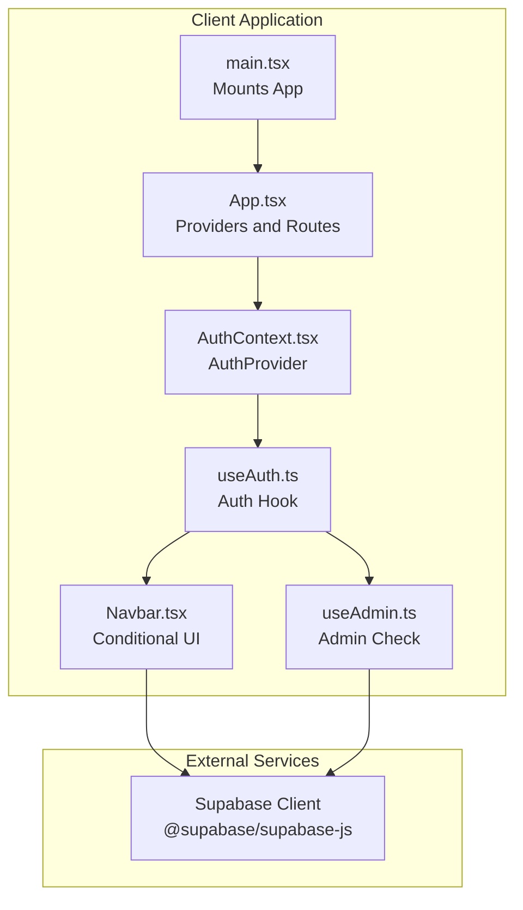
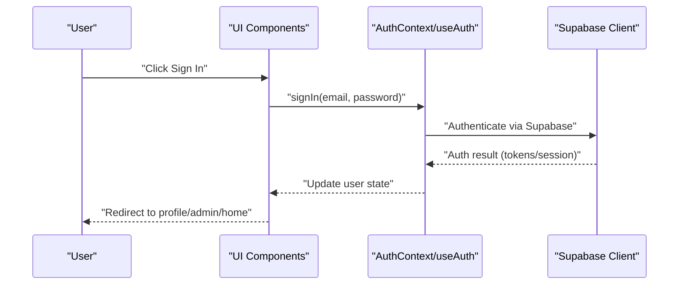
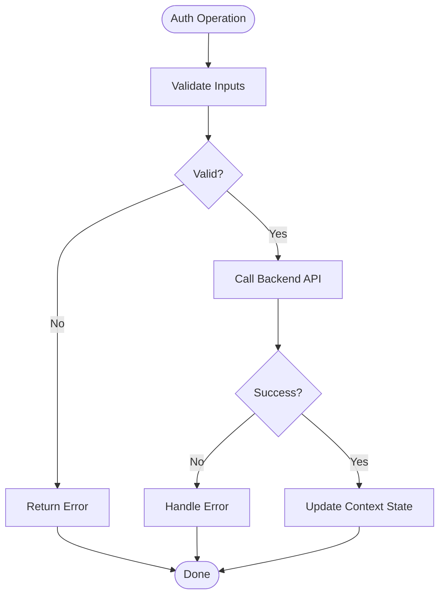
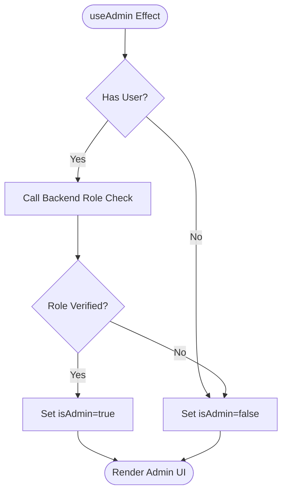
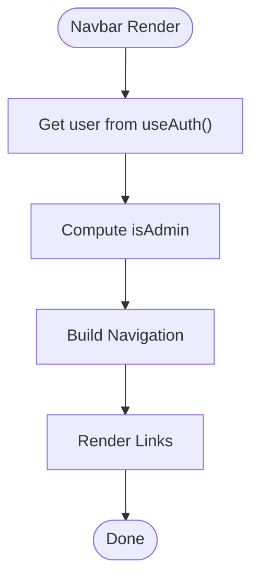
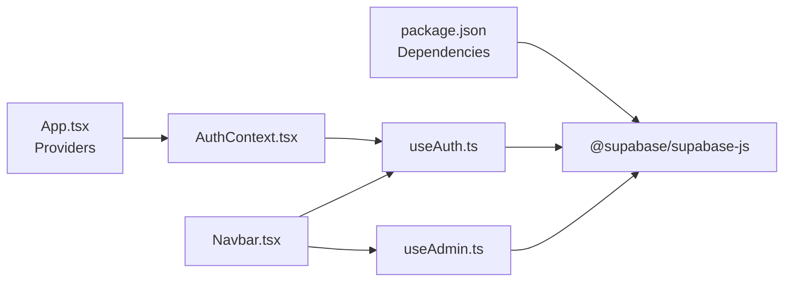

# Security Best Practices

<cite>
**Referenced Files in This Document**
- [AuthContext.tsx](file://autocure/src/contexts/AuthContext.tsx)
- [useAuth.ts](file://autocure/src/hooks/useAuth.ts)
- [useAdmin.ts](file://autocure/src/hooks/useAdmin.ts)
- [Navbar.tsx](file://autocure/src/components/Navbar.tsx)
- [App.tsx](file://autocure/src/App.tsx)
- [main.tsx](file://autocure/src/main.tsx)
- [package.json](file://autocure/package.json)
- [cartStore.ts](file://autocure/src/stores/cartStore.ts)
- [Footer.tsx](file://autocure/src/components/Footer.tsx)
- [ScrollToTop.tsx](file://autocure/src/components/ScrollToTop.tsx)
</cite>

## Table of Contents
1. [Introduction](#introduction)
2. [Project Structure](#project-structure)
3. [Core Components](#core-components)
4. [Architecture Overview](#architecture-overview)
5. [Detailed Component Analysis](#detailed-component-analysis)
6. [Dependency Analysis](#dependency-analysis)
7. [Performance Considerations](#performance-considerations)
8. [Troubleshooting Guide](#troubleshooting-guide)
9. [Conclusion](#conclusion)
10. [Appendices](#appendices)

## Introduction
This document provides comprehensive security guidance for client-side authentication in CarCure2. It focuses on secure state management, protecting credentials and tokens, mitigating common web vulnerabilities such as cross-site scripting (XSS) and cross-site request forgery (CSRF), and establishing secure communication patterns with authentication APIs. It also covers logout procedures, session invalidation, secure redirects, and performance considerations for authentication checks. Recommendations include leveraging the Supabase client library for secure authentication and integrating with backend services while avoiding sensitive data exposure in client-side code.

## Project Structure
CarCure2 is a React application bootstrapped with Vite. Authentication is implemented using a React context and a custom hook, with routing managed by react-router-dom. The application integrates Supabase client libraries for authentication and database operations. The UI components conditionally render based on authentication state, and navigation links change depending on whether a user is signed in or has administrative privileges.

**Diagram sources**
- [main.tsx](file://autocure/src/main.tsx#L1-L11)
- [App.tsx](file://autocure/src/App.tsx#L1-L47)
- [AuthContext.tsx](file://autocure/src/contexts/AuthContext.tsx#L1-L37)
- [useAuth.ts](file://autocure/src/hooks/useAuth.ts#L1-L43)
- [Navbar.tsx](file://autocure/src/components/Navbar.tsx#L1-L216)
- [useAdmin.ts](file://autocure/src/hooks/useAdmin.ts#L1-L25)
- [package.json](file://autocure/package.json#L18-L29)

**Section sources**
- [main.tsx](file://autocure/src/main.tsx#L1-L11)
- [App.tsx](file://autocure/src/App.tsx#L1-L47)
- [AuthContext.tsx](file://autocure/src/contexts/AuthContext.tsx#L1-L37)
- [useAuth.ts](file://autocure/src/hooks/useAuth.ts#L1-L43)
- [Navbar.tsx](file://autocure/src/components/Navbar.tsx#L1-L216)
- [useAdmin.ts](file://autocure/src/hooks/useAdmin.ts#L1-L25)
- [package.json](file://autocure/package.json#L18-L29)

## Core Components
- Authentication Context and Hook
  - The AuthProvider wraps the app and exposes authentication functions and state to consumers.
  - The useAuth hook currently provides stub implementations for sign-up, sign-in, and sign-out. These must be implemented to securely communicate with the backend and manage tokens.
- Admin Privilege Check
  - The useAdmin hook derives admin status from the current user and performs a backend check via a stored procedure call pattern. This is a placeholder for secure role verification.
- UI Integration
  - Navbar renders different navigation items based on authentication state and admin status, ensuring sensitive routes are only accessible to authorized users.

Security-relevant observations:
- The current implementation uses stubs for authentication operations. Implementations must avoid storing secrets in local state and must rely on secure backend APIs.
- Admin checks are stubbed; replace with server-side role verification to prevent client-side tampering.

**Section sources**
- [AuthContext.tsx](file://autocure/src/contexts/AuthContext.tsx#L1-L37)
- [useAuth.ts](file://autocure/src/hooks/useAuth.ts#L1-L43)
- [useAdmin.ts](file://autocure/src/hooks/useAdmin.ts#L1-L25)
- [Navbar.tsx](file://autocure/src/components/Navbar.tsx#L114-L131)

## Architecture Overview
The client-side authentication architecture centers on a React context that exposes sign-in/sign-up/sign-out functions and user state. UI components consume this context to enable/disable features and routes. Supabase client libraries are included for authentication and database operations.

**Diagram sources**
- [useAuth.ts](file://autocure/src/hooks/useAuth.ts#L21-L29)
- [Navbar.tsx](file://autocure/src/components/Navbar.tsx#L114-L131)
- [package.json](file://autocure/package.json#L18-L29)

## Detailed Component Analysis

### Authentication State Management
- Purpose
  - Centralizes authentication state and exposes sign-in/sign-up/sign-out functions to the rest of the app.
- Security Considerations
  - Do not persist raw passwords or tokens in React state. Use secure browser storage mechanisms (see recommendations below).
  - Ensure sign-out clears all user state and invalidates any session tokens.
  - Validate and sanitize all inputs before calling backend APIs.

**Diagram sources**
- [useAuth.ts](file://autocure/src/hooks/useAuth.ts#L21-L29)

**Section sources**
- [AuthContext.tsx](file://autocure/src/contexts/AuthContext.tsx#L1-L37)
- [useAuth.ts](file://autocure/src/hooks/useAuth.ts#L1-L43)

### Admin Privilege Verification
- Purpose
  - Derives admin status from the current user and performs a backend role check.
- Security Considerations
  - Replace the stub with a secure backend call that verifies roles server-side.
  - Avoid exposing admin controls to users who do not pass this check.

**Diagram sources**
- [useAdmin.ts](file://autocure/src/hooks/useAdmin.ts#L8-L21)

**Section sources**
- [useAdmin.ts](file://autocure/src/hooks/useAdmin.ts#L1-L25)

### UI Integration and Conditional Rendering
- Purpose
  - Renders navigation items conditionally based on authentication state and admin status.
- Security Considerations
  - Do not rely solely on client-side visibility to protect admin routes. Protect routes at the router level and enforce authorization on the backend.

**Diagram sources**
- [Navbar.tsx](file://autocure/src/components/Navbar.tsx#L20-L22)

**Section sources**
- [Navbar.tsx](file://autocure/src/components/Navbar.tsx#L1-L216)

### Secure Token Storage and Session Management
- Current State
  - The authentication hook currently uses stubs and does not persist tokens.
- Recommended Approach
  - Use Supabase’s built-in session management to store tokens securely. Avoid placing tokens in localStorage or sessionStorage due to XSS risks.
  - Prefer HttpOnly cookies for session tokens when supported by your backend. This prevents JavaScript access and reduces XSS impact.
  - Implement automatic token refresh and silent re-authentication to minimize user friction.

[No sources needed since this section provides general guidance]

### Protection Against XSS and CSRF
- XSS Prevention
  - Sanitize all user-generated content before rendering.
  - Use Content Security Policy (CSP) headers to restrict script execution.
  - Avoid innerHTML and eval. Use React’s default escaping behavior.
- CSRF Prevention
  - Use anti-CSRF tokens for state-changing requests.
  - Enforce SameSite cookies for session cookies.
  - Restrict origins with CORS policies and validate referer headers where applicable.

[No sources needed since this section provides general guidance]

### Secure Communication Patterns with Authentication APIs
- Use HTTPS-only endpoints.
- Implement short-lived access tokens and refresh tokens.
- Validate and log all authentication-related requests and errors.
- Avoid leaking sensitive information in error messages.

[No sources needed since this section provides general guidance]

### Logout Procedures, Session Invalidation, and Redirects
- Logout Procedure
  - Clear user state in the auth context.
  - Invalidate the session on the backend (call sign-out endpoint).
  - Remove any stored tokens from secure storage.
- Redirect Handling
  - Redirect to a safe page after logout (e.g., home or auth).
  - Avoid redirect loops by checking current location before redirecting.

[No sources needed since this section provides general guidance]

### Error Handling to Avoid Information Leakage
- Do not expose internal error details to users.
- Log errors on the server and return generic messages to clients.
- Distinguish between recoverable and unrecoverable errors without revealing stack traces.

[No sources needed since this section provides general guidance]

### Integrating with Backend Authentication Services
- Supabase Integration
  - Initialize the Supabase client with project URL and anonymous/public keys.
  - Use Supabase Auth for sign-in, sign-up, and session management.
  - Use Supabase DB for protected queries and role checks.

**Section sources**
- [package.json](file://autocure/package.json#L18-L29)

## Dependency Analysis
The application depends on Supabase client libraries for authentication and database operations. The authentication context and hook are the primary integration points for these dependencies.

**Diagram sources**
- [package.json](file://autocure/package.json#L18-L29)
- [App.tsx](file://autocure/src/App.tsx#L1-L47)
- [AuthContext.tsx](file://autocure/src/contexts/AuthContext.tsx#L1-L37)
- [useAuth.ts](file://autocure/src/hooks/useAuth.ts#L1-L43)
- [Navbar.tsx](file://autocure/src/components/Navbar.tsx#L1-L216)
- [useAdmin.ts](file://autocure/src/hooks/useAdmin.ts#L1-L25)

**Section sources**
- [package.json](file://autocure/package.json#L18-L29)
- [App.tsx](file://autocure/src/App.tsx#L1-L47)
- [AuthContext.tsx](file://autocure/src/contexts/AuthContext.tsx#L1-L37)
- [useAuth.ts](file://autocure/src/hooks/useAuth.ts#L1-L43)
- [Navbar.tsx](file://autocure/src/components/Navbar.tsx#L1-L216)
- [useAdmin.ts](file://autocure/src/hooks/useAdmin.ts#L1-L25)

## Performance Considerations
- Minimize re-renders by memoizing derived values (e.g., admin status) and using shallow comparisons where appropriate.
- Debounce or throttle frequent UI updates (e.g., scroll effects) to reduce layout thrashing.
- Lazy-load heavy components and defer non-critical features until after initial render.
- Use efficient state containers (e.g., Zustand) for client-side stores to avoid unnecessary updates.

[No sources needed since this section provides general guidance]

## Troubleshooting Guide
- Authentication Stubs Not Implemented
  - Symptom: Sign-in/sign-up do not update user state.
  - Action: Implement sign-in/sign-up functions to call backend APIs and update context state upon success.
- Admin UI Visible Without Authorization
  - Symptom: Admin dashboard appears accessible without proper role verification.
  - Action: Replace the admin check stub with a secure backend role verification and guard routes accordingly.
- Logout Does Not Clear State
  - Symptom: User remains logged in after clicking logout.
  - Action: Ensure sign-out clears user state and invalidates the session on the backend.

**Section sources**
- [useAuth.ts](file://autocure/src/hooks/useAuth.ts#L21-L33)
- [useAdmin.ts](file://autocure/src/hooks/useAdmin.ts#L14-L18)
- [Navbar.tsx](file://autocure/src/components/Navbar.tsx#L114-L131)

## Conclusion
CarCure2’s current authentication implementation is a foundation that requires secure backend integration and robust client-side state management. By replacing stubs with secure API calls, enforcing server-side role checks, and adopting secure storage and communication patterns, the application can mitigate common vulnerabilities and provide a resilient authentication experience. Implement HttpOnly cookies for sessions, enforce CSRF protections, and apply strict error handling to avoid information leakage.

[No sources needed since this section summarizes without analyzing specific files]

## Appendices
- Additional UI Components
  - Footer and ScrollToTop are present but not directly involved in authentication logic.
- State Stores
  - Cart store demonstrates a separate state container pattern suitable for non-sensitive client-side data.

**Section sources**
- [Footer.tsx](file://autocure/src/components/Footer.tsx#L1-L119)
- [ScrollToTop.tsx](file://autocure/src/components/ScrollToTop.tsx#L1-L13)
- [cartStore.ts](file://autocure/src/stores/cartStore.ts#L1-L63)