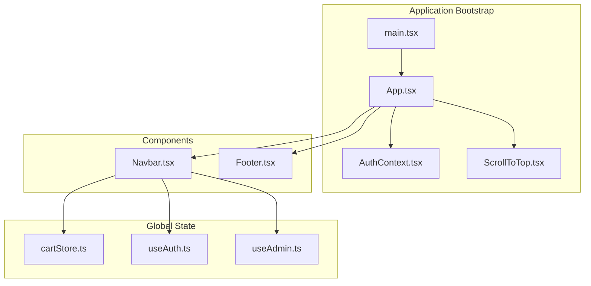
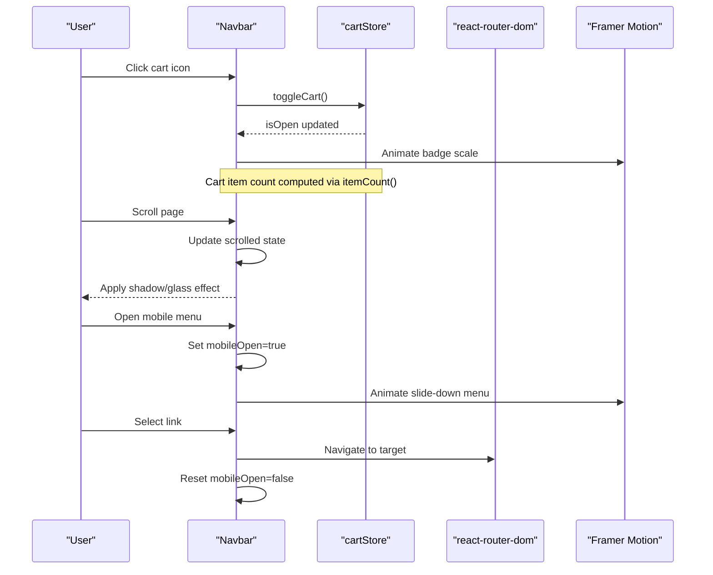
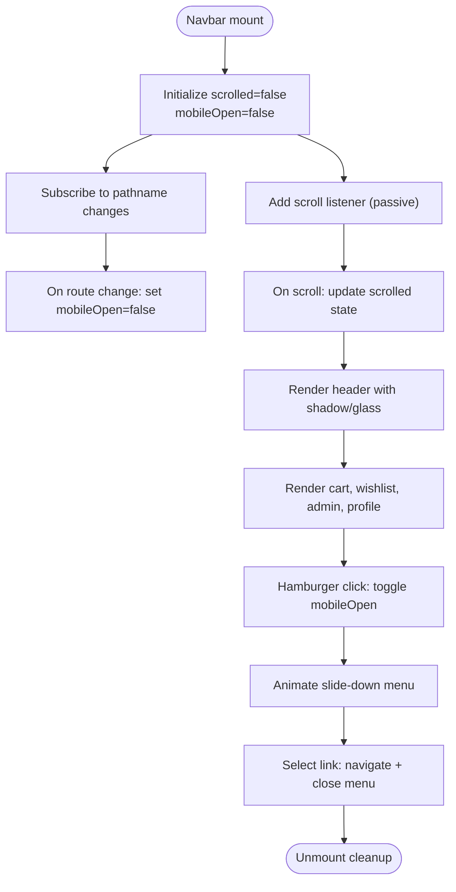
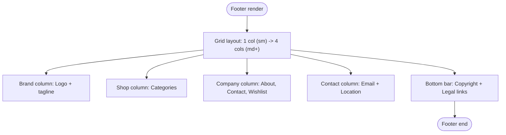
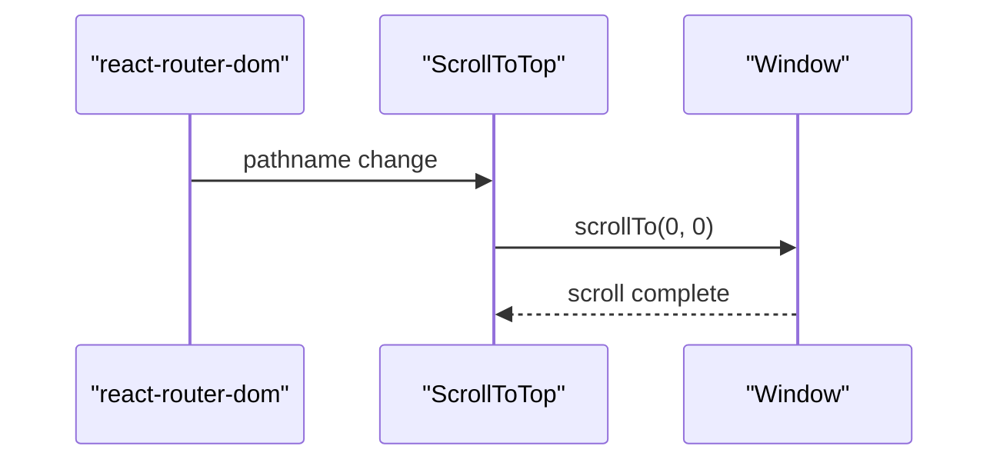
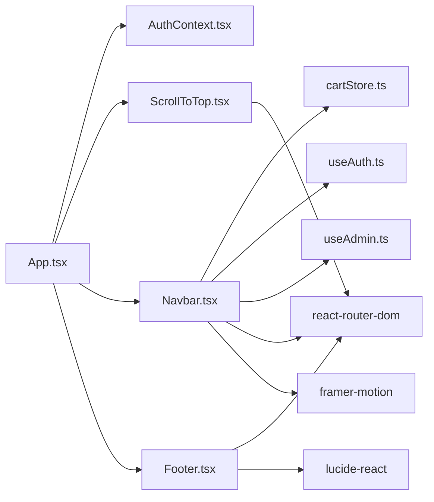

# Component Library

<cite>
**Referenced Files in This Document**
- [Navbar.tsx](file://autocure/src/components/Navbar.tsx)
- [Footer.tsx](file://autocure/src/components/Footer.tsx)
- [ScrollToTop.tsx](file://autocure/src/components/ScrollToTop.tsx)
- [cartStore.ts](file://autocure/src/stores/cartStore.ts)
- [AuthContext.tsx](file://autocure/src/contexts/AuthContext.tsx)
- [useAuth.ts](file://autocure/src/hooks/useAuth.ts)
- [useAdmin.ts](file://autocure/src/hooks/useAdmin.ts)
- [App.tsx](file://autocure/src/App.tsx)
- [main.tsx](file://autocure/src/main.tsx)
- [index.css](file://autocure/src/index.css)
- [tailwind.config.ts](file://autocure/tailwind.config.ts)
</cite>

## Table of Contents
1. [Introduction](#introduction)
2. [Project Structure](#project-structure)
3. [Core Components](#core-components)
4. [Architecture Overview](#architecture-overview)
5. [Detailed Component Analysis](#detailed-component-analysis)
6. [Dependency Analysis](#dependency-analysis)
7. [Performance Considerations](#performance-considerations)
8. [Troubleshooting Guide](#troubleshooting-guide)
9. [Conclusion](#conclusion)
10. [Appendices](#appendices)

## Introduction
This document describes CarCure2’s reusable component library with a focus on three primary UI components: Navbar, Footer, and ScrollToTop. It explains component props, event handlers, styling approaches using Tailwind CSS, responsive design patterns, composition patterns, integration with global state, accessibility features, mobile responsiveness, lifecycle considerations, performance characteristics, and best practices for extending the component library.

## Project Structure
The component library resides under the src/components directory and integrates with global state via Zustand stores and React context providers. The application bootstraps with Tailwind CSS and custom design tokens.

**Diagram sources**
- [main.tsx](file://autocure/src/main.tsx#L1-L11)
- [App.tsx](file://autocure/src/App.tsx#L1-L47)
- [AuthContext.tsx](file://autocure/src/contexts/AuthContext.tsx#L1-L37)
- [ScrollToTop.tsx](file://autocure/src/components/ScrollToTop.tsx#L1-L13)
- [Navbar.tsx](file://autocure/src/components/Navbar.tsx#L1-L216)
- [Footer.tsx](file://autocure/src/components/Footer.tsx#L1-L119)
- [cartStore.ts](file://autocure/src/stores/cartStore.ts#L1-L36)
- [useAuth.ts](file://autocure/src/hooks/useAuth.ts#L1-L43)
- [useAdmin.ts](file://autocure/src/hooks/useAdmin.ts#L1-L25)

**Section sources**
- [main.tsx](file://autocure/src/main.tsx#L1-L11)
- [App.tsx](file://autocure/src/App.tsx#L1-L47)

## Core Components
- Navbar: Fixed header with logo, desktop navigation links, cart integration, user/admin actions, and a mobile hamburger menu with animated transitions.
- Footer: Multi-column layout with brand identity, shop categories, company links, contact information, and legal links.
- ScrollToTop: Route-aware component that scrolls to the top of the page on route changes.

Key integration points:
- Navbar consumes cartStore for cart toggling and item count, and uses AuthContext via useAuth/useAdmin hooks to conditionally render profile, admin, and wishlist actions.
- Footer is self-contained and does not require props.
- ScrollToTop is mounted globally and relies on react-router-dom’s useLocation to trigger scrolling.

**Section sources**
- [Navbar.tsx](file://autocure/src/components/Navbar.tsx#L1-L216)
- [Footer.tsx](file://autocure/src/components/Footer.tsx#L1-L119)
- [ScrollToTop.tsx](file://autocure/src/components/ScrollToTop.tsx#L1-L13)
- [cartStore.ts](file://autocure/src/stores/cartStore.ts#L1-L36)
- [AuthContext.tsx](file://autocure/src/contexts/AuthContext.tsx#L1-L37)
- [useAuth.ts](file://autocure/src/hooks/useAuth.ts#L1-L43)
- [useAdmin.ts](file://autocure/src/hooks/useAdmin.ts#L1-L25)

## Architecture Overview
The Navbar composes icons, routing links, and stateful interactions. It integrates with:
- Zustand cartStore for cart visibility and item count
- Auth hooks for user session and admin checks
- Framer Motion for smooth animations
- Tailwind CSS for responsive and glass-like styling

**Diagram sources**
- [Navbar.tsx](file://autocure/src/components/Navbar.tsx#L1-L216)
- [cartStore.ts](file://autocure/src/stores/cartStore.ts#L1-L36)

## Detailed Component Analysis

### Navbar
- Purpose: Primary navigation with cart integration, user/admin actions, and responsive mobile menu.
- Props: None (no props interface defined).
- Event handlers:
  - Cart toggle via toggleCart from cartStore
  - Mobile menu open/close via local state
  - Route change handler to close mobile menu
- Accessibility:
  - Uses aria-label on interactive buttons for screen readers
  - Semantic Link components for navigation
- Responsive behavior:
  - Desktop: horizontal nav links
  - Mobile: hamburger menu with animated slide-down panel
  - Scroll-aware header with dynamic shadow and glass effect
- Styling approach:
  - Tailwind utilities for spacing, colors, and responsive breakpoints
  - Custom glass classes and neon effects from index.css/tailwind.config.ts
  - Framer Motion for cart badge scaling and mobile menu transitions
- Composition patterns:
  - Uses useCartStore, useAuth, useAdmin hooks
  - Composes lucide-react icons
  - Integrates with react-router-dom Link for navigation

**Diagram sources**
- [Navbar.tsx](file://autocure/src/components/Navbar.tsx#L1-L216)

**Section sources**
- [Navbar.tsx](file://autocure/src/components/Navbar.tsx#L1-L216)
- [cartStore.ts](file://autocure/src/stores/cartStore.ts#L1-L36)
- [useAuth.ts](file://autocure/src/hooks/useAuth.ts#L1-L43)
- [useAdmin.ts](file://autocure/src/hooks/useAdmin.ts#L1-L25)
- [index.css](file://autocure/src/index.css#L53-L135)
- [tailwind.config.ts](file://autocure/tailwind.config.ts#L1-L91)

### Footer
- Purpose: Branding footer with shop categories, company links, contact info, and legal links.
- Props: None (no props interface defined).
- Event handlers: None (static links).
- Accessibility: Links use semantic anchor tags with hover/focus states via Tailwind.
- Responsive behavior:
  - Single column on small screens
  - Four-column grid on medium and larger screens
- Styling approach:
  - Tailwind grid for layout
  - Consistent typography and color tokens from design system
- Composition patterns:
  - Uses lucide-react icons for contact details
  - Leverages shared link styles for consistency

**Diagram sources**
- [Footer.tsx](file://autocure/src/components/Footer.tsx#L1-L119)

**Section sources**
- [Footer.tsx](file://autocure/src/components/Footer.tsx#L1-L119)
- [index.css](file://autocure/src/index.css#L53-L135)
- [tailwind.config.ts](file://autocure/tailwind.config.ts#L1-L91)

### ScrollToTop
- Purpose: Automatically scroll to the top of the page on route changes.
- Props: None (no props interface defined).
- Event handlers:
  - useEffect with pathname dependency triggers window.scrollTo(0, 0)
- Accessibility: No interactive elements; purely functional.
- Responsive behavior: N/A (purely programmatic).
- Styling approach: Stateless component returning null.
- Composition patterns:
  - Consumes react-router-dom useLocation
  - Mounted globally in App to wrap all routes

**Diagram sources**
- [ScrollToTop.tsx](file://autocure/src/components/ScrollToTop.tsx#L1-L13)
- [App.tsx](file://autocure/src/App.tsx#L1-L47)

**Section sources**
- [ScrollToTop.tsx](file://autocure/src/components/ScrollToTop.tsx#L1-L13)
- [App.tsx](file://autocure/src/App.tsx#L1-L47)

## Dependency Analysis
- Navbar depends on:
  - cartStore for cart state and item count
  - useAuth/useAdmin for conditional rendering
  - Framer Motion for animations
  - lucide-react for icons
  - react-router-dom for navigation and location
- Footer is self-contained and depends only on react-router-dom and lucide-react.
- ScrollToTop depends on react-router-dom useLocation.
- Global state:
  - cartStore is a Zustand store with items, isOpen, toggleCart, itemCount, addItem
  - AuthContext provides user session and auth actions via useAuth hook
  - useAdmin derives admin status from user

**Diagram sources**
- [Navbar.tsx](file://autocure/src/components/Navbar.tsx#L1-L216)
- [Footer.tsx](file://autocure/src/components/Footer.tsx#L1-L119)
- [ScrollToTop.tsx](file://autocure/src/components/ScrollToTop.tsx#L1-L13)
- [cartStore.ts](file://autocure/src/stores/cartStore.ts#L1-L36)
- [useAuth.ts](file://autocure/src/hooks/useAuth.ts#L1-L43)
- [useAdmin.ts](file://autocure/src/hooks/useAdmin.ts#L1-L25)
- [AuthContext.tsx](file://autocure/src/contexts/AuthContext.tsx#L1-L37)
- [App.tsx](file://autocure/src/App.tsx#L1-L47)

**Section sources**
- [cartStore.ts](file://autocure/src/stores/cartStore.ts#L1-L36)
- [useAuth.ts](file://autocure/src/hooks/useAuth.ts#L1-L43)
- [useAdmin.ts](file://autocure/src/hooks/useAdmin.ts#L1-L25)
- [AuthContext.tsx](file://autocure/src/contexts/AuthContext.tsx#L1-L37)
- [App.tsx](file://autocure/src/App.tsx#L1-L47)

## Performance Considerations
- Navbar
  - Scroll listener uses passive option to improve scroll performance.
  - Local state updates are minimal and scoped to header behavior.
  - Framer Motion animations are lightweight and only triggered on user interactions.
- Footer
  - Stateless component with static content; no re-renders beyond initial mount.
- ScrollToTop
  - Minimal overhead; only runs on pathname changes.
- Global state
  - cartStore uses Zustand for efficient state updates and selective re-renders.
  - Auth hooks keep user/session state local to components that need it.
- Styling
  - Tailwind utilities are scoped and layered via @layer directives for predictable cascade.
  - Custom neon and glass utilities are defined once and reused.

[No sources needed since this section provides general guidance]

## Troubleshooting Guide
- Navbar cart badge not updating
  - Verify cartStore.addItem and itemCount are correctly implemented and consumed by Navbar.
  - Ensure toggleCart is bound to the cart icon button.
- Mobile menu not closing on link selection
  - Confirm that each Link inside the mobile menu calls setMobileOpen(false).
- ScrollToTop not triggering
  - Ensure ScrollToTop is rendered within the BrowserRouter and that pathname changes occur on navigation.
- Auth/admin icons not appearing
  - Check that useAuth returns a user object and useAdmin computes isAdmin based on user presence.
- Accessibility issues
  - Verify aria-labels on interactive elements and ensure keyboard focus is visible.

**Section sources**
- [Navbar.tsx](file://autocure/src/components/Navbar.tsx#L1-L216)
- [cartStore.ts](file://autocure/src/stores/cartStore.ts#L1-L36)
- [useAuth.ts](file://autocure/src/hooks/useAuth.ts#L1-L43)
- [useAdmin.ts](file://autocure/src/hooks/useAdmin.ts#L1-L25)
- [ScrollToTop.tsx](file://autocure/src/components/ScrollToTop.tsx#L1-L13)

## Conclusion
CarCure2’s component library demonstrates clean separation of concerns, robust integration with global state, and thoughtful responsive design. The Navbar, Footer, and ScrollToTop components are modular, accessible, and styled consistently using Tailwind CSS and custom design tokens. Extending the library involves adding new components with clear composition patterns, leveraging existing hooks and stores, and adhering to the established styling and accessibility guidelines.

[No sources needed since this section summarizes without analyzing specific files]

## Appendices

### Styling and Design Tokens
- Tailwind configuration defines custom colors (neon and glass), fonts (display/body), and keyframes/animations.
- index.css layers define base, components, and utilities, including glass and neon effects.

**Section sources**
- [index.css](file://autocure/src/index.css#L1-L146)
- [tailwind.config.ts](file://autocure/tailwind.config.ts#L1-L91)

### Global State Interfaces
- cartStore
  - Items: array of cart items
  - isOpen: boolean flag for cart visibility
  - toggleCart: function to flip isOpen
  - itemCount: function to compute total quantity
  - addItem: function to add or increment item quantity
- AuthContext
  - user: User object or null
  - loading: boolean flag
  - signUp, signIn, signOut: async auth action functions

**Section sources**
- [cartStore.ts](file://autocure/src/stores/cartStore.ts#L1-L36)
- [AuthContext.tsx](file://autocure/src/contexts/AuthContext.tsx#L1-L37)
- [useAuth.ts](file://autocure/src/hooks/useAuth.ts#L1-L43)

### Best Practices for Extension
- Keep components stateless when possible; delegate state to stores or context.
- Use Tailwind utilities for responsive layouts and avoid inline styles.
- Add aria-labels and semantic HTML for accessibility.
- Encapsulate animations with Framer Motion only when necessary.
- Reuse design tokens and component classes to maintain consistency.
- Test mobile responsiveness across breakpoints and ensure touch-friendly targets.

[No sources needed since this section provides general guidance]