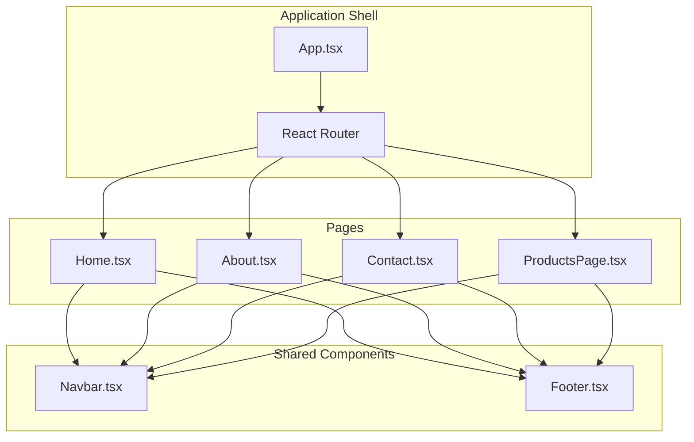
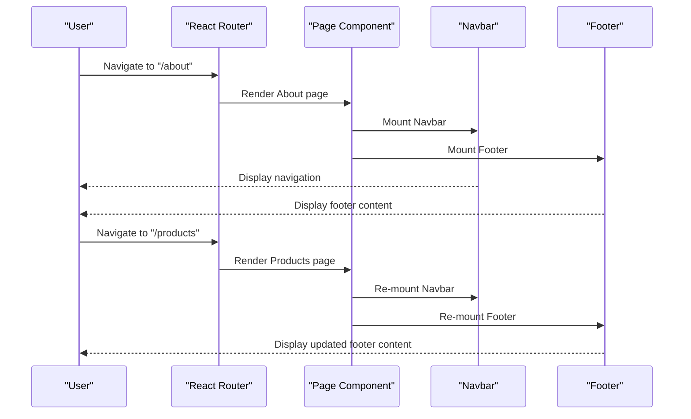
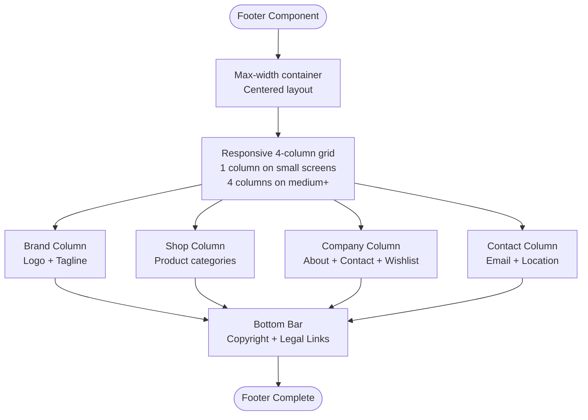
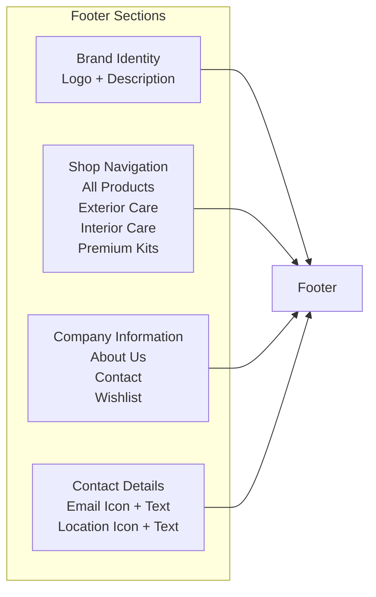
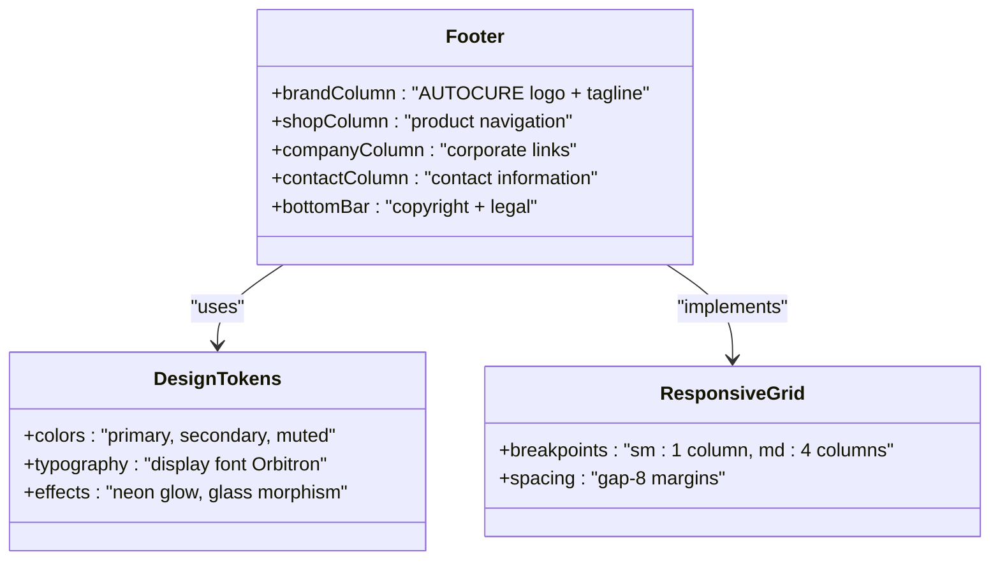
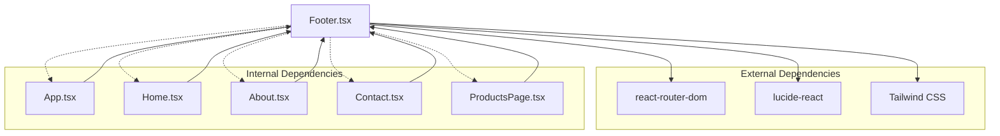

# Footer Component

<cite>
**Referenced Files in This Document**
- [Footer.tsx](file://autocure/src/components/Footer.tsx)
- [App.tsx](file://autocure/src/App.tsx)
- [Home.tsx](file://autocure/src/pages/Home.tsx)
- [About.tsx](file://autocure/src/pages/About.tsx)
- [Contact.tsx](file://autocure/src/pages/Contact.tsx)
- [ProductsPage.tsx](file://autocure/src/pages/ProductsPage.tsx)
- [Navbar.tsx](file://autocure/src/components/Navbar.tsx)
- [tailwind.config.ts](file://autocure/tailwind.config.ts)
- [index.css](file://autocure/src/index.css)
- [package.json](file://autocure/package.json)
</cite>

## Table of Contents
1. [Introduction](#introduction)
2. [Project Structure](#project-structure)
3. [Core Components](#core-components)
4. [Architecture Overview](#architecture-overview)
5. [Detailed Component Analysis](#detailed-component-analysis)
6. [Dependency Analysis](#dependency-analysis)
7. [Performance Considerations](#performance-considerations)
8. [Troubleshooting Guide](#troubleshooting-guide)
9. [Conclusion](#conclusion)

## Introduction
This document provides comprehensive documentation for the Footer component used in CarCure2. It explains the component's layout structure, link organization, and branding elements. Since the current implementation does not expose props for customization, this guide focuses on the existing static structure and demonstrates how to integrate and extend the Footer across the application while maintaining consistent design and functionality.

## Project Structure
The Footer component is part of the shared components and is integrated into multiple page layouts. The application uses React Router for navigation and Tailwind CSS with custom design tokens for styling.

**Diagram sources**
- [App.tsx](file://autocure/src/App.tsx#L1-L47)
- [Home.tsx](file://autocure/src/pages/Home.tsx#L1-L18)
- [About.tsx](file://autocure/src/pages/About.tsx#L1-L17)
- [Contact.tsx](file://autocure/src/pages/Contact.tsx#L1-L17)
- [ProductsPage.tsx](file://autocure/src/pages/ProductsPage.tsx#L1-L225)
- [Navbar.tsx](file://autocure/src/components/Navbar.tsx#L1-L216)
- [Footer.tsx](file://autocure/src/components/Footer.tsx#L1-L119)

**Section sources**
- [App.tsx](file://autocure/src/App.tsx#L1-L47)
- [Home.tsx](file://autocure/src/pages/Home.tsx#L1-L18)
- [About.tsx](file://autocure/src/pages/About.tsx#L1-L17)
- [Contact.tsx](file://autocure/src/pages/Contact.tsx#L1-L17)
- [ProductsPage.tsx](file://autocure/src/pages/ProductsPage.tsx#L1-L225)

## Core Components
The Footer component renders a responsive four-column layout with brand identity, shop navigation, company information, and contact details. It also includes a bottom bar with legal links and copyright information.

Key structural elements:
- Grid layout with responsive breakpoints (single column on small screens, four columns on medium and larger screens)
- Brand column containing logo and tagline
- Navigation columns for Shop and Company sections
- Contact column with icon-enhanced information
- Bottom bar with copyright and legal links

Styling characteristics:
- Uses Tailwind utility classes for responsive design and theming
- Leverages custom CSS variables and Tailwind theme extensions for consistent color schemes
- Implements glass morphism effects and neon accents

**Section sources**
- [Footer.tsx](file://autocure/src/components/Footer.tsx#L1-L119)
- [tailwind.config.ts](file://autocure/tailwind.config.ts#L1-L91)
- [index.css](file://autocure/src/index.css#L1-L146)

## Architecture Overview
The Footer integrates seamlessly with the application's routing and layout system. It is included in multiple page components to ensure consistent navigation and branding across the site.

**Diagram sources**
- [App.tsx](file://autocure/src/App.tsx#L1-L47)
- [About.tsx](file://autocure/src/pages/About.tsx#L1-L17)
- [ProductsPage.tsx](file://autocure/src/pages/ProductsPage.tsx#L1-L225)
- [Footer.tsx](file://autocure/src/components/Footer.tsx#L1-L119)

## Detailed Component Analysis

### Layout Structure and Responsive Design
The Footer employs a responsive grid system that adapts to different screen sizes:

**Diagram sources**
- [Footer.tsx](file://autocure/src/components/Footer.tsx#L6-L118)

Responsive behavior implementation:
- Uses `grid grid-cols-1 md:grid-cols-4` for responsive column layout
- Maintains proper spacing with `gap-8` and margin/padding utilities
- Adapts bottom bar to single column on small screens with `flex-col sm:flex-row`

### Content Organization and Navigation
The Footer organizes content into logical sections:

**Diagram sources**
- [Footer.tsx](file://autocure/src/components/Footer.tsx#L11-L98)

Navigation patterns:
- All links use React Router's `Link` component for client-side navigation
- Consistent hover states with `hover:text-primary` transitions
- Proper semantic markup with appropriate heading levels

### Styling System and Theming
The Footer leverages the application's design system:

**Diagram sources**
- [Footer.tsx](file://autocure/src/components/Footer.tsx#L1-L119)
- [tailwind.config.ts](file://autocure/tailwind.config.ts#L10-L50)
- [index.css](file://autocure/src/index.css#L25-L34)

Design system integration:
- Custom CSS variables define primary colors and neon effects
- Tailwind theme extends with display and body fonts
- Glass morphism effects achieved through backdrop blur and border utilities

### Accessibility Features
The Footer incorporates several accessibility best practices:

- Semantic HTML structure with appropriate heading hierarchy
- Sufficient color contrast for text elements
- Hover states provide clear visual feedback
- Focus management through proper button and link semantics
- Responsive design ensures usability across devices

Current accessibility considerations:
- Links use `hover:text-primary` for clear state indication
- Proper spacing ensures touch targets meet minimum size requirements
- Color scheme maintains sufficient contrast ratios

**Section sources**
- [Footer.tsx](file://autocure/src/components/Footer.tsx#L1-L119)
- [tailwind.config.ts](file://autocure/tailwind.config.ts#L15-L50)
- [index.css](file://autocure/src/index.css#L5-L51)

## Dependency Analysis
The Footer component has minimal external dependencies and integrates cleanly with the application ecosystem.

**Diagram sources**
- [Footer.tsx](file://autocure/src/components/Footer.tsx#L1-L2)
- [App.tsx](file://autocure/src/App.tsx#L1-L47)
- [Home.tsx](file://autocure/src/pages/Home.tsx#L1-L18)
- [About.tsx](file://autocure/src/pages/About.tsx#L1-L17)
- [Contact.tsx](file://autocure/src/pages/Contact.tsx#L1-L17)
- [ProductsPage.tsx](file://autocure/src/pages/ProductsPage.tsx#L1-L225)
- [package.json](file://autocure/package.json#L18-L28)

Dependency characteristics:
- **Direct dependencies**: react-router-dom, lucide-react
- **Development dependencies**: Tailwind CSS, TypeScript
- **Integration points**: React Router for navigation, Tailwind for styling
- **No circular dependencies**: Clean separation between component and application layers

**Section sources**
- [Footer.tsx](file://autocure/src/components/Footer.tsx#L1-L2)
- [package.json](file://autocure/package.json#L18-L28)

## Performance Considerations
The Footer component is lightweight and optimized for performance:

- Minimal DOM structure reduces rendering overhead
- Stateless component with no local state management
- Efficient CSS class usage leveraging Tailwind utilities
- No heavy external libraries or complex computations

Optimization opportunities:
- Consider memoization if content becomes dynamic
- Lazy loading could be beneficial if content grows significantly
- Bundle size impact is negligible due to minimal dependencies

## Troubleshooting Guide
Common issues and solutions when working with the Footer component:

### Styling Issues
**Problem**: Footer colors don't match the design system
**Solution**: Verify Tailwind theme configuration and CSS variables are properly loaded

**Problem**: Responsive layout breaks on specific screen sizes
**Solution**: Check grid gap and container padding classes for consistency

### Navigation Issues
**Problem**: Links don't navigate correctly
**Solution**: Ensure React Router is properly configured in the application shell

**Problem**: Broken routes after navigation
**Solution**: Verify route definitions in the main App component

### Integration Problems
**Problem**: Footer not appearing on certain pages
**Solution**: Confirm Footer component is imported and rendered in the page component

**Problem**: Styling conflicts with page-specific styles
**Solution**: Use scoped styling or ensure proper CSS specificity

**Section sources**
- [Footer.tsx](file://autocure/src/components/Footer.tsx#L1-L119)
- [App.tsx](file://autocure/src/App.tsx#L27-L39)

## Conclusion
The Footer component serves as a consistent navigational and informational hub for CarCure2. Its clean implementation, responsive design, and integration with the application's design system make it a robust foundation for user experience. While currently static, the component's structure supports future enhancements for dynamic content and expanded functionality without disrupting the established design patterns.

The component successfully balances functionality with performance, providing essential navigation and branding elements across all application pages while maintaining visual consistency through the shared design system.