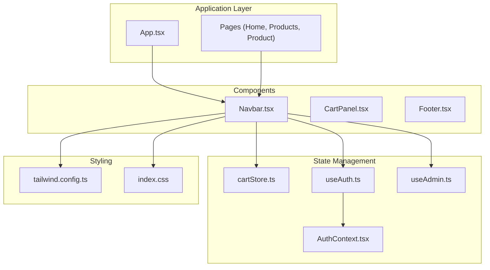
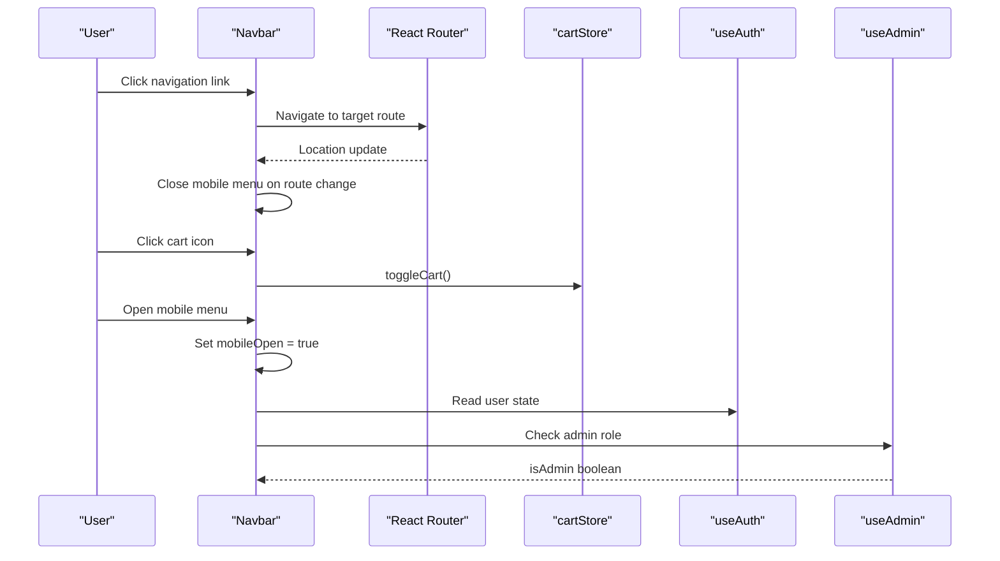
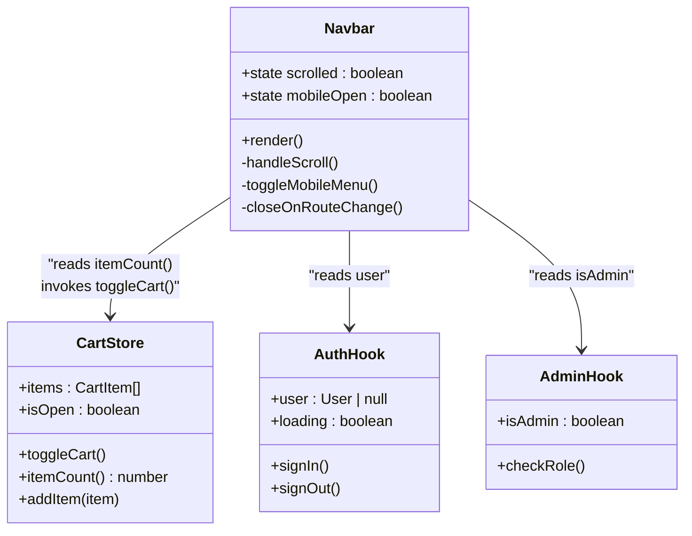
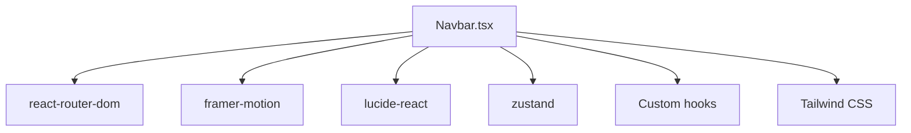

# Navbar Component

<cite>
**Referenced Files in This Document**
- [Navbar.tsx](file://autocure/src/components/Navbar.tsx)
- [cartStore.ts](file://autocure/src/stores/cartStore.ts)
- [useAuth.ts](file://autocure/src/hooks/useAuth.ts)
- [useAdmin.ts](file://autocure/src/hooks/useAdmin.ts)
- [AuthContext.tsx](file://autocure/src/contexts/AuthContext.tsx)
- [App.tsx](file://autocure/src/App.tsx)
- [Home.tsx](file://autocure/src/pages/Home.tsx)
- [ProductsPage.tsx](file://autocure/src/pages/ProductsPage.tsx)
- [ProductPage.tsx](file://autocure/src/pages/ProductPage.tsx)
- [ScrollToTop.tsx](file://autocure/src/components/ScrollToTop.tsx)
- [tailwind.config.ts](file://autocure/tailwind.config.ts)
- [index.css](file://autocure/src/index.css)
</cite>

## Table of Contents
1. [Introduction](#introduction)
2. [Project Structure](#project-structure)
3. [Core Components](#core-components)
4. [Architecture Overview](#architecture-overview)
5. [Detailed Component Analysis](#detailed-component-analysis)
6. [Dependency Analysis](#dependency-analysis)
7. [Performance Considerations](#performance-considerations)
8. [Troubleshooting Guide](#troubleshooting-guide)
9. [Conclusion](#conclusion)
10. [Appendices](#appendices)

## Introduction
The Navbar component is the primary navigation interface for CarCure2, providing seamless access to site sections, cart functionality, user authentication, and responsive mobile navigation. It integrates with React Router for route handling, Zustand for cart state, and custom hooks for authentication and admin checks. The component emphasizes modern UI/UX with glass morphism styling, smooth animations, and accessibility features.

## Project Structure
The Navbar is part of the components layer and integrates with pages, stores, and contexts across the application. It relies on Tailwind CSS for styling and Framer Motion for animations.

**Diagram sources**
- [App.tsx](file://autocure/src/App.tsx#L21-L44)
- [Navbar.tsx](file://autocure/src/components/Navbar.tsx#L15-L216)
- [cartStore.ts](file://autocure/src/stores/cartStore.ts#L1-L36)
- [useAuth.ts](file://autocure/src/hooks/useAuth.ts#L17-L42)
- [useAdmin.ts](file://autocure/src/hooks/useAdmin.ts#L4-L24)
- [AuthContext.tsx](file://autocure/src/contexts/AuthContext.tsx#L20-L36)
- [tailwind.config.ts](file://autocure/tailwind.config.ts#L3-L91)
- [index.css](file://autocure/src/index.css#L1-L146)

**Section sources**
- [App.tsx](file://autocure/src/App.tsx#L1-L47)
- [Navbar.tsx](file://autocure/src/components/Navbar.tsx#L1-L216)

## Core Components
The Navbar component orchestrates navigation, cart integration, authentication state, and responsive behavior. It exposes no props and manages its own internal state for scroll effects and mobile menu visibility.

Key responsibilities:
- Navigation links for desktop and mobile
- Cart badge display synchronized with cartStore
- Authentication-based UI segments (profile, wishlist, admin)
- Responsive mobile menu with animated transitions
- Accessibility attributes for screen readers
- Scroll-aware styling for glass effect

Integration points:
- React Router for navigation and route awareness
- Zustand cartStore for cart toggling and item count
- Custom hooks for authentication and admin checks
- Tailwind CSS for styling and animations

**Section sources**
- [Navbar.tsx](file://autocure/src/components/Navbar.tsx#L9-L13)
- [Navbar.tsx](file://autocure/src/components/Navbar.tsx#L15-L38)
- [cartStore.ts](file://autocure/src/stores/cartStore.ts#L11-L17)
- [useAuth.ts](file://autocure/src/hooks/useAuth.ts#L9-L15)
- [useAdmin.ts](file://autocure/src/hooks/useAdmin.ts#L4-L24)

## Architecture Overview
The Navbar participates in a unidirectional data flow: state updates bubble up from stores and hooks, while UI reacts to location changes and user interactions.

**Diagram sources**
- [Navbar.tsx](file://autocure/src/components/Navbar.tsx#L18-L38)
- [Navbar.tsx](file://autocure/src/components/Navbar.tsx#L75-L90)
- [Navbar.tsx](file://autocure/src/components/Navbar.tsx#L134-L144)
- [cartStore.ts](file://autocure/src/stores/cartStore.ts#L22-L23)
- [useAuth.ts](file://autocure/src/hooks/useAuth.ts#L35-L41)
- [useAdmin.ts](file://autocure/src/hooks/useAdmin.ts#L4-L24)

## Detailed Component Analysis

### Props Interface and Event Handlers
Props interface:
- None. The Navbar is self-contained and does not accept external props.

Event handlers:
- Cart toggle: Invokes cartStore.toggleCart() to open/close cart panel.
- Mobile menu toggle: Toggles internal mobileOpen state.
- Route change: Automatically closes mobile menu when location changes.

Navigation actions:
- Uses React Router Link components for internal navigation.
- Integrates with ScrollToTop to reset scroll position on route changes.

**Section sources**
- [Navbar.tsx](file://autocure/src/components/Navbar.tsx#L15-L216)
- [ScrollToTop.tsx](file://autocure/src/components/ScrollToTop.tsx#L4-L12)

### State Synchronization with AuthContext and cartStore
Authentication state:
- Reads user from useAuth hook to conditionally render profile, wishlist, and admin links.
- Uses AuthContext provider in App.tsx to supply authentication state to the Navbar.

Admin state:
- useAdmin hook derives admin status from user role and updates accordingly.

Cart state:
- cartStore maintains items, isOpen flag, and itemCount calculation.
- Navbar displays cartCount and triggers toggleCart for UI interaction.

**Diagram sources**
- [Navbar.tsx](file://autocure/src/components/Navbar.tsx#L15-L38)
- [cartStore.ts](file://autocure/src/stores/cartStore.ts#L11-L35)
- [useAuth.ts](file://autocure/src/hooks/useAuth.ts#L9-L41)
- [useAdmin.ts](file://autocure/src/hooks/useAdmin.ts#L4-L24)

**Section sources**
- [Navbar.tsx](file://autocure/src/components/Navbar.tsx#L20-L24)
- [cartStore.ts](file://autocure/src/stores/cartStore.ts#L19-L35)
- [useAuth.ts](file://autocure/src/hooks/useAuth.ts#L17-L42)
- [useAdmin.ts](file://autocure/src/hooks/useAdmin.ts#L4-L24)

### Responsive Design Implementation
Desktop navigation:
- Hidden on mobile screens using responsive utilities.
- Links styled with hover transitions and uppercase typography.

Mobile navigation:
- Collapsible drawer using Framer Motion animations.
- Closes automatically on route changes.
- Conditional rendering based on authentication and admin roles.

Cart badge:
- Animated scaling entrance for new items.
- Positioned absolutely relative to cart icon.

Accessibility:
- Proper aria-labels for interactive elements.
- Semantic HTML structure with Link components.

**Section sources**
- [Navbar.tsx](file://autocure/src/components/Navbar.tsx#L59-L70)
- [Navbar.tsx](file://autocure/src/components/Navbar.tsx#L133-L144)
- [Navbar.tsx](file://autocure/src/components/Navbar.tsx#L150-L212)
- [Navbar.tsx](file://autocure/src/components/Navbar.tsx#L81-L89)

### Styling and Branding
Tailwind configuration:
- Custom color tokens for neon accents and glass surfaces.
- Font families for display and body text.
- Animation utilities for glow and floating effects.

Global CSS:
- CSS variables define theme tokens.
- Layered utilities for glass cards and neon text effects.

Customization options:
- Modify color tokens in CSS variables to change brand identity.
- Adjust font families and keyframe animations in Tailwind config.
- Override utility classes for layout adjustments.

**Section sources**
- [tailwind.config.ts](file://autocure/tailwind.config.ts#L9-L91)
- [index.css](file://autocure/src/index.css#L5-L51)
- [index.css](file://autocure/src/index.css#L53-L146)

### Usage Examples and Composition Patterns
Typical usage:
- Imported into page components (Home, ProductsPage, ProductPage) to wrap page content.
- Integrated with CartPanel for cart functionality.

Composition patterns:
- Navbar composes Link components for navigation.
- Uses conditional rendering based on authentication state.
- Leverages motion components for smooth transitions.

Extensibility:
- Add new navigation items by updating navLinks array.
- Extend authentication segments by adding new conditional blocks.
- Customize styling by modifying Tailwind utilities applied to elements.

**Section sources**
- [Home.tsx](file://autocure/src/pages/Home.tsx#L7-L17)
- [ProductsPage.tsx](file://autocure/src/pages/ProductsPage.tsx#L20-L82)
- [ProductPage.tsx](file://autocure/src/pages/ProductPage.tsx#L38-L118)
- [Navbar.tsx](file://autocure/src/components/Navbar.tsx#L9-L13)

### Accessibility Features
- ARIA labels on interactive elements (cart, menu, profile).
- Semantic navigation structure using Link components.
- Focus-friendly button styles with hover states.
- Screen reader-friendly labels for icons.

Best practices:
- Maintain ARIA labels when changing iconography.
- Ensure sufficient color contrast for text and backgrounds.
- Test keyboard navigation and focus management.

**Section sources**
- [Navbar.tsx](file://autocure/src/components/Navbar.tsx#L78-L79)
- [Navbar.tsx](file://autocure/src/components/Navbar.tsx#L137-L138)
- [Navbar.tsx](file://autocure/src/components/Navbar.tsx#L118-L121)
- [Navbar.tsx](file://autocure/src/components/Navbar.tsx#L203-L207)

## Dependency Analysis
The Navbar depends on several external libraries and internal modules for its functionality.

**Diagram sources**
- [Navbar.tsx](file://autocure/src/components/Navbar.tsx#L1-L8)
- [cartStore.ts](file://autocure/src/stores/cartStore.ts#L1)
- [useAuth.ts](file://autocure/src/hooks/useAuth.ts#L1-L2)
- [useAdmin.ts](file://autocure/src/hooks/useAdmin.ts#L1-L2)

**Section sources**
- [Navbar.tsx](file://autocure/src/components/Navbar.tsx#L1-L8)
- [cartStore.ts](file://autocure/src/stores/cartStore.ts#L1)
- [useAuth.ts](file://autocure/src/hooks/useAuth.ts#L1-L2)
- [useAdmin.ts](file://autocure/src/hooks/useAdmin.ts#L1-L2)

## Performance Considerations
- Passive scroll listener: Uses passive: true to avoid layout thrashing during scroll events.
- Memoized cart count: cartStore.itemCount() reduces re-renders by computing total efficiently.
- Conditional rendering: Hides admin and wishlist sections when not applicable to minimize DOM.
- Animations: Framer Motion animations are optimized with initial/exit states and controlled transitions.
- Lazy loading: Consider lazy-loading heavy icons or panels if bundle size becomes a concern.

Optimization opportunities:
- Debounce scroll handler if additional logic is added.
- Extract static navLinks to a constant outside component scope.
- Use React.memo for child components if performance bottlenecks are identified.

**Section sources**
- [Navbar.tsx](file://autocure/src/components/Navbar.tsx#L26-L33)
- [cartStore.ts](file://autocure/src/stores/cartStore.ts#L23-L23)

## Troubleshooting Guide
Common issues and resolutions:
- Cart badge not updating: Verify cartStore.addItem() is called and itemCount() reflects changes.
- Mobile menu not closing on navigation: Ensure useLocation is imported and pathname effect is active.
- Authentication state not reflected: Confirm AuthProvider wraps the application and useAuth returns expected user object.
- Admin link visibility: Check useAdmin hook logic and user role assignment.

Debugging tips:
- Add console logs in useEffect hooks for scroll and route changes.
- Temporarily hardcode user/admin state to test conditional rendering.
- Inspect Tailwind-generated classes for styling inconsistencies.

**Section sources**
- [Navbar.tsx](file://autocure/src/components/Navbar.tsx#L35-L38)
- [App.tsx](file://autocure/src/App.tsx#L24-L42)
- [useAuth.ts](file://autocure/src/hooks/useAuth.ts#L17-L42)
- [useAdmin.ts](file://autocure/src/hooks/useAdmin.ts#L4-L24)

## Conclusion
The Navbar component exemplifies clean separation of concerns by delegating state management to dedicated hooks and stores while maintaining a focused UI layer. Its responsive design, accessibility features, and performance-conscious implementation make it a robust foundation for CarCure2's navigation needs. Extending functionality involves minimal changes to navigation links, conditional segments, and styling utilities.

## Appendices

### Best Practices for Extending Navbar Functionality
- Keep navLinks centralized for easy maintenance.
- Use conditional rendering sparingly to avoid excessive re-renders.
- Add aria-labels for any new interactive elements.
- Leverage Tailwind utilities consistently for branding coherence.
- Test responsive behavior across various viewport sizes.

### Component Composition Checklist
- Navigation: Ensure all routes are covered and accessible.
- Cart: Verify cartStore integration and badge accuracy.
- Authentication: Confirm conditional segments align with user state.
- Mobile: Test menu toggle and automatic closure on navigation.
- Accessibility: Validate ARIA labels and keyboard navigation.