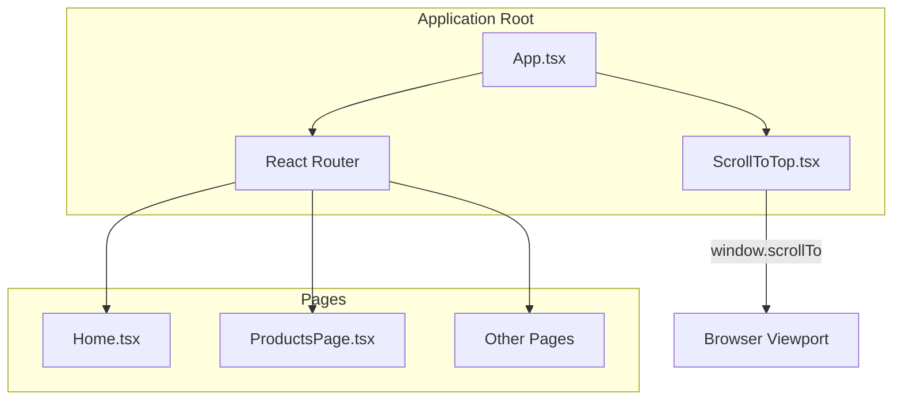
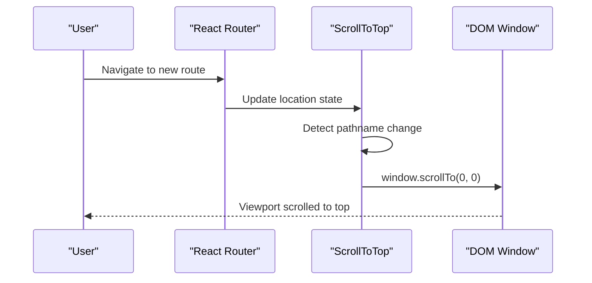
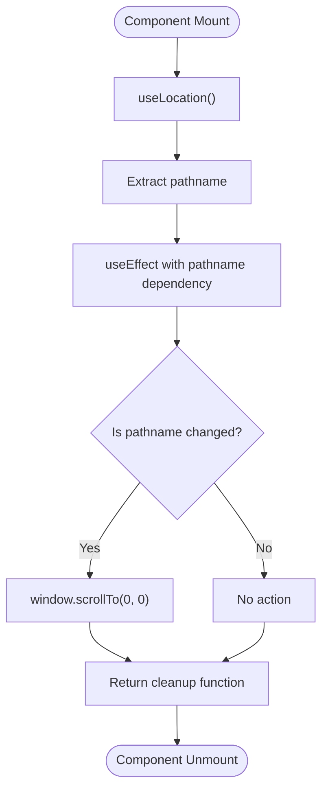
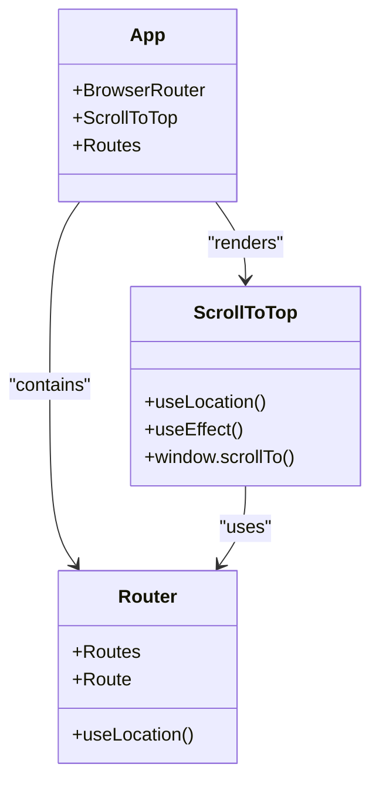
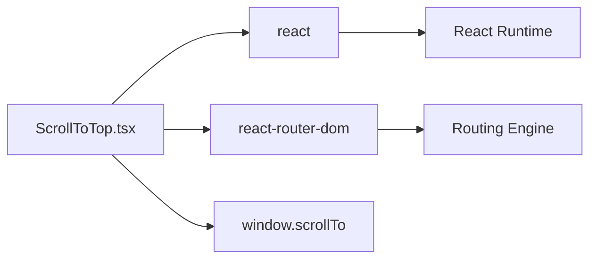

# ScrollToTop Component

<cite>
**Referenced Files in This Document**
- [ScrollToTop.tsx](file://autocure/src/components/ScrollToTop.tsx)
- [App.tsx](file://autocure/src/App.tsx)
- [package.json](file://autocure/package.json)
- [Navbar.tsx](file://autocure/src/components/Navbar.tsx)
- [ProductsPage.tsx](file://autocure/src/pages/ProductsPage.tsx)
</cite>

## Table of Contents
1. [Introduction](#introduction)
2. [Project Structure](#project-structure)
3. [Core Components](#core-components)
4. [Architecture Overview](#architecture-overview)
5. [Detailed Component Analysis](#detailed-component-analysis)
6. [Dependency Analysis](#dependency-analysis)
7. [Performance Considerations](#performance-considerations)
8. [Troubleshooting Guide](#troubleshooting-guide)
9. [Conclusion](#conclusion)
10. [Appendices](#appendices)

## Introduction
This document provides comprehensive documentation for the ScrollToTop component, which ensures users are smoothly returned to the top of the page when navigating between routes. The component integrates with React Router to automatically scroll to the top whenever the URL path changes, enhancing user experience by eliminating the need for manual page resets during navigation.

## Project Structure
The ScrollToTop component is a lightweight utility placed at the application root level to intercept route changes and trigger page resets. It relies on React Router's location hook to detect navigation events and uses the browser's native scroll API to position the viewport at the top of the page.

**Diagram sources**
- [App.tsx](file://autocure/src/App.tsx#L21-L44)
- [ScrollToTop.tsx](file://autocure/src/components/ScrollToTop.tsx#L4-L12)

**Section sources**
- [App.tsx](file://autocure/src/App.tsx#L1-L47)
- [ScrollToTop.tsx](file://autocure/src/components/ScrollToTop.tsx#L1-L13)

## Core Components
The ScrollToTop component consists of a single functional component that:
- Subscribes to route changes using React Router's location hook
- Triggers a scroll-to-top action when the pathname changes
- Executes cleanup to prevent memory leaks

Key characteristics:
- Stateless component with no props interface
- Minimal performance footprint
- Automatic integration with React Router's navigation system
- No external dependencies beyond React and React Router

**Section sources**
- [ScrollToTop.tsx](file://autocure/src/components/ScrollToTop.tsx#L4-L12)

## Architecture Overview
The component participates in the application's routing architecture by being rendered at the root level alongside the router. This positioning ensures that every route change triggers the scroll-to-top behavior consistently across all pages.

**Diagram sources**
- [ScrollToTop.tsx](file://autocure/src/components/ScrollToTop.tsx#L7-L9)
- [App.tsx](file://autocure/src/App.tsx#L25-L26)

**Section sources**
- [App.tsx](file://autocure/src/App.tsx#L21-L44)
- [ScrollToTop.tsx](file://autocure/src/components/ScrollToTop.tsx#L4-L12)

## Detailed Component Analysis

### Component Implementation
The ScrollToTop component implements a minimal yet effective solution for page navigation:

**Diagram sources**
- [ScrollToTop.tsx](file://autocure/src/components/ScrollToTop.tsx#L5-L9)

### Integration Pattern
The component integrates seamlessly with the application's routing system through a straightforward pattern:

**Diagram sources**
- [App.tsx](file://autocure/src/App.tsx#L25-L26)
- [ScrollToTop.tsx](file://autocure/src/components/ScrollToTop.tsx#L5-L9)

**Section sources**
- [ScrollToTop.tsx](file://autocure/src/components/ScrollToTop.tsx#L4-L12)
- [App.tsx](file://autocure/src/App.tsx#L25-L26)

### Usage Examples
The component requires no explicit configuration or props. Its behavior is determined entirely by the routing system:

Example 1: Basic integration
- Place the component as a child of the router
- No additional configuration needed
- Works automatically across all routes

Example 2: Page transition coordination
- Combine with page animations for seamless navigation
- The component resets scroll position before page transitions begin

Example 3: Cross-device compatibility
- Functions identically across desktop, tablet, and mobile devices
- Uses native browser APIs for optimal performance

**Section sources**
- [App.tsx](file://autocure/src/App.tsx#L25-L26)
- [ScrollToTop.tsx](file://autocure/src/components/ScrollToTop.tsx#L4-L12)

## Dependency Analysis
The component maintains minimal dependencies to ensure reliability and performance:

**Diagram sources**
- [ScrollToTop.tsx](file://autocure/src/components/ScrollToTop.tsx#L1-L2)
- [package.json](file://autocure/package.json#L18-L27)

**Section sources**
- [ScrollToTop.tsx](file://autocure/src/components/ScrollToTop.tsx#L1-L2)
- [package.json](file://autocure/package.json#L18-L27)

## Performance Considerations
The component is designed for optimal performance with several built-in optimizations:

### Memory Management
- Automatic cleanup through useEffect return function prevents memory leaks
- Single event listener lifecycle tied to component mount/unmount
- No persistent state or subscriptions beyond the effect

### Rendering Efficiency
- Stateless component with no re-renders triggered by scroll events
- Minimal computational overhead during route changes
- Native browser API usage for efficient scrolling

### Browser Compatibility
- Uses standard window.scrollTo API for broad compatibility
- No polyfills required for modern browsers
- Graceful degradation on older browsers

### Performance Best Practices
- Dependency array ensures scroll runs only on pathname changes
- No unnecessary re-computations or state updates
- Lightweight implementation suitable for frequent route changes

**Section sources**
- [ScrollToTop.tsx](file://autocure/src/components/ScrollToTop.tsx#L7-L9)

## Troubleshooting Guide
Common issues and solutions for the ScrollToTop component:

### Issue: Component not scrolling to top
**Symptoms**: Page remains scrolled after navigation
**Causes**: 
- Component not rendered at router level
- Custom router configuration interfering with location hook
- CSS overflow properties affecting scroll behavior

**Solutions**:
- Verify component placement inside BrowserRouter
- Check for custom router wrappers that might block location updates
- Review CSS overflow properties on body/html elements

### Issue: Scroll conflicts with page animations
**Symptoms**: Jittery or conflicting animations during navigation
**Causes**: 
- Simultaneous scroll and page transition animations
- CSS transforms affecting scroll positioning

**Solutions**:
- Coordinate scroll timing with page transition animations
- Use CSS transforms carefully around scrollable areas
- Consider delaying page animations until after scroll completes

### Issue: Performance impact during rapid navigation
**Symptoms**: Slow response during quick route changes
**Causes**: 
- Excessive scroll operations during rapid navigation
- Heavy page content blocking scroll execution

**Solutions**:
- Limit scroll operations to essential route changes
- Optimize page content loading during navigation
- Consider debouncing scroll operations if needed

**Section sources**
- [ScrollToTop.tsx](file://autocure/src/components/ScrollToTop.tsx#L7-L9)
- [App.tsx](file://autocure/src/App.tsx#L25-L26)

## Conclusion
The ScrollToTop component provides a robust, minimal solution for maintaining consistent user experience during navigation. Its design prioritizes simplicity, performance, and reliability while integrating seamlessly with React Router's navigation system. The component serves as an excellent foundation for building smooth, user-friendly applications without introducing unnecessary complexity or performance overhead.

## Appendices

### Accessibility Considerations
While the component itself is invisible to users, it contributes to accessibility by:
- Ensuring predictable page positioning after navigation
- Maintaining consistent scroll behavior across different devices
- Supporting screen readers by preserving logical document structure

### Extension Opportunities
Future enhancements could include:
- Configurable scroll timing and easing
- Conditional scroll behavior based on navigation direction
- Integration with scroll position preservation for specific use cases

### Related Components
The component works in conjunction with other UI elements:
- Navbar components that may need to adjust for scroll position
- Page content that benefits from consistent scroll positioning
- Animation systems that coordinate with navigation transitions

**Section sources**
- [Navbar.tsx](file://autocure/src/components/Navbar.tsx#L26-L33)
- [ProductsPage.tsx](file://autocure/src/pages/ProductsPage.tsx#L79-L224)