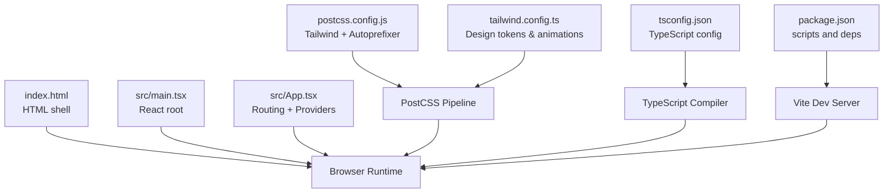
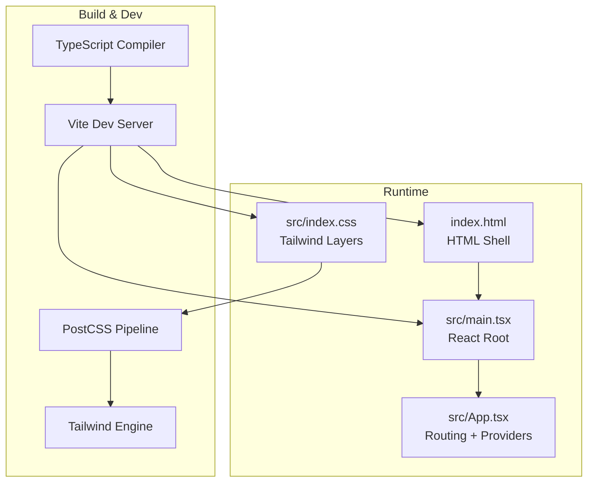
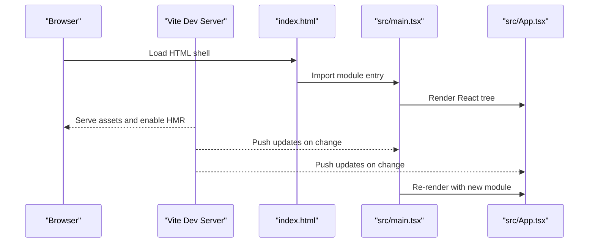
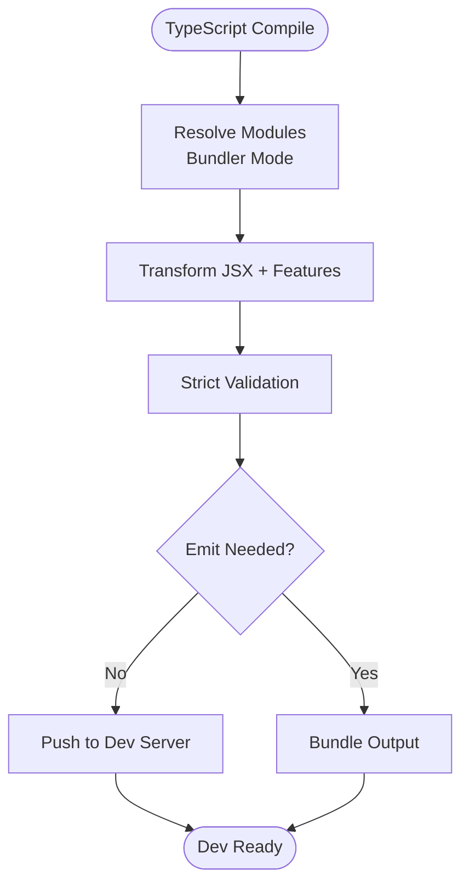
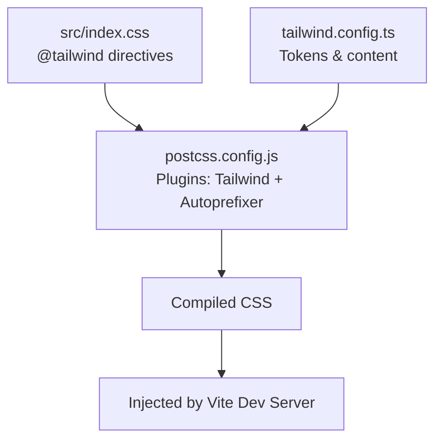
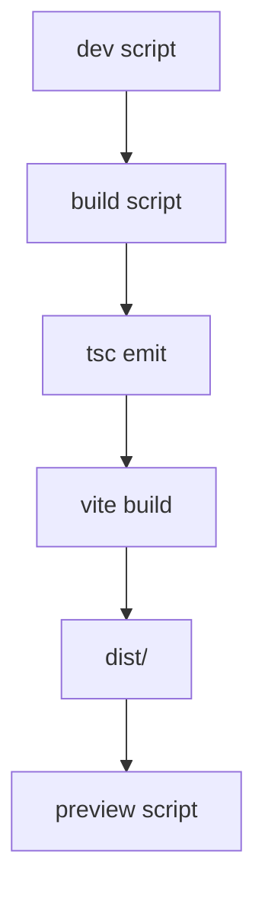
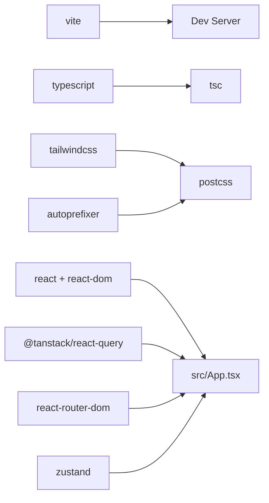

# Development Workflow

<cite>
**Referenced Files in This Document**
- [package.json](file://autocure/package.json)
- [tsconfig.json](file://autocure/tsconfig.json)
- [postcss.config.js](file://autocure/postcss.config.js)
- [tailwind.config.ts](file://autocure/tailwind.config.ts)
- [index.html](file://autocure/index.html)
- [src/main.tsx](file://autocure/src/main.tsx)
- [src/App.tsx](file://autocure/src/App.tsx)
- [src/index.css](file://autocure/src/index.css)
- [.gitignore](file://autocure/.gitignore)
</cite>

## Table of Contents
1. [Introduction](#introduction)
2. [Project Structure](#project-structure)
3. [Core Components](#core-components)
4. [Architecture Overview](#architecture-overview)
5. [Detailed Component Analysis](#detailed-component-analysis)
6. [Dependency Analysis](#dependency-analysis)
7. [Performance Considerations](#performance-considerations)
8. [Troubleshooting Guide](#troubleshooting-guide)
9. [Conclusion](#conclusion)
10. [Appendices](#appendices)

## Introduction
This document explains CarCure2’s development workflow and build process. It covers the Vite-powered development server, TypeScript compilation, PostCSS pipeline with Tailwind CSS, hot module replacement, environment variable management, build optimization, production deployment preparation, code quality tools, pre-commit hooks, performance monitoring, bundle analysis, and continuous integration setup for frontend deployments.

## Project Structure
The project is organized around a modern React + TypeScript stack with Vite for dev/build and Tailwind CSS for styling. Key files and roles:
- package.json defines scripts for development, building, and previewing, and lists dependencies/devDependencies.
- tsconfig.json configures TypeScript for bundler mode with strictness and JSX support.
- postcss.config.js enables Tailwind and Autoprefixer.
- tailwind.config.ts defines design tokens, animations, and content scanning.
- index.html is the static HTML shell loaded by the app.
- src/main.tsx is the React root that mounts the app.
- src/App.tsx composes routing, global providers, and page routes.
- src/index.css imports Tailwind layers and defines design tokens and utilities.

**Diagram sources**
- [package.json](file://autocure/package.json#L1-L30)
- [tsconfig.json](file://autocure/tsconfig.json#L1-L28)
- [postcss.config.js](file://autocure/postcss.config.js#L1-L7)
- [tailwind.config.ts](file://autocure/tailwind.config.ts#L1-L91)
- [index.html](file://autocure/index.html#L1-L33)
- [src/main.tsx](file://autocure/src/main.tsx#L1-L11)
- [src/App.tsx](file://autocure/src/App.tsx#L1-L47)

**Section sources**
- [package.json](file://autocure/package.json#L1-L30)
- [tsconfig.json](file://autocure/tsconfig.json#L1-L28)
- [postcss.config.js](file://autocure/postcss.config.js#L1-L7)
- [tailwind.config.ts](file://autocure/tailwind.config.ts#L1-L91)
- [index.html](file://autocure/index.html#L1-L33)
- [src/main.tsx](file://autocure/src/main.tsx#L1-L11)
- [src/App.tsx](file://autocure/src/App.tsx#L1-L47)
- [src/index.css](file://autocure/src/index.css#L1-L146)
- [.gitignore](file://autocure/.gitignore#L1-L25)

## Core Components
- Vite Development Server
  - Starts the dev server via the script defined in package.json.
  - Serves index.html and handles hot module replacement for fast iteration.
  - Uses TypeScript and JSX resolution configured in tsconfig.json.
- TypeScript Compilation
  - Bundler-mode TypeScript configuration ensures compatibility with Vite’s module resolution.
  - Strict compiler options enforce code quality during development.
- PostCSS and Tailwind CSS
  - Tailwind layers are imported in src/index.css.
  - Tailwind scans configured content paths and generates utility classes.
  - Autoprefixer adds vendor prefixes automatically.
- Build and Preview
  - The build script runs TypeScript emit followed by Vite build to produce optimized assets.
  - Preview serves the production build locally for verification.

**Section sources**
- [package.json](file://autocure/package.json#L6-L10)
- [tsconfig.json](file://autocure/tsconfig.json#L10-L25)
- [postcss.config.js](file://autocure/postcss.config.js#L1-L7)
- [tailwind.config.ts](file://autocure/tailwind.config.ts#L5-L8)
- [src/index.css](file://autocure/src/index.css#L1-L3)
- [index.html](file://autocure/index.html#L28-L32)

## Architecture Overview
The runtime architecture ties together the HTML shell, React application, routing, global providers, and CSS pipeline.

**Diagram sources**
- [index.html](file://autocure/index.html#L1-L33)
- [src/main.tsx](file://autocure/src/main.tsx#L1-L11)
- [src/App.tsx](file://autocure/src/App.tsx#L1-L47)
- [src/index.css](file://autocure/src/index.css#L1-L146)
- [postcss.config.js](file://autocure/postcss.config.js#L1-L7)
- [tailwind.config.ts](file://autocure/tailwind.config.ts#L1-L91)
- [package.json](file://autocure/package.json#L6-L10)

## Detailed Component Analysis

### Vite Development Server and Hot Module Replacement
- Entry points
  - index.html provides the DOM shell and loads the module entry.
  - src/main.tsx mounts the React root and StrictMode wrapper.
- Hot Module Replacement (HMR)
  - Vite injects HMR runtime to update modules without full reloads.
  - Changes to components, styles, and routing propagate quickly in the browser.
- Development server configuration
  - No explicit vite.config.ts indicates defaults are acceptable for this project.
  - The dev script starts the server with default behavior.

**Diagram sources**
- [index.html](file://autocure/index.html#L28-L32)
- [src/main.tsx](file://autocure/src/main.tsx#L1-L11)
- [src/App.tsx](file://autocure/src/App.tsx#L1-L47)
- [package.json](file://autocure/package.json#L7-L7)

**Section sources**
- [index.html](file://autocure/index.html#L1-L33)
- [src/main.tsx](file://autocure/src/main.tsx#L1-L11)
- [src/App.tsx](file://autocure/src/App.tsx#L1-L47)
- [package.json](file://autocure/package.json#L6-L10)

### TypeScript Compilation Settings
- Target and modules
  - ES2022 target and ESNext module align with modern browsers and Vite bundler mode.
- Resolution and emit
  - Bundler mode with verbatim module syntax and noEmit enable Vite to handle transpilation and bundling.
- JSX and strictness
  - React JSX factory and strict compiler options improve correctness and developer feedback.
- Type checking
  - Skip library checks and strict linting options balance speed and safety during dev.

**Diagram sources**
- [tsconfig.json](file://autocure/tsconfig.json#L3-L16)
- [package.json](file://autocure/package.json#L7-L10)

**Section sources**
- [tsconfig.json](file://autocure/tsconfig.json#L1-L28)
- [package.json](file://autocure/package.json#L6-L10)

### PostCSS Pipeline with Tailwind CSS Integration
- Tailwind layers
  - Base, components, and utilities are imported in src/index.css.
- Design tokens and animations
  - tailwind.config.ts defines color palettes, typography, border radius, keyframes, and animations.
- Content scanning
  - Tailwind scans index.html and src templates to purge unused CSS.
- Autoprefixer
  - Adds vendor-prefixed properties for broader browser support.

**Diagram sources**
- [src/index.css](file://autocure/src/index.css#L1-L3)
- [postcss.config.js](file://autocure/postcss.config.js#L1-L7)
- [tailwind.config.ts](file://autocure/tailwind.config.ts#L5-L8)

**Section sources**
- [src/index.css](file://autocure/src/index.css#L1-L146)
- [postcss.config.js](file://autocure/postcss.config.js#L1-L7)
- [tailwind.config.ts](file://autocure/tailwind.config.ts#L1-L91)

### Build Process and Production Deployment Preparation
- Build command
  - The build script runs TypeScript emit and then Vite build to produce optimized assets.
- Output artifacts
  - Vite emits to a dist directory by default; ensure .gitignore excludes node_modules and dist.
- Preview
  - The preview script serves the production build locally for validation.

**Diagram sources**
- [package.json](file://autocure/package.json#L7-L10)
- [.gitignore](file://autocure/.gitignore#L10-L12)

**Section sources**
- [package.json](file://autocure/package.json#L6-L10)
- [.gitignore](file://autocure/.gitignore#L1-L25)

### Environment Variable Management
- Vite environment variables
  - Vite exposes environment variables prefixed with VITE_ to the browser.
  - Define variables in .env files at project root for different environments (development, preview, production).
- Best practices
  - Keep secrets out of the repository; use CI/CD to inject environment variables during builds.
  - Document required variables in a .env.example file for contributors.

[No sources needed since this section provides general guidance]

### Debugging Strategies
- Console and React DevTools
  - Use browser console and React DevTools to inspect component props and state.
- Vite Dev Server logs
  - Observe HMR updates and asset rebuilds in the terminal running the dev server.
- TypeScript diagnostics
  - Rely on strict TypeScript settings to surface errors early in development.
- CSS inspection
  - Inspect generated Tailwind utilities and custom design tokens in the browser.

[No sources needed since this section provides general guidance]

### Code Quality Tools and Pre-commit Hooks
- Linting and formatting
  - Integrate ESLint and Prettier to enforce style and catch potential issues.
  - Configure ESLint with React and TypeScript plugins.
- Pre-commit hooks
  - Use Husky and lint-staged to run linters and formatters before commits.
  - Prevent committing code that fails quality checks.

[No sources needed since this section provides general guidance]

### Performance Monitoring, Bundle Analysis, and CI Setup
- Performance monitoring
  - Use browser devtools to profile rendering and network requests.
  - Monitor bundle sizes and identify heavy dependencies.
- Bundle analysis
  - Use rollup-plugin-visualizer or similar to generate bundle reports after builds.
- Continuous integration
  - Configure GitHub Actions or equivalent to run tests, linting, and build previews on pull requests.
  - Deploy the preview build to a staging environment for review.

[No sources needed since this section provides general guidance]

## Dependency Analysis
The project’s build and runtime dependencies are declared in package.json. The development server relies on Vite, while Tailwind and Autoprefixer handle CSS. TypeScript compiles TS/TSX sources, and React renders the UI.

**Diagram sources**
- [package.json](file://autocure/package.json#L11-L28)
- [postcss.config.js](file://autocure/postcss.config.js#L1-L7)
- [tailwind.config.ts](file://autocure/tailwind.config.ts#L1-L91)
- [src/App.tsx](file://autocure/src/App.tsx#L1-L47)

**Section sources**
- [package.json](file://autocure/package.json#L1-L30)

## Performance Considerations
- Optimize Tailwind usage
  - Keep the content globs minimal to reduce CSS generation overhead.
  - Prefer utility-first patterns to avoid bloated CSS.
- Tree shaking and bundling
  - Use Vite’s native tree shaking; avoid importing entire libraries when only specific exports are needed.
- Asset optimization
  - Compress images and fonts; leverage lazy loading for non-critical resources.
- Network and rendering
  - Minimize re-renders with React.memo and memoized selectors.
  - Defer non-critical features until after initial load.

[No sources needed since this section provides general guidance]

## Troubleshooting Guide
- Dev server not starting
  - Verify port availability and correct installation of dependencies.
- HMR not working
  - Ensure module boundaries are correct and avoid top-level throws in modules.
- Tailwind utilities missing
  - Confirm content paths include current templates and that Tailwind is processing CSS.
- Build failures
  - Check TypeScript diagnostics and resolve strict mode errors before building.

[No sources needed since this section provides general guidance]

## Conclusion
CarCure2 leverages Vite for a fast development experience, TypeScript for robustness, and Tailwind CSS for efficient styling. The build process is streamlined with a single build command, and the PostCSS pipeline integrates Tailwind and Autoprefixer seamlessly. By adopting code quality tools, pre-commit hooks, performance monitoring, and CI/CD practices, the team can maintain a reliable and scalable frontend workflow.

## Appendices
- Quick commands
  - Development: run the dev script defined in package.json.
  - Build: run the build script to produce optimized assets.
  - Preview: serve the production build locally.
- Recommended additions
  - Add ESLint and Prettier configurations.
  - Set up Husky and lint-staged for pre-commit enforcement.
  - Add a CI workflow to test, lint, build, and deploy previews.

[No sources needed since this section provides general guidance]