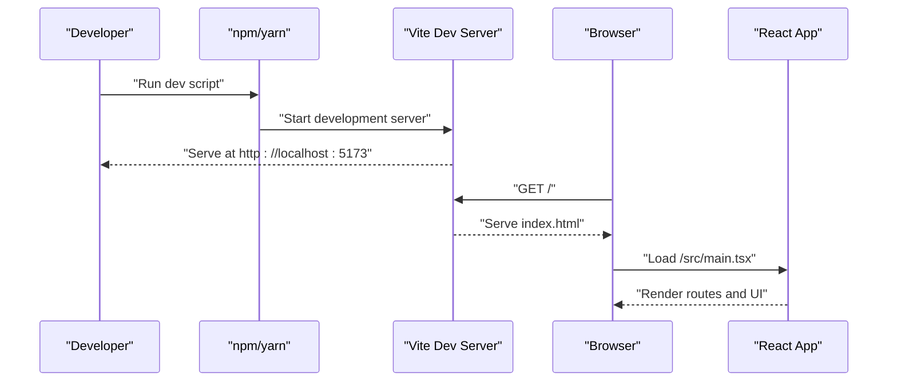

# Getting Started

<cite>
**Referenced Files in This Document**
- [package.json](file://autocure/package.json)
- [tsconfig.json](file://autocure/tsconfig.json)
- [tailwind.config.ts](file://autocure/tailwind.config.ts)
- [postcss.config.js](file://autocure/postcss.config.js)
- [index.html](file://autocure/index.html)
- [src/main.tsx](file://autocure/src/main.tsx)
- [src/App.tsx](file://autocure/src/App.tsx)
- [src/index.css](file://autocure/src/index.css)
- [src/components/Navbar.tsx](file://autocure/src/components/Navbar.tsx)
- [src/contexts/AuthContext.tsx](file://autocure/src/contexts/AuthContext.tsx)
- [.gitignore](file://autocure/.gitignore)
</cite>

## Table of Contents
1. [Introduction](#introduction)
2. [Prerequisites](#prerequisites)
3. [Installation](#installation)
4. [Development Workflow](#development-workflow)
5. [Build and Preview](#build-and-preview)
6. [System Requirements](#system-requirements)
7. [IDE Recommendations](#ide-recommendations)
8. [Browser Compatibility](#browser-compatibility)
9. [Quick Start Examples](#quick-start-examples)
10. [Troubleshooting Guide](#troubleshooting-guide)
11. [Conclusion](#conclusion)

## Introduction
This guide helps you set up the CarCure2 development environment and run the application locally. It covers prerequisites, installation, development server startup, building for production, and common troubleshooting steps. The project is a React application with TypeScript, styled via Tailwind CSS and PostCSS, bundled with Vite.

## Prerequisites
- Operating system: Windows, macOS, or Linux
- Node.js: Version requirements are determined by the project’s lockfile and dev dependencies. Based on the lockfile, the project requires Node.js version 18 or higher for optimal compatibility with the bundler and toolchain.
- Package manager: npm or yarn. The scripts in the project are configured for npm; yarn can be used if preferred.
- Git: Recommended for cloning the repository and managing local changes.

Notes:
- The project uses modern JavaScript/TypeScript features and relies on ES2022+ APIs as configured in the TypeScript compiler options.
- Tailwind CSS and PostCSS are used for styling; ensure your environment supports the required Node.js version for these tools.

**Section sources**
- [package.json](file://autocure/package.json#L1-L30)
- [tsconfig.json](file://autocure/tsconfig.json#L1-L28)
- [postcss.config.js](file://autocure/postcss.config.js#L1-L7)
- [tailwind.config.ts](file://autocure/tailwind.config.ts#L1-L91)

## Installation
Follow these steps to install and prepare the project:

1. Install Node.js
   - Download and install Node.js version 18 or later from the official website.
   - Verify installation by running:
     - node --version
     - npm --version

2. Clone or place the project folder under autocure in your workspace.

3. Install dependencies
   - Navigate to the autocure directory.
   - Run your package manager to install dependencies:
     - npm install
     - Or with yarn: yarn install

4. Confirm environment configuration
   - The project uses TypeScript, Vite, Tailwind CSS, and PostCSS. These are declared in the dependencies and devDependencies.
   - The TypeScript configuration targets ES2022 and uses bundler module resolution.

5. Optional: Configure your editor
   - Install recommended extensions for TypeScript, Tailwind CSS, and React if using VS Code or similar editors.

**Section sources**
- [package.json](file://autocure/package.json#L1-L30)
- [tsconfig.json](file://autocure/tsconfig.json#L1-L28)
- [tailwind.config.ts](file://autocure/tailwind.config.ts#L1-L91)
- [postcss.config.js](file://autocure/postcss.config.js#L1-L7)
- [.gitignore](file://autocure/.gitignore#L1-L25)

## Development Workflow
Start the development server using Vite:

- Run the development script:
  - npm run dev
  - Or with yarn: yarn dev

- The development server will start and listen on the port indicated by Vite (commonly http://localhost:5173). Open this URL in your browser to view the app.

- The app entry point initializes React and mounts the root component to the DOM. Routing is handled by React Router, and global state/query caching is provided by React Query.

Key files involved in the development workflow:
- HTML shell and root mount: [index.html](file://autocure/index.html#L1-L33), [src/main.tsx](file://autocure/src/main.tsx#L1-L11)
- Application routing and providers: [src/App.tsx](file://autocure/src/App.tsx#L1-L47)
- Styling pipeline: [src/index.css](file://autocure/src/index.css#L1-L146), [tailwind.config.ts](file://autocure/tailwind.config.ts#L1-L91), [postcss.config.js](file://autocure/postcss.config.js#L1-L7)

**Diagram sources**
- [package.json](file://autocure/package.json#L6-L10)
- [index.html](file://autocure/index.html#L28-L32)
- [src/main.tsx](file://autocure/src/main.tsx#L1-L11)
- [src/App.tsx](file://autocure/src/App.tsx#L1-L47)

**Section sources**
- [package.json](file://autocure/package.json#L6-L10)
- [index.html](file://autocure/index.html#L1-L33)
- [src/main.tsx](file://autocure/src/main.tsx#L1-L11)
- [src/App.tsx](file://autocure/src/App.tsx#L1-L47)

## Build and Preview
After development, build the project for production:

- Build command:
  - npm run build
  - Or with yarn: yarn build

- Preview the production build locally:
  - npm run preview
  - Or with yarn: yarn preview

What happens during build:
- TypeScript compiles the source files according to the project’s tsconfig.
- Vite bundles the application assets and generates the dist directory.
- The preview server serves the built assets locally for testing.

Important note:
- The build script runs TypeScript compilation before bundling, ensuring type-safe builds.

**Section sources**
- [package.json](file://autocure/package.json#L6-L10)
- [tsconfig.json](file://autocure/tsconfig.json#L1-L28)

## System Requirements
- Minimum Node.js version: 18 (recommended by the toolchain and lockfile).
- Supported operating systems: Windows, macOS, Linux.
- Disk space: Sufficient for installing dependencies and building the project.
- Memory: At least 4 GB RAM recommended for smooth development and builds.

[No sources needed since this section provides general guidance]

## IDE Recommendations
Recommended IDE/editor setups for working on this project:
- VS Code:
  - Extensions: Prettier, ESLint, Tailwind CSS IntelliSense, React Developer Tools.
  - Settings: Enable format on save and TypeScript validation.
- WebStorm or IntelliJ IDEA:
  - Enable TypeScript and React support.
  - Configure Tailwind CSS plugin for IntelliSense.
- Sublime Text or Atom:
  - Install TypeScript and Tailwind CSS packages/plugins.

[No sources needed since this section provides general guidance]

## Browser Compatibility
- The project targets modern browsers compatible with ES2022 and React 19.
- Tailwind CSS utilities and CSS variables are widely supported in current browsers.
- For older browsers, consider adding polyfills or adjusting the target accordingly in the TypeScript configuration.

[No sources needed since this section provides general guidance]

## Quick Start Examples
- Start the development server:
  - npm run dev
  - Visit http://localhost:5173 in your browser.
- View the home page:
  - The root route renders the Home page with navigation and footer components.
- Access authentication pages:
  - Navigate to the Auth route to see the authentication placeholder.
- Verify routing:
  - Switch between routes to confirm React Router navigation works.

Example routes present in the application:
- Home: "/"
- Products: "/products"
- Product Detail: "/product/:id"
- Checkout: "/checkout"
- Auth: "/auth"
- About: "/about"
- Contact: "/contact"
- Profile: "/profile"
- Admin: "/admin"
- Wishlist: "/wishlist"
- Fallback: "*"

**Section sources**
- [src/App.tsx](file://autocure/src/App.tsx#L27-L39)
- [src/pages/Home.tsx](file://autocure/src/pages/Home.tsx#L1-L17)
- [src/pages/Auth.tsx](file://autocure/src/pages/Auth.tsx#L1-L17)

## Troubleshooting Guide
Common setup and runtime issues:

- Node.js version mismatch
  - Symptom: Errors related to unsupported engine or missing Node features.
  - Fix: Install Node.js 18 or later and retry.

- Port already in use
  - Symptom: Vite fails to start with a port conflict.
  - Fix: Stop the conflicting process or configure Vite to use another port.

- Missing dependencies after clone
  - Symptom: Errors when running dev/build.
  - Fix: Run npm install or yarn install to restore node_modules.

- Tailwind classes not applying
  - Symptom: Styles not appearing as expected.
  - Fix: Ensure Tailwind directives are present in index.css and Tailwind is scanning the correct paths.

- TypeScript errors during build
  - Symptom: Build fails due to type errors.
  - Fix: Review tsconfig compiler options and resolve type issues in the codebase.

- Hot reload not working
  - Symptom: Changes to source files are not reflected immediately.
  - Fix: Restart the dev server; ensure no syntax errors block compilation.

- Authentication context errors
  - Symptom: Error indicating useAuthContext must be used within an AuthProvider.
  - Fix: Wrap components using the auth hook with the AuthProvider.

- Unexpected build artifacts
  - Symptom: dist directory missing or outdated.
  - Fix: Clean previous builds and rerun the build script.

Environment and ignore rules:
- node_modules and dist are ignored by Git.
- IDE-specific files are excluded to keep the repository clean.

**Section sources**
- [package.json](file://autocure/package.json#L1-L30)
- [src/index.css](file://autocure/src/index.css#L1-L3)
- [src/App.tsx](file://autocure/src/App.tsx#L23-L24)
- [src/contexts/AuthContext.tsx](file://autocure/src/contexts/AuthContext.tsx#L30-L36)
- [.gitignore](file://autocure/.gitignore#L10-L13)

## Conclusion
You now have the essentials to set up and run CarCure2 locally. Use the development server for rapid iteration, build for production, and preview the optimized bundle. If you encounter issues, refer to the troubleshooting section and ensure your Node.js version meets the requirements. For styling and routing, rely on the existing Tailwind and React Router configurations.

[No sources needed since this section summarizes without analyzing specific files]