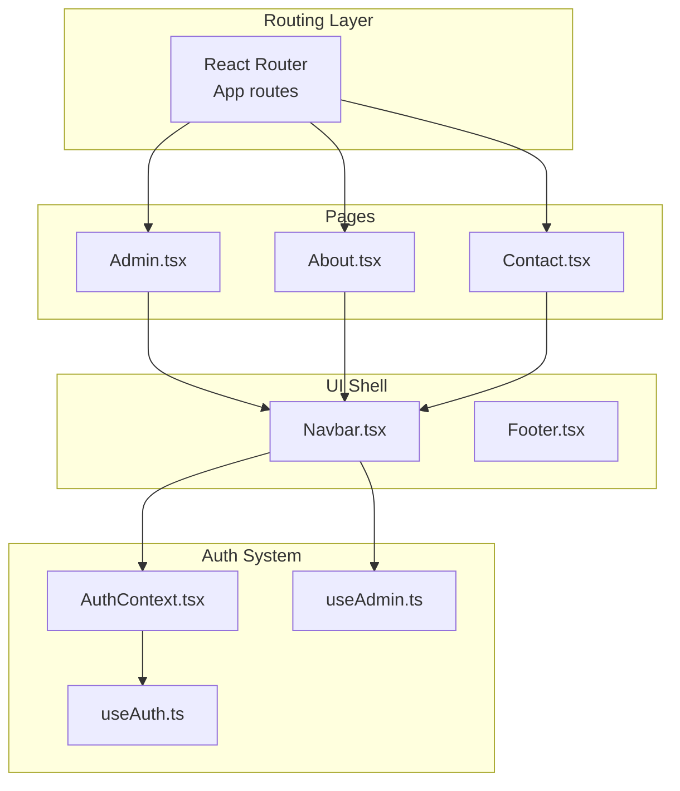
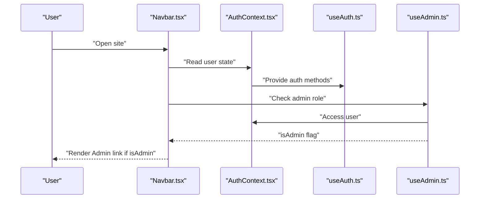
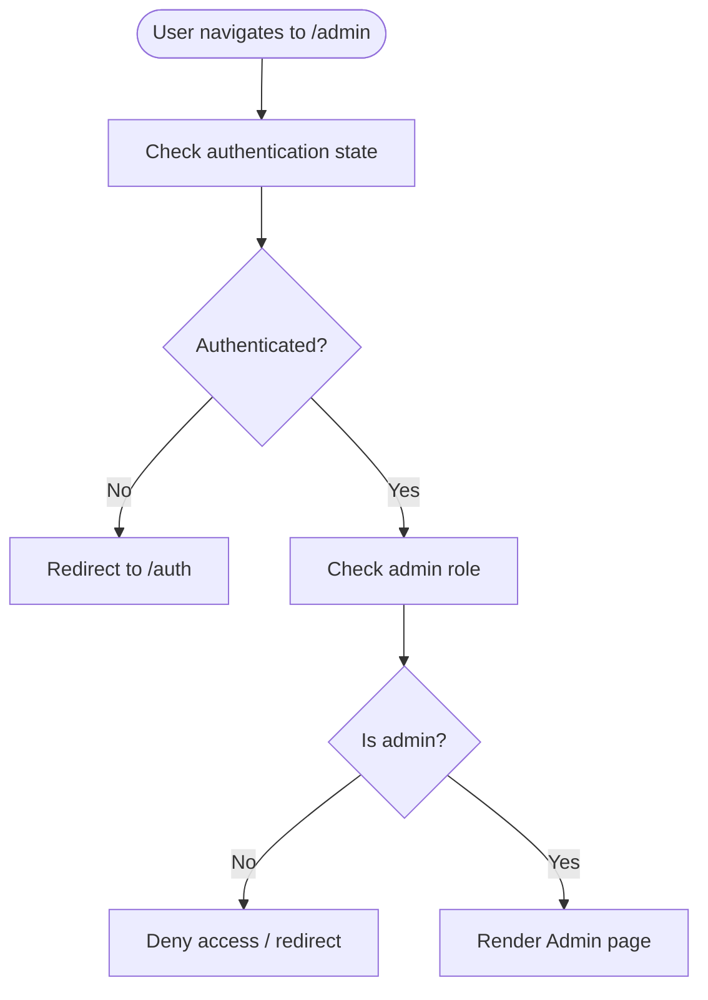
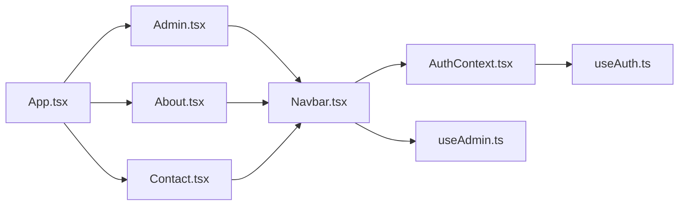

# Administrative Pages

<cite>
**Referenced Files in This Document**
- [Admin.tsx](file://autocure/src/pages/Admin.tsx)
- [About.tsx](file://autocure/src/pages/About.tsx)
- [Contact.tsx](file://autocure/src/pages/Contact.tsx)
- [App.tsx](file://autocure/src/App.tsx)
- [Navbar.tsx](file://autocure/src/components/Navbar.tsx)
- [AuthContext.tsx](file://autocure/src/contexts/AuthContext.tsx)
- [useAuth.ts](file://autocure/src/hooks/useAuth.ts)
- [useAdmin.ts](file://autocure/src/hooks/useAdmin.ts)
- [package.json](file://autocure/package.json)
</cite>

## Table of Contents
1. [Introduction](#introduction)
2. [Project Structure](#project-structure)
3. [Core Components](#core-components)
4. [Architecture Overview](#architecture-overview)
5. [Detailed Component Analysis](#detailed-component-analysis)
6. [Dependency Analysis](#dependency-analysis)
7. [Performance Considerations](#performance-considerations)
8. [Troubleshooting Guide](#troubleshooting-guide)
9. [Conclusion](#conclusion)

## Introduction
This document describes the administrative and informational page components for CarCure2, focusing on the Admin, About, and Contact pages. It explains how the Admin page is structured for future dashboard functionality, how the About and Contact pages present company information and communication details, and how role-based access control is wired for admin-only navigation. It also covers content management patterns, route protection foundations, and integration points with external services.

## Project Structure
The application is a React single-page application using React Router for routing and Framer Motion for animations. Authentication and authorization are implemented via a custom context and hooks. The Admin, About, and Contact pages share a common layout pattern with a shared Navbar and Footer.

**Diagram sources**
- [App.tsx](file://autocure/src/App.tsx#L21-L44)
- [Admin.tsx](file://autocure/src/pages/Admin.tsx#L1-L17)
- [About.tsx](file://autocure/src/pages/About.tsx#L1-L17)
- [Contact.tsx](file://autocure/src/pages/Contact.tsx#L1-L17)
- [Navbar.tsx](file://autocure/src/components/Navbar.tsx#L15-L216)
- [AuthContext.tsx](file://autocure/src/contexts/AuthContext.tsx#L20-L37)
- [useAuth.ts](file://autocure/src/hooks/useAuth.ts#L17-L43)
- [useAdmin.ts](file://autocure/src/hooks/useAdmin.ts#L4-L25)

**Section sources**
- [App.tsx](file://autocure/src/App.tsx#L1-L47)
- [package.json](file://autocure/package.json#L1-L30)

## Core Components
- Admin page: Minimal placeholder layout with shared shell.
- About page: Minimal informational layout with shared shell.
- Contact page: Minimal informational layout with shared shell.
- Navbar: Provides admin-only navigation link and integrates auth/admin hooks.
- AuthContext and hooks: Provide authentication state and admin role checks.

Key implementation patterns:
- Pages render a consistent shell with Navbar and Footer.
- Admin route exists but currently renders a placeholder.
- Admin-only navigation appears conditionally based on admin hook result.
- Authentication hooks provide a foundation for sign-in/sign-out and role checks.

**Section sources**
- [Admin.tsx](file://autocure/src/pages/Admin.tsx#L1-L17)
- [About.tsx](file://autocure/src/pages/About.tsx#L1-L17)
- [Contact.tsx](file://autocure/src/pages/Contact.tsx#L1-L17)
- [Navbar.tsx](file://autocure/src/components/Navbar.tsx#L103-L112)
- [AuthContext.tsx](file://autocure/src/contexts/AuthContext.tsx#L20-L37)
- [useAuth.ts](file://autocure/src/hooks/useAuth.ts#L17-L43)
- [useAdmin.ts](file://autocure/src/hooks/useAdmin.ts#L4-L25)

## Architecture Overview
The Admin, About, and Contact pages are rendered by React Router under a single route configuration. The Navbar conditionally renders an Admin link when the user is identified as an administrator via the useAdmin hook. Authentication state is provided by AuthContext, which wraps the app and exposes user and auth methods.

**Diagram sources**
- [Navbar.tsx](file://autocure/src/components/Navbar.tsx#L21-L22)
- [AuthContext.tsx](file://autocure/src/contexts/AuthContext.tsx#L20-L37)
- [useAuth.ts](file://autocure/src/hooks/useAuth.ts#L17-L43)
- [useAdmin.ts](file://autocure/src/hooks/useAdmin.ts#L4-L25)

## Detailed Component Analysis

### Admin Page
Purpose:
- Serves as the entry point for administrative functionality.
- Currently displays a placeholder centered heading with shared layout.

Current behavior:
- Renders a minimal layout with Navbar and Footer.
- No dashboard widgets, user management, product controls, order tracking, or analytics are implemented yet.

Future enhancements (recommended):
- Replace placeholder with a dashboard grid containing:
  - Analytics cards (sales, traffic, conversion).
  - Recent orders panel with quick actions.
  - User management controls (suspend, roles).
  - Product administration controls (add/edit/delete).
- Integrate with backend APIs for data fetching and mutations.
- Apply admin-only route protection at the routing level.

Role-based access control:
- Admin link visibility is controlled by the useAdmin hook returning false in the current stub implementation.
- To enforce route protection, wrap the Admin route with a guard that redirects unauthenticated or non-admin users.

Content management patterns:
- Use a centralized data fetching library (e.g., React Query) to manage server state.
- Implement CRUD operations for users, products, and orders.
- Use optimistic updates for responsive interactions.

Administrative workflow optimization:
- Batch operations for user/product updates.
- Filtering/sorting/pagination for large datasets.
- Audit logs and activity feeds.

**Section sources**
- [Admin.tsx](file://autocure/src/pages/Admin.tsx#L1-L17)
- [useAdmin.ts](file://autocure/src/hooks/useAdmin.ts#L4-L25)
- [App.tsx](file://autocure/src/App.tsx#L36-L36)

### About Page
Purpose:
- Presents company information, mission, team introductions, and corporate values.

Current behavior:
- Renders a centered heading with shared layout.

Recommended content structure:
- Hero section with mission statement.
- Team member cards with photos and roles.
- Values section with icons and descriptions.
- Timeline or milestones if applicable.

Integration points:
- Static content can be managed via a CMS or markdown files.
- For dynamic content, integrate with a headless CMS or Supabase.

**Section sources**
- [About.tsx](file://autocure/src/pages/About.tsx#L1-L17)

### Contact Page
Purpose:
- Provides contact form, location information, business hours, and customer support integration.

Current behavior:
- Renders a centered heading with shared layout.

Recommended implementation:
- Contact form with validation and submission handling.
- Location map integration (e.g., embedded map).
- Business hours display.
- Customer support links (chat, email, phone).

Integration points:
- Form submissions can be sent to an external service (e.g., email API, CRM).
- Map integration via a mapping provider SDK.
- Support widget integration (e.g., chat SDK).

**Section sources**
- [Contact.tsx](file://autocure/src/pages/Contact.tsx#L1-L17)

### Role-Based Access Control and Navigation
Admin-only navigation:
- The Navbar conditionally renders an Admin link when useAdmin returns true.
- The current stub implementation returns false, so the Admin link is hidden.

Route protection:
- The Admin route is publicly accessible in the current router configuration.
- To protect it, implement a route guard that checks authentication and admin role before rendering the Admin page.

Auth and admin hooks:
- useAuth provides user state and auth methods (signUp, signIn, signOut).
- useAdmin derives admin status from user and can be extended to call backend role checks.

**Diagram sources**
- [App.tsx](file://autocure/src/App.tsx#L36-L36)
- [Navbar.tsx](file://autocure/src/components/Navbar.tsx#L103-L112)
- [useAdmin.ts](file://autocure/src/hooks/useAdmin.ts#L4-L25)
- [useAuth.ts](file://autocure/src/hooks/useAuth.ts#L17-L43)

**Section sources**
- [Navbar.tsx](file://autocure/src/components/Navbar.tsx#L103-L112)
- [useAdmin.ts](file://autocure/src/hooks/useAdmin.ts#L4-L25)
- [useAuth.ts](file://autocure/src/hooks/useAuth.ts#L17-L43)
- [App.tsx](file://autocure/src/App.tsx#L36-L36)

### Content Rendering Patterns
- All three pages follow a consistent layout pattern: Navbar -> Main content -> Footer.
- Main content area uses a centered heading with a large display font and neon styling.
- This pattern ensures brand consistency and easy extension to richer content.

**Section sources**
- [Admin.tsx](file://autocure/src/pages/Admin.tsx#L4-L16)
- [About.tsx](file://autocure/src/pages/About.tsx#L4-L16)
- [Contact.tsx](file://autocure/src/pages/Contact.tsx#L4-L16)

### Integration with External Services
- Authentication stubs: useAuth provides method signatures for signUp, signIn, and signOut, enabling future integration with a backend or Supabase.
- Admin role stub: useAdmin indicates where backend role checks will be integrated (e.g., RPC calls).
- Data fetching: React Query is included in dependencies, suitable for managing server state and caching.

**Section sources**
- [useAuth.ts](file://autocure/src/hooks/useAuth.ts#L17-L43)
- [useAdmin.ts](file://autocure/src/hooks/useAdmin.ts#L14-L18)
- [package.json](file://autocure/package.json#L18-L28)

## Dependency Analysis
The Admin, About, and Contact pages depend on shared UI components and the authentication system. The Navbar consumes auth and admin hooks to decide whether to show admin navigation.

**Diagram sources**
- [Admin.tsx](file://autocure/src/pages/Admin.tsx#L1-L17)
- [About.tsx](file://autocure/src/pages/About.tsx#L1-L17)
- [Contact.tsx](file://autocure/src/pages/Contact.tsx#L1-L17)
- [Navbar.tsx](file://autocure/src/components/Navbar.tsx#L15-L216)
- [AuthContext.tsx](file://autocure/src/contexts/AuthContext.tsx#L20-L37)
- [useAuth.ts](file://autocure/src/hooks/useAuth.ts#L17-L43)
- [useAdmin.ts](file://autocure/src/hooks/useAdmin.ts#L4-L25)
- [App.tsx](file://autocure/src/App.tsx#L21-L44)

**Section sources**
- [App.tsx](file://autocure/src/App.tsx#L1-L47)
- [Navbar.tsx](file://autocure/src/components/Navbar.tsx#L15-L216)
- [AuthContext.tsx](file://autocure/src/contexts/AuthContext.tsx#L20-L37)
- [useAuth.ts](file://autocure/src/hooks/useAuth.ts#L17-L43)
- [useAdmin.ts](file://autocure/src/hooks/useAdmin.ts#L4-L25)

## Performance Considerations
- Keep page components lightweight; defer heavy computations to hooks or services.
- Use React.lazy and Suspense for optional admin features if the bundle grows.
- Optimize re-renders by memoizing derived data and avoiding unnecessary prop drilling.
- Use React Query’s built-in caching and invalidation to minimize network requests.

## Troubleshooting Guide
Common issues and resolutions:
- Admin link not visible:
  - Ensure useAdmin resolves to true after authentication and backend role checks are implemented.
  - Verify AuthContext is wrapping the app and that user state is populated.
- Admin route accessible to non-admins:
  - Implement a route guard that checks authentication and admin role before rendering.
- Auth methods not working:
  - Confirm useAuth methods are properly wired to backend services and update user state accordingly.

**Section sources**
- [useAdmin.ts](file://autocure/src/hooks/useAdmin.ts#L4-L25)
- [useAuth.ts](file://autocure/src/hooks/useAuth.ts#L17-L43)
- [AuthContext.tsx](file://autocure/src/contexts/AuthContext.tsx#L20-L37)

## Conclusion
The Admin, About, and Contact pages currently provide a consistent layout foundation. The Admin page is ready to expand into a full dashboard with role-based access control, while About and Contact pages can be enriched with dynamic content and integrations. The authentication and admin hooks establish a strong base for secure, scalable administrative workflows.