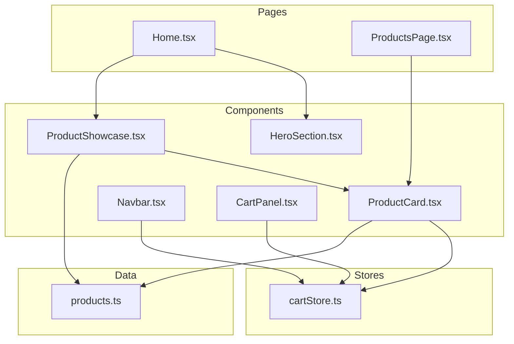
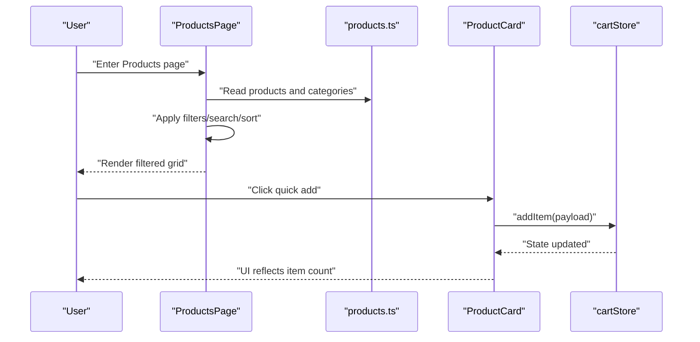
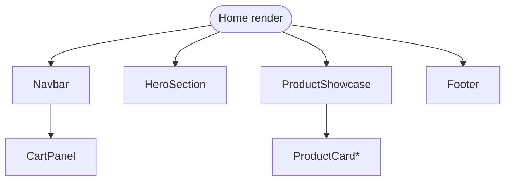
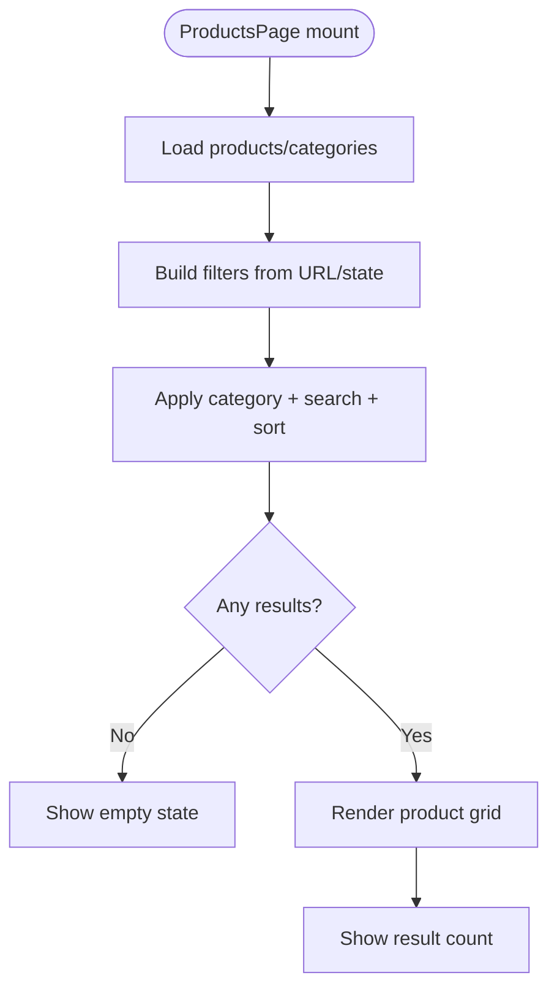
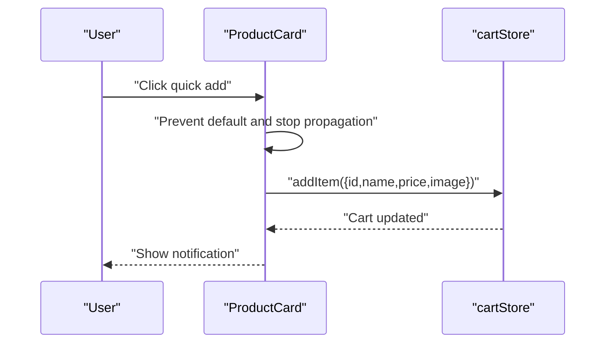
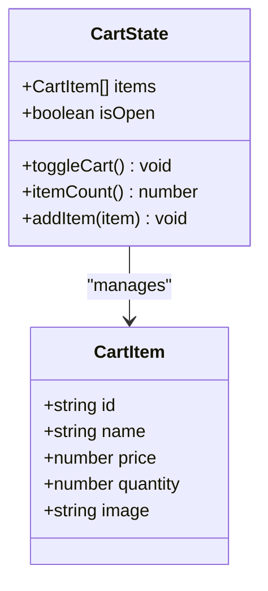
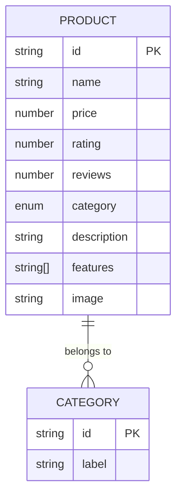
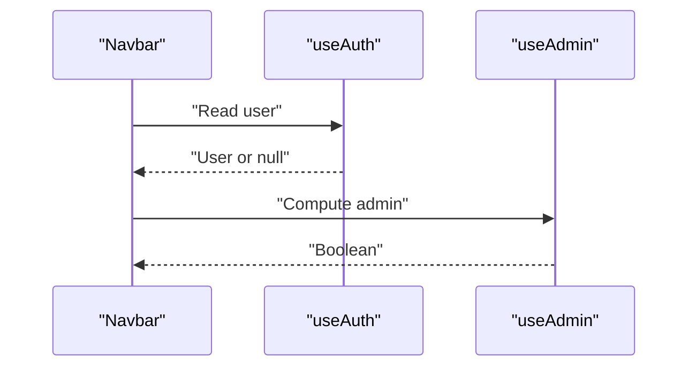
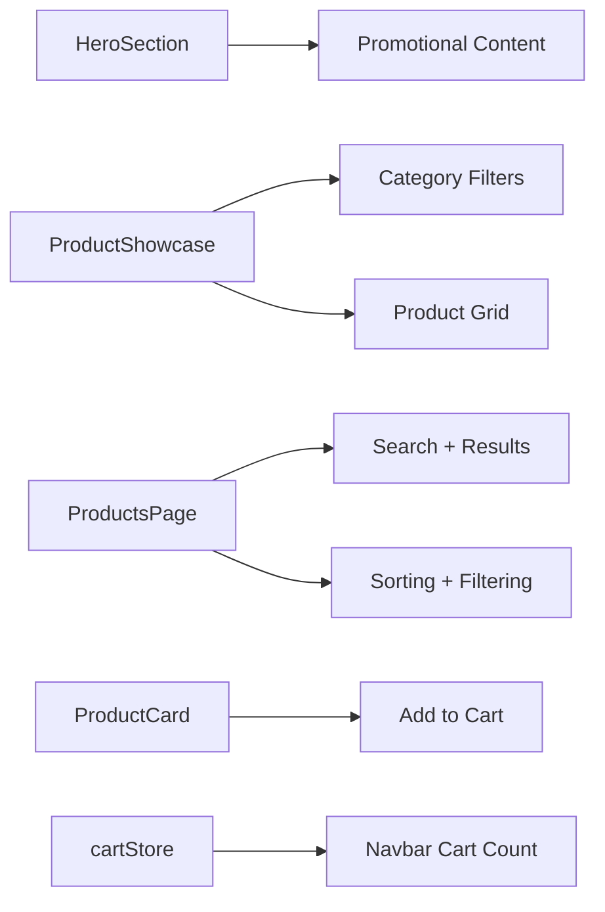
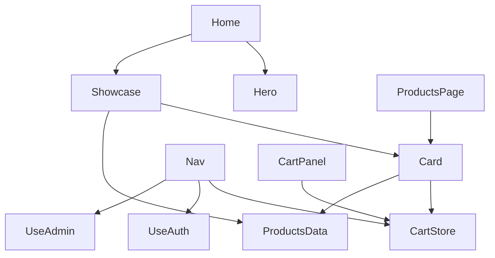

# Core Pages

<cite>
**Referenced Files in This Document**
- [Home.tsx](file://autocure/src/pages/Home.tsx)
- [ProductsPage.tsx](file://autocure/src/pages/ProductsPage.tsx)
- [HeroSection.tsx](file://autocure/src/components/HeroSection.tsx)
- [ProductShowcase.tsx](file://autocure/src/components/ProductShowcase.tsx)
- [ProductCard.tsx](file://autocure/src/components/ProductCard.tsx)
- [cartStore.ts](file://autocure/src/stores/cartStore.ts)
- [products.ts](file://autocure/src/data/products.ts)
- [Navbar.tsx](file://autocure/src/components/Navbar.tsx)
- [useAuth.ts](file://autocure/src/hooks/useAuth.ts)
- [useAdmin.ts](file://autocure/src/hooks/useAdmin.ts)
- [CartPanel.tsx](file://autocure/src/components/CartPanel.tsx)
</cite>

## Table of Contents
1. [Introduction](#introduction)
2. [Project Structure](#project-structure)
3. [Core Components](#core-components)
4. [Architecture Overview](#architecture-overview)
5. [Detailed Component Analysis](#detailed-component-analysis)
6. [Dependency Analysis](#dependency-analysis)
7. [Performance Considerations](#performance-considerations)
8. [Troubleshooting Guide](#troubleshooting-guide)
9. [Conclusion](#conclusion)

## Introduction
This document provides comprehensive documentation for CarCure2’s core page components: Home, Products catalog, and the upcoming ProductDetail page. It explains the Home page’s hero section, featured products display, and promotional content; the Products page’s product listing, filtering, search, and sorting; and the ProductDetail page’s product information display, image gallery, quantity selection, add-to-cart functionality, and related products. It also covers data fetching patterns, loading states, error handling, responsive design, product data models, API integration patterns, and state management integration with the cart store.

## Project Structure
The core pages and components are organized under the src directory. The Home page composes the HeroSection and ProductShowcase, which in turn render ProductCard components. The Products page provides a full-featured catalog with search, filtering, and sorting. The cart state is managed via a Zustand store, integrated into ProductCard and consumed by Navbar and CartPanel.

**Diagram sources**
- [Home.tsx](file://autocure/src/pages/Home.tsx#L1-L18)
- [ProductsPage.tsx](file://autocure/src/pages/ProductsPage.tsx#L1-L225)
- [HeroSection.tsx](file://autocure/src/components/HeroSection.tsx#L1-L123)
- [ProductShowcase.tsx](file://autocure/src/components/ProductShowcase.tsx#L1-L70)
- [ProductCard.tsx](file://autocure/src/components/ProductCard.tsx#L1-L100)
- [Navbar.tsx](file://autocure/src/components/Navbar.tsx#L1-L216)
- [CartPanel.tsx](file://autocure/src/components/CartPanel.tsx#L1-L5)
- [cartStore.ts](file://autocure/src/stores/cartStore.ts#L1-L36)
- [products.ts](file://autocure/src/data/products.ts#L1-L111)

**Section sources**
- [Home.tsx](file://autocure/src/pages/Home.tsx#L1-L18)
- [ProductsPage.tsx](file://autocure/src/pages/ProductsPage.tsx#L1-L225)
- [HeroSection.tsx](file://autocure/src/components/HeroSection.tsx#L1-L123)
- [ProductShowcase.tsx](file://autocure/src/components/ProductShowcase.tsx#L1-L70)
- [ProductCard.tsx](file://autocure/src/components/ProductCard.tsx#L1-L100)
- [cartStore.ts](file://autocure/src/stores/cartStore.ts#L1-L36)
- [products.ts](file://autocure/src/data/products.ts#L1-L111)
- [Navbar.tsx](file://autocure/src/components/Navbar.tsx#L1-L216)
- [CartPanel.tsx](file://autocure/src/components/CartPanel.tsx#L1-L5)

## Core Components
- Home page orchestrator that renders the navigation panel, hero banner, featured products showcase, and footer.
- Products page with category filtering, search, sorting, and result display.
- ProductCard reusable component for product preview, quick add-to-cart, and link to detail.
- Cart store for managing cart items, open/closed state, item count, and add operation.
- Product data model and category definitions for rendering and filtering.

Key responsibilities:
- Home: Compose hero and showcase; integrate CartPanel and Navbar.
- Products: Centralized filtering/search/sort pipeline; result grid and empty state.
- ProductCard: Add to cart action and navigation to product detail.
- Cart store: Minimal cart state with Zustand; integrates with Navbar badge and ProductCard.

**Section sources**
- [Home.tsx](file://autocure/src/pages/Home.tsx#L7-L17)
- [ProductsPage.tsx](file://autocure/src/pages/ProductsPage.tsx#L20-L77)
- [ProductCard.tsx](file://autocure/src/components/ProductCard.tsx#L12-L26)
- [cartStore.ts](file://autocure/src/stores/cartStore.ts#L19-L35)
- [products.ts](file://autocure/src/data/products.ts#L1-L11)

## Architecture Overview
The pages are composed of small, focused components. Filtering and sorting are handled locally against an in-memory product dataset. State is centralized in the cart store. Authentication and admin checks are provided via hooks and consumed by Navbar.

**Diagram sources**
- [ProductsPage.tsx](file://autocure/src/pages/ProductsPage.tsx#L38-L77)
- [products.ts](file://autocure/src/data/products.ts#L13-L102)
- [ProductCard.tsx](file://autocure/src/components/ProductCard.tsx#L15-L26)
- [cartStore.ts](file://autocure/src/stores/cartStore.ts#L24-L34)

## Detailed Component Analysis

### Home Page
The Home page is a composition of:
- Navbar: Fixed header with logo, navigation links, cart icon with item count, profile/admin links, and mobile menu.
- CartPanel: Placeholder component for future cart drawer.
- HeroSection: Fullscreen hero with animated background, floating orbs, headline, subtitle, CTA buttons, and statistics.
- ProductShowcase: Section with category filter buttons and product grid.

Responsibilities:
- Render layout and compose child components.
- Integrate CartPanel and Navbar for cart state and navigation.

**Diagram sources**
- [Home.tsx](file://autocure/src/pages/Home.tsx#L7-L17)
- [HeroSection.tsx](file://autocure/src/components/HeroSection.tsx#L11-L122)
- [ProductShowcase.tsx](file://autocure/src/components/ProductShowcase.tsx#L6-L69)
- [Navbar.tsx](file://autocure/src/components/Navbar.tsx#L15-L215)
- [CartPanel.tsx](file://autocure/src/components/CartPanel.tsx#L1-L5)

**Section sources**
- [Home.tsx](file://autocure/src/pages/Home.tsx#L7-L17)
- [HeroSection.tsx](file://autocure/src/components/HeroSection.tsx#L11-L122)
- [ProductShowcase.tsx](file://autocure/src/components/ProductShowcase.tsx#L6-L69)
- [Navbar.tsx](file://autocure/src/components/Navbar.tsx#L15-L215)
- [CartPanel.tsx](file://autocure/src/components/CartPanel.tsx#L1-L5)

### Products Catalog Page
The Products page implements:
- Category filtering via pill-style buttons.
- Search across product name, description, and features.
- Sorting by default, price ascending/descending, rating, and name.
- Click-outside behavior to close the sort dropdown.
- Empty state when no results match filters.
- Responsive grid layout and result count display.

**Diagram sources**
- [ProductsPage.tsx](file://autocure/src/pages/ProductsPage.tsx#L20-L77)

**Section sources**
- [ProductsPage.tsx](file://autocure/src/pages/ProductsPage.tsx#L20-L77)
- [ProductsPage.tsx](file://autocure/src/pages/ProductsPage.tsx#L101-L166)
- [ProductsPage.tsx](file://autocure/src/pages/ProductsPage.tsx#L194-L218)

### ProductCard Component
ProductCard displays a single product preview and enables quick add-to-cart:
- Renders product image, rating, name, description, price, and feature badges.
- Hover effects reveal a quick-add-to-cart button.
- Click handler adds the item to the cart store and triggers a simple alert.
- Links to the product detail route.

**Diagram sources**
- [ProductCard.tsx](file://autocure/src/components/ProductCard.tsx#L15-L26)
- [cartStore.ts](file://autocure/src/stores/cartStore.ts#L24-L34)

**Section sources**
- [ProductCard.tsx](file://autocure/src/components/ProductCard.tsx#L12-L26)
- [cartStore.ts](file://autocure/src/stores/cartStore.ts#L19-L35)

### Cart Store (Zustand)
The cart store defines:
- CartItem shape: id, name, price, quantity, image.
- CartState: items array, isOpen flag, toggleCart, itemCount, addItem.
- addItem logic merges duplicates by increasing quantity or appends a new item.

**Diagram sources**
- [cartStore.ts](file://autocure/src/stores/cartStore.ts#L3-L17)
- [cartStore.ts](file://autocure/src/stores/cartStore.ts#L19-L35)

**Section sources**
- [cartStore.ts](file://autocure/src/stores/cartStore.ts#L1-L36)

### Product Data Model and Categories
The product data model includes:
- id, name, price, rating, reviews, category, description, features[], image.
- Categories define filterable groups.

**Diagram sources**
- [products.ts](file://autocure/src/data/products.ts#L1-L11)
- [products.ts](file://autocure/src/data/products.ts#L104-L111)

**Section sources**
- [products.ts](file://autocure/src/data/products.ts#L1-L111)

### Authentication and Admin Hooks
- useAuth provides user state, loading, and sign-up/sign-in/sign-out stubs.
- useAdmin derives admin status from user and is currently stubbed.

**Diagram sources**
- [Navbar.tsx](file://autocure/src/components/Navbar.tsx#L20-L22)
- [useAuth.ts](file://autocure/src/hooks/useAuth.ts#L17-L42)
- [useAdmin.ts](file://autocure/src/hooks/useAdmin.ts#L4-L24)

**Section sources**
- [useAuth.ts](file://autocure/src/hooks/useAuth.ts#L1-L43)
- [useAdmin.ts](file://autocure/src/hooks/useAdmin.ts#L1-L25)
- [Navbar.tsx](file://autocure/src/components/Navbar.tsx#L15-L215)

### Conceptual Overview
- HeroSection: Fullscreen hero with animated background and CTA buttons.
- ProductShowcase: Category filter and product grid with lazy loading images.
- ProductsPage: Comprehensive catalog with search, filtering, sorting, and responsive grid.
- ProductCard: Preview card with quick add-to-cart and navigation to detail.
- Cart integration: Navbar badge updates with cart item count; ProductCard adds items.

[No sources needed since this diagram shows conceptual workflow, not actual code structure]

## Dependency Analysis
- Home depends on HeroSection and ProductShowcase.
- ProductShowcase depends on ProductCard and local product/category data.
- ProductsPage depends on ProductCard and local product/category data.
- ProductCard depends on cartStore and products data.
- Navbar consumes cartStore and auth/admin hooks.
- CartPanel is a stub and depends on cartStore for future implementation.

**Diagram sources**
- [Home.tsx](file://autocure/src/pages/Home.tsx#L1-L18)
- [HeroSection.tsx](file://autocure/src/components/HeroSection.tsx#L1-L123)
- [ProductShowcase.tsx](file://autocure/src/components/ProductShowcase.tsx#L1-L70)
- [ProductsPage.tsx](file://autocure/src/pages/ProductsPage.tsx#L1-L225)
- [ProductCard.tsx](file://autocure/src/components/ProductCard.tsx#L1-L100)
- [cartStore.ts](file://autocure/src/stores/cartStore.ts#L1-L36)
- [products.ts](file://autocure/src/data/products.ts#L1-L111)
- [Navbar.tsx](file://autocure/src/components/Navbar.tsx#L1-L216)
- [useAuth.ts](file://autocure/src/hooks/useAuth.ts#L1-L43)
- [useAdmin.ts](file://autocure/src/hooks/useAdmin.ts#L1-L25)
- [CartPanel.tsx](file://autocure/src/components/CartPanel.tsx#L1-L5)

**Section sources**
- [Home.tsx](file://autocure/src/pages/Home.tsx#L1-L18)
- [ProductsPage.tsx](file://autocure/src/pages/ProductsPage.tsx#L1-L225)
- [ProductShowcase.tsx](file://autocure/src/components/ProductShowcase.tsx#L1-L70)
- [ProductCard.tsx](file://autocure/src/components/ProductCard.tsx#L1-L100)
- [cartStore.ts](file://autocure/src/stores/cartStore.ts#L1-L36)
- [products.ts](file://autocure/src/data/products.ts#L1-L111)
- [Navbar.tsx](file://autocure/src/components/Navbar.tsx#L1-L216)
- [useAuth.ts](file://autocure/src/hooks/useAuth.ts#L1-L43)
- [useAdmin.ts](file://autocure/src/hooks/useAdmin.ts#L1-L25)
- [CartPanel.tsx](file://autocure/src/components/CartPanel.tsx#L1-L5)

## Performance Considerations
- Local filtering and sorting: Efficient for small to medium datasets; consider pagination or virtualization for larger catalogs.
- Memoization: useMemo is used in ProductShowcase and ProductsPage to avoid unnecessary recalculations.
- Lazy loading: ProductCard images use lazy loading to improve initial load performance.
- Animations: Framer Motion animations are used sparingly; keep thresholds minimal for mobile devices.
- Cart updates: Zustand state updates are fast; avoid excessive re-renders by keeping payload minimal.

[No sources needed since this section provides general guidance]

## Troubleshooting Guide
Common issues and resolutions:
- Cart item count not updating: Verify that the cart store is initialized and that components subscribe to it.
- Add-to-cart not working: Ensure ProductCard is connected to the cart store and that addItem is invoked with the correct payload.
- Empty results after filtering: Confirm that category IDs and search terms match the product dataset.
- Navbar icons not visible: Check that the authentication and admin hooks return expected values; ensure proper routing.

**Section sources**
- [cartStore.ts](file://autocure/src/stores/cartStore.ts#L19-L35)
- [ProductCard.tsx](file://autocure/src/components/ProductCard.tsx#L15-L26)
- [ProductsPage.tsx](file://autocure/src/pages/ProductsPage.tsx#L38-L77)
- [useAuth.ts](file://autocure/src/hooks/useAuth.ts#L17-L42)
- [useAdmin.ts](file://autocure/src/hooks/useAdmin.ts#L4-L24)

## Conclusion
The Home, Products catalog, and ProductDetail pages form the core shopping experience. Filtering, search, and sorting are implemented locally for simplicity, while cart state is centralized via Zustand. The design emphasizes responsiveness and smooth interactions. For production readiness, consider integrating real APIs, implementing pagination, enhancing error handling, and adding loading states.