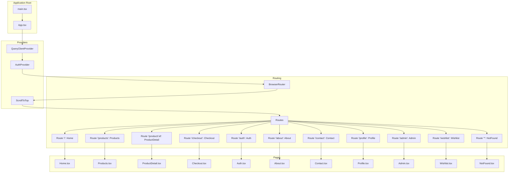
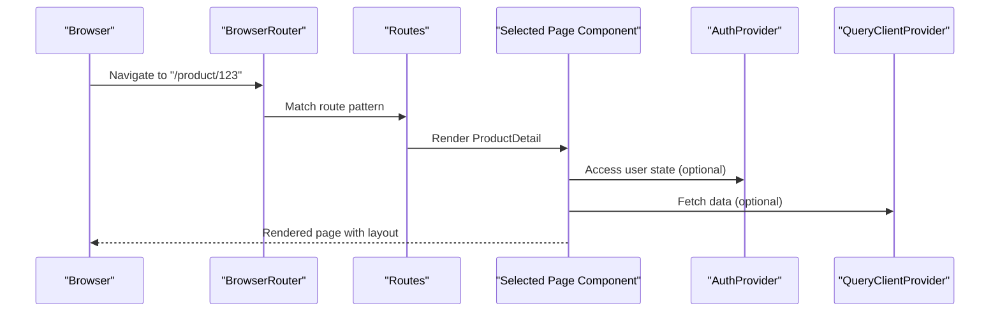
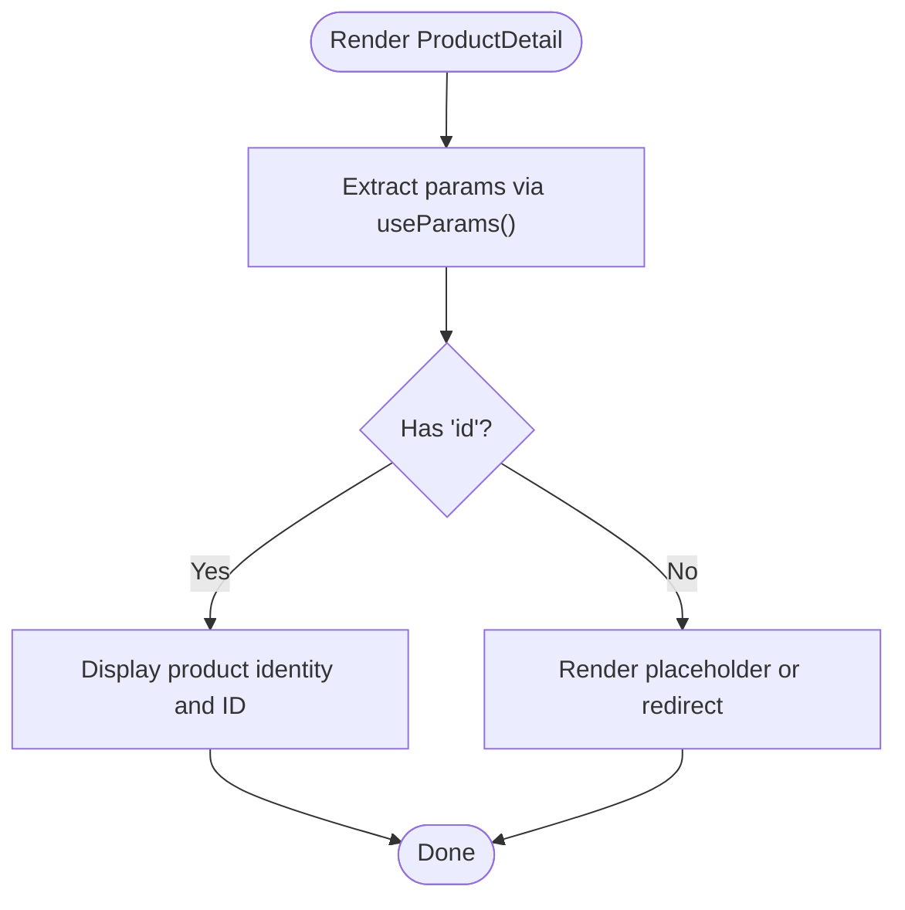
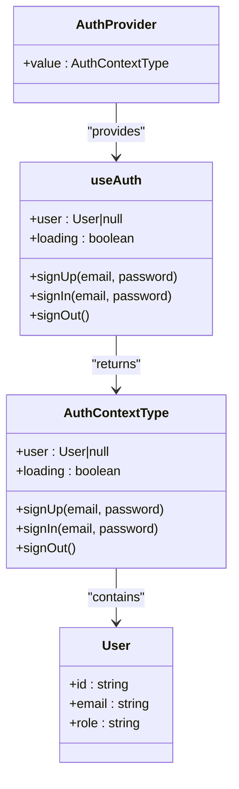
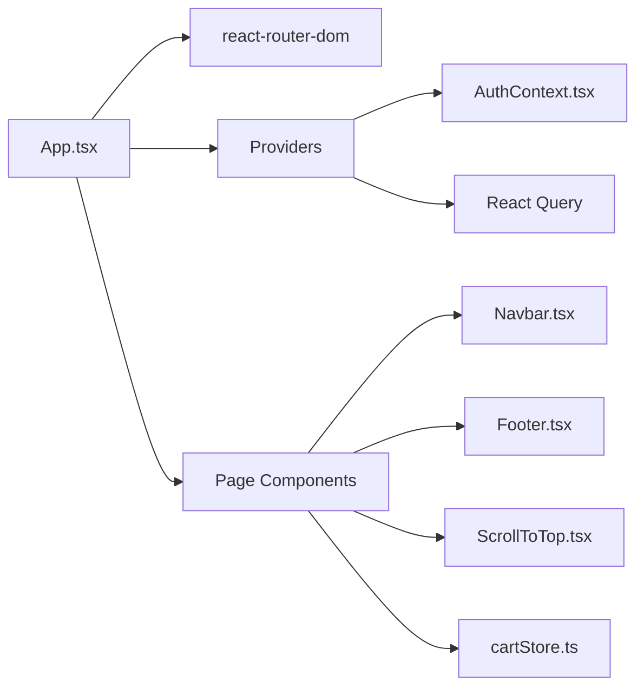

# Page Components

<cite>
**Referenced Files in This Document**
- [App.tsx](file://autocure/src/App.tsx)
- [main.tsx](file://autocure/src/main.tsx)
- [Home.tsx](file://autocure/src/pages/Home.tsx)
- [Products.tsx](file://autocure/src/pages/Products.tsx)
- [ProductDetail.tsx](file://autocure/src/pages/ProductDetail.tsx)
- [Checkout.tsx](file://autocure/src/pages/Checkout.tsx)
- [Profile.tsx](file://autocure/src/pages/Profile.tsx)
- [Admin.tsx](file://autocure/src/pages/Admin.tsx)
- [Wishlist.tsx](file://autocure/src/pages/Wishlist.tsx)
- [About.tsx](file://autocure/src/pages/About.tsx)
- [Contact.tsx](file://autocure/src/pages/Contact.tsx)
- [NotFound.tsx](file://autocure/src/pages/NotFound.tsx)
- [Auth.tsx](file://autocure/src/pages/Auth.tsx)
- [AuthContext.tsx](file://autocure/src/contexts/AuthContext.tsx)
- [useAuth.ts](file://autocure/src/hooks/useAuth.ts)
- [cartStore.ts](file://autocure/src/stores/cartStore.ts)
- [Navbar.tsx](file://autocure/src/components/Navbar.tsx)
- [Footer.tsx](file://autocure/src/components/Footer.tsx)
- [ScrollToTop.tsx](file://autocure/src/components/ScrollToTop.tsx)
</cite>

## Table of Contents
1. [Introduction](#introduction)
2. [Project Structure](#project-structure)
3. [Core Components](#core-components)
4. [Architecture Overview](#architecture-overview)
5. [Detailed Component Analysis](#detailed-component-analysis)
6. [Dependency Analysis](#dependency-analysis)
7. [Performance Considerations](#performance-considerations)
8. [Troubleshooting Guide](#troubleshooting-guide)
9. [Conclusion](#conclusion)

## Introduction
This document describes CarCure2’s page components and routing system. It covers each page component (Home, Products catalog, ProductDetail, Checkout, Profile, Admin, Wishlist, About, Contact, and NotFound), their page-specific functionality, routing configuration, navigation patterns, and integration with authentication and state management. It also outlines lifecycle management, SEO considerations, performance optimization strategies, responsive design, and error handling patterns.

## Project Structure
The application is structured around a single-page app built with React and React Router. Routing is configured in the root App component, which mounts pages under specific paths. Authentication is provided via a context provider, and global state for cart is exposed via a store module. The UI is composed of shared components (Navbar, Footer, ScrollToTop) and per-page components.



**Diagram sources**
- [App.tsx](file://autocure/src/App.tsx#L1-L47)
- [main.tsx](file://autocure/src/main.tsx#L1-L11)

**Section sources**
- [App.tsx](file://autocure/src/App.tsx#L1-L47)
- [main.tsx](file://autocure/src/main.tsx#L1-L11)

## Core Components
- Routing and Providers
  - BrowserRouter wraps the app and enables declarative routing.
  - QueryClientProvider configures React Query for caching and data fetching.
  - AuthProvider wraps children to expose authentication state globally.
  - ScrollToTop ensures smooth navigation by resetting scroll position on route change.
- Shared UI
  - Navbar and Footer are included on most pages for consistent navigation and branding.
  - ScrollToTop is mounted once at the top level to reset scroll after each route change.
- State Management
  - Authentication state is provided via a context and hook abstraction.
  - Cart state is exposed via a dedicated store module.

**Section sources**
- [App.tsx](file://autocure/src/App.tsx#L1-L47)
- [AuthContext.tsx](file://autocure/src/contexts/AuthContext.tsx#L1-L37)
- [useAuth.ts](file://autocure/src/hooks/useAuth.ts#L1-L43)
- [cartStore.ts](file://autocure/src/stores/cartStore.ts)

## Architecture Overview
The routing architecture is flat and explicit, with each page mapped to a static or dynamic route. Authentication is centralized through a context provider, enabling protected routes and user-aware UI. React Query is configured globally for optimistic UI and caching.



**Diagram sources**
- [App.tsx](file://autocure/src/App.tsx#L21-L44)
- [ProductDetail.tsx](file://autocure/src/pages/ProductDetail.tsx#L1-L25)

## Detailed Component Analysis

### Home Page
- Purpose: Entry point showcasing hero content and product highlights.
- Layout: Full-height layout with Navbar, CartPanel, HeroSection, ProductShowcase, and Footer.
- Lifecycle: Stateless functional component rendering a composition of shared components.
- Navigation: Uses Navbar links for internal navigation.
- SEO: Semantic headings and meta-ready structure; consider adding page metadata in a future enhancement.
- Performance: Minimal rendering cost; relies on shared components.

**Section sources**
- [Home.tsx](file://autocure/src/pages/Home.tsx#L1-L18)
- [Navbar.tsx](file://autocure/src/components/Navbar.tsx)
- [Footer.tsx](file://autocure/src/components/Footer.tsx)

### Products Catalog Page
- Purpose: Placeholder for product listing.
- Routing: Static route "/products".
- UI: Centered heading with animated background and layout tokens.
- Navigation: Internal navigation via Navbar.
- SEO: Heading-based semantics; consider structured data and filters in future iterations.
- Performance: Stateless render; minimal overhead.

**Section sources**
- [Products.tsx](file://autocure/src/pages/Products.tsx#L1-L17)

### Product Detail Page
- Purpose: Single-product view with dynamic route parameter ":id".
- Routing: Dynamic segment "/product/:id".
- Parameter Handling: Uses useParams to extract productId.
- UI: Centered display of product identity and ID.
- Navigation: Back navigation via browser history or Navbar.
- SEO: Add canonical URL and Open Graph tags for product pages in future enhancements.
- Performance: Lightweight; consider React Query for product data fetching.



**Diagram sources**
- [ProductDetail.tsx](file://autocure/src/pages/ProductDetail.tsx#L1-L25)

**Section sources**
- [ProductDetail.tsx](file://autocure/src/pages/ProductDetail.tsx#L1-L25)

### Checkout Page
- Purpose: Placeholder for checkout flow.
- Routing: Static route "/checkout".
- UI: Centered heading with animated background.
- Navigation: Internal navigation via Navbar.
- SEO: Heading-based semantics; consider form accessibility and schema markup.
- Performance: Stateless render.

**Section sources**
- [Checkout.tsx](file://autocure/src/pages/Checkout.tsx#L1-L17)

### Profile Page
- Purpose: Placeholder for user profile.
- Routing: Static route "/profile".
- UI: Centered heading with animated background.
- Navigation: Internal navigation via Navbar.
- SEO: Heading-based semantics; consider profile schema.
- Performance: Stateless render.

**Section sources**
- [Profile.tsx](file://autocure/src/pages/Profile.tsx#L1-L17)

### Admin Page
- Purpose: Placeholder for administrative interface.
- Routing: Static route "/admin".
- UI: Centered heading with purple-themed styling.
- Navigation: Internal navigation via Navbar.
- SEO: Heading-based semantics.
- Performance: Stateless render.

**Section sources**
- [Admin.tsx](file://autocure/src/pages/Admin.tsx#L1-L17)

### Wishlist Page
- Purpose: Placeholder for wishlist management.
- Routing: Static route "/wishlist".
- UI: Centered heading with animated background.
- Navigation: Internal navigation via Navbar.
- SEO: Heading-based semantics.
- Performance: Stateless render.

**Section sources**
- [Wishlist.tsx](file://autocure/src/pages/Wishlist.tsx#L1-L17)

### About Page
- Purpose: Company/about information.
- Routing: Static route "/about".
- UI: Centered heading with animated background.
- Navigation: Internal navigation via Navbar.
- SEO: Heading-based semantics; consider adding structured data.
- Performance: Stateless render.

**Section sources**
- [About.tsx](file://autocure/src/pages/About.tsx#L1-L17)

### Contact Page
- Purpose: Contact information and form placeholder.
- Routing: Static route "/contact".
- UI: Centered heading with animated background.
- Navigation: Internal navigation via Navbar.
- SEO: Heading-based semantics; consider contact schema and form accessibility.
- Performance: Stateless render.

**Section sources**
- [Contact.tsx](file://autocure/src/pages/Contact.tsx#L1-L17)

### Auth Page
- Purpose: Authentication entry point (login/sign-up).
- Routing: Static route "/auth".
- UI: Centered heading with animated background.
- Navigation: Internal navigation via Navbar.
- SEO: Heading-based semantics.
- Performance: Stateless render.

**Section sources**
- [Auth.tsx](file://autocure/src/pages/Auth.tsx#L1-L17)

### NotFound Page
- Purpose: Catch-all for unmatched routes.
- Routing: Wildcard route "*".
- Behavior: Displays 404 message and a link to home.
- Navigation: Programmatic navigation via react-router-dom Link to "/".
- SEO: Clear signal to crawlers that the route does not exist.
- Performance: Stateless render.

```mermaid
sequenceDiagram
participant Router as "Routes"
participant NotFound as "NotFound"
participant Link as "Link('/')"
participant Home as "Home"
Router->>NotFound : Render on wildcard match
NotFound->>Link : Provide navigation to "/"
Link-->>Home : On click, navigate to Home
```

**Diagram sources**
- [App.tsx](file://autocure/src/App.tsx#L38-L38)
- [NotFound.tsx](file://autocure/src/pages/NotFound.tsx#L1-L27)

**Section sources**
- [NotFound.tsx](file://autocure/src/pages/NotFound.tsx#L1-L27)

### Routing Configuration and Navigation Patterns
- Static Routes: "/", "/products", "/checkout", "/about", "/contact", "/profile", "/admin", "/wishlist", "/auth".
- Dynamic Route: "/product/:id" uses useParams to read productId.
- Catch-All: "*" renders NotFound.
- Navigation: Uses react-router-dom Link for internal navigation; programmatic navigation is available via useNavigate (not shown here but commonly used).
- Scroll Behavior: ScrollToTop resets scroll position on route change.

**Section sources**
- [App.tsx](file://autocure/src/App.tsx#L27-L38)
- [ProductDetail.tsx](file://autocure/src/pages/ProductDetail.tsx#L3-L6)
- [NotFound.tsx](file://autocure/src/pages/NotFound.tsx#L16-L21)

### Route Protection Mechanisms
- Current Implementation: No route guards are present in the routing configuration.
- Recommended Pattern: Wrap protected routes with a guard component that checks AuthContext.user and redirects unauthenticated users to "/auth" or "/". This pattern is not implemented in the current codebase.

[No sources needed since this section provides recommended patterns without analyzing specific files]

### Authentication Integration
- Context Provider: AuthProvider wraps the app and exposes user, loading, and auth methods.
- Hook Abstraction: useAuth encapsulates state transitions for sign-up, sign-in, and sign-out.
- Usage Across Pages: Pages can consume the context via useAuthContext to conditionally render UI or enforce protections.



**Diagram sources**
- [AuthContext.tsx](file://autocure/src/contexts/AuthContext.tsx#L1-L37)
- [useAuth.ts](file://autocure/src/hooks/useAuth.ts#L1-L43)

**Section sources**
- [AuthContext.tsx](file://autocure/src/contexts/AuthContext.tsx#L1-L37)
- [useAuth.ts](file://autocure/src/hooks/useAuth.ts#L1-L43)

### State Management Integration
- Cart Store: cartStore.ts is imported at the root level and is intended to manage shopping cart state. While not directly used in pages yet, it is available for integration.
- Authentication Store: Authentication state is centralized via AuthContext and useAuth hook.

**Section sources**
- [cartStore.ts](file://autocure/src/stores/cartStore.ts)

### Page Lifecycle Management
- Mounting: Each page component renders its layout and content upon route match.
- Unmounting: React Router automatically unmounts previous page components when navigating.
- Scroll Reset: ScrollToTop resets scroll position on route change.

**Section sources**
- [App.tsx](file://autocure/src/App.tsx#L26-L26)
- [ScrollToTop.tsx](file://autocure/src/components/ScrollToTop.tsx)

### SEO Considerations
- Headings: Each page uses prominent headings suitable for semantic structure.
- Metadata: No page-level metadata is set in the current codebase; consider adding a head management solution (e.g., react-helmet) to set titles, descriptions, and canonical URLs.
- Structured Data: Product pages could benefit from product-specific structured data.

[No sources needed since this section provides general guidance]

### Performance Optimization Strategies
- Lazy Loading: Dynamically import heavy pages to reduce initial bundle size.
- Suspense: Pair lazy imports with React.Suspense for graceful loading states.
- React Query: Use QueryClientProvider for caching and background refetching; avoid unnecessary re-fetches by configuring cache times appropriately.
- Code Splitting: Split vendor and app bundles; enable tree-shaking and minification.
- Rendering: Keep pages stateless where possible; memoize expensive computations.

[No sources needed since this section provides general guidance]

### Responsive Design Implementation
- Tailwind Classes: Pages use Tailwind utility classes for responsive layouts (e.g., min-h-screen, flex, items-center, justify-center).
- Component Composition: Shared components (Navbar, Footer) are designed to adapt across screen sizes.
- Recommendations: Ensure media queries and responsive breakpoints are consistently applied; test across mobile, tablet, and desktop.

**Section sources**
- [Home.tsx](file://autocure/src/pages/Home.tsx#L6-L15)
- [Products.tsx](file://autocure/src/pages/Products.tsx#L6-L14)
- [ProductDetail.tsx](file://autocure/src/pages/ProductDetail.tsx#L8-L22)

### Examples of Navigation and Dynamic Parameters
- Internal Navigation: Use Link to navigate between pages (e.g., to="/").
- Dynamic Route Parameters: ProductDetail reads ":id" via useParams and displays it.
- Catch-All Handling: NotFound renders when no route matches.

**Section sources**
- [NotFound.tsx](file://autocure/src/pages/NotFound.tsx#L16-L21)
- [ProductDetail.tsx](file://autocure/src/pages/ProductDetail.tsx#L3-L17)

### Error Boundary Handling
- Current State: No error boundaries are implemented in the routing configuration.
- Recommended Pattern: Wrap pages with an error boundary component to gracefully handle runtime errors and provide fallback UI.

[No sources needed since this section provides recommended patterns without analyzing specific files]

## Dependency Analysis
The routing layer depends on React Router and providers. Pages depend on shared components and optionally on state stores. Authentication is decoupled via context, enabling flexible protection strategies.



**Diagram sources**
- [App.tsx](file://autocure/src/App.tsx#L1-L47)
- [AuthContext.tsx](file://autocure/src/contexts/AuthContext.tsx#L1-L37)
- [cartStore.ts](file://autocure/src/stores/cartStore.ts)

**Section sources**
- [App.tsx](file://autocure/src/App.tsx#L1-L47)

## Performance Considerations
- Bundle Size: Lazy-load heavy pages and split chunks.
- Caching: Configure React Query cache times and invalidation strategies.
- Rendering: Prefer lightweight page components; defer heavy work to background threads or server-side rendering.
- Hydration: Ensure hydration consistency when introducing SSR.

[No sources needed since this section provides general guidance]

## Troubleshooting Guide
- Route Not Found: Verify wildcard route "*" is defined last in Routes.
- Scroll Position: Confirm ScrollToTop is mounted at the top level.
- Authentication State: Ensure AuthProvider wraps the app; check useAuthContext is used within provider.
- Dynamic Params: Confirm route pattern matches useParams usage (e.g., "/product/:id").

**Section sources**
- [App.tsx](file://autocure/src/App.tsx#L26-L38)
- [NotFound.tsx](file://autocure/src/pages/NotFound.tsx#L1-L27)
- [AuthContext.tsx](file://autocure/src/contexts/AuthContext.tsx#L20-L28)
- [ProductDetail.tsx](file://autocure/src/pages/ProductDetail.tsx#L3-L6)

## Conclusion
CarCure2’s routing system is straightforward and extensible, with clear page boundaries and shared UI components. Authentication is centralized via a context provider, and global state is prepared through React Query and a cart store. To enhance production readiness, consider implementing route guards, error boundaries, metadata management, and performance optimizations such as lazy loading and caching strategies.