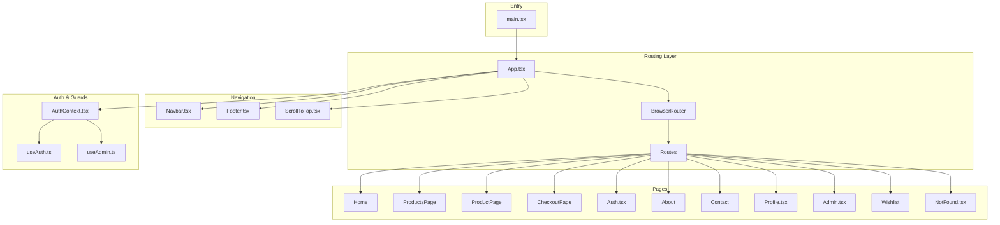
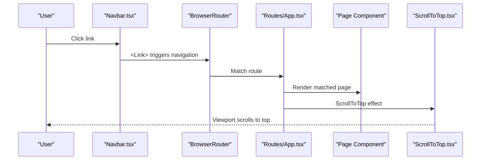
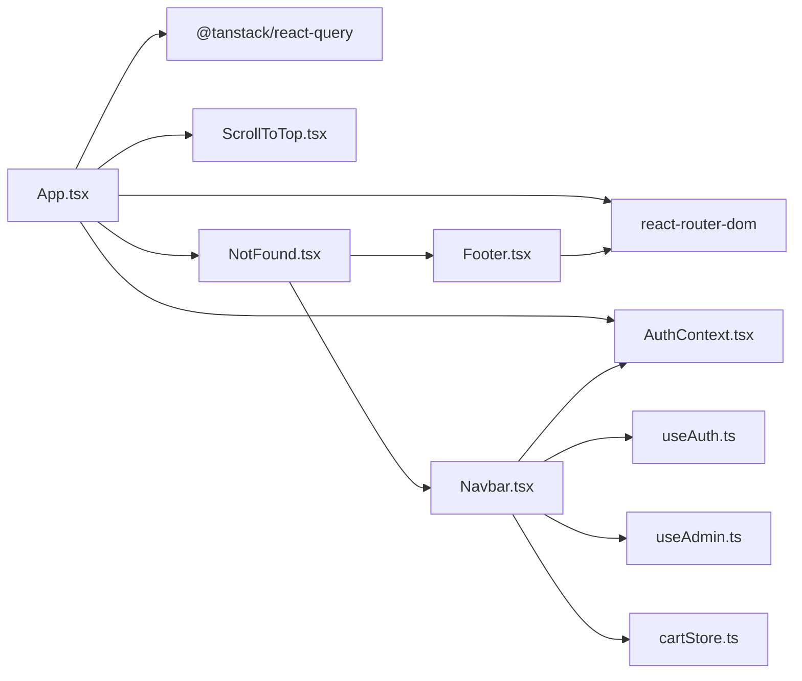

# Routing and Navigation

<cite>
**Referenced Files in This Document**
- [App.tsx](file://autocure/src/App.tsx)
- [main.tsx](file://autocure/src/main.tsx)
- [Navbar.tsx](file://autocure/src/components/Navbar.tsx)
- [Footer.tsx](file://autocure/src/components/Footer.tsx)
- [ScrollToTop.tsx](file://autocure/src/components/ScrollToTop.tsx)
- [AuthContext.tsx](file://autocure/src/contexts/AuthContext.tsx)
- [useAuth.ts](file://autocure/src/hooks/useAuth.ts)
- [useAdmin.ts](file://autocure/src/hooks/useAdmin.ts)
- [cartStore.ts](file://autocure/src/stores/cartStore.ts)
- [NotFound.tsx](file://autocure/src/pages/NotFound.tsx)
- [Auth.tsx](file://autocure/src/pages/Auth.tsx)
- [Admin.tsx](file://autocure/src/pages/Admin.tsx)
- [Profile.tsx](file://autocure/src/pages/Profile.tsx)
- [package.json](file://autocure/package.json)
</cite>

## Table of Contents
1. [Introduction](#introduction)
2. [Project Structure](#project-structure)
3. [Core Components](#core-components)
4. [Architecture Overview](#architecture-overview)
5. [Detailed Component Analysis](#detailed-component-analysis)
6. [Dependency Analysis](#dependency-analysis)
7. [Performance Considerations](#performance-considerations)
8. [Troubleshooting Guide](#troubleshooting-guide)
9. [Conclusion](#conclusion)

## Introduction
This document explains CarCure2’s routing system and navigation patterns. It covers the central routing configuration in App.tsx, route definitions, navigation components, authentication and admin guards, and the NotFound handler. It also outlines programmatic navigation patterns, route parameter handling, query string management, route-based code splitting, breadcrumbs, SEO considerations, performance optimization, and fallback mechanisms for broken links.

## Project Structure
CarCure2 uses React Router v6 with a single-page application architecture. The routing configuration is centralized in App.tsx, which defines static routes and a catch-all 404 handler. Navigation components (Navbar and Footer) render links to these routes. Authentication and admin checks are handled via React Context and custom hooks. A global scroll-to-top behavior is implemented to reset viewport on route changes.

**Diagram sources**
- [main.tsx](file://autocure/src/main.tsx#L1-L11)
- [App.tsx](file://autocure/src/App.tsx#L1-L47)
- [Navbar.tsx](file://autocure/src/components/Navbar.tsx#L1-L216)
- [Footer.tsx](file://autocure/src/components/Footer.tsx#L1-L119)
- [ScrollToTop.tsx](file://autocure/src/components/ScrollToTop.tsx#L1-L13)
- [AuthContext.tsx](file://autocure/src/contexts/AuthContext.tsx#L1-L37)
- [useAuth.ts](file://autocure/src/hooks/useAuth.ts#L1-L43)
- [useAdmin.ts](file://autocure/src/hooks/useAdmin.ts#L1-L25)
- [NotFound.tsx](file://autocure/src/pages/NotFound.tsx#L1-L27)
- [Auth.tsx](file://autocure/src/pages/Auth.tsx#L1-L17)
- [Admin.tsx](file://autocure/src/pages/Admin.tsx#L1-L17)
- [Profile.tsx](file://autocure/src/pages/Profile.tsx#L1-L17)

**Section sources**
- [main.tsx](file://autocure/src/main.tsx#L1-L11)
- [App.tsx](file://autocure/src/App.tsx#L1-L47)

## Core Components
- Central routing configuration: App.tsx defines routes for home, products, product detail, checkout, auth, about, contact, profile, admin, wishlist, and a catch-all 404 page.
- Navigation components: Navbar.tsx and Footer.tsx render links to routes and adapt visibility based on authentication and admin status.
- Scroll-to-top behavior: ScrollToTop.tsx resets scroll position on route changes.
- Authentication and admin guards: AuthContext.tsx and useAuth.ts provide user state; useAdmin.ts derives admin status from user.
- Store integration: cartStore.ts integrates with Navbar for cart icon badge count.

**Section sources**
- [App.tsx](file://autocure/src/App.tsx#L21-L44)
- [Navbar.tsx](file://autocure/src/components/Navbar.tsx#L15-L216)
- [Footer.tsx](file://autocure/src/components/Footer.tsx#L1-L119)
- [ScrollToTop.tsx](file://autocure/src/components/ScrollToTop.tsx#L4-L12)
- [AuthContext.tsx](file://autocure/src/contexts/AuthContext.tsx#L20-L28)
- [useAuth.ts](file://autocure/src/hooks/useAuth.ts#L17-L42)
- [useAdmin.ts](file://autocure/src/hooks/useAdmin.ts#L4-L24)
- [cartStore.ts](file://autocure/src/stores/cartStore.ts#L22-L62)

## Architecture Overview
The routing architecture is a flat, static route tree with a single catch-all 404. Authentication and admin checks are performed at the component level via hooks and context. Programmatic navigation is not currently implemented in the provided files; navigation occurs through declarative Link components.

**Diagram sources**
- [Navbar.tsx](file://autocure/src/components/Navbar.tsx#L52-L131)
- [App.tsx](file://autocure/src/App.tsx#L25-L40)
- [ScrollToTop.tsx](file://autocure/src/components/ScrollToTop.tsx#L4-L12)

## Detailed Component Analysis

### Central Routing Configuration (App.tsx)
- Wraps the app with QueryClientProvider, AuthProvider, and BrowserRouter.
- Defines static routes for home, products, product detail with parameter, checkout, auth, about, contact, profile, admin, wishlist, and a catch-all 404.
- Uses a wildcard route to render NotFound for unmatched paths.

Key implementation references:
- Provider setup and router initialization: [App.tsx](file://autocure/src/App.tsx#L21-L27)
- Route definitions: [App.tsx](file://autocure/src/App.tsx#L27-L39)
- Catch-all 404: [App.tsx](file://autocure/src/App.tsx#L38)

**Section sources**
- [App.tsx](file://autocure/src/App.tsx#L21-L44)

### Route Definitions and Parameter Handling
- Static routes include a parameterized route for product detail.
- No query string parsing is implemented in the provided files; query parameters are not handled in navigation logic.

References:
- Product detail route: [App.tsx](file://autocure/src/App.tsx#L30)
- Other routes: [App.tsx](file://autocure/src/App.tsx#L28-L37)

**Section sources**
- [App.tsx](file://autocure/src/App.tsx#L27-L39)

### Navigation Guards and Access Control
- Authentication guard: Navbar renders profile/admin links conditionally based on user presence.
- Admin guard: Navbar renders admin link conditionally based on admin status derived from useAdmin hook.
- AuthContext and useAuth provide user state; useAdmin stubs admin checking.

References:
- Conditional rendering in Navbar: [Navbar.tsx](file://autocure/src/components/Navbar.tsx#L115-L131), [Navbar.tsx](file://autocure/src/components/Navbar.tsx#L104-L112)
- Admin conditional rendering: [Navbar.tsx](file://autocure/src/components/Navbar.tsx#L182-L190)
- Auth provider: [AuthContext.tsx](file://autocure/src/contexts/AuthContext.tsx#L20-L28)
- Auth state hook: [useAuth.ts](file://autocure/src/hooks/useAuth.ts#L17-L42)
- Admin hook: [useAdmin.ts](file://autocure/src/hooks/useAdmin.ts#L4-L24)

**Section sources**
- [Navbar.tsx](file://autocure/src/components/Navbar.tsx#L115-L131)
- [Navbar.tsx](file://autocure/src/components/Navbar.tsx#L104-L112)
- [AuthContext.tsx](file://autocure/src/contexts/AuthContext.tsx#L20-L28)
- [useAuth.ts](file://autocure/src/hooks/useAuth.ts#L17-L42)
- [useAdmin.ts](file://autocure/src/hooks/useAdmin.ts#L4-L24)

### Protected Routes and Redirection
- There is no dedicated protected route wrapper or redirect logic in the provided files.
- Authentication-based redirection is not implemented; Navbar simply hides/shows links depending on user/admin state.

Recommendation:
- Implement a ProtectedRoute component that checks user state and redirects unauthenticated users to the auth page.
- Implement an AdminRoute component that checks admin status and redirects non-admin users appropriately.

**Section sources**
- [Navbar.tsx](file://autocure/src/components/Navbar.tsx#L115-L131)
- [useAuth.ts](file://autocure/src/hooks/useAuth.ts#L17-L42)
- [useAdmin.ts](file://autocure/src/hooks/useAdmin.ts#L4-L24)

### NotFound Page and Error Handling
- NotFound.tsx renders a 404 layout with a “GO HOME” link back to the root.
- The wildcard route in App.tsx ensures unmatched paths render NotFound.

References:
- NotFound page: [NotFound.tsx](file://autocure/src/pages/NotFound.tsx#L5-L26)
- Wildcard route: [App.tsx](file://autocure/src/App.tsx#L38)

**Section sources**
- [NotFound.tsx](file://autocure/src/pages/NotFound.tsx#L5-L26)
- [App.tsx](file://autocure/src/App.tsx#L38)

### Navigation Patterns and Programmatic Navigation
- Declarative navigation: Links in Navbar and Footer use react-router-dom Link components.
- Programmatic navigation is not present in the provided files; navigation is purely declarative.

References:
- Navbar links: [Navbar.tsx](file://autocure/src/components/Navbar.tsx#L61-L69), [Navbar.tsx](file://autocure/src/components/Navbar.tsx#L115-L131)
- Footer links: [Footer.tsx](file://autocure/src/components/Footer.tsx#L29-L53), [Footer.tsx](file://autocure/src/components/Footer.tsx#L62-L79)

**Section sources**
- [Navbar.tsx](file://autocure/src/components/Navbar.tsx#L61-L69)
- [Navbar.tsx](file://autocure/src/components/Navbar.tsx#L115-L131)
- [Footer.tsx](file://autocure/src/components/Footer.tsx#L29-L53)
- [Footer.tsx](file://autocure/src/components/Footer.tsx#L62-L79)

### Route-Based Code Splitting
- Current implementation imports pages statically in App.tsx.
- To enable route-based code splitting, replace static imports with dynamic imports using React.lazy and Suspense around Routes.

References:
- Static imports in App.tsx: [App.tsx](file://autocure/src/App.tsx#L6-L17)

**Section sources**
- [App.tsx](file://autocure/src/App.tsx#L6-L17)

### Breadcrumb Implementation
- No breadcrumb component is implemented in the provided files.
- A breadcrumb could be added by deriving path segments and mapping them to human-readable labels, optionally integrating with route definitions.

[No sources needed since this section proposes a concept not yet implemented]

### SEO Optimization for Different Page Types
- No SEO metadata is configured in the provided files.
- Add metadata per route using a library like react-helmet or head in Vite to set titles, descriptions, and canonical URLs.

[No sources needed since this section proposes a concept not yet implemented]

### Scroll-to-Top Behavior
- ScrollToTop.tsx resets scroll position on route changes by watching pathname.

References:
- Scroll behavior: [ScrollToTop.tsx](file://autocure/src/components/ScrollToTop.tsx#L4-L12)

**Section sources**
- [ScrollToTop.tsx](file://autocure/src/components/ScrollToTop.tsx#L4-L12)

## Dependency Analysis
- App.tsx depends on React Router for routing, React Query for caching, and AuthContext for user state.
- Navbar depends on useAuth and useAdmin for conditional UI and on cartStore for cart item count.
- Footer provides static navigation links.
- NotFound.tsx composes Navbar and Footer for consistent layout.

**Diagram sources**
- [App.tsx](file://autocure/src/App.tsx#L1-L47)
- [Navbar.tsx](file://autocure/src/components/Navbar.tsx#L1-L216)
- [Footer.tsx](file://autocure/src/components/Footer.tsx#L1-L119)
- [ScrollToTop.tsx](file://autocure/src/components/ScrollToTop.tsx#L1-L13)
- [AuthContext.tsx](file://autocure/src/contexts/AuthContext.tsx#L1-L37)
- [useAuth.ts](file://autocure/src/hooks/useAuth.ts#L1-L43)
- [useAdmin.ts](file://autocure/src/hooks/useAdmin.ts#L1-L25)
- [cartStore.ts](file://autocure/src/stores/cartStore.ts#L1-L63)
- [NotFound.tsx](file://autocure/src/pages/NotFound.tsx#L1-L27)

**Section sources**
- [App.tsx](file://autocure/src/App.tsx#L1-L47)
- [Navbar.tsx](file://autocure/src/components/Navbar.tsx#L1-L216)
- [Footer.tsx](file://autocure/src/components/Footer.tsx#L1-L119)
- [ScrollToTop.tsx](file://autocure/src/components/ScrollToTop.tsx#L1-L13)
- [AuthContext.tsx](file://autocure/src/contexts/AuthContext.tsx#L1-L37)
- [useAuth.ts](file://autocure/src/hooks/useAuth.ts#L1-L43)
- [useAdmin.ts](file://autocure/src/hooks/useAdmin.ts#L1-L25)
- [cartStore.ts](file://autocure/src/stores/cartStore.ts#L1-L63)
- [NotFound.tsx](file://autocure/src/pages/NotFound.tsx#L1-L27)

## Performance Considerations
- Lazy loading: Replace static imports in App.tsx with dynamic imports to split bundles by route.
- Preloading: Use React Router’s future flags and preloading strategies to prefetch critical resources.
- Bundle size: Keep route components small and share common dependencies via shared chunks.
- Rendering: Avoid unnecessary re-renders by memoizing route props and using stable keys for route transitions.

[No sources needed since this section provides general guidance]

## Troubleshooting Guide
- Broken links: Verify route paths in Navbar and Footer match App.tsx definitions.
- 404 handling: Confirm the wildcard route renders NotFound and that Navbar/Footer links avoid typos.
- Authentication state: Ensure AuthProvider wraps the app so useAuth/useAdmin return expected values.
- Scroll behavior: Confirm ScrollToTop runs on pathname changes and does not conflict with page-specific scroll logic.

**Section sources**
- [App.tsx](file://autocure/src/App.tsx#L27-L39)
- [Navbar.tsx](file://autocure/src/components/Navbar.tsx#L115-L131)
- [Footer.tsx](file://autocure/src/components/Footer.tsx#L29-L53)
- [AuthContext.tsx](file://autocure/src/contexts/AuthContext.tsx#L20-L28)
- [ScrollToTop.tsx](file://autocure/src/components/ScrollToTop.tsx#L4-L12)

## Conclusion
CarCure2’s routing system centers on a clean, flat route tree with a robust 404 handler and component-level guards for authentication and admin access. While programmatic navigation and route-based code splitting are not yet implemented, the current structure supports straightforward enhancements to improve UX, security, and performance.