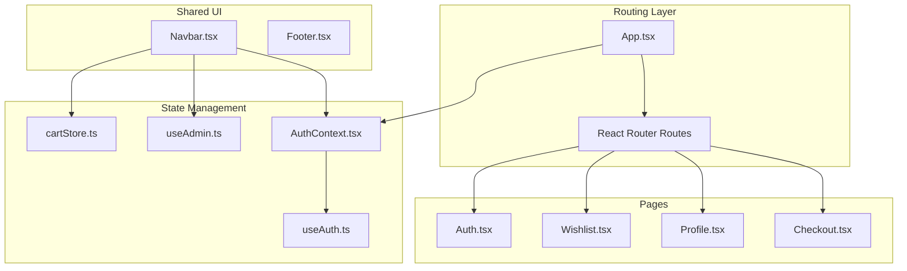
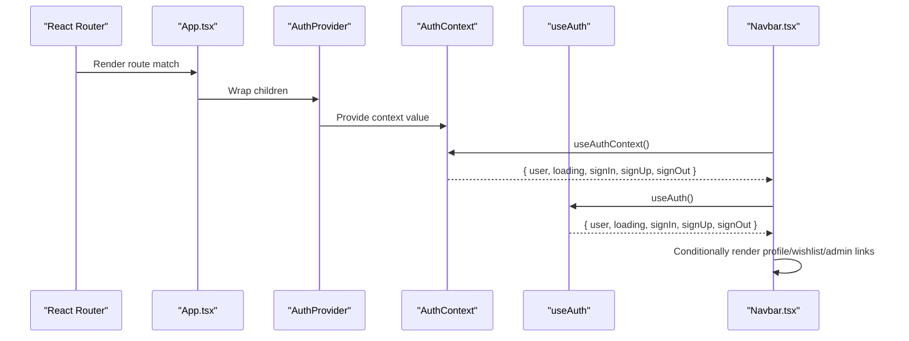
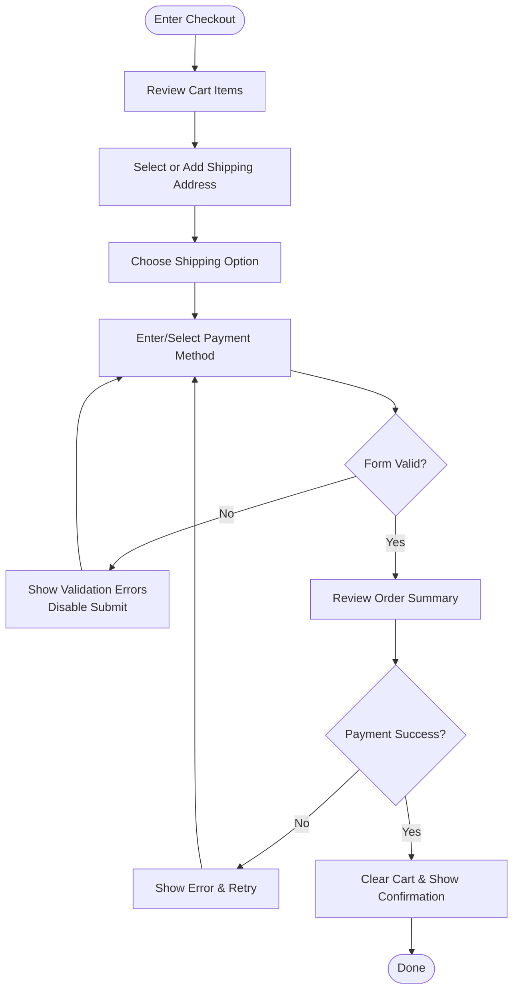
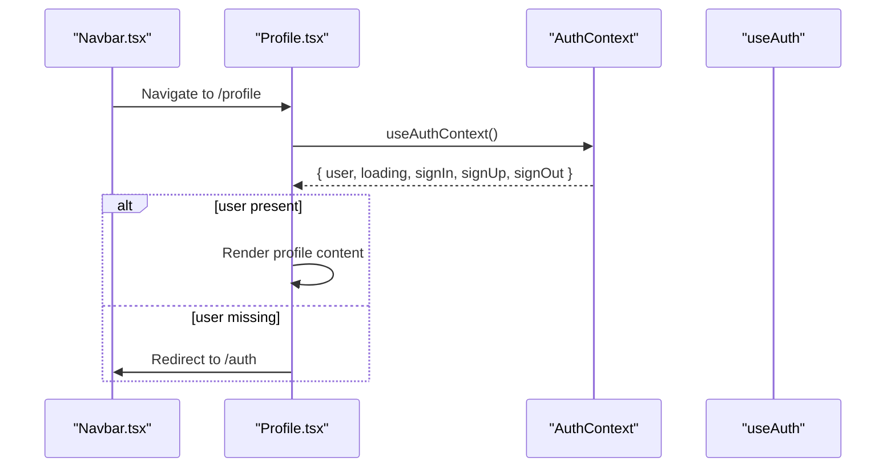
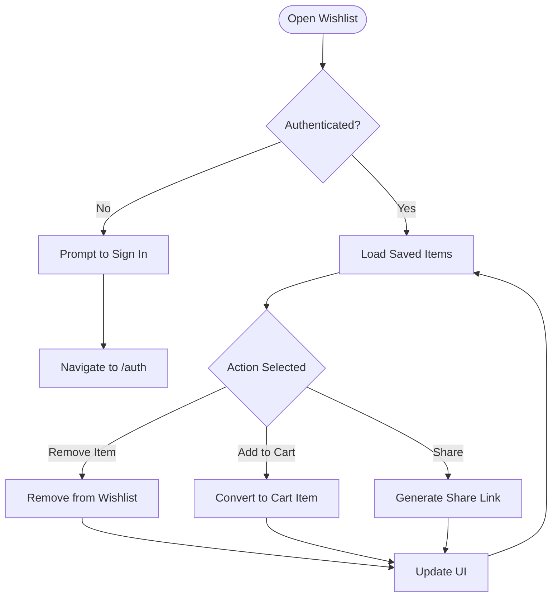
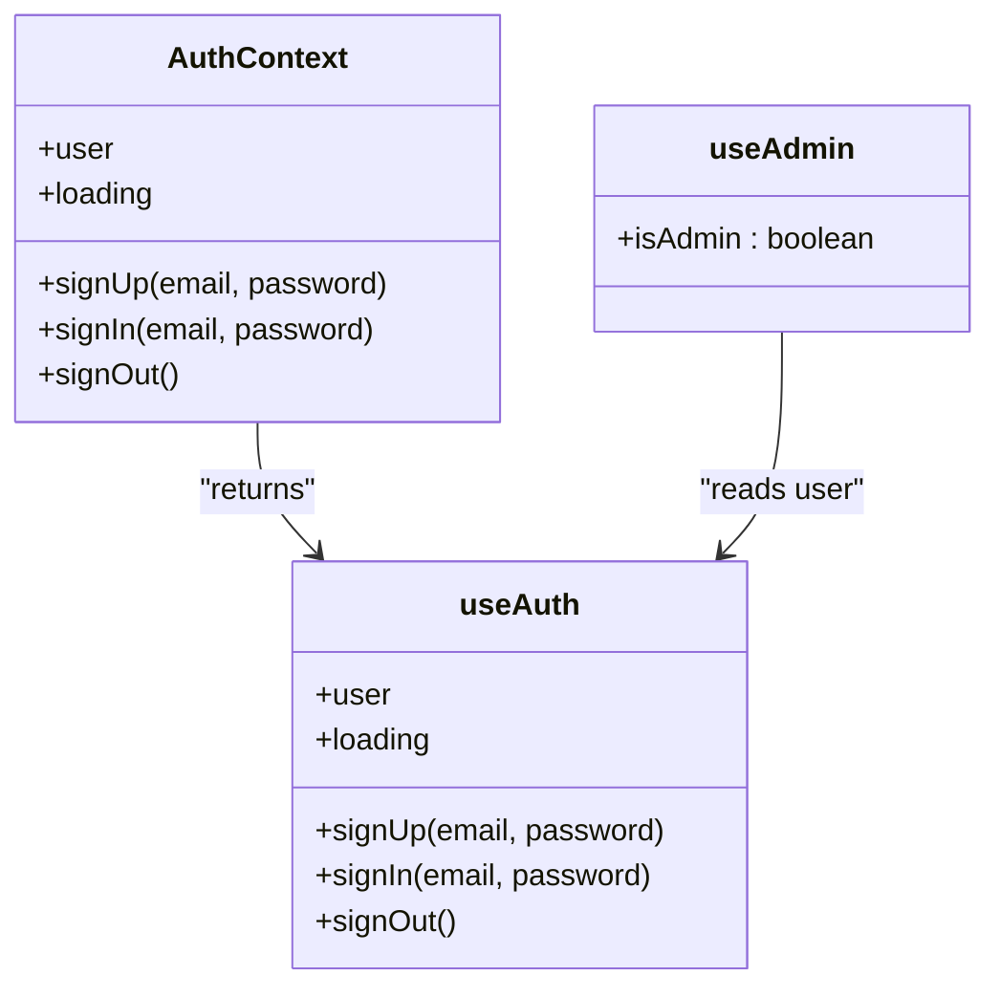
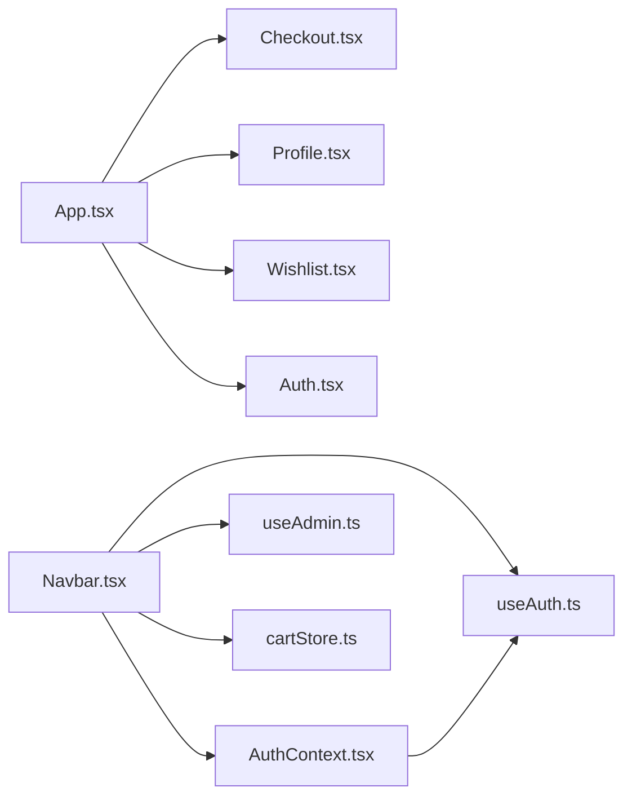

# User-Facing Pages

<cite>
**Referenced Files in This Document**
- [App.tsx](file://autocure/src/App.tsx)
- [Checkout.tsx](file://autocure/src/pages/Checkout.tsx)
- [Profile.tsx](file://autocure/src/pages/Profile.tsx)
- [Wishlist.tsx](file://autocure/src/pages/Wishlist.tsx)
- [Auth.tsx](file://autocure/src/pages/Auth.tsx)
- [AuthContext.tsx](file://autocure/src/contexts/AuthContext.tsx)
- [useAuth.ts](file://autocure/src/hooks/useAuth.ts)
- [useAdmin.ts](file://autocure/src/hooks/useAdmin.ts)
- [cartStore.ts](file://autocure/src/stores/cartStore.ts)
- [Navbar.tsx](file://autocure/src/components/Navbar.tsx)
</cite>

## Table of Contents
1. [Introduction](#introduction)
2. [Project Structure](#project-structure)
3. [Core Components](#core-components)
4. [Architecture Overview](#architecture-overview)
5. [Detailed Component Analysis](#detailed-component-analysis)
6. [Dependency Analysis](#dependency-analysis)
7. [Performance Considerations](#performance-considerations)
8. [Troubleshooting Guide](#troubleshooting-guide)
9. [Conclusion](#conclusion)

## Introduction
This document describes the user-facing pages for Checkout, Profile, and Wishlist within the CarCure2 application. It explains the current state of these pages, outlines the intended multi-step checkout flow, profile management features, and wishlist functionality, and documents the authentication integration, form handling patterns, error validation strategies, and user session management. It also provides examples of form state management, conditional rendering based on authentication status, and data persistence patterns using the existing store and context infrastructure.

## Project Structure
The application uses React with routing, a global authentication context, and a Zustand-based cart store. The pages are registered in the main application shell and rendered conditionally based on routes. Authentication-aware navigation is implemented in the shared navbar.

**Diagram sources**
- [App.tsx](file://autocure/src/App.tsx#L1-L47)
- [Checkout.tsx](file://autocure/src/pages/Checkout.tsx#L1-L17)
- [Profile.tsx](file://autocure/src/pages/Profile.tsx#L1-L17)
- [Wishlist.tsx](file://autocure/src/pages/Wishlist.tsx#L1-L17)
- [Auth.tsx](file://autocure/src/pages/Auth.tsx#L1-L17)
- [AuthContext.tsx](file://autocure/src/contexts/AuthContext.tsx#L1-L37)
- [useAuth.ts](file://autocure/src/hooks/useAuth.ts#L1-L43)
- [useAdmin.ts](file://autocure/src/hooks/useAdmin.ts#L1-L25)
- [cartStore.ts](file://autocure/src/stores/cartStore.ts#L1-L63)
- [Navbar.tsx](file://autocure/src/components/Navbar.tsx#L1-L216)

**Section sources**
- [App.tsx](file://autocure/src/App.tsx#L1-L47)
- [Navbar.tsx](file://autocure/src/components/Navbar.tsx#L1-L216)

## Core Components
- Authentication Context and Hooks
  - Provides user state, loading state, sign-up/sign-in/sign-out functions, and admin role detection.
  - Exposes a hook to consume context safely and a provider to wrap the app.
- Cart Store (Zustand)
  - Manages cart items, quantities, totals, and visibility state.
- Shared Navigation Bar
  - Renders links conditionally based on authentication and admin status, and integrates cart count.
- Page Components
  - Currently minimal placeholders for Checkout, Profile, Wishlist, and Auth.

Key responsibilities:
- Authentication integration: Conditional rendering of profile/wishlist/admin links and auth link.
- Session management: Maintains user session state and exposes sign-out.
- Data persistence patterns: Uses Zustand for cart state; authentication state is local in the auth hook.

**Section sources**
- [AuthContext.tsx](file://autocure/src/contexts/AuthContext.tsx#L1-L37)
- [useAuth.ts](file://autocure/src/hooks/useAuth.ts#L1-L43)
- [useAdmin.ts](file://autocure/src/hooks/useAdmin.ts#L1-L25)
- [cartStore.ts](file://autocure/src/stores/cartStore.ts#L1-L63)
- [Navbar.tsx](file://autocure/src/components/Navbar.tsx#L1-L216)
- [Checkout.tsx](file://autocure/src/pages/Checkout.tsx#L1-L17)
- [Profile.tsx](file://autocure/src/pages/Profile.tsx#L1-L17)
- [Wishlist.tsx](file://autocure/src/pages/Wishlist.tsx#L1-L17)
- [Auth.tsx](file://autocure/src/pages/Auth.tsx#L1-L17)

## Architecture Overview
The pages are routed and wrapped by the authentication provider. The navbar consumes authentication and admin hooks to render appropriate links and icons. The cart store is globally available to components that need cart-related actions.

**Diagram sources**
- [App.tsx](file://autocure/src/App.tsx#L20-L28)
- [AuthContext.tsx](file://autocure/src/contexts/AuthContext.tsx#L20-L28)
- [useAuth.ts](file://autocure/src/hooks/useAuth.ts#L17-L42)
- [Navbar.tsx](file://autocure/src/components/Navbar.tsx#L115-L131)

## Detailed Component Analysis

### Checkout Page
Current state:
- Minimal placeholder page displaying a heading and reusing shared layout components.

Intended multi-step process (design outline):
- Step 1: Cart review and shipping address selection
  - Display cart items, quantities, and totals.
  - Allow selecting a saved address or adding a new one.
- Step 2: Shipping options and delivery date estimation
  - Present shipping tiers with costs and estimated delivery windows.
- Step 3: Payment method selection
  - Accept card details with validation.
  - Support saved payment methods.
- Step 4: Review and confirmation
  - Show order summary, taxes, and total.
  - Confirm and submit order.

Form validation and error handling:
- Use controlled components with local state per field.
- Validate required fields and formats (email, postal code, card number).
- Surface errors near affected fields and disable submission until valid.

Shipping address management:
- Persist selected address in cart store or a dedicated address store.
- Allow toggling between saved addresses and new entries.

Payment processing simulation:
- Simulate payment provider response (success/failure).
- On success, clear cart and show confirmation.
- On failure, display actionable error messages.

Order confirmation flow:
- Redirect to a confirmation page with order ID and summary.
- Offer download receipt and continue shopping.

**Section sources**
- [Checkout.tsx](file://autocure/src/pages/Checkout.tsx#L1-L17)
- [cartStore.ts](file://autocure/src/stores/cartStore.ts#L1-L63)
- [Navbar.tsx](file://autocure/src/components/Navbar.tsx#L74-L90)

### Profile Page
Current state:
- Minimal placeholder page displaying a heading and reusing shared layout components.

Planned features:
- User information display
  - Show email, join date, and profile metadata.
- Account settings management
  - Change password, update email, manage notifications.
- Order history viewing
  - List past orders with status, date, and total.
  - Provide details view per order.
- Personal data editing
  - Edit name, phone, and address with validation.

Authentication integration:
- Require signed-in user; redirect unauthenticated users to Auth.
- Use auth context to fetch user data and sign out.

Form handling patterns:
- Controlled inputs with local state per field.
- Debounced updates for non-critical fields, immediate validation for required fields.

Error validation strategies:
- Validate input formats and uniqueness.
- Show inline errors and aggregate error summaries.
- Disable submit while async checks (e.g., email availability) are pending.

Conditional rendering based on authentication:
- Show profile content when user exists.
- Otherwise, render a prompt to sign in.

Data persistence patterns:
- Use auth context for user state.
- Persist edits via backend APIs (to be implemented) and update local state accordingly.

**Section sources**
- [Profile.tsx](file://autocure/src/pages/Profile.tsx#L1-L17)
- [AuthContext.tsx](file://autocure/src/contexts/AuthContext.tsx#L30-L36)
- [useAuth.ts](file://autocure/src/hooks/useAuth.ts#L17-L42)
- [Navbar.tsx](file://autocure/src/components/Navbar.tsx#L115-L123)

### Wishlist Page
Current state:
- Minimal placeholder page displaying a heading and reusing shared layout components.

Planned features:
- Saved items display
  - Show product image, name, price, and stock status.
- Item removal
  - Remove single or multiple items with confirmation.
- Add-to-cart conversion
  - Convert wishlist item to cart item and remove from wishlist.
- Wishlist sharing
  - Share a public link or copy shareable URL.

Authentication integration:
- Require signed-in user; hide wishlist icon/link when not authenticated.

Form handling patterns:
- Use controlled lists with local state for selections and actions.
- Batch actions (remove all, add all to cart) with confirmation modals.

Error validation strategies:
- Handle network failures and item availability changes.
- Show user-friendly messages and retry options.

Conditional rendering based on authentication:
- Show wishlist content when user exists.
- Otherwise, render a prompt to sign in.

Data persistence patterns:
- Store wishlist items in a dedicated store or backend (to be implemented).
- Sync with cart store when converting items to cart.

**Section sources**
- [Wishlist.tsx](file://autocure/src/pages/Wishlist.tsx#L1-L17)
- [Navbar.tsx](file://autocure/src/components/Navbar.tsx#L92-L101)
- [Auth.tsx](file://autocure/src/pages/Auth.tsx#L1-L17)

### Authentication Integration
- Context and Provider
  - Expose user, loading, sign-up, sign-in, and sign-out.
  - Wrap the app to make context available to all pages.
- Hooks
  - useAuth: Local state for user and loading; stub implementations for sign-up/sign-in.
  - useAdmin: Derive admin status from user; stubbed for now.
- Conditional Rendering
  - Navbar renders profile/wishlist/admin links only when user is present.
  - Auth link appears when user is absent.

**Diagram sources**
- [AuthContext.tsx](file://autocure/src/contexts/AuthContext.tsx#L10-L16)
- [useAuth.ts](file://autocure/src/hooks/useAuth.ts#L9-L15)
- [useAdmin.ts](file://autocure/src/hooks/useAdmin.ts#L4-L6)

**Section sources**
- [AuthContext.tsx](file://autocure/src/contexts/AuthContext.tsx#L1-L37)
- [useAuth.ts](file://autocure/src/hooks/useAuth.ts#L1-L43)
- [useAdmin.ts](file://autocure/src/hooks/useAdmin.ts#L1-L25)
- [Navbar.tsx](file://autocure/src/components/Navbar.tsx#L115-L131)

### Form Handling Patterns and Validation
- Controlled components
  - Maintain form state in component state or store.
  - Update state on input change with validation triggers.
- Validation strategies
  - Required fields, format checks (email, phone), length constraints.
  - Real-time feedback with inline messages.
- Error surfaces
  - Aggregate error list and highlight invalid fields.
  - Disable submit button until validation passes.
- Async operations
  - Debounce expensive checks (e.g., availability).
  - Show loading states during submission.

### User Session Management
- Session lifecycle
  - Initialize with no user.
  - Sign-in sets user; sign-out clears user.
  - Redirect unauthenticated users to Auth when accessing protected pages.
- Persistence
  - Current implementation keeps session in memory.
  - Future integration can persist to secure storage or backend.

**Section sources**
- [useAuth.ts](file://autocure/src/hooks/useAuth.ts#L17-L42)
- [AuthContext.tsx](file://autocure/src/contexts/AuthContext.tsx#L20-L28)
- [Navbar.tsx](file://autocure/src/components/Navbar.tsx#L115-L131)

### Data Persistence Patterns
- Cart store
  - Centralized cart state with actions to add/remove/update items and compute totals.
- Wishlist store (planned)
  - Dedicated store for wishlist items synced with backend.
- Profile data (planned)
  - Fetch and update user profile via backend APIs; update local state on success.

**Section sources**
- [cartStore.ts](file://autocure/src/stores/cartStore.ts#L1-L63)
- [Profile.tsx](file://autocure/src/pages/Profile.tsx#L1-L17)
- [Wishlist.tsx](file://autocure/src/pages/Wishlist.tsx#L1-L17)

## Dependency Analysis
- Routing depends on App and registers all pages.
- Navbar depends on AuthContext, useAdmin, and cartStore for rendering and interactivity.
- AuthContext depends on useAuth for state and functions.
- Pages depend on shared components for layout.

**Diagram sources**
- [App.tsx](file://autocure/src/App.tsx#L1-L47)
- [Navbar.tsx](file://autocure/src/components/Navbar.tsx#L1-L216)
- [AuthContext.tsx](file://autocure/src/contexts/AuthContext.tsx#L1-L37)
- [useAuth.ts](file://autocure/src/hooks/useAuth.ts#L1-L43)
- [useAdmin.ts](file://autocure/src/hooks/useAdmin.ts#L1-L25)
- [cartStore.ts](file://autocure/src/stores/cartStore.ts#L1-L63)

**Section sources**
- [App.tsx](file://autocure/src/App.tsx#L1-L47)
- [Navbar.tsx](file://autocure/src/components/Navbar.tsx#L1-L216)

## Performance Considerations
- Keep form state local to minimize unnecessary re-renders.
- Use memoization for derived values (e.g., cart totals).
- Debounce async validations to reduce server load.
- Lazy-load heavy components on demand.

## Troubleshooting Guide
- Authentication issues
  - Ensure AuthProvider wraps the app.
  - Verify useAuthContext is used inside the provider.
- Navigation problems
  - Confirm routes are registered in App.
  - Check that Navbar links match route paths.
- Cart state anomalies
  - Validate cart store actions and ensure consistent state updates.
  - Verify totals and item counts after mutations.

**Section sources**
- [AuthContext.tsx](file://autocure/src/contexts/AuthContext.tsx#L30-L36)
- [App.tsx](file://autocure/src/App.tsx#L20-L42)
- [cartStore.ts](file://autocure/src/stores/cartStore.ts#L22-L62)

## Conclusion
The Checkout, Profile, and Wishlist pages are currently placeholders. The authentication and state infrastructure (context, hooks, and cart store) provides a solid foundation for implementing the full user experiences described above. By leveraging the existing patterns—controlled forms, validation, conditional rendering, and store-driven state—the team can build robust, maintainable features that integrate seamlessly with the rest of the application.