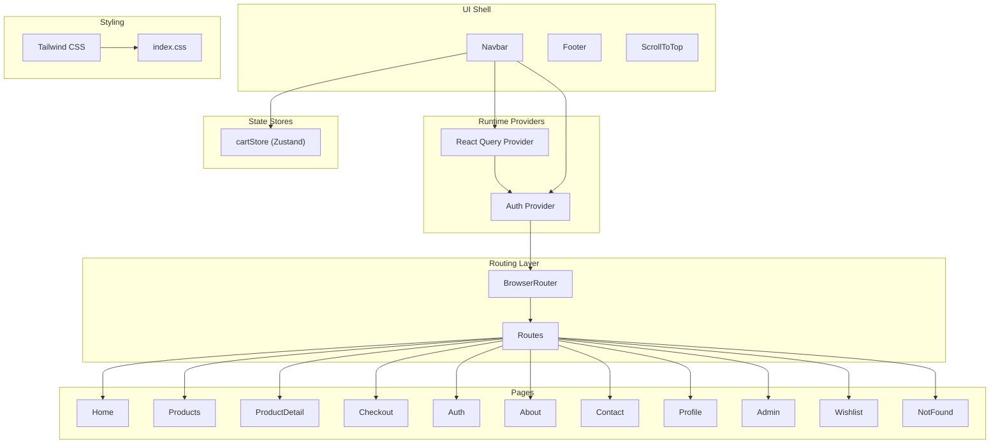
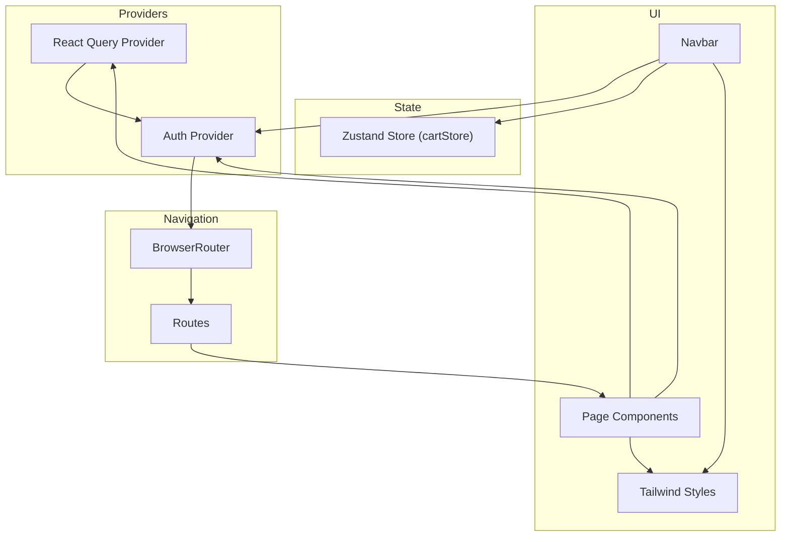
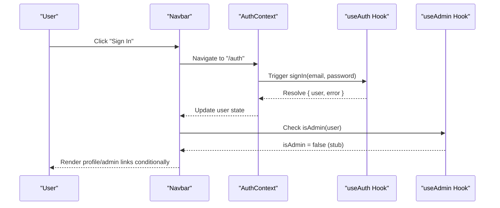
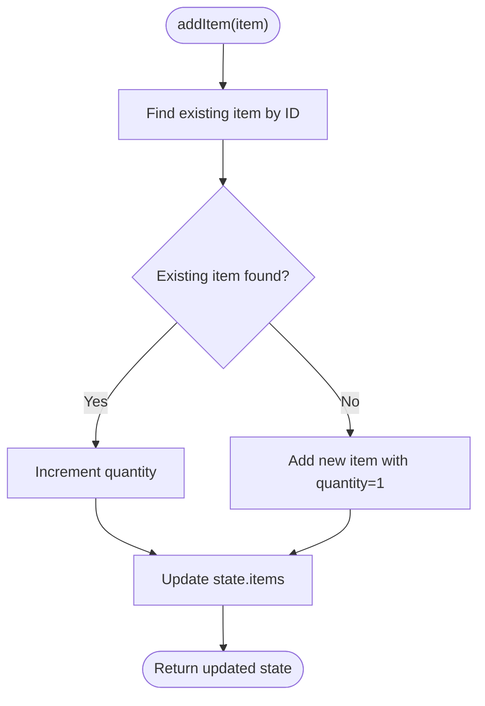
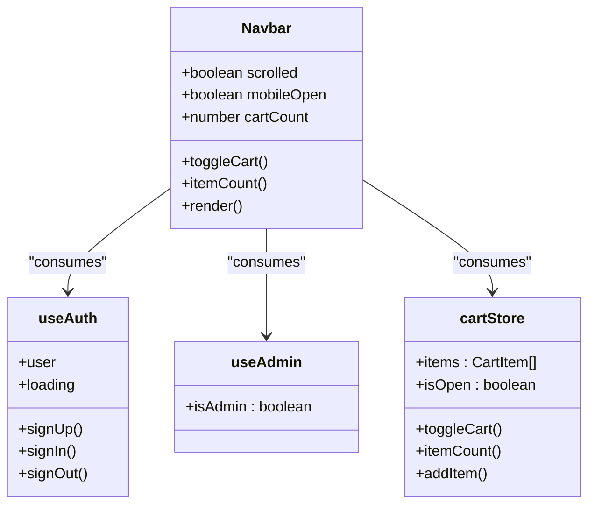
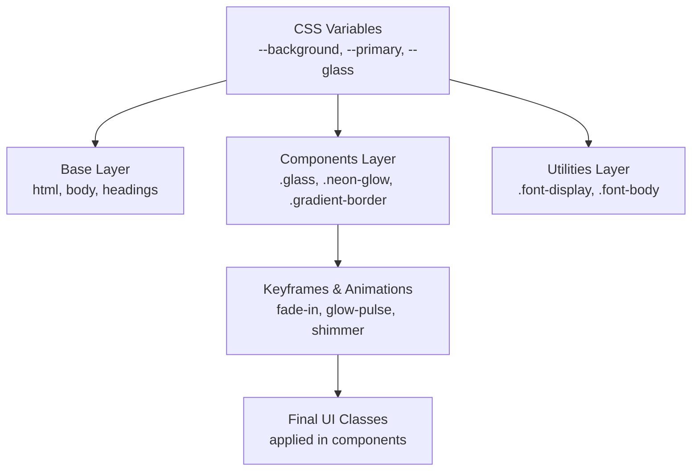
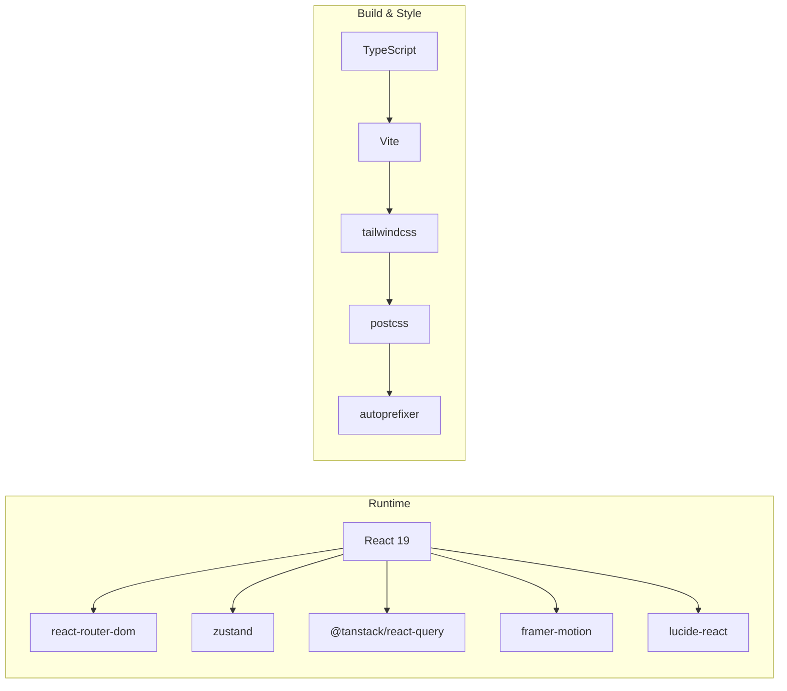

# Project Overview

<cite>
**Referenced Files in This Document**
- [package.json](file://autocure/package.json)
- [tsconfig.json](file://autocure/tsconfig.json)
- [postcss.config.js](file://autocure/postcss.config.js)
- [tailwind.config.ts](file://autocure/tailwind.config.ts)
- [src/main.tsx](file://autocure/src/main.tsx)
- [src/App.tsx](file://autocure/src/App.tsx)
- [src/index.css](file://autocure/src/index.css)
- [src/contexts/AuthContext.tsx](file://autocure/src/contexts/AuthContext.tsx)
- [src/hooks/useAuth.ts](file://autocure/src/hooks/useAuth.ts)
- [src/hooks/useAdmin.ts](file://autocure/src/hooks/useAdmin.ts)
- [src/stores/cartStore.ts](file://autocure/src/stores/cartStore.ts)
- [src/components/Navbar.tsx](file://autocure/src/components/Navbar.tsx)
- [src/pages/Home.tsx](file://autocure/src/pages/Home.tsx)
- [src/pages/Products.tsx](file://autocure/src/pages/Products.tsx)
- [src/pages/Admin.tsx](file://autocure/src/pages/Admin.tsx)
- [src/pages/Auth.tsx](file://autocure/src/pages/Auth.tsx)
- [src/pages/Profile.tsx](file://autocure/src/pages/Profile.tsx)
</cite>

## Table of Contents
1. [Introduction](#introduction)
2. [Project Structure](#project-structure)
3. [Core Components](#core-components)
4. [Architecture Overview](#architecture-overview)
5. [Detailed Component Analysis](#detailed-component-analysis)
6. [Dependency Analysis](#dependency-analysis)
7. [Performance Considerations](#performance-considerations)
8. [Troubleshooting Guide](#troubleshooting-guide)
9. [Conclusion](#conclusion)
10. [Appendices](#appendices)

## Introduction
CarCure2 is a modern automotive parts e-commerce Single Page Application (SPA) built with React 19 and TypeScript. It targets car enthusiasts and professional mechanics who need a fast, responsive interface to browse parts, manage wishlists, and perform secure checkout. The platform emphasizes real-time cart updates, user authentication, and an admin dashboard for backend operations. The frontend-only scope ensures a streamlined development model focused on UI/UX and state orchestration.

Key differentiators:
- Real-time cart updates powered by Zustand for immediate feedback during shopping.
- User authentication and profile management via a dedicated AuthContext and hooks.
- Admin dashboard access gated by role checks for privileged operations.
- Modern UI with Tailwind CSS, custom themes, and animations for an immersive automotive experience.

## Project Structure
The project follows a component-based architecture organized by feature folders:
- src/components: Reusable UI building blocks (Navbar, Footer, ScrollToTop).
- src/contexts: Global application state providers (AuthContext).
- src/hooks: Custom hooks for authentication, admin checks, and reusable logic.
- src/pages: Route-level page components for navigation and content.
- src/stores: Local state stores using Zustand for cart and UI state.
- Public assets and configuration files support build, styling, and runtime behavior.

**Diagram sources**
- [src/App.tsx](file://autocure/src/App.tsx#L1-L47)
- [src/main.tsx](file://autocure/src/main.tsx#L1-L11)
- [src/components/Navbar.tsx](file://autocure/src/components/Navbar.tsx#L1-L216)
- [src/stores/cartStore.ts](file://autocure/src/stores/cartStore.ts#L1-L36)
- [src/index.css](file://autocure/src/index.css#L1-L146)
- [tailwind.config.ts](file://autocure/tailwind.config.ts#L1-L91)

**Section sources**
- [src/App.tsx](file://autocure/src/App.tsx#L1-L47)
- [src/main.tsx](file://autocure/src/main.tsx#L1-L11)
- [src/index.css](file://autocure/src/index.css#L1-L146)
- [tailwind.config.ts](file://autocure/tailwind.config.ts#L1-L91)

## Core Components
- Authentication and Authorization
  - AuthContext provides a typed context for user state and auth actions.
  - useAuth encapsulates sign-up, sign-in, and sign-out logic with loading states.
  - useAdmin derives admin privileges from current user and guards admin routes.
- State Management
  - cartStore manages cart items, visibility, and item count with Zustand.
- Routing and Navigation
  - App wires up routing with react-router-dom and integrates providers.
  - Navbar displays dynamic cart count, conditional links for authenticated/admin users, and mobile responsiveness.
- Styling and Theming
  - Tailwind CSS with custom design tokens, neon accents, and glass morphism effects.
  - index.css defines CSS variables and layered styles for base, components, and utilities.

**Section sources**
- [src/contexts/AuthContext.tsx](file://autocure/src/contexts/AuthContext.tsx#L1-L37)
- [src/hooks/useAuth.ts](file://autocure/src/hooks/useAuth.ts#L1-L43)
- [src/hooks/useAdmin.ts](file://autocure/src/hooks/useAdmin.ts#L1-L25)
- [src/stores/cartStore.ts](file://autocure/src/stores/cartStore.ts#L1-L36)
- [src/components/Navbar.tsx](file://autocure/src/components/Navbar.tsx#L1-L216)
- [src/App.tsx](file://autocure/src/App.tsx#L1-L47)
- [src/index.css](file://autocure/src/index.css#L1-L146)
- [tailwind.config.ts](file://autocure/tailwind.config.ts#L1-L91)

## Architecture Overview
CarCure2 employs a provider-centric architecture:
- React Query Provider wraps the app to enable caching, background updates, and optimistic UI patterns.
- Auth Provider supplies user session state and auth actions to all pages.
- Zustand stores encapsulate local UI state (cart) with minimal boilerplate.
- Tailwind CSS and custom tokens deliver a cohesive, themeable UI.

**Diagram sources**
- [src/App.tsx](file://autocure/src/App.tsx#L1-L47)
- [src/contexts/AuthContext.tsx](file://autocure/src/contexts/AuthContext.tsx#L1-L37)
- [src/stores/cartStore.ts](file://autocure/src/stores/cartStore.ts#L1-L36)
- [src/components/Navbar.tsx](file://autocure/src/components/Navbar.tsx#L1-L216)
- [src/index.css](file://autocure/src/index.css#L1-L146)

## Detailed Component Analysis

### Authentication and Authorization Flow
The authentication system is structured around a typed context and custom hooks:
- AuthContext exposes sign-up, sign-in, sign-out, and user state.
- useAuth provides stub implementations for auth actions and manages loading states.
- useAdmin derives admin status from the current user and guards admin UI elements.

**Diagram sources**
- [src/contexts/AuthContext.tsx](file://autocure/src/contexts/AuthContext.tsx#L1-L37)
- [src/hooks/useAuth.ts](file://autocure/src/hooks/useAuth.ts#L1-L43)
- [src/hooks/useAdmin.ts](file://autocure/src/hooks/useAdmin.ts#L1-L25)
- [src/components/Navbar.tsx](file://autocure/src/components/Navbar.tsx#L1-L216)

**Section sources**
- [src/contexts/AuthContext.tsx](file://autocure/src/contexts/AuthContext.tsx#L1-L37)
- [src/hooks/useAuth.ts](file://autocure/src/hooks/useAuth.ts#L1-L43)
- [src/hooks/useAdmin.ts](file://autocure/src/hooks/useAdmin.ts#L1-L25)
- [src/components/Navbar.tsx](file://autocure/src/components/Navbar.tsx#L115-L131)

### Cart State Management
The cart store uses Zustand to manage items, visibility, and item count:
- addItem handles adding new items or incrementing quantities.
- itemCount aggregates total units across cart items.
- toggleCart controls the cart panel visibility.

**Diagram sources**
- [src/stores/cartStore.ts](file://autocure/src/stores/cartStore.ts#L19-L35)

**Section sources**
- [src/stores/cartStore.ts](file://autocure/src/stores/cartStore.ts#L1-L36)
- [src/components/Navbar.tsx](file://autocure/src/components/Navbar.tsx#L74-L90)

### UI Shell and Navigation
The Navbar integrates cart state, authentication, and admin checks:
- Displays cart badge with real-time item count.
- Shows profile/admin links conditionally based on user and admin status.
- Implements responsive mobile menu with Framer Motion animations.

**Diagram sources**
- [src/components/Navbar.tsx](file://autocure/src/components/Navbar.tsx#L1-L216)
- [src/hooks/useAuth.ts](file://autocure/src/hooks/useAuth.ts#L1-L43)
- [src/hooks/useAdmin.ts](file://autocure/src/hooks/useAdmin.ts#L1-L25)
- [src/stores/cartStore.ts](file://autocure/src/stores/cartStore.ts#L1-L36)

**Section sources**
- [src/components/Navbar.tsx](file://autocure/src/components/Navbar.tsx#L1-L216)

### Theme and Styling System
Tailwind CSS with custom design tokens enables a cohesive, automotive-themed UI:
- CSS variables define background, foreground, primary/secondary colors, and glass/neon effects.
- Custom animations (fade-in, glow-pulse, slide-in-right, float) enhance interactivity.
- Layered Tailwind directives organize base, components, and utilities.

**Diagram sources**
- [src/index.css](file://autocure/src/index.css#L5-L146)
- [tailwind.config.ts](file://autocure/tailwind.config.ts#L9-L88)

**Section sources**
- [src/index.css](file://autocure/src/index.css#L1-L146)
- [tailwind.config.ts](file://autocure/tailwind.config.ts#L1-L91)

## Dependency Analysis
The project relies on a focused set of libraries:
- React 19 and React Router DOM for UI and routing.
- Zustand for lightweight, unopinionated state management.
- React Query for caching, background updates, and optimistic UI.
- Tailwind CSS with PostCSS and autoprefixer for styling.
- Framer Motion and Lucide React for animations and icons.

**Diagram sources**
- [package.json](file://autocure/package.json#L11-L28)
- [postcss.config.js](file://autocure/postcss.config.js#L1-L7)
- [tsconfig.json](file://autocure/tsconfig.json#L1-L28)

**Section sources**
- [package.json](file://autocure/package.json#L1-L30)
- [postcss.config.js](file://autocure/postcss.config.js#L1-L7)
- [tsconfig.json](file://autocure/tsconfig.json#L1-L28)

## Performance Considerations
- Zustand minimizes re-renders by allowing granular selector patterns and avoiding unnecessary subscriptions.
- React Query’s caching reduces network requests and accelerates navigation between pages.
- Tailwind’s JIT and CSS variable usage keep styles efficient and maintainable.
- Lazy-loading route components and code-splitting via Vite improve initial load performance.

## Troubleshooting Guide
Common areas to inspect:
- Authentication hook stubs: Ensure sign-up/sign-in resolve with proper user objects and errors.
- Admin role gating: Confirm user role resolution and UI visibility for admin-only routes.
- Cart store updates: Verify item addition and quantity increments across repeated clicks.
- Navbar responsiveness: Test mobile menu toggling and route-driven closing behavior.
- Styling regressions: Validate Tailwind class usage and CSS variable overrides.

**Section sources**
- [src/hooks/useAuth.ts](file://autocure/src/hooks/useAuth.ts#L21-L33)
- [src/hooks/useAdmin.ts](file://autocure/src/hooks/useAdmin.ts#L8-L21)
- [src/stores/cartStore.ts](file://autocure/src/stores/cartStore.ts#L24-L34)
- [src/components/Navbar.tsx](file://autocure/src/components/Navbar.tsx#L35-L38)

## Conclusion
CarCure2 establishes a solid foundation for an automotive parts e-commerce platform with a modern React 19 + TypeScript stack, real-time cart updates, robust authentication hooks, and a themed UI. The frontend-only scope allows rapid iteration on UX while preserving clear extension points for backend integration and advanced state orchestration.

## Appendices
- Technology Stack Summary
  - Frontend: React 19, TypeScript, Vite
  - State: Zustand (local), React Query (remote)
  - Styling: Tailwind CSS, PostCSS, autoprefixer
  - UI Enhancements: Framer Motion, Lucide React
- Scope Limitations
  - Authentication and admin logic are currently stubbed; integrate backend APIs for production.
  - No product catalog or payment processing is implemented; pages serve as placeholders.
- Extension Points
  - Integrate Supabase or Firebase for authentication and admin roles.
  - Connect product APIs and cart persistence via React Query.
  - Add checkout flow, order management, and inventory sync.