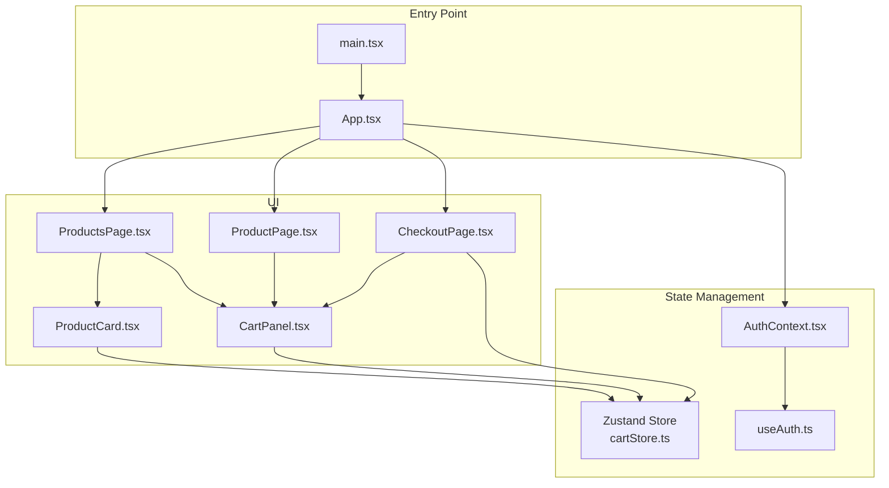
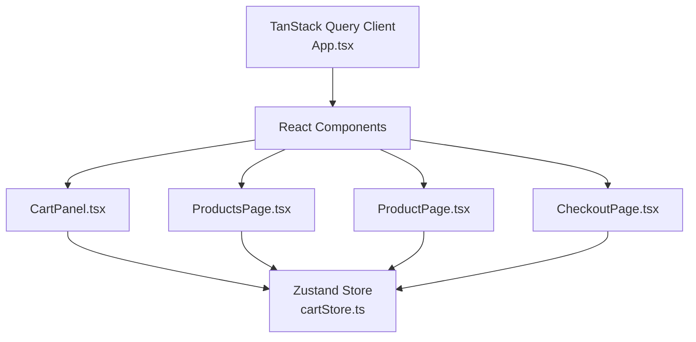
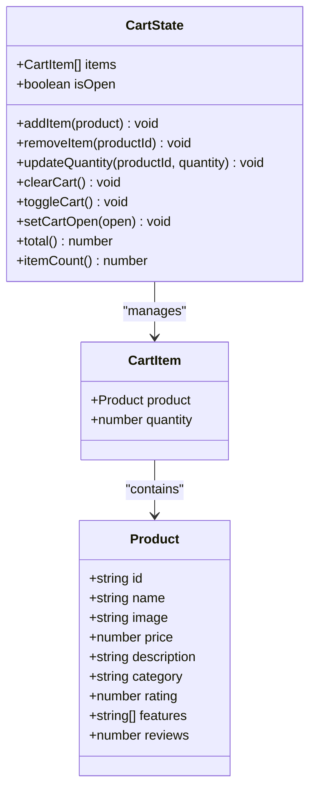
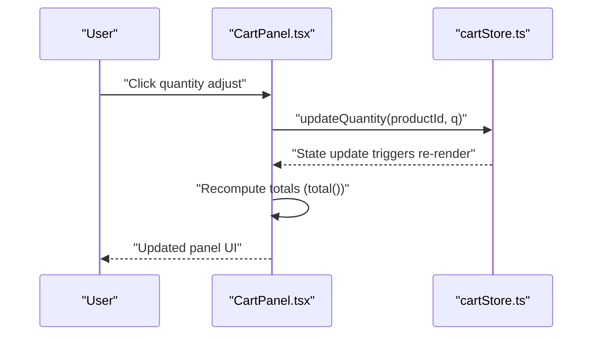
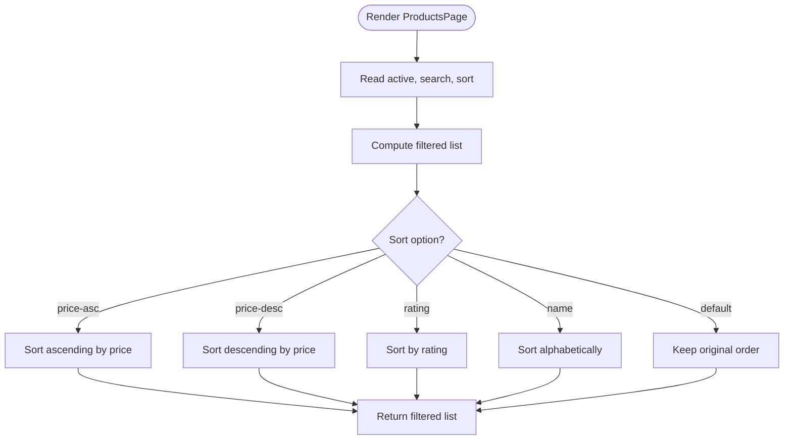
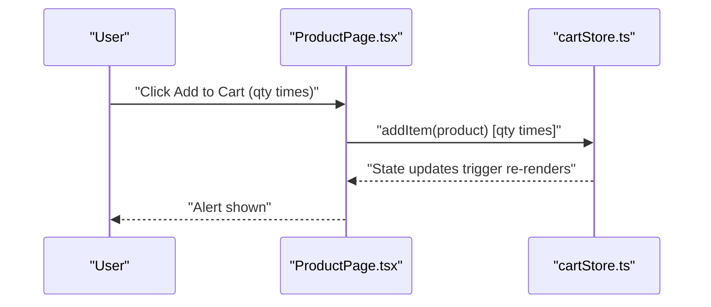
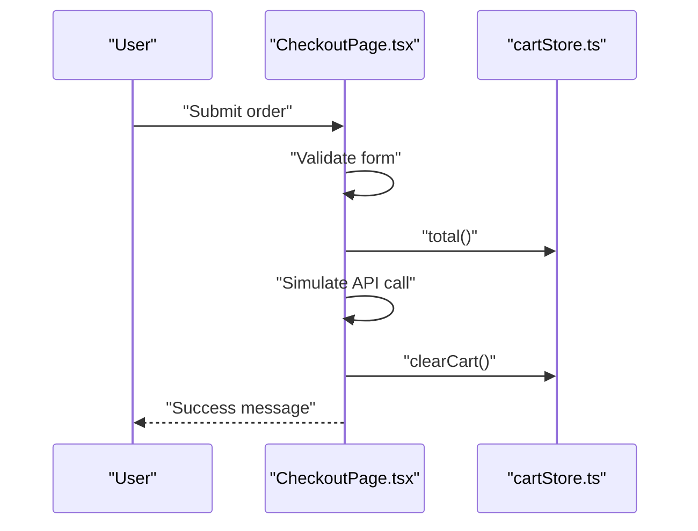
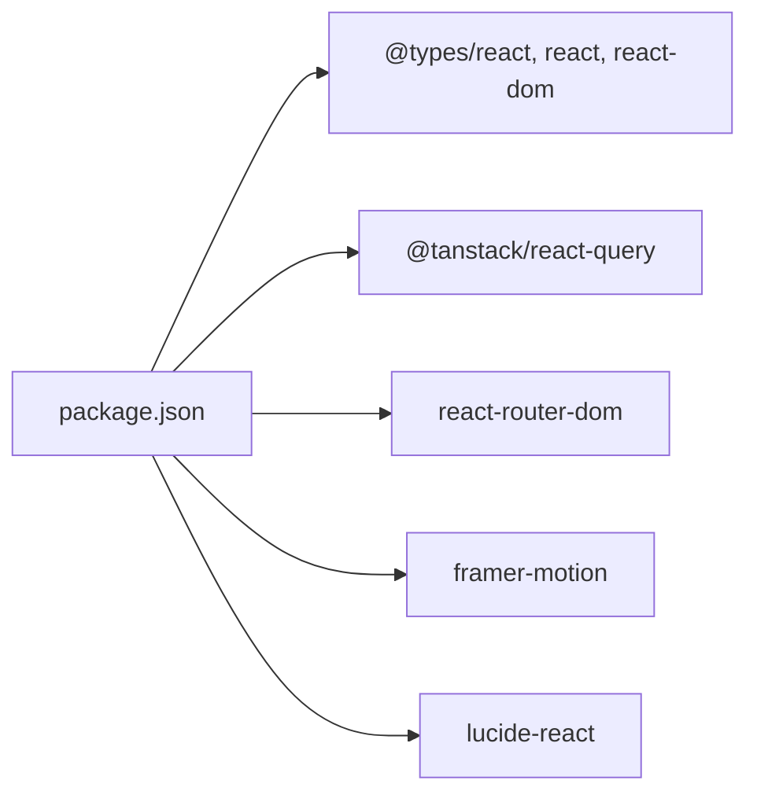

# Performance Optimization Strategies

<cite>
**Referenced Files in This Document**
- [cartStore.ts](file://autocure/src/stores/cartStore.ts)
- [CartPanel.tsx](file://autocure/src/components/CartPanel.tsx)
- [ProductsPage.tsx](file://autocure/src/pages/ProductsPage.tsx)
- [ProductPage.tsx](file://autocure/src/pages/ProductPage.tsx)
- [CheckoutPage.tsx](file://autocure/src/pages/CheckoutPage.tsx)
- [ProductCard.tsx](file://autocure/src/components/ProductCard.tsx)
- [App.tsx](file://autocure/src/App.tsx)
- [main.tsx](file://autocure/src/main.tsx)
- [AuthContext.tsx](file://autocure/src/contexts/AuthContext.tsx)
- [useAuth.ts](file://autocure/src/hooks/useAuth.ts)
- [package.json](file://autocure/package.json)
</cite>

## Table of Contents
1. [Introduction](#introduction)
2. [Project Structure](#project-structure)
3. [Core Components](#core-components)
4. [Architecture Overview](#architecture-overview)
5. [Detailed Component Analysis](#detailed-component-analysis)
6. [Dependency Analysis](#dependency-analysis)
7. [Performance Considerations](#performance-considerations)
8. [Troubleshooting Guide](#troubleshooting-guide)
9. [Conclusion](#conclusion)
10. [Appendices](#appendices)

## Introduction
This document provides a comprehensive guide to performance optimization strategies for CarCure2’s state management system. It focuses on minimizing unnecessary re-renders, optimizing selector usage, managing memory efficiently, and applying normalization patterns. It also covers memoization strategies, lazy loading approaches for large datasets, performance monitoring techniques, debugging state-related performance issues, and best practices for scalable state management. Practical examples demonstrate optimizing cart operations, reducing state update frequency, and implementing efficient state subscriptions.

## Project Structure
CarCure2 uses a modern React stack with Zustand for local state and TanStack Query for server cache hydration. The application is structured around feature-based pages and shared components, with a dedicated cart store for shopping-cart state.

**Diagram sources**
- [main.tsx](file://autocure/src/main.tsx#L1-L11)
- [App.tsx](file://autocure/src/App.tsx#L1-L47)
- [cartStore.ts](file://autocure/src/stores/cartStore.ts#L1-L63)
- [ProductsPage.tsx](file://autocure/src/pages/ProductsPage.tsx#L1-L225)
- [ProductPage.tsx](file://autocure/src/pages/ProductPage.tsx#L1-L364)
- [CheckoutPage.tsx](file://autocure/src/pages/CheckoutPage.tsx#L1-L381)
- [CartPanel.tsx](file://autocure/src/components/CartPanel.tsx#L1-L143)
- [ProductCard.tsx](file://autocure/src/components/ProductCard.tsx#L1-L95)
- [AuthContext.tsx](file://autocure/src/contexts/AuthContext.tsx#L1-L37)
- [useAuth.ts](file://autocure/src/hooks/useAuth.ts#L1-L43)

**Section sources**
- [main.tsx](file://autocure/src/main.tsx#L1-L11)
- [App.tsx](file://autocure/src/App.tsx#L1-L47)
- [package.json](file://autocure/package.json#L1-L30)

## Core Components
- Zustand cart store: Centralized state for cart items, open/closed state, and derived totals and counts. Exposes actions to add/remove/update items and toggles.
- Cart panel: Animated panel that subscribes to cart state and renders items, quantities, and totals.
- Product pages: Filtering, sorting, and related product computation using memoization.
- Checkout page: Form validation and order submission with cart-derived totals.
- Authentication context: Lightweight user state provider.

Key performance-relevant aspects:
- Cart store computes totals and counts on-demand via functions, avoiding redundant derived state updates.
- Pages use useMemo to avoid recomputing filtered lists and related products.
- Cart panel maps over items and uses layout animations; careful with frequent updates.

**Section sources**
- [cartStore.ts](file://autocure/src/stores/cartStore.ts#L1-L63)
- [CartPanel.tsx](file://autocure/src/components/CartPanel.tsx#L1-L143)
- [ProductsPage.tsx](file://autocure/src/pages/ProductsPage.tsx#L1-L225)
- [ProductPage.tsx](file://autocure/src/pages/ProductPage.tsx#L1-L364)
- [CheckoutPage.tsx](file://autocure/src/pages/CheckoutPage.tsx#L1-L381)
- [AuthContext.tsx](file://autocure/src/contexts/AuthContext.tsx#L1-L37)
- [useAuth.ts](file://autocure/src/hooks/useAuth.ts#L1-L43)

## Architecture Overview
The state architecture combines local store state (cart) with UI-driven computations and external caching via TanStack Query.

**Diagram sources**
- [cartStore.ts](file://autocure/src/stores/cartStore.ts#L1-L63)
- [CartPanel.tsx](file://autocure/src/components/CartPanel.tsx#L1-L143)
- [ProductsPage.tsx](file://autocure/src/pages/ProductsPage.tsx#L1-L225)
- [ProductPage.tsx](file://autocure/src/pages/ProductPage.tsx#L1-L364)
- [CheckoutPage.tsx](file://autocure/src/pages/CheckoutPage.tsx#L1-L381)
- [App.tsx](file://autocure/src/App.tsx#L1-L47)

## Detailed Component Analysis

### Cart Store Analysis
The cart store encapsulates:
- Items: array of cart entries with product and quantity.
- Flags: isOpen for cart visibility.
- Actions: addItem, removeItem, updateQuantity, clearCart, toggleCart, setCartOpen.
- Derived helpers: total, itemCount computed on demand.

Performance characteristics:
- addItem/updateQuantity/removeItem use functional updates to minimize re-renders by returning shallowly equal objects when possible.
- total and itemCount compute values lazily, avoiding storing redundant derived state.

**Diagram sources**
- [cartStore.ts](file://autocure/src/stores/cartStore.ts#L4-L20)

**Section sources**
- [cartStore.ts](file://autocure/src/stores/cartStore.ts#L1-L63)

### Cart Panel Analysis
The cart panel subscribes to the entire cart slice and renders:
- A backdrop and sliding panel.
- A list of items with per-item animations.
- Quantity controls and removal actions.
- A footer with total and checkout link.

Performance considerations:
- Uses AnimatePresence and motion wrappers; frequent cart updates can trigger layout animations.
- Rendering per-item animations scales with item count; consider virtualization for very large carts.
- total() is called on render; prefer memoizing totals at the component level.

**Diagram sources**
- [CartPanel.tsx](file://autocure/src/components/CartPanel.tsx#L1-L143)
- [cartStore.ts](file://autocure/src/stores/cartStore.ts#L42-L62)

**Section sources**
- [CartPanel.tsx](file://autocure/src/components/CartPanel.tsx#L1-L143)
- [cartStore.ts](file://autocure/src/stores/cartStore.ts#L1-L63)

### Products Page Analysis
The Products page uses useMemo to compute:
- Filtered products by category and search term.
- Sorting by multiple criteria.

Performance benefits:
- Memoized filtered list prevents re-sorting/filtering on unrelated state changes.
- Sorting occurs only when inputs change.

**Diagram sources**
- [ProductsPage.tsx](file://autocure/src/pages/ProductsPage.tsx#L38-L77)

**Section sources**
- [ProductsPage.tsx](file://autocure/src/pages/ProductsPage.tsx#L1-L225)

### Product Page Analysis
The Product page:
- Finds the current product via useMemo keyed by route params.
- Computes related products by category and excludes self.
- Adds multiple units via a loop in addItem.

Performance considerations:
- Using useMemo for product lookup avoids repeated array scans.
- Adding multiple units in a loop increases store updates; batch operations could reduce re-renders.

**Diagram sources**
- [ProductPage.tsx](file://autocure/src/pages/ProductPage.tsx#L100-L105)
- [cartStore.ts](file://autocure/src/stores/cartStore.ts#L26-L36)

**Section sources**
- [ProductPage.tsx](file://autocure/src/pages/ProductPage.tsx#L1-L364)
- [cartStore.ts](file://autocure/src/stores/cartStore.ts#L1-L63)

### Checkout Page Analysis
The Checkout page:
- Validates form inputs and disables submit when user is not signed in.
- Displays order summary using cart items and total.
- Clears cart after successful order placement.

Performance considerations:
- total() is called during render and form submission; memoize totals at component level to avoid recomputation.
- Empty cart guard prevents unnecessary rendering.

**Diagram sources**
- [CheckoutPage.tsx](file://autocure/src/pages/CheckoutPage.tsx#L67-L117)
- [cartStore.ts](file://autocure/src/stores/cartStore.ts#L59-L61)

**Section sources**
- [CheckoutPage.tsx](file://autocure/src/pages/CheckoutPage.tsx#L1-L381)
- [cartStore.ts](file://autocure/src/stores/cartStore.ts#L1-L63)

### Product Card Analysis
The Product card:
- Subscribes to the cart store to add items.
- Uses viewport-based animations for staggered entry.

Performance considerations:
- addItem is invoked directly; consider debouncing or batching if cards are frequently interacted with.
- Lazy loading on images helps with initial load performance.

**Section sources**
- [ProductCard.tsx](file://autocure/src/components/ProductCard.tsx#L1-L95)
- [cartStore.ts](file://autocure/src/stores/cartStore.ts#L1-L63)

## Dependency Analysis
External libraries and their roles:
- Zustand: Lightweight state management for cart operations.
- Framer Motion: Animations for cart panel and product cards.
- Lucide React: Icons for cart controls and UI.
- React Router: Routing for pages.
- TanStack Query: Caching and hydration provider at the app root.

**Diagram sources**
- [package.json](file://autocure/package.json#L1-L30)

**Section sources**
- [package.json](file://autocure/package.json#L1-L30)

## Performance Considerations

### Minimizing Unnecessary Re-Renders
- Prefer granular selectors: Instead of subscribing to the entire cart slice, extract only needed fields. For example, pass only items length to indicators and compute totals locally.
- Batch updates: Avoid multiple small updates in loops (e.g., adding multiple units). Consider a single action that accepts a quantity increment or a batch operation if supported by the store.
- Memoize derived data: Use useMemo for expensive computations (already used for filtering and related products).

### Optimizing Selector Usage
- Use shallow equality checks: Zustand’s default equality check compares object identity; keep state shapes flat or use shallow updates to prevent re-renders.
- Normalize state: Store normalized entities (e.g., products by id) and derive views. This reduces deep object churn and improves selector performance.

### Memory Efficiency
- Avoid retaining large intermediate arrays: Filter/sort operations create new arrays; ensure they are not held in closures or long-lived refs.
- Clear cart on completion: The checkout flow clears the cart, preventing accumulation of stale items.

### State Normalization Patterns
- Current state shape: items as a flat array of CartItem with embedded Product.
- Recommended normalization: Separate entities (products) and references (cart items as productId + quantity). This enables:
  - Faster updates when product metadata changes.
  - Easier pagination and lazy loading of product lists.
  - Reduced memory footprint for large catalogs.

### Memoization Strategies
- useMemo for derived lists: Already applied in ProductsPage and ProductPage for filtering and related products.
- useCallback for handlers: Wrap event handlers passed to children to prevent prop drift and unnecessary re-renders.
- Component-level memoization: Wrap heavy components with memoization to avoid re-computation.

### Lazy Loading Approaches for Large Datasets
- Virtualize lists: For large product grids, use a virtualized list to render only visible items.
- Pagination: Split product listings into pages to limit DOM nodes and memory usage.
- On-demand fetching: Integrate TanStack Query for server-side caching and infinite scrolling.

### Performance Monitoring and Debugging
- React DevTools Profiler: Identify components with frequent re-renders and long commit times.
- React Developer Tools “Highlight Updates”: Observe which components re-render on state changes.
- Measure totals: Cache total calculations at the component level to avoid repeated recomputation.
- Network profiling: Use browser devtools to monitor API calls and cache hits.

### Best Practices for Scalable State Management
- Keep state flat: Prefer primitive keys and minimal nesting to improve selector performance.
- Use domain-specific slices: Separate cart, UI flags, and user preferences into distinct slices.
- Favor immutable updates: Use functional updates to preserve referential stability.
- Avoid global subscriptions: Limit subscriptions to only the components that need them.

### Examples: Optimizing Cart Operations
- Reduce update frequency:
  - Replace repeated addItem calls with a single batch operation or a single updateQuantity call.
  - Debounce rapid-fire quantity adjustments in the cart panel.
- Efficient state subscriptions:
  - Subscribe to only the fields needed (e.g., items length for badge, totals computed locally).
- Implement efficient state subscriptions:
  - Use shallow selectors to pick specific fields from the cart store.

### Guidelines for Profiling State Performance
- Identify hotspots: Use React Profiler to locate components with excessive renders.
- Measure selector costs: Time computations like filtering, sorting, and totals.
- Inspect network and cache: Ensure TanStack Query is configured to reuse cached data and avoid redundant requests.

### Identifying Bottlenecks in Complex State Interactions
- Cart-panel re-renders: When many items change, consider virtualization and local memoization of totals.
- Product-page recomputation: Ensure product lookup and related-product derivation are memoized.
- Checkout totals: Compute and memoize totals at the component level to avoid repeated store reads.

[No sources needed since this section provides general guidance]

## Troubleshooting Guide
Common performance issues and remedies:
- Excessive cart re-renders:
  - Symptom: Cart panel flickers or stutters when adjusting quantities.
  - Fix: Memoize totals at the component level; batch updates; avoid unnecessary re-renders by keeping state flat.
- Slow product filtering/sorting:
  - Symptom: UI freezes during search or sort.
  - Fix: Ensure filtering/sorting are memoized; consider virtualization for large grids.
- High memory usage:
  - Symptom: Browser tab becomes sluggish over time.
  - Fix: Clear cart after checkout; avoid retaining large intermediate arrays; normalize state.

**Section sources**
- [CartPanel.tsx](file://autocure/src/components/CartPanel.tsx#L1-L143)
- [ProductsPage.tsx](file://autocure/src/pages/ProductsPage.tsx#L1-L225)
- [CheckoutPage.tsx](file://autocure/src/pages/CheckoutPage.tsx#L1-L381)
- [cartStore.ts](file://autocure/src/stores/cartStore.ts#L1-L63)

## Conclusion
CarCure2’s state management leverages Zustand for cart operations and TanStack Query for caching. By applying memoization, normalizing state, batching updates, and carefully managing subscriptions, the application can achieve smooth interactions even with larger datasets. The strategies outlined here—selector optimization, lazy loading, performance monitoring, and debugging techniques—provide a roadmap to scalable and responsive state management.

[No sources needed since this section summarizes without analyzing specific files]

## Appendices

### Quick Reference: Where to Apply Optimizations
- Cart operations: cartStore.ts, CartPanel.tsx, ProductPage.tsx, CheckoutPage.tsx
- Filtering/sorting: ProductsPage.tsx
- Product cards: ProductCard.tsx
- Authentication: AuthContext.tsx, useAuth.ts
- App bootstrap: App.tsx, main.tsx

[No sources needed since this section provides general guidance]