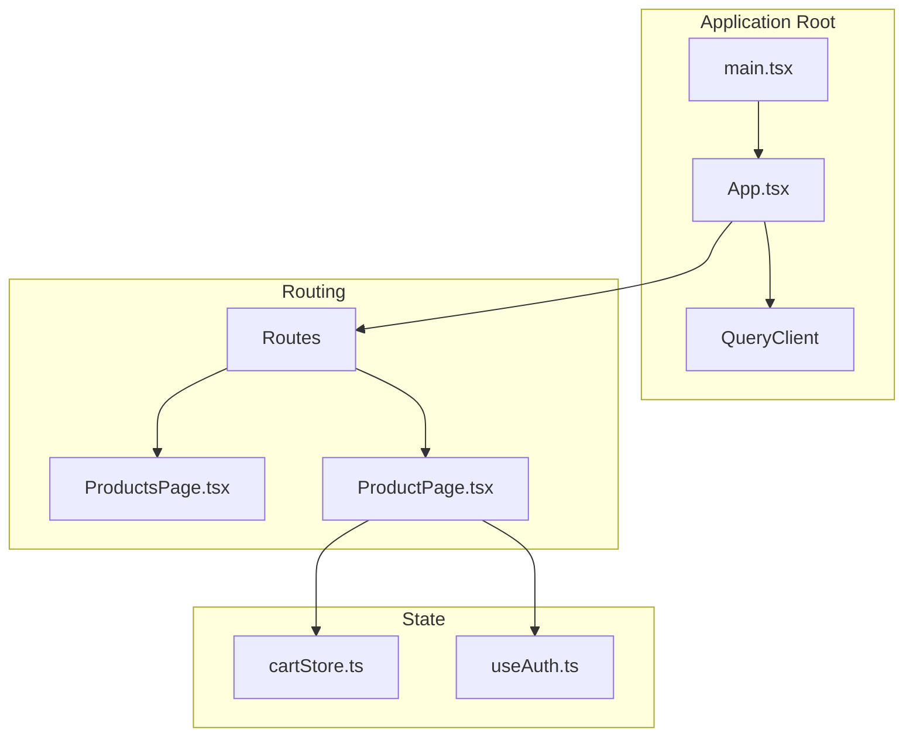
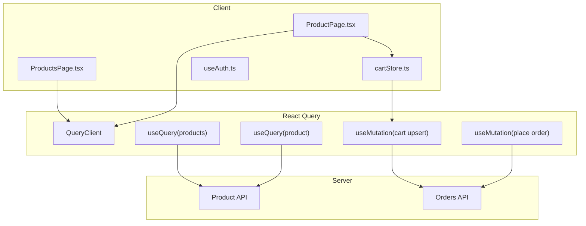
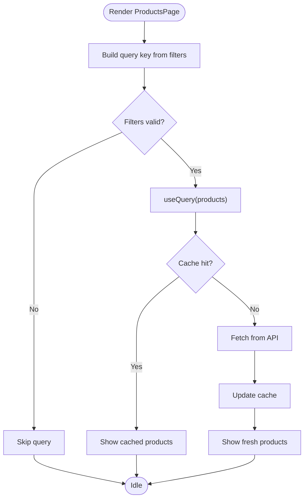
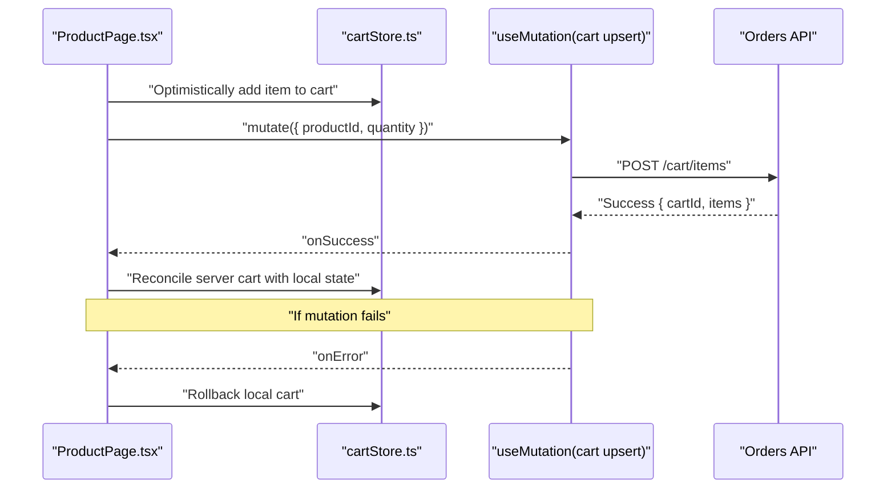
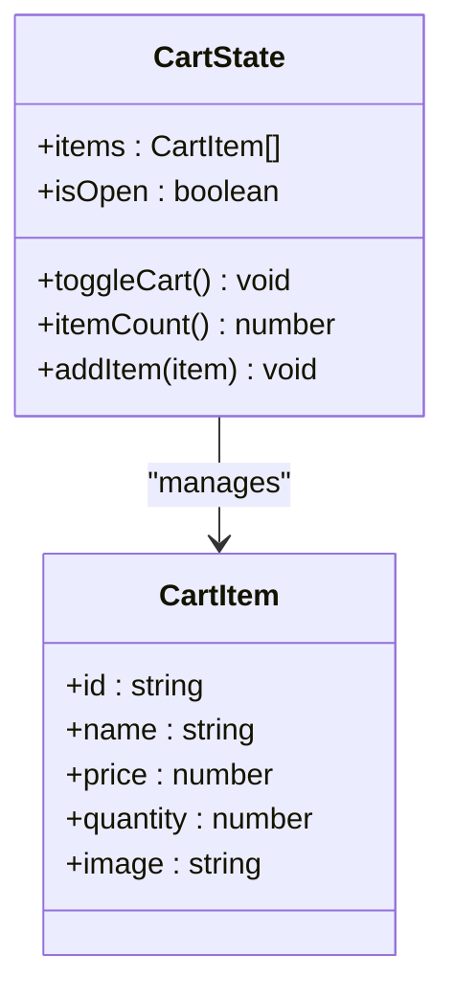
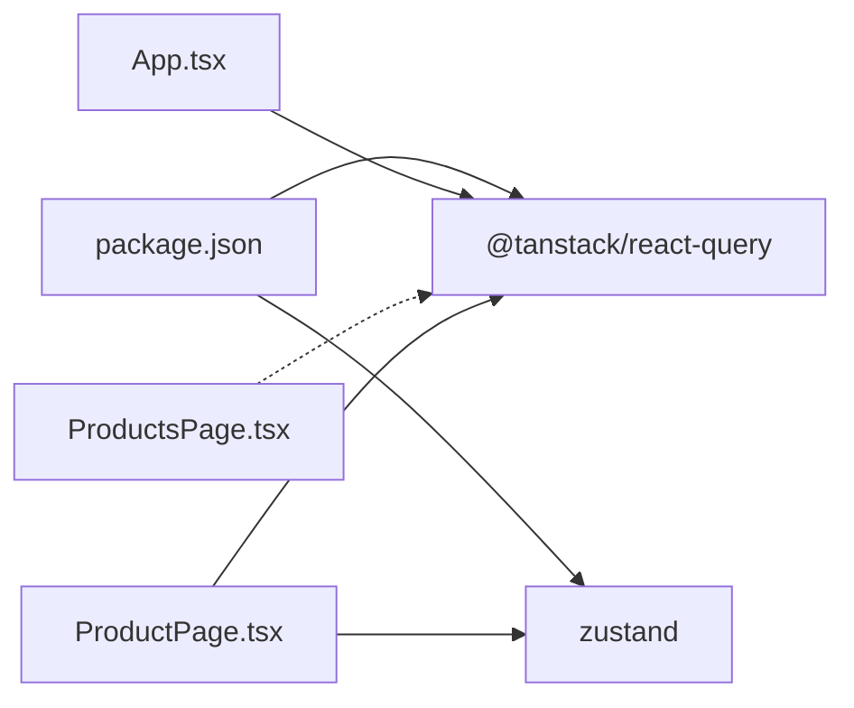

# React Query Integration

<cite>
**Referenced Files in This Document**
- [package.json](file://autocure/package.json)
- [main.tsx](file://autocure/src/main.tsx)
- [App.tsx](file://autocure/src/App.tsx)
- [ProductsPage.tsx](file://autocure/src/pages/ProductsPage.tsx)
- [ProductPage.tsx](file://autocure/src/pages/ProductPage.tsx)
- [cartStore.ts](file://autocure/src/stores/cartStore.ts)
- [useAuth.ts](file://autocure/src/hooks/useAuth.ts)
</cite>

## Table of Contents
1. [Introduction](#introduction)
2. [Project Structure](#project-structure)
3. [Core Components](#core-components)
4. [Architecture Overview](#architecture-overview)
5. [Detailed Component Analysis](#detailed-component-analysis)
6. [Dependency Analysis](#dependency-analysis)
7. [Performance Considerations](#performance-considerations)
8. [Troubleshooting Guide](#troubleshooting-guide)
9. [Conclusion](#conclusion)

## Introduction
This document explains how React Query is integrated into CarCure2’s state management architecture. It focuses on the server state management approach, query configuration, cache synchronization strategies, and how client-side Zustand state interacts with React Query’s cache. It also documents product data fetching patterns, caching mechanisms, optimistic updates, error handling strategies, and performance optimization techniques. Guidance is provided for extending React Query to new data sources while maintaining consistency between local and remote state.

## Project Structure
CarCure2 initializes React Query at the application root via a QueryClientProvider and wraps routing and authentication providers. Product-related pages currently use local data and a Zustand cart store. This document outlines how to integrate React Query for server-driven product data and synchronize it with the existing Zustand cart store.

**Diagram sources**
- [main.tsx](file://autocure/src/main.tsx#L1-L11)
- [App.tsx](file://autocure/src/App.tsx#L1-L47)
- [ProductsPage.tsx](file://autocure/src/pages/ProductsPage.tsx#L1-L225)
- [ProductPage.tsx](file://autocure/src/pages/ProductPage.tsx#L1-L369)
- [cartStore.ts](file://autocure/src/stores/cartStore.ts#L1-L36)
- [useAuth.ts](file://autocure/src/hooks/useAuth.ts#L1-L43)

**Section sources**
- [main.tsx](file://autocure/src/main.tsx#L1-L11)
- [App.tsx](file://autocure/src/App.tsx#L1-L47)

## Core Components
- QueryClientProvider: Installed at the root to enable React Query across the app.
- QueryClient: Created in the root and passed to the provider.
- Local product data and UI: ProductsPage and ProductPage currently use local arrays and Zustand for cart state.
- Authentication hook: Provides user context for conditional UI and future server interactions.

Key integration points:
- App.tsx creates the QueryClient and wraps routing and AuthProvider with QueryClientProvider.
- ProductPage uses a local product array and Zustand cart store; this is where React Query integration should be introduced for server-driven product data.

**Section sources**
- [App.tsx](file://autocure/src/App.tsx#L1-L47)
- [ProductsPage.tsx](file://autocure/src/pages/ProductsPage.tsx#L1-L225)
- [ProductPage.tsx](file://autocure/src/pages/ProductPage.tsx#L1-L369)
- [cartStore.ts](file://autocure/src/stores/cartStore.ts#L1-L36)
- [useAuth.ts](file://autocure/src/hooks/useAuth.ts#L1-L43)

## Architecture Overview
The current architecture separates UI and local state from server state. React Query is present but not yet used for product data. The recommended approach is to:
- Introduce React Query queries for product lists and details.
- Use query keys aligned with product identifiers to leverage cache and invalidation.
- Keep the Zustand cart store for client-side cart operations while synchronizing with server-backed order state via mutations.
- Maintain optimistic updates for cart actions and reconcile with server state on mutation success/failure.

**Diagram sources**
- [App.tsx](file://autocure/src/App.tsx#L1-L47)
- [ProductsPage.tsx](file://autocure/src/pages/ProductsPage.tsx#L1-L225)
- [ProductPage.tsx](file://autocure/src/pages/ProductPage.tsx#L1-L369)
- [cartStore.ts](file://autocure/src/stores/cartStore.ts#L1-L36)

## Detailed Component Analysis

### QueryClient Initialization and Provider
- The QueryClient is instantiated and passed to QueryClientProvider at the root.
- All routes and components inherit React Query capabilities from this provider.
- This enables useQuery, useMutation, and cache management anywhere in the app.

Best practices:
- Configure default query and mutation options in the QueryClient for consistent retry/backoff, stale times, and error handling.
- Consider enabling selective hydration/dehydration for SSR scenarios if applicable.

**Section sources**
- [App.tsx](file://autocure/src/App.tsx#L19-L24)

### ProductsPage: Local Data to Server Query
Current state:
- Uses a local products array and categories for filtering/sorting.
- No React Query usage for product listings.

Recommended integration:
- Replace local data with a React Query query keyed by filters (category, search, sort).
- Use query keys like ["products", { category, search, sort }] to enable cache partitioning.
- Configure staleTime and cacheTime to balance freshness and performance.
- Use enabled conditions to avoid unnecessary requests when filters are empty.

**Diagram sources**
- [ProductsPage.tsx](file://autocure/src/pages/ProductsPage.tsx#L20-L77)

**Section sources**
- [ProductsPage.tsx](file://autocure/src/pages/ProductsPage.tsx#L1-L225)

### ProductPage: Optimistic Updates and Cart Synchronization
Current state:
- Uses a local product array and Zustand cart store.
- Adds items to the cart locally; no server synchronization.

Recommended integration:
- Replace local product lookup with a React Query product query keyed by productId.
- For cart operations, use a mutation to upsert cart items on the server.
- Perform optimistic updates in the UI by immediately adding items to Zustand cart state.
- On mutation success, reconcile with server cart; on failure, rollback Zustand state and show error.

**Diagram sources**
- [ProductPage.tsx](file://autocure/src/pages/ProductPage.tsx#L100-L110)
- [cartStore.ts](file://autocure/src/stores/cartStore.ts#L19-L35)

**Section sources**
- [ProductPage.tsx](file://autocure/src/pages/ProductPage.tsx#L1-L369)
- [cartStore.ts](file://autocure/src/stores/cartStore.ts#L1-L36)

### Authentication Hook and Conditional Queries
- The authentication hook provides user context for conditional UI and future server interactions.
- Use the user context to gate server queries/mutations (e.g., require authentication for cart sync).

**Section sources**
- [useAuth.ts](file://autocure/src/hooks/useAuth.ts#L1-L43)

### Zustand Cart Store: Client-Side State
- The Zustand store manages cart items, open/closed state, and item counts.
- For server-backed cart, wrap Zustand updates with React Query mutations to maintain consistency.

**Diagram sources**
- [cartStore.ts](file://autocure/src/stores/cartStore.ts#L1-L36)

**Section sources**
- [cartStore.ts](file://autocure/src/stores/cartStore.ts#L1-L36)

## Dependency Analysis
- React Query is declared as a runtime dependency and is initialized at the root.
- The application does not currently import React Query hooks in pages or components.
- Zustand is used for cart state; authentication is handled by a custom hook.

**Diagram sources**
- [package.json](file://autocure/package.json#L18-L28)
- [App.tsx](file://autocure/src/App.tsx#L1-L47)
- [ProductsPage.tsx](file://autocure/src/pages/ProductsPage.tsx#L1-L225)
- [ProductPage.tsx](file://autocure/src/pages/ProductPage.tsx#L1-L369)

**Section sources**
- [package.json](file://autocure/package.json#L18-L28)
- [App.tsx](file://autocure/src/App.tsx#L1-L47)

## Performance Considerations
- Query Keys: Use structured keys to prevent cache collisions (e.g., ["products", filters]).
- Stale and Cache Times: Tune staleTime/cacheTime to balance freshness and performance; shorter stale times for sensitive data.
- Parallel Queries: Fetch related data concurrently when appropriate.
- Selective Refetch: Use enabled flags to avoid unnecessary requests.
- Pagination: For infinite queries, implement getNextPageParam/getPreviousPageParam to manage pagination efficiently.
- Dependent Queries: Use enabled to prevent premature requests until dependencies are ready.
- Mutations: Use optimistic updates for immediate feedback; ensure rollback on failure.

## Troubleshooting Guide
Common issues and resolutions:
- Query not updating after mutation:
  - Ensure mutation key aligns with query key so invalidation triggers refetch.
  - Verify that onSuccess/onError update local state consistently.
- Duplicate requests:
  - Confirm query keys are stable and unique per filter combination.
  - Avoid re-render loops by memoizing derived values.
- Stale data in UI:
  - Adjust staleTime/cacheTime or trigger manual refetch when needed.
- Optimistic update rollback:
  - Implement onError to revert local state and surface errors to users.

## Conclusion
CarCure2 currently initializes React Query at the root but does not yet use it for product data. By integrating React Query for product lists and details, and wrapping cart operations with server-backed mutations, the app can achieve robust server state management with consistent client-side Zustand state. This approach enables efficient caching, optimistic updates, and scalable extension to new data sources while preserving the existing UI and user experience.