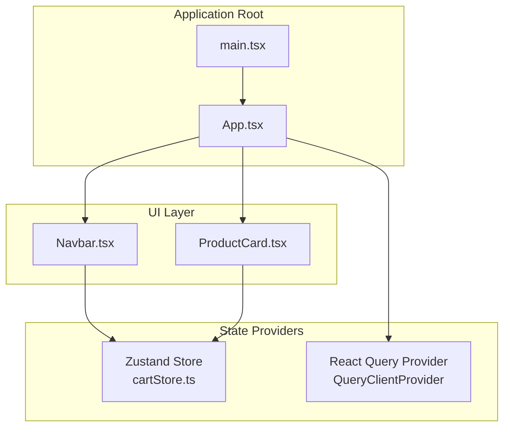
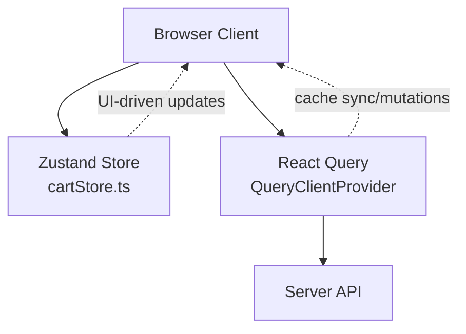
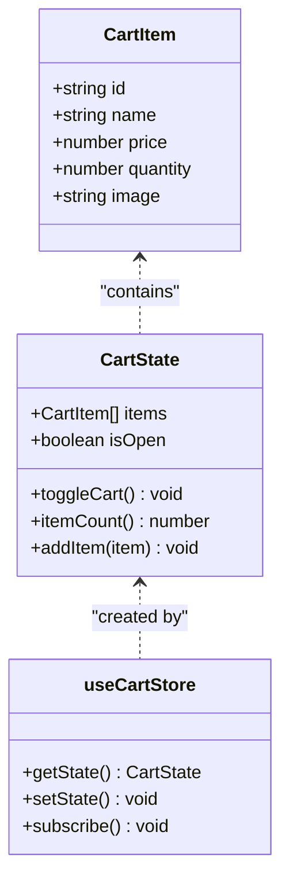
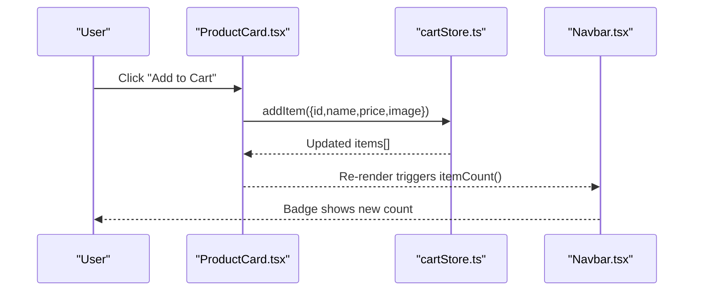
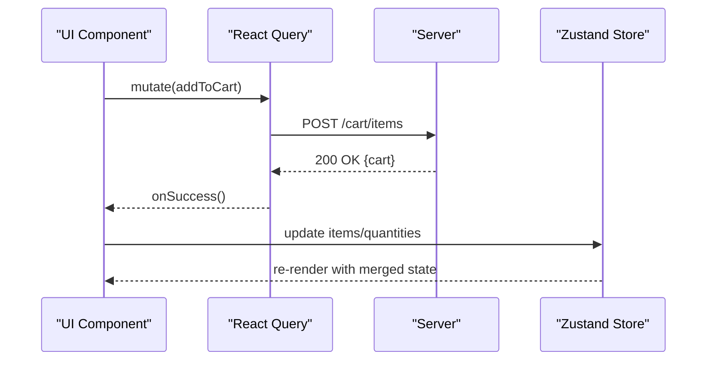
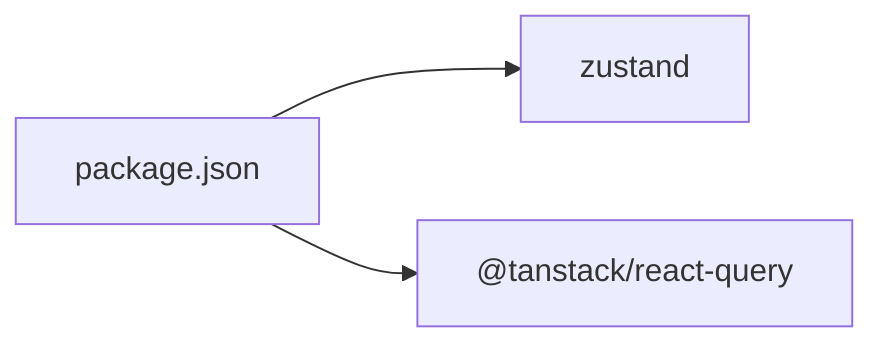

# State Management

<cite>
**Referenced Files in This Document**
- [cartStore.ts](file://autocure/src/stores/cartStore.ts)
- [App.tsx](file://autocure/src/App.tsx)
- [Navbar.tsx](file://autocure/src/components/Navbar.tsx)
- [ProductCard.tsx](file://autocure/src/components/ProductCard.tsx)
- [package.json](file://autocure/package.json)
- [main.tsx](file://autocure/src/main.tsx)
</cite>

## Table of Contents
1. [Introduction](#introduction)
2. [Project Structure](#project-structure)
3. [Core Components](#core-components)
4. [Architecture Overview](#architecture-overview)
5. [Detailed Component Analysis](#detailed-component-analysis)
6. [Dependency Analysis](#dependency-analysis)
7. [Performance Considerations](#performance-considerations)
8. [Troubleshooting Guide](#troubleshooting-guide)
9. [Conclusion](#conclusion)

## Introduction
This document explains CarCure2’s state management architecture with a focus on the dual-state approach:
- Client-side state via Zustand for fast, local UI state (such as the shopping cart).
- Server state synchronization via React Query for remote data fetching, caching, and mutations.

It documents the cart store implementation, selectors and action patterns, state consumption in components, and how to extend the system for new features while maintaining performance and clarity.

## Project Structure
The state management stack centers around:
- A Zustand store for client-side cart state.
- A global React Query provider enabling server state hydration and cache management.
- Components consuming the Zustand store to drive UI updates.

**Diagram sources**
- [main.tsx](file://autocure/src/main.tsx#L1-L11)
- [App.tsx](file://autocure/src/App.tsx#L1-L47)
- [cartStore.ts](file://autocure/src/stores/cartStore.ts#L1-L36)
- [Navbar.tsx](file://autocure/src/components/Navbar.tsx#L1-L216)
- [ProductCard.tsx](file://autocure/src/components/ProductCard.tsx#L1-L200)

**Section sources**
- [main.tsx](file://autocure/src/main.tsx#L1-L11)
- [App.tsx](file://autocure/src/App.tsx#L1-L47)

## Core Components
- Zustand cart store: Provides actions to toggle the cart UI state and add items to the cart, plus a derived selector to compute total item count.
- React Query provider: Wraps the app to enable server state features (queries, mutations, cache invalidation, and hydration).

Key responsibilities:
- Zustand store: Local UI state and item inventory manipulation.
- React Query: Remote data lifecycle management and cache consistency.

**Section sources**
- [cartStore.ts](file://autocure/src/stores/cartStore.ts#L1-L36)
- [App.tsx](file://autocure/src/App.tsx#L1-L47)

## Architecture Overview
The system integrates Zustand and React Query as complementary layers:
- Zustand handles ephemeral, UI-focused state (cart open/closed, item quantities).
- React Query manages server-backed state (e.g., product catalogs, user sessions, orders).

[No sources needed since this diagram shows conceptual workflow, not actual code structure]

## Detailed Component Analysis

### Zustand Cart Store
The cart store defines:
- State shape: items array, isOpen flag.
- Actions: toggleCart, addItem.
- Selectors: itemCount (derived computation over items).

Implementation highlights:
- addItem uses immutable updates: finds an existing item by id and increments quantity, otherwise appends a new item with quantity 1.
- itemCount computes a derived value from current items.
- toggleCart flips the isOpen flag.

**Diagram sources**
- [cartStore.ts](file://autocure/src/stores/cartStore.ts#L3-L17)

**Section sources**
- [cartStore.ts](file://autocure/src/stores/cartStore.ts#L1-L36)

### State Consumption in Components
- Navbar consumes the cart store to display the cart icon badge and toggle the cart panel.
- ProductCard consumes the cart store to add items to the cart.

**Diagram sources**
- [ProductCard.tsx](file://autocure/src/components/ProductCard.tsx#L1-L200)
- [cartStore.ts](file://autocure/src/stores/cartStore.ts#L19-L35)
- [Navbar.tsx](file://autocure/src/components/Navbar.tsx#L20-L24)

**Section sources**
- [Navbar.tsx](file://autocure/src/components/Navbar.tsx#L1-L216)
- [ProductCard.tsx](file://autocure/src/components/ProductCard.tsx#L1-L200)
- [cartStore.ts](file://autocure/src/stores/cartStore.ts#L1-L36)

### State Synchronization Between Zustand and React Query
- Current state: The cart store is purely client-side and does not automatically synchronize with React Query cache.
- Recommended pattern to bridge the two:
  - Use React Query queries/mutations to fetch and persist server-side cart state.
  - On successful mutations, update the Zustand store to keep UI state in sync.
  - On query invalidation or refetch, reconcile Zustand with server state.

[No sources needed since this diagram shows conceptual workflow, not actual code structure]

## Dependency Analysis
External libraries powering state management:
- Zustand: lightweight, functional store with minimal boilerplate.
- React Query: robust caching, background updates, and cache normalization.

**Diagram sources**
- [package.json](file://autocure/package.json#L18-L28)

**Section sources**
- [package.json](file://autocure/package.json#L1-L30)

## Performance Considerations
- Prefer narrow selectors: Use dedicated selectors (like itemCount) to minimize re-renders by subscribing to only the needed slice of state.
- Keep state flat: Maintain a simple items array to reduce deep equality checks and improve selector performance.
- Batch updates: When adding items, rely on immutable updates to avoid unnecessary renders.
- Avoid excessive subscriptions: Subscribe to only the props/actions your component needs.
- React Query cache hygiene: Invalidate or update the cache after mutations to prevent stale UI while keeping local Zustand fast.

[No sources needed since this section provides general guidance]

## Troubleshooting Guide
- Debugging Zustand state changes:
  - Add logging inside actions to observe when items are added or the cart toggled.
  - Verify selectors compute the correct totals by checking derived values.
- Ensuring UI reflects updates:
  - Confirm components subscribe to the store (e.g., Navbar and ProductCard both import and use the store).
- React Query integration pitfalls:
  - If server state diverges from the UI, reconcile Zustand with the latest server cache after mutations or invalidations.

**Section sources**
- [cartStore.ts](file://autocure/src/stores/cartStore.ts#L19-L35)
- [Navbar.tsx](file://autocure/src/components/Navbar.tsx#L20-L24)
- [ProductCard.tsx](file://autocure/src/components/ProductCard.tsx#L1-L200)

## Conclusion
CarCure2 currently uses Zustand for client-side cart state and React Query for server state management. To achieve a cohesive dual-state system:
- Extend the cart store with server-backed actions and integrate React Query for persistence.
- Use selectors for efficient re-renders and keep state normalized.
- Apply cache invalidation and reconciliation to maintain consistency between local and server state.

[No sources needed since this section summarizes without analyzing specific files]