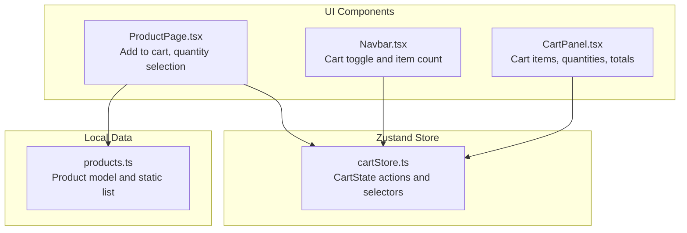
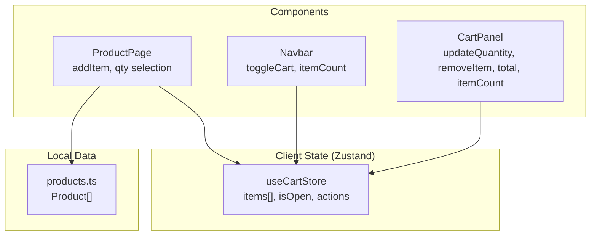
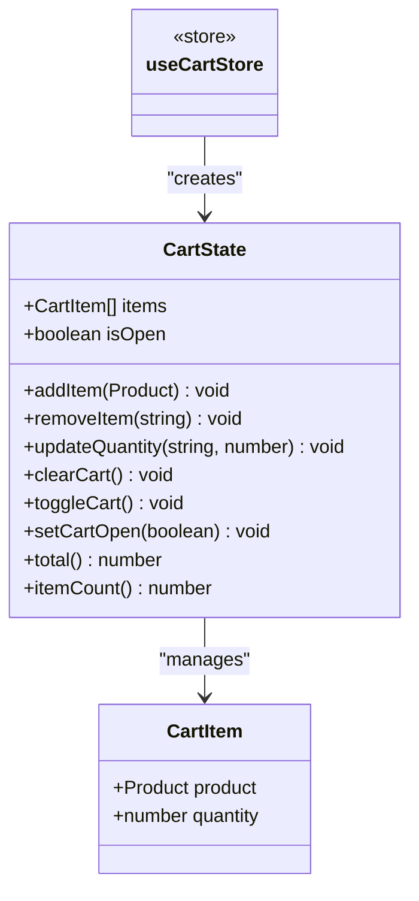
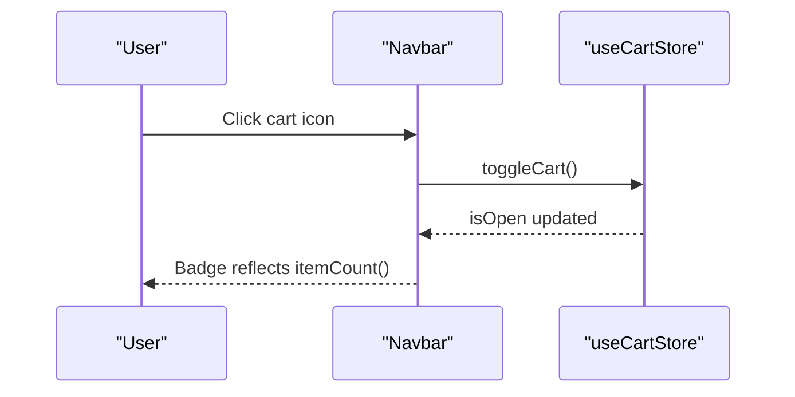
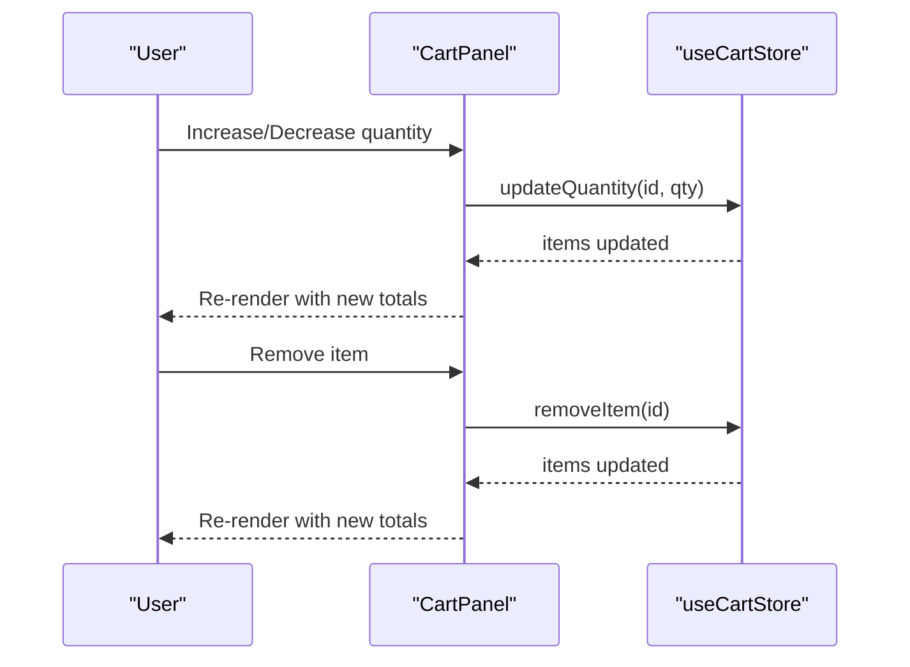
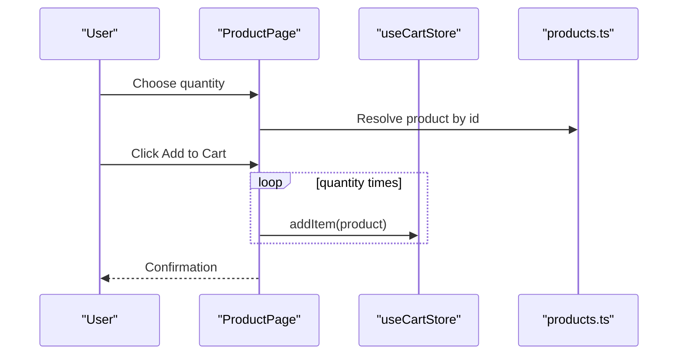
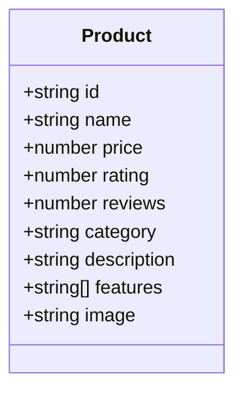
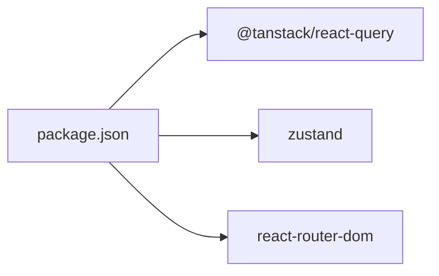

# State Synchronization Patterns

<cite>
**Referenced Files in This Document**
- [cartStore.ts](file://autocure/src/stores/cartStore.ts)
- [Navbar.tsx](file://autocure/src/components/Navbar.tsx)
- [CartPanel.tsx](file://autocure/src/components/CartPanel.tsx)
- [ProductPage.tsx](file://autocure/src/pages/ProductPage.tsx)
- [products.ts](file://autocure/src/data/products.ts)
- [package.json](file://autocure/package.json)
</cite>

## Table of Contents
1. [Introduction](#introduction)
2. [Project Structure](#project-structure)
3. [Core Components](#core-components)
4. [Architecture Overview](#architecture-overview)
5. [Detailed Component Analysis](#detailed-component-analysis)
6. [Dependency Analysis](#dependency-analysis)
7. [Performance Considerations](#performance-considerations)
8. [Troubleshooting Guide](#troubleshooting-guide)
9. [Conclusion](#conclusion)

## Introduction
This document explains the state synchronization patterns between Zustand and React Query in CarCure2. The project implements a dual-state management architecture:
- Local client-side cart state managed by Zustand
- Server-side product data modeled locally via static data

The current implementation focuses on client-side cart state and local product data. While React Query is present in the project dependencies, there is no active integration with Zustand in the examined codebase. This document therefore documents the existing patterns, highlights areas where React Query could integrate, and provides guidance for future enhancements to synchronize Zustand and React Query effectively.

## Project Structure
The state management touches three primary areas:
- Zustand store for cart state
- UI components that consume the cart store
- Local product data model

**Diagram sources**
- [cartStore.ts](file://autocure/src/stores/cartStore.ts#L1-L63)
- [Navbar.tsx](file://autocure/src/components/Navbar.tsx#L1-L216)
- [CartPanel.tsx](file://autocure/src/components/CartPanel.tsx#L1-L143)
- [ProductPage.tsx](file://autocure/src/pages/ProductPage.tsx#L1-L364)
- [products.ts](file://autocure/src/data/products.ts#L1-L111)

**Section sources**
- [cartStore.ts](file://autocure/src/stores/cartStore.ts#L1-L63)
- [Navbar.tsx](file://autocure/src/components/Navbar.tsx#L1-L216)
- [CartPanel.tsx](file://autocure/src/components/CartPanel.tsx#L1-L143)
- [ProductPage.tsx](file://autocure/src/pages/ProductPage.tsx#L1-L364)
- [products.ts](file://autocure/src/data/products.ts#L1-L111)

## Core Components
- Zustand cart store
  - Manages items, open state, and derived computations (totals and counts)
  - Provides actions to add/remove/update items and to toggle the cart panel
- UI components
  - Navbar consumes cart state to show the cart icon badge
  - CartPanel renders the cart contents, allows quantity adjustments and removal
  - ProductPage handles adding selected quantities to the cart

Key implementation references:
- Cart store definition and actions: [cartStore.ts](file://autocure/src/stores/cartStore.ts#L9-L20), [cartStore.ts](file://autocure/src/stores/cartStore.ts#L22-L62)
- Navbar cart toggle and item count: [Navbar.tsx](file://autocure/src/components/Navbar.tsx#L19-L24)
- CartPanel rendering and actions: [CartPanel.tsx](file://autocure/src/components/CartPanel.tsx#L6-L136)
- ProductPage add-to-cart flow: [ProductPage.tsx](file://autocure/src/pages/ProductPage.tsx#L40-L105)

**Section sources**
- [cartStore.ts](file://autocure/src/stores/cartStore.ts#L1-L63)
- [Navbar.tsx](file://autocure/src/components/Navbar.tsx#L1-L216)
- [CartPanel.tsx](file://autocure/src/components/CartPanel.tsx#L1-L143)
- [ProductPage.tsx](file://autocure/src/pages/ProductPage.tsx#L1-L364)

## Architecture Overview
The current architecture is a single-source-of-truth pattern for cart state:
- Zustand store holds the authoritative cart state
- UI components subscribe to Zustand and render based on store state
- Product data is a static list consumed directly by pages and cards

**Diagram sources**
- [cartStore.ts](file://autocure/src/stores/cartStore.ts#L1-L63)
- [Navbar.tsx](file://autocure/src/components/Navbar.tsx#L1-L216)
- [CartPanel.tsx](file://autocure/src/components/CartPanel.tsx#L1-L143)
- [ProductPage.tsx](file://autocure/src/pages/ProductPage.tsx#L1-L364)
- [products.ts](file://autocure/src/data/products.ts#L1-L111)

## Detailed Component Analysis

### Zustand Cart Store
The cart store encapsulates:
- State: items (CartItem[]), isOpen flag
- Actions: addItem, removeItem, updateQuantity, clearCart, toggleCart, setCartOpen
- Selectors: total, itemCount

**Diagram sources**
- [cartStore.ts](file://autocure/src/stores/cartStore.ts#L4-L20)
- [cartStore.ts](file://autocure/src/stores/cartStore.ts#L22-L62)

Implementation highlights:
- addItem updates existing items by increasing quantity or appends a new item
- updateQuantity removes items when quantity drops to zero
- total and itemCount compute derived values from the current state

References:
- [cartStore.ts](file://autocure/src/stores/cartStore.ts#L22-L62)

**Section sources**
- [cartStore.ts](file://autocure/src/stores/cartStore.ts#L1-L63)

### UI Integration: Navbar
Navbar subscribes to Zustand to:
- Toggle cart visibility
- Display the item count in the cart badge

**Diagram sources**
- [Navbar.tsx](file://autocure/src/components/Navbar.tsx#L19-L24)
- [cartStore.ts](file://autocure/src/stores/cartStore.ts#L55-L57)

**Section sources**
- [Navbar.tsx](file://autocure/src/components/Navbar.tsx#L1-L216)
- [cartStore.ts](file://autocure/src/stores/cartStore.ts#L1-L63)

### UI Integration: CartPanel
CartPanel renders the cart and allows:
- Adjusting item quantities
- Removing items
- Calculating totals and item counts

**Diagram sources**
- [CartPanel.tsx](file://autocure/src/components/CartPanel.tsx#L6-L136)
- [cartStore.ts](file://autocure/src/stores/cartStore.ts#L38-L51)

**Section sources**
- [CartPanel.tsx](file://autocure/src/components/CartPanel.tsx#L1-L143)
- [cartStore.ts](file://autocure/src/stores/cartStore.ts#L1-L63)

### UI Integration: ProductPage
ProductPage enables adding products to the cart:
- Selects quantity
- Calls addItem multiple times to add the chosen quantity
- Uses local product data for display and pricing

**Diagram sources**
- [ProductPage.tsx](file://autocure/src/pages/ProductPage.tsx#L40-L105)
- [cartStore.ts](file://autocure/src/stores/cartStore.ts#L12-L36)
- [products.ts](file://autocure/src/data/products.ts#L13-L102)

**Section sources**
- [ProductPage.tsx](file://autocure/src/pages/ProductPage.tsx#L1-L364)
- [cartStore.ts](file://autocure/src/stores/cartStore.ts#L1-L63)
- [products.ts](file://autocure/src/data/products.ts#L1-L111)

### Data Model: Product
The Product interface defines the shape of product data used across the UI.

**Diagram sources**
- [products.ts](file://autocure/src/data/products.ts#L1-L11)

**Section sources**
- [products.ts](file://autocure/src/data/products.ts#L1-L111)

## Dependency Analysis
React Query is declared as a dependency but is not currently integrated with Zustand in the examined code. The project uses:
- Zustand for cart state
- Static product data
- React Router for navigation

**Diagram sources**
- [package.json](file://autocure/package.json#L18-L28)

**Section sources**
- [package.json](file://autocure/package.json#L1-L30)

## Performance Considerations
- Zustand store granularity
  - Keep the cart state flat and avoid unnecessary re-renders by selecting only required slices
  - Prefer memoized selectors for derived values (already present via total and itemCount)
- UI rendering
  - CartPanel uses layout animations per item; consider virtualization for very large carts
  - ProductPage computes related products; ensure filtering is efficient
- Data locality
  - Local product data avoids network overhead but does not reflect server-side inventory or pricing changes
- Future React Query integration
  - Use query keys aligned with product IDs to enable cache reuse and invalidation
  - Apply selective refetches to keep UI responsive during updates

[No sources needed since this section provides general guidance]

## Troubleshooting Guide
Common issues and resolutions for the current Zustand-only architecture:

- Cart quantity resets unexpectedly
  - Verify that updateQuantity is called with positive quantities; zero or negative quantities trigger removal
  - References: [cartStore.ts](file://autocure/src/stores/cartStore.ts#L42-L51)
- Duplicate items not merging
  - addItem merges by product id; ensure product ids are unique and stable
  - References: [cartStore.ts](file://autocure/src/stores/cartStore.ts#L26-L36)
- Cart badge not updating
  - Confirm that itemCount is called from Navbar and that the component re-renders after state changes
  - References: [Navbar.tsx](file://autocure/src/components/Navbar.tsx#L19-L24), [cartStore.ts](file://autocure/src/stores/cartStore.ts#L59-L61)
- Adding multiple quantities
  - ProductPage loops addItem for the selected quantity; ensure qty remains within expected bounds
  - References: [ProductPage.tsx](file://autocure/src/pages/ProductPage.tsx#L100-L105)
- Totals mismatch
  - total multiplies price by quantity; confirm price values and currency formatting are consistent
  - References: [cartStore.ts](file://autocure/src/stores/cartStore.ts#L59-L61)

**Section sources**
- [cartStore.ts](file://autocure/src/stores/cartStore.ts#L1-L63)
- [Navbar.tsx](file://autocure/src/components/Navbar.tsx#L1-L216)
- [ProductPage.tsx](file://autocure/src/pages/ProductPage.tsx#L1-L364)

## Conclusion
CarCure2 currently implements a clean, single-source-of-truth architecture using Zustand for cart state and local product data. The UI components are tightly coupled to Zustand, enabling immediate feedback for cart operations. While React Query is present in dependencies, no active integration exists between Zustand and React Query caches.

Recommended next steps for future development:
- Introduce React Query queries for product data keyed by product id
- Invalidate and refetch product queries after cart changes that might affect availability or pricing
- Implement optimistic updates for cart actions and roll back on failure
- Align Zustand and React Query keys to maintain consistency across state sources

[No sources needed since this section summarizes without analyzing specific files]