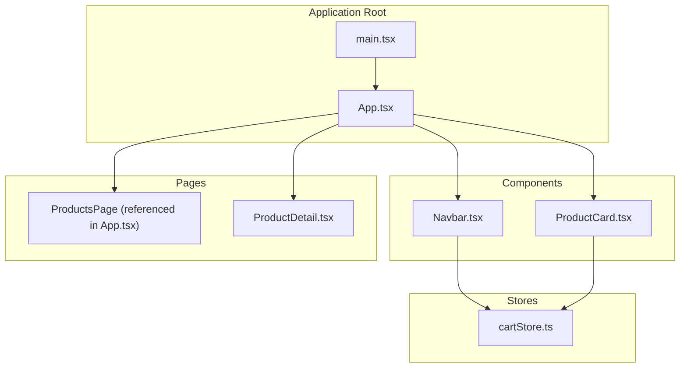
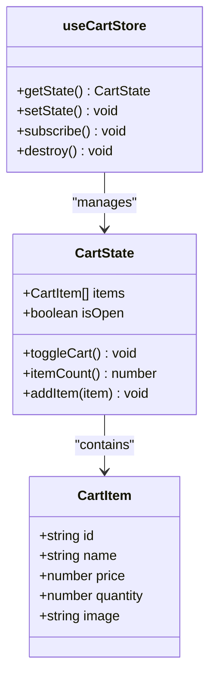
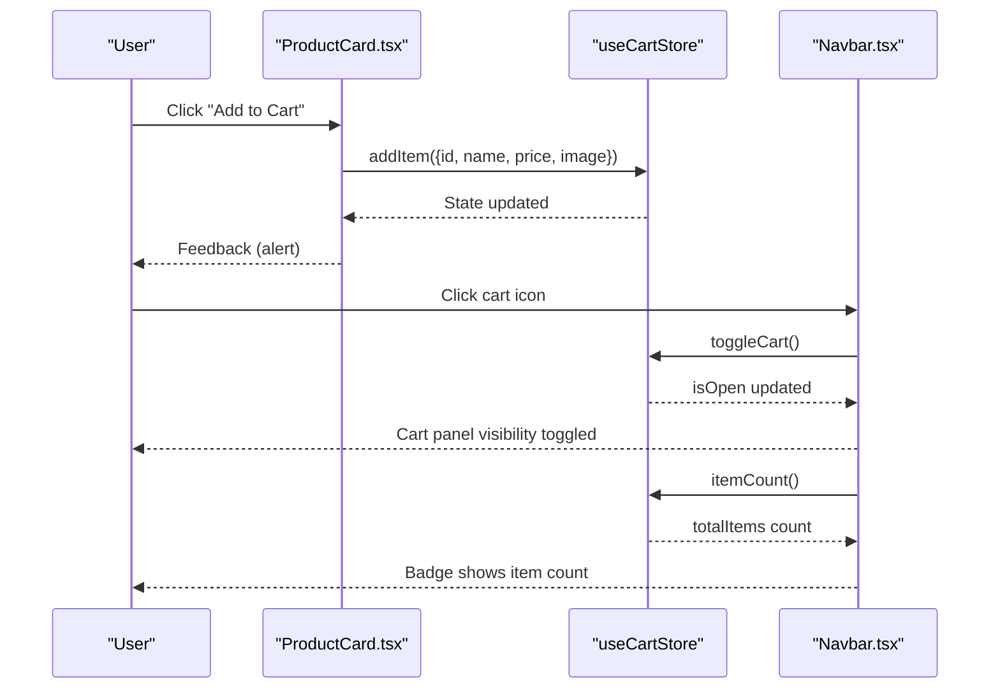
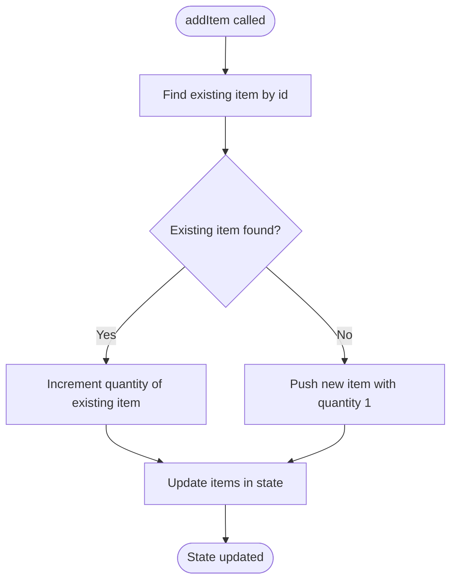
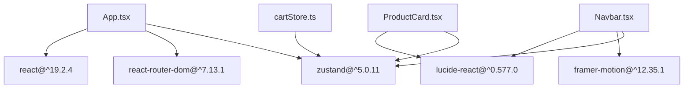

# Zustand Store Implementation

<cite>
**Referenced Files in This Document**
- [cartStore.ts](file://autocure/src/stores/cartStore.ts)
- [Navbar.tsx](file://autocure/src/components/Navbar.tsx)
- [ProductCard.tsx](file://autocure/src/components/ProductCard.tsx)
- [App.tsx](file://autocure/src/App.tsx)
- [main.tsx](file://autocure/src/main.tsx)
- [products.ts](file://autocure/src/data/products.ts)
- [package.json](file://autocure/package.json)
</cite>

## Table of Contents
1. [Introduction](#introduction)
2. [Project Structure](#project-structure)
3. [Core Components](#core-components)
4. [Architecture Overview](#architecture-overview)
5. [Detailed Component Analysis](#detailed-component-analysis)
6. [Dependency Analysis](#dependency-analysis)
7. [Performance Considerations](#performance-considerations)
8. [Troubleshooting Guide](#troubleshooting-guide)
9. [Conclusion](#conclusion)

## Introduction
This document provides comprehensive documentation for the Zustand-based cart store implementation in CarCure2. It explains the store's state shape, action creators, and integration patterns with React components. The cart store manages shopping cart state with real-time updates, item manipulation, and cart visibility control. It also covers subscription patterns, selector usage for efficient re-renders, integration with React components, state persistence strategies, and debugging techniques. Finally, it outlines guidelines for extending the cart store with new functionality while maintaining state consistency across components.

## Project Structure
The cart store resides under the stores directory and is consumed by components such as the navigation bar and product cards. The application bootstraps the React app and wraps routing and authentication providers around the page routes.

**Diagram sources**
- [main.tsx](file://autocure/src/main.tsx#L1-L11)
- [App.tsx](file://autocure/src/App.tsx#L1-L47)
- [cartStore.ts](file://autocure/src/stores/cartStore.ts#L1-L36)
- [Navbar.tsx](file://autocure/src/components/Navbar.tsx#L1-L216)
- [ProductCard.tsx](file://autocure/src/components/ProductCard.tsx#L1-L100)

**Section sources**
- [main.tsx](file://autocure/src/main.tsx#L1-L11)
- [App.tsx](file://autocure/src/App.tsx#L1-L47)

## Core Components
The cart store defines the state shape and actions for managing a shopping cart. It exposes typed selectors and action creators for adding items, toggling cart visibility, and computing item counts.

Key aspects:
- State shape: items array, isOpen flag, and derived helpers
- Action creators: toggleCart, itemCount, addItem
- Store export: useCartStore hook for consuming components

**Diagram sources**
- [cartStore.ts](file://autocure/src/stores/cartStore.ts#L3-L17)

**Section sources**
- [cartStore.ts](file://autocure/src/stores/cartStore.ts#L1-L36)

## Architecture Overview
The cart store integrates with React components through a simple hook-based API. Components subscribe to specific slices of state using the store's selectors, enabling targeted re-renders. The store does not currently persist state to storage; however, the architecture supports easy integration of persistence strategies.

**Diagram sources**
- [ProductCard.tsx](file://autocure/src/components/ProductCard.tsx#L12-L26)
- [cartStore.ts](file://autocure/src/stores/cartStore.ts#L19-L35)
- [Navbar.tsx](file://autocure/src/components/Navbar.tsx#L20-L24)

## Detailed Component Analysis

### Cart Store Implementation
The cart store uses Zustand's create API to define state and actions. It maintains:
- items: array of CartItem with id, name, price, quantity, and image
- isOpen: boolean flag controlling cart panel visibility
- toggleCart: flips the isOpen state
- itemCount: computes total quantity across items
- addItem: adds a new item or increments quantity if already present

**Diagram sources**
- [cartStore.ts](file://autocure/src/stores/cartStore.ts#L24-L34)

**Section sources**
- [cartStore.ts](file://autocure/src/stores/cartStore.ts#L1-L36)

### Navbar Integration
The Navbar consumes the cart store to display the cart icon badge and toggle cart visibility. It reads the item count and toggles the cart panel when the user clicks the cart icon.

Key interactions:
- Subscribes to toggleCart and itemCount
- Uses itemCount to render a badge when greater than zero
- Toggles isOpen state to control cart panel visibility

**Section sources**
- [Navbar.tsx](file://autocure/src/components/Navbar.tsx#L15-L33)
- [Navbar.tsx](file://autocure/src/components/Navbar.tsx#L74-L90)

### Product Card Integration
The ProductCard integrates with the cart store to add items to the cart. It constructs an item payload from product data and invokes addItem, then provides immediate feedback to the user.

Key interactions:
- Subscribes to addItem
- Builds item payload from product data
- Triggers user feedback after successful addition

**Section sources**
- [ProductCard.tsx](file://autocure/src/components/ProductCard.tsx#L12-L26)

### Data Model for Products
The product data model informs how cart items are structured. While the cart store accepts items with id, name, price, and image, the product data includes additional metadata such as rating, reviews, category, description, features, and image URL.

**Section sources**
- [products.ts](file://autocure/src/data/products.ts#L1-L11)

## Dependency Analysis
The application depends on React, React Router DOM, Framer Motion, Lucide React, and Zustand. The cart store relies on Zustand for state management, while components depend on React hooks and the store's exported hook.

**Diagram sources**
- [package.json](file://autocure/package.json#L18-L28)
- [App.tsx](file://autocure/src/App.tsx#L1-L47)
- [Navbar.tsx](file://autocure/src/components/Navbar.tsx#L1-L216)
- [ProductCard.tsx](file://autocure/src/components/ProductCard.tsx#L1-L100)
- [cartStore.ts](file://autocure/src/stores/cartStore.ts#L1-L36)

**Section sources**
- [package.json](file://autocure/package.json#L1-L30)

## Performance Considerations
- Selector-based subscriptions: Components should subscribe to only the parts of state they need (e.g., itemCount, toggleCart) to minimize re-renders.
- Derived computations: Keep derived values like itemCount pure and memoized at the component level if needed to avoid unnecessary recalculations.
- Avoid unnecessary renders: Since the store exposes lightweight actions and selectors, ensure components do not trigger full-page re-renders by relying on local state where appropriate.
- Large item lists: If the items array grows significantly, consider pagination or virtualization in UI components that render the cart.

## Troubleshooting Guide
Common issues and resolutions:
- Items not updating in UI: Verify that components are subscribing to the correct selectors and that state updates are triggered via addItem or toggleCart.
- Duplicate items not incrementing: Confirm that item identification uses a stable id and that the store logic correctly finds existing items by id.
- Cart badge not appearing: Ensure itemCount is being called and that the Navbar subscribes to the store properly.
- Debugging state: Use Zustand's built-in devtools or log state snapshots during development to inspect current items and isOpen state.
- Persistence: If persistence is desired, integrate a storage adapter (e.g., localStorage) to hydrate state on initialization and persist changes on update.

## Conclusion
The Zustand cart store in CarCure2 provides a clean, minimal API for managing shopping cart state. It enables real-time updates, efficient component subscriptions, and straightforward integrations with UI components. By following the documented patterns for selectors, actions, and potential persistence strategies, developers can extend the cart store reliably while maintaining consistency across components.