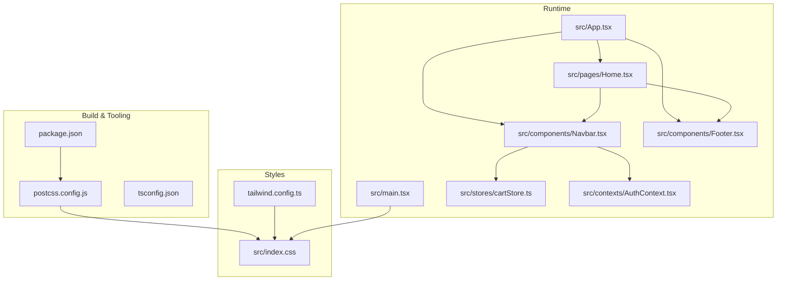
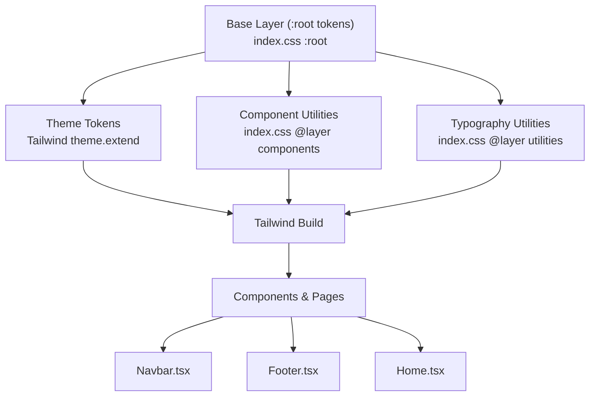
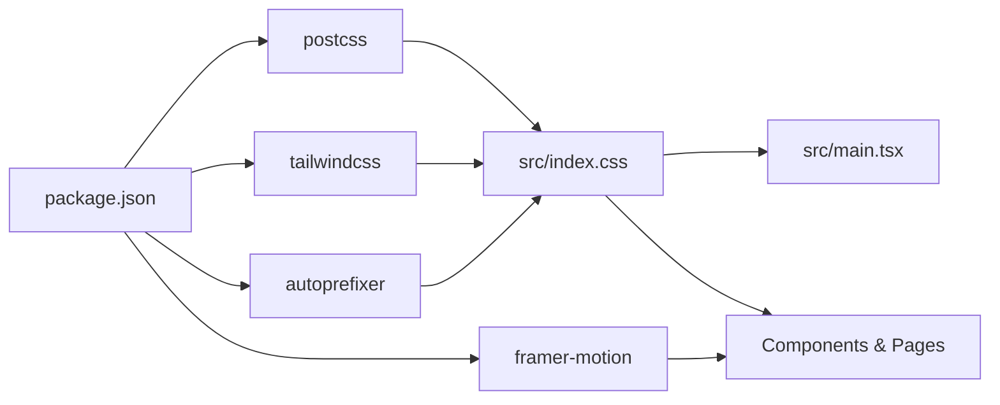

# Styling and Design System

<cite>
**Referenced Files in This Document**
- [tailwind.config.ts](file://autocure/tailwind.config.ts)
- [postcss.config.js](file://autocure/postcss.config.js)
- [index.css](file://autocure/src/index.css)
- [package.json](file://autocure/package.json)
- [Navbar.tsx](file://autocure/src/components/Navbar.tsx)
- [Footer.tsx](file://autocure/src/components/Footer.tsx)
- [Home.tsx](file://autocure/src/pages/Home.tsx)
- [cartStore.ts](file://autocure/src/stores/cartStore.ts)
- [AuthContext.tsx](file://autocure/src/contexts/AuthContext.tsx)
- [main.tsx](file://autocure/src/main.tsx)
- [App.tsx](file://autocure/src/App.tsx)
- [tsconfig.json](file://autocure/tsconfig.json)
</cite>

## Table of Contents
1. [Introduction](#introduction)
2. [Project Structure](#project-structure)
3. [Core Components](#core-components)
4. [Architecture Overview](#architecture-overview)
5. [Detailed Component Analysis](#detailed-component-analysis)
6. [Dependency Analysis](#dependency-analysis)
7. [Performance Considerations](#performance-considerations)
8. [Troubleshooting Guide](#troubleshooting-guide)
9. [Conclusion](#conclusion)
10. [Appendices](#appendices)

## Introduction
This document describes CarCure2’s styling architecture and design system. It covers Tailwind CSS configuration, design tokens, component styling patterns, responsive design, animations via Framer Motion, dark/light theme support, accessibility, cross-browser compatibility, and performance optimization strategies. The goal is to help maintain design consistency, extend the system, and implement custom styling patterns effectively.

## Project Structure
The styling system is built around PostCSS, Tailwind CSS, and Framer Motion. Global styles and design tokens live in a single CSS file layered with Tailwind directives. Tailwind is configured to scan TypeScript/JSX sources and enable a class-based dark mode strategy. Components apply design tokens and animations consistently across pages.

**Diagram sources**
- [package.json](file://autocure/package.json#L1-L30)
- [postcss.config.js](file://autocure/postcss.config.js#L1-L7)
- [tsconfig.json](file://autocure/tsconfig.json#L1-L28)
- [index.css](file://autocure/src/index.css#L1-L146)
- [tailwind.config.ts](file://autocure/tailwind.config.ts#L1-L91)
- [main.tsx](file://autocure/src/main.tsx#L1-L11)
- [App.tsx](file://autocure/src/App.tsx#L1-L47)
- [Navbar.tsx](file://autocure/src/components/Navbar.tsx#L1-L216)
- [Footer.tsx](file://autocure/src/components/Footer.tsx#L1-L119)
- [Home.tsx](file://autocure/src/pages/Home.tsx#L1-L18)
- [cartStore.ts](file://autocure/src/stores/cartStore.ts#L1-L36)
- [AuthContext.tsx](file://autocure/src/contexts/AuthContext.tsx#L1-L37)

**Section sources**
- [package.json](file://autocure/package.json#L1-L30)
- [postcss.config.js](file://autocure/postcss.config.js#L1-L7)
- [tsconfig.json](file://autocure/tsconfig.json#L1-L28)
- [index.css](file://autocure/src/index.css#L1-L146)
- [tailwind.config.ts](file://autocure/tailwind.config.ts#L1-L91)
- [main.tsx](file://autocure/src/main.tsx#L1-L11)
- [App.tsx](file://autocure/src/App.tsx#L1-L47)
- [Navbar.tsx](file://autocure/src/components/Navbar.tsx#L1-L216)
- [Footer.tsx](file://autocure/src/components/Footer.tsx#L1-L119)
- [Home.tsx](file://autocure/src/pages/Home.tsx#L1-L18)
- [cartStore.ts](file://autocure/src/stores/cartStore.ts#L1-L36)
- [AuthContext.tsx](file://autocure/src/contexts/AuthContext.tsx#L1-L37)

## Core Components
- Tailwind configuration defines dark mode, content scanning, design tokens, custom colors, border radius, keyframes, and animations.
- Global CSS establishes design tokens via CSS variables, applies base styles, and defines component-level utilities and animated backgrounds.
- PostCSS pipeline enables Tailwind and vendor prefixing.
- Components apply design tokens and animations using Tailwind utilities and Framer Motion.

Key implementation references:
- Tailwind configuration and design tokens: [tailwind.config.ts](file://autocure/tailwind.config.ts#L3-L88)
- Global design tokens and utilities: [index.css](file://autocure/src/index.css#L5-L145)
- PostCSS pipeline: [postcss.config.js](file://autocure/postcss.config.js#L1-L7)
- Package dependencies: [package.json](file://autocure/package.json#L11-L28)

**Section sources**
- [tailwind.config.ts](file://autocure/tailwind.config.ts#L3-L88)
- [index.css](file://autocure/src/index.css#L5-L145)
- [postcss.config.js](file://autocure/postcss.config.js#L1-L7)
- [package.json](file://autocure/package.json#L11-L28)

## Architecture Overview
The styling architecture follows a layered approach:
- Base layer sets global tokens and resets.
- Component layer defines reusable utilities and visual patterns.
- Utility layer exposes typography and font helpers.
- Components consume tokens and utilities to remain consistent.

**Diagram sources**
- [index.css](file://autocure/src/index.css#L5-L145)
- [tailwind.config.ts](file://autocure/tailwind.config.ts#L9-L86)
- [Navbar.tsx](file://autocure/src/components/Navbar.tsx#L40-L148)
- [Footer.tsx](file://autocure/src/components/Footer.tsx#L4-L116)
- [Home.tsx](file://autocure/src/pages/Home.tsx#L7-L16)

## Detailed Component Analysis

### Tailwind Configuration and Design Tokens
- Dark mode strategy uses the class strategy.
- Content scanning includes HTML and all TypeScript/JSX under src.
- Font families are exposed as display/body for consistent typography.
- Semantic color tokens map to CSS variables for dynamic themes.
- Border radius scales derive from a shared radius variable.
- Custom animations include fade-in, glow-pulse, slide-in-right, float, and shimmer.
- Plugins array is empty; animations and tokens are self-contained.

Implementation references:
- Dark mode and content scanning: [tailwind.config.ts](file://autocure/tailwind.config.ts#L4-L8)
- Fonts and colors: [tailwind.config.ts](file://autocure/tailwind.config.ts#L11-L50)
- Radius and animations: [tailwind.config.ts](file://autocure/tailwind.config.ts#L51-L84)

**Section sources**
- [tailwind.config.ts](file://autocure/tailwind.config.ts#L4-L8)
- [tailwind.config.ts](file://autocure/tailwind.config.ts#L11-L50)
- [tailwind.config.ts](file://autocure/tailwind.config.ts#L51-L84)

### Global Design Tokens and Utilities
- CSS variables define semantic tokens for background, foreground, card, primary/secondary/muted/accent/destructive, borders, input, ring, and a shared radius.
- Neon and glass tokens are defined for special effects.
- Base layer applies border utilities globally, smooth scrolling, and font/body classes to body and display fonts to headings.
- Component utilities include glass, glass-card, neon-glow, gradient-border, animated-bg, and font-display/body helpers.
- Utilities layer exposes font-display and font-body classes.

Implementation references:
- Tokens and base styles: [index.css](file://autocure/src/index.css#L5-L51)
- Glass and neon utilities: [index.css](file://autocure/src/index.css#L53-L135)
- Typography utilities: [index.css](file://autocure/src/index.css#L137-L145)

**Section sources**
- [index.css](file://autocure/src/index.css#L5-L51)
- [index.css](file://autocure/src/index.css#L53-L135)
- [index.css](file://autocure/src/index.css#L137-L145)

### Animation System with Framer Motion
- Components use Framer Motion for entrance/exit transitions and interactive states.
- Examples include mobile menu slide-in-right, cart badge scale-in, and hover-driven transforms.
- Animations leverage Tailwind classes for layout and motion for visual effects.

Implementation references:
- Navbar mobile menu and cart badge: [Navbar.tsx](file://autocure/src/components/Navbar.tsx#L15-L215)
- Motion imports and usage: [Navbar.tsx](file://autocure/src/components/Navbar.tsx#L3-L3)

**Section sources**
- [Navbar.tsx](file://autocure/src/components/Navbar.tsx#L3-L3)
- [Navbar.tsx](file://autocure/src/components/Navbar.tsx#L15-L215)

### Responsive Design Implementation
- Components use Tailwind’s responsive prefixes to adapt layouts across breakpoints.
- Example patterns include centering content within max widths, adjusting paddings, and switching between hidden and visible navigation on small screens.
- The design relies on a mobile-first approach with targeted adjustments at larger viewports.

Implementation references:
- Responsive container and paddings: [Navbar.tsx](file://autocure/src/components/Navbar.tsx#L49-L147)
- Grid and column layouts: [Footer.tsx](file://autocure/src/components/Footer.tsx#L8-L99)

**Section sources**
- [Navbar.tsx](file://autocure/src/components/Navbar.tsx#L49-L147)
- [Footer.tsx](file://autocure/src/components/Footer.tsx#L8-L99)

### Dark/Light Theme Support
- Tailwind dark mode is enabled via class strategy.
- Design tokens are CSS variables, enabling easy switching of themes by toggling a root class.
- Components consume semantic tokens and utilities that automatically adapt to the active theme.

Implementation references:
- Dark mode strategy: [tailwind.config.ts](file://autocure/tailwind.config.ts#L4-L4)
- Token definitions: [index.css](file://autocure/src/index.css#L6-L34)

**Section sources**
- [tailwind.config.ts](file://autocure/tailwind.config.ts#L4-L4)
- [index.css](file://autocure/src/index.css#L6-L34)

### Accessibility Considerations
- Interactive elements include appropriate aria-labels for icons and buttons.
- Hover/focus states use color transitions to indicate interactivity.
- Semantic link usage and proper heading hierarchy are maintained across components.

Implementation references:
- ARIA labels and transitions: [Navbar.tsx](file://autocure/src/components/Navbar.tsx#L77-L138)
- Link hover states: [Footer.tsx](file://autocure/src/components/Footer.tsx#L28-L113)

**Section sources**
- [Navbar.tsx](file://autocure/src/components/Navbar.tsx#L77-L138)
- [Footer.tsx](file://autocure/src/components/Footer.tsx#L28-L113)

### Cross-Browser Compatibility
- Autoprefixer is configured via PostCSS to add vendor prefixes.
- CSS variables are used for tokens, ensuring modern browser support and consistent rendering.
- Vendor-prefixed gradients and backdrop blur are applied in component utilities.

Implementation references:
- PostCSS plugins: [postcss.config.js](file://autocure/postcss.config.js#L1-L7)
- Gradient and backdrop usage: [index.css](file://autocure/src/index.css#L89-L113)

**Section sources**
- [postcss.config.js](file://autocure/postcss.config.js#L1-L7)
- [index.css](file://autocure/src/index.css#L89-L113)

### Component Styling Patterns
- Navbar applies a glass header with dynamic border and shadow based on scroll state, uses neon text for branding, and integrates cart count with motion.
- Footer uses a four-column grid, consistent typography tokens, and hover transitions for links.
- Home page composes the layout with animated background and includes shared components.

Implementation references:
- Navbar pattern: [Navbar.tsx](file://autocure/src/components/Navbar.tsx#L40-L148)
- Footer pattern: [Footer.tsx](file://autocure/src/components/Footer.tsx#L4-L116)
- Home composition: [Home.tsx](file://autocure/src/pages/Home.tsx#L7-L16)

**Section sources**
- [Navbar.tsx](file://autocure/src/components/Navbar.tsx#L40-L148)
- [Footer.tsx](file://autocure/src/components/Footer.tsx#L4-L116)
- [Home.tsx](file://autocure/src/pages/Home.tsx#L7-L16)

### Data Stores and Contexts in Styling Flow
- Cart store manages cart visibility and item counts; Navbar reacts to store changes to show cart badge.
- Auth context provides user state; Navbar conditionally renders profile/admin/wishlist based on auth/admin roles.

Implementation references:
- Cart store: [cartStore.ts](file://autocure/src/stores/cartStore.ts#L19-L35)
- Auth provider and context: [AuthContext.tsx](file://autocure/src/contexts/AuthContext.tsx#L20-L28)

**Section sources**
- [cartStore.ts](file://autocure/src/stores/cartStore.ts#L19-L35)
- [AuthContext.tsx](file://autocure/src/contexts/AuthContext.tsx#L20-L28)

## Dependency Analysis
The styling stack depends on Tailwind and PostCSS for CSS generation and autoprefixing. React components depend on Tailwind utilities and Framer Motion for animations. The runtime wiring ensures global styles are loaded before components.

**Diagram sources**
- [package.json](file://autocure/package.json#L11-L28)
- [postcss.config.js](file://autocure/postcss.config.js#L1-L7)
- [index.css](file://autocure/src/index.css#L1-L3)
- [main.tsx](file://autocure/src/main.tsx#L4-L4)

**Section sources**
- [package.json](file://autocure/package.json#L11-L28)
- [postcss.config.js](file://autocure/postcss.config.js#L1-L7)
- [index.css](file://autocure/src/index.css#L1-L3)
- [main.tsx](file://autocure/src/main.tsx#L4-L4)

## Performance Considerations
- Tailwind content scanning is configured to include HTML and all TypeScript/JSX under src, enabling efficient purging of unused styles.
- CSS variables centralize theme tokens, reducing duplication and improving maintainability.
- Motion usage is scoped to interactive elements to minimize unnecessary re-renders.
- Consider enabling PurgeCSS or Tailwind’s built-in purging in production builds to remove unused CSS.

Implementation references:
- Content scanning: [tailwind.config.ts](file://autocure/tailwind.config.ts#L5-L8)
- Global tokens and utilities: [index.css](file://autocure/src/index.css#L5-L145)

**Section sources**
- [tailwind.config.ts](file://autocure/tailwind.config.ts#L5-L8)
- [index.css](file://autocure/src/index.css#L5-L145)

## Troubleshooting Guide
- If animations do not appear, verify Framer Motion is installed and imported in components.
- If dark mode does not switch, ensure the root class toggles the dark mode selector and CSS variables are present.
- If neon or glass effects are missing, confirm the presence of related utilities and CSS variables.
- If hover states feel unresponsive, review transition durations and ensure hover utilities are applied consistently.

Implementation references:
- Framer Motion dependency: [package.json](file://autocure/package.json#L22-L22)
- Navbar motion usage: [Navbar.tsx](file://autocure/src/components/Navbar.tsx#L3-L3)
- Dark mode strategy: [tailwind.config.ts](file://autocure/tailwind.config.ts#L4-L4)
- Neon/glass utilities: [index.css](file://autocure/src/index.css#L53-L135)

**Section sources**
- [package.json](file://autocure/package.json#L22-L22)
- [Navbar.tsx](file://autocure/src/components/Navbar.tsx#L3-L3)
- [tailwind.config.ts](file://autocure/tailwind.config.ts#L4-L4)
- [index.css](file://autocure/src/index.css#L53-L135)

## Conclusion
CarCure2’s styling system centers on a clean separation of concerns: CSS variables for tokens, Tailwind utilities for layout and theming, and Framer Motion for micro-interactions. The architecture supports responsive design, dark/light modes, and accessibility while remaining extensible and performant.

## Appendices

### Appendix A: Tailwind Configuration Highlights
- Dark mode: class strategy
- Content scanning: root HTML and src tree
- Fonts: display/body families
- Colors: semantic tokens mapped to CSS variables
- Radius: derived from a shared radius variable
- Animations: custom keyframes and named animation utilities

**Section sources**
- [tailwind.config.ts](file://autocure/tailwind.config.ts#L4-L8)
- [tailwind.config.ts](file://autocure/tailwind.config.ts#L11-L50)
- [tailwind.config.ts](file://autocure/tailwind.config.ts#L51-L84)

### Appendix B: Global Tokens Reference
- Semantic tokens: background, foreground, card, primary, secondary, muted, accent, destructive, border, input, ring
- Shared radius: controls border radius scaling
- Neon tokens: blue, purple, cyan
- Glass tokens: glass, glass-border, chrome

**Section sources**
- [index.css](file://autocure/src/index.css#L6-L34)

### Appendix C: Component Utilities Reference
- Glass and glass-card utilities for frosted panels
- Neon glow and text utilities for highlights
- Gradient border pseudo-element technique
- Animated background with radial gradients

**Section sources**
- [index.css](file://autocure/src/index.css#L53-L135)

### Appendix D: Animation Reference
- Fade-in, glow-pulse, slide-in-right, float, shimmer
- Motion usage in Navbar for cart badge and mobile menu

**Section sources**
- [tailwind.config.ts](file://autocure/tailwind.config.ts#L56-L84)
- [Navbar.tsx](file://autocure/src/components/Navbar.tsx#L150-L212)